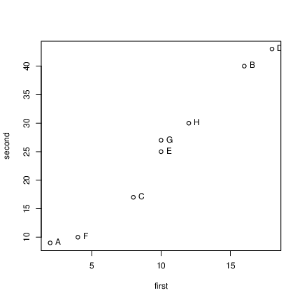
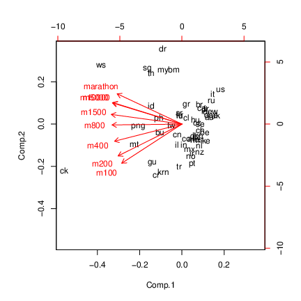
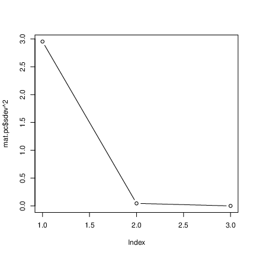

# Principal components


## Principal Components


* Have measurements on (possibly large) number of variables on some individuals.

* Question: can we describe data using fewer variables (because original variables correlated in some way)?

* Look for direction (linear combination of original variables) in which values {\em most spread out}. This is {\em first principal component}.

* Second principal component then direction uncorrelated with this in which values then most spread out. And so on.


## Principal components


* See whether small number of principal components captures most of variation in data.

* Might try to interpret principal components.

* If 2 components good, can make plot of data.

* (Like discriminant analysis, but no groups.)

* "What are important ways that these data vary?"


## Packages
```{r size="scriptsize",echo=F,message=F}
library(plyr) # for annoying technical reasons (here)
library(ggbiplot)
library(tidyverse)
library(ggrepel)
```

   

You might not have installed the first of these. See over for
instructions. 

```{r eval=F}
library(ggbiplot) # see over
library(tidyverse)
library(ggrepel)
```

 


## Installing `ggbiplot`


* `ggbiplot` not on CRAN, so usual
`install.packages` will not work.

* Install package `devtools` first (once):
```{r eval=F}
install.packages("devtools")
```

     

* Then install `ggbiplot` (once):
```{r eval=F}
library(devtools)
install_github("vqv/ggbiplot")
```

     


## Small example: 2 test scores for 8 people

```{r testt,message=F,size="small"}
my_url <- "http://www.utsc.utoronto.ca/~butler/d29/test12.txt"
test12 <- read_table2(my_url)
test12
```


```{r ff1}
g <- ggplot(test12, aes(x = first, y = second, label = id)) +
  geom_point() + geom_text_repel()
```

 


## The plot

```{r ff2,fig.height=4}
g + geom_smooth(method = "lm", se = F)
```


  


## Principal component analysis


* Grab just the numeric columns:
```{r size="small"}
test12_numbers <- test12 %>% select_if(is.numeric)
```

     


* Strongly correlated, so data nearly 1-dimensional:

```{r size="small"}
cor(test12_numbers)
```

 


* Make a score summarizing this one dimension. Like this:

```{r plot12,size="small"}
test12.pc <- test12_numbers %>% princomp(cor = T)
summary(test12.pc)
```

 


## Comments


* "Standard deviation" shows relative importance of components
(as for LDs in discriminant analysis)

* Here, first one explains almost all (99.4\%) of variability.

* That is, look only at first component and ignore second.

* `cor=T` standardizes all variables first. Usually wanted,
because variables measured on different scales. (Only omit if
variables measured on same scale and expect similar variability.)


## Scree plot
```{r fig.height=3.5}
ggscreeplot(test12.pc)
```

   

Imagine scree plot continues at zero, so 2 components is a *big*
elbow (take one component).


## Component loadings
explain how each principal component depends on (standardized)
original variables (test scores):
```{r }
test12.pc$loadings
```

   

First component basically negative sum of (standardized) test
scores. That is, person tends to score similarly on two tests, and a
composite score would summarize performance.


## Component scores

```{r }
d <- data.frame(test12, test12.pc$scores)
d
```
$


* Person A is a low scorer, high positive `comp.1` score.

* Person D is high scorer, high negative `comp.1` score.

* Person E average scorer, near-zero `comp.1` score.

* `comp.2` says basically nothing.


## Plot of scores

```{r score-plot,fig.height=3.5,}
ggplot(d, aes(x = Comp.1, y = Comp.2, label = id)) +
  geom_point() + geom_text_repel()
```
  


## Comments


* Vertical scale exaggerates importance of `comp.2`.

* Fix up to get axes on same scale:
```{r eqsc}
g <- ggplot(d, aes(x = Comp.1, y = Comp.2, label = id)) +
  geom_point() + geom_text_repel() +
  coord_fixed()
```


* Shows how exam scores really spread out along one dimension:

```{r eqsc2,fig.height=2}
g
```


## The biplot


* Plotting variables and individuals on one plot.

* Shows how components and original variables related.

* Shows how individuals score on each component, and therefore
suggests how they score on each variable.

* Add `labels` option to identify individuals:
```{r }
g <- ggbiplot(test12.pc, labels = test12$id)
```

     


## The biplot
```{r ff3,fig.height=4,echo=F}
g
```
  


## Comments


* Variables point almost same direction (left). Thus very
negative value on `comp.1` goes with high scores on both
tests, and test scores highly correlated.

* Position of individuals on plot according to scores on
principal components, implies values on original variables. Eg.:


* D very negative on `comp.1`, high scorer on both tests.

* A and F very positive on `comp.1`, poor scorers on
both tests.

* C positive on `comp.2`, high score on first
test relative to second.

* A negative on `comp.2`, high score on second test
relative to first.


## Track running data

(1984) track running records for distances 100m to marathon, arranged
by country. Countries labelled by (mostly) Internet domain names (ISO
2-letter codes):

```{r echo=F}
w <- getOption("width")
options(width = w + 10)
```

 

```{r size="scriptsize",message=F}
my_url <- "http://www.utsc.utoronto.ca/~butler/d29/men_track_field.txt"
track <- read_table(my_url)
track %>% sample_n(12)
```

 


## Country names
Also read in a table to look country names up in later:

```{r message=F, size="small"}
my_url <- "http://www.utsc.utoronto.ca/~butler/d29/isocodes.csv"
iso <- read_csv(my_url)
iso
```

 


## Data and aims


* 
Times in seconds 100m--400m, in minutes for rest (800m up).

* This taken care of by standardization.

* 8 variables; can we summarize by fewer and gain some insight?

* In particular, if 2 components tell most of story, what do we see in a plot?


## Fit and examine principal components
```{r echo=FALSE}
options(width = 50)
```

   
```{r scree-a,size="footnotesize"}
track_num <- track %>% select_if(is.numeric)
track.pc <- princomp(track_num, cor = T)
summary(track.pc)
```

 


## Scree plot

```{r scree-b,fig.height=3.5,}
ggscreeplot(track.pc)
```

 


## How many components?


* As for discriminant analysis, look for "elbow" in scree plot.

* See one here at 3 components; everything 3 and beyond is "scree".

* So take 2 components.

* Note difference from discriminant analysis: want "large"
rather than "small", so go 1 step left of elbow.

* Another criterion: any component with eigenvalue bigger than
about 1 is worth including. 2nd one here has eigenvalue just less
than 1.

* Refer back to `summary`: cumulative proportion of
variance explained for 2 components is 93.7\%, pleasantly high. 2
components tell almost whole story.


## How do components depend on original variables?
Loadings:

```{r size="footnotesize",echo=2}
options(width = 60)
track.pc$loadings
```

   


## Comments


* `comp.1` loads about equally (has equal weight) on
times over all distances.

* `comp.2` has large positive loading for long
distances, large negative for short ones.

* `comp.3`: large negative for middle distance, large
positive especially for short distances.

* Country overall good at running will have lower than average record
times at all distances, so `comp.1`
*large*. Conversely, for countries bad at running,
`comp.1` very negative.

* Countries relatively better at sprinting (low times) will be
*positive* on `comp.2`; countries relatively better at
distance running *negative* on `comp.2`.


## Commands for plots


* Principal component scores (first two). Also need country names.
```{r pc-plot}
d <- data.frame(track.pc$scores,
  country = track$country
)
names(d)
g1 <- ggplot(d, aes(
  x = Comp.1, y = Comp.2,
  label = country
)) +
  geom_point() + geom_text_repel() +
  coord_fixed()
```

     


* Biplot:
```{r biplot}
g2 <- ggbiplot(track.pc, labels = track$country)
```

   


## Principal components plot

```{r lecce,fig.height=3.9}
g1
```

     


## Comments on principal components plot


* Good running countries at right of plot: US, UK, Italy,
Russia, East and West Germany.

* Bad running countries at left: Western Samoa, Cook Islands.

* Better sprinting countries at bottom: US, Italy, Russia,
Brazil, Greece. `do` is Dominican Republic, where sprinting
records relatively good, distance records very bad.

* Better distance-running countries at top: Portugal, Norway,
Turkey, Ireland, New Zealand, Mexico. `ke` is Kenya.


## Biplot

```{r biplot2,fig.height=3.5}
g2
```
  



## Comments on biplot


* Had to do some pre-work to interpret PC plot. Biplot more self-contained.

* All variable arrows point left; countries on left have large
(bad) record times overall, countries on right good overall.

* Variable arrows extend negatively as well. Top left = bad at
distance running, bottom right = good at distance running.

* Bottom left = bad at sprinting, top right = good at
sprinting.

* Doesn't require so much pre-interpretation of components.


## How do I know which country is which?
Need to look up two-letter abbreviations in ISO table, eg. for best
8 running countries:
```{r size="footnotesize",warning=F}
d %>%
  arrange(desc(Comp.1)) %>%
  left_join(iso, by = c("country" = "ISO2")) %>%
  select(Comp.1, country, Country) %>%
  slice(1:8)
```

   


## Best 8 running countries
```{r size="footnotesize",warning=F}
d %>%
  arrange(Comp.1) %>%
  left_join(iso, by = c("country" = "ISO2")) %>%
  select(Comp.1, country, Country) %>%
  slice(1:8)
```

   


## Worst 8 running countries
```{r "footnotesize", warning=F}
d %>%
  arrange(desc(Comp.1)) %>%
  left_join(iso, by = c("country" = "ISO2")) %>%
  select(Comp.1, country, Country) %>%
  slice(1:8)
```

   


## Better at distance running
```{r size="footnotesize",warning=F}
d %>%
  arrange(desc(Comp.2)) %>%
  left_join(iso, by = c("country" = "ISO2")) %>%
  select(Comp.2, country, Country) %>%
  slice(1:8)
```

   

## Better at sprinting
```{r size="footnotesize",warning=F}
d %>%
  arrange(Comp.2) %>%
  left_join(iso, by = c("country" = "ISO2")) %>%
  select(Comp.2, country, Country) %>%
  slice(1:10)
```

   


## Plot with country names
```{r }
g <- d %>%
  left_join(iso, by = c("country" = "ISO2")) %>%
  select(Comp.1, Comp.2, Country) %>%
  ggplot(aes(x = Comp.1, y = Comp.2, label = Country)) +
  geom_point() + geom_text_repel(size = 1) +
  coord_fixed()
```

   


## The plot

```{r fig.height=5.5, warning=F}
g
```

   


## Principal components from correlation matrix
Create data file like this:
\verbatiminput{cov.txt}
and read in like this:
```{r message=F}
my_url <- "http://www.utsc.utoronto.ca/~butler/d29/cov.txt"
mat <- read_table(my_url, col_names = F)
mat
```

   


## Pre-processing
A little pre-processing required:


* Turn into matrix (from data frame)

* Feed into `princomp` as `covmat=`

```{r pc-cov,fig.height=4,}
mat.pc <- mat %>%
  as.matrix() %>%
  princomp(covmat = .)
```

   


## Scree plot: one component fine

```{r palermo,fig.height=3.5}
ggscreeplot(mat.pc)
```
  

    


## Component loadings
\begin{minipage}[t]{0.6\linewidth}
Compare correlation matrix:

```{r size="scriptsize"}
mat
```

  

with component loadings

```{r size="scriptsize"}
mat.pc$loadings
```
$
\end{minipage}
\begin{minipage}[t]{0.37\linewidth}


* When X1 large, X2 also large, X3 small.

* Then `comp.1` *negative*.

* When X1 small, X2 small, X3 large.

* Then `comp.1` *positive*.

\end{minipage}

## No scores


* With correlation matrix rather than data, no component scores

* So no principal component plot

* and no biplot. 


```{r echo=F, warning=F}
pkgs <- names(sessionInfo()$otherPkgs)
pkgs <- paste("package:", pkgs, sep = "")
x <- lapply(pkgs, detach, character.only = TRUE, unload = TRUE)
```

   


