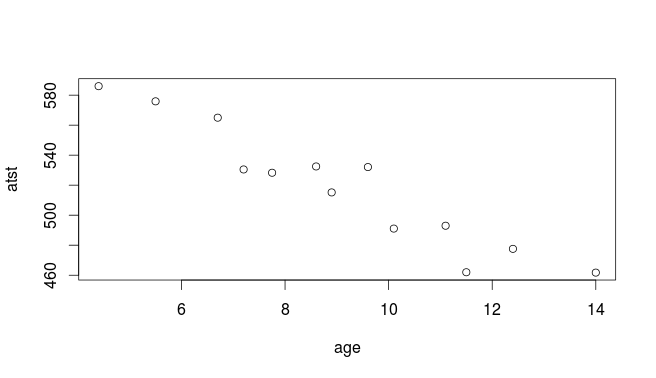
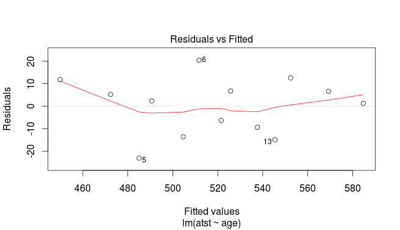
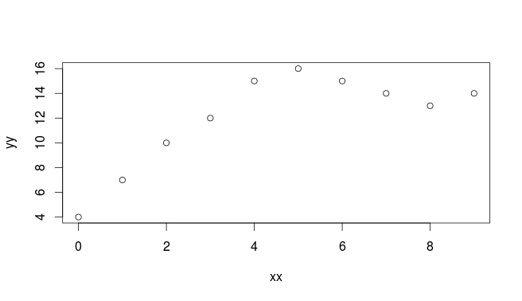
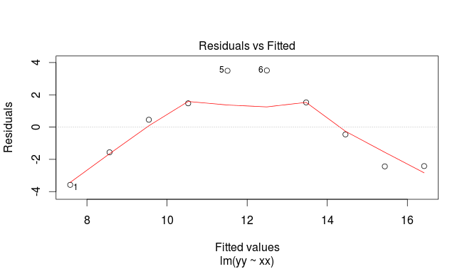
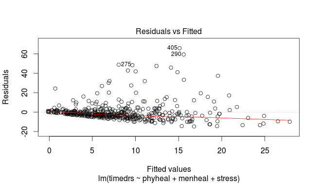

%\usepackage[utf8]{inputenc}

\section{Review of (multiple) regression}
\frame{\sectionpage}
 <<setup2,echo=F>>=
 library(knitr)
 opts_chunk$set(dev = 'pdf')
 opts_chunk$set(comment=NA, fig.width=5, fig.height=3.5)
 options(width=45)
 #suppressMessages(library(tidyverse))
 @ %def 
## Regression


* Use regression when one variable is an outcome ({\em response}, $y$).

* See if/how response depends on other variable(s), {\em explanatory}, $x_1, x_2,\ldots$.

* Can have {\em one} or {\em more than one} explanatory variable, but always one response.

* Assumes a {\em straight-line} relationship between response and explanatory.

* Ask: 


* {\em is there} a relationship between $y$ and $x$'s, and if so, which ones?

* what does the relationship look like?


## Packages
```{r }
library(MASS) # for Box-Cox, later
library(tidyverse)
library(broom)
```

   


## A regression with one $x$

13 children, measure average total sleep time (ATST, mins) and age (years) for each. See if ATST depends on age. Data in `sleep.txt`, ATST then age. Read in data:
```{r }
my_url <- "http://www.utsc.utoronto.ca/~butler/d29/sleep.txt"
sleep <- read_delim(my_url, " ")
```
def 


## Check data
```{r size="footnotesize"}
sleep
```

   

and make scatter plot of ATST (response) vs.\ age (explanatory) using
code overleaf:


## The scatterplot
```{r suggo, fig.height=4}
ggplot(sleep, aes(x = age, y = atst)) + geom_point()
```
def 




## Correlation


* Measures how well a straight line fits the data:
```{r }
with(sleep, cor(atst, age))
```
def 


* $1$ is perfect upward trend, $-1$ is perfect downward trend, 0
is no trend.

* This one close to perfect downward trend.

* Can do correlations of whole data frame:
```{r }
cor(sleep)
```
def 

* Correlations of all possible pairs of variables.  


## Lowess curve


* Sometimes nice to guide the eye: is the trend straight, or not?

* Idea: *lowess curve*. "Locally weighted least squares",
not affected by outliers, not constrained to be linear.

* Lowess is a *guide*: even if straight line appropriate,
may wiggle/bend a little. Looking for *serious* problems with
linearity. 

* Add lowess curve to plot using `geom_smooth`:


## Plot with lowess curve
```{r icko,fig.height=3}
ggplot(sleep, aes(x = age, y = atst)) + geom_point() +
  geom_smooth()
```
def 

## The regression

Scatterplot shows no obvious curve, and a pretty clear downward trend. So we can run the regression:

{\scriptsize
```{r echo=-1}
options(width = 60)
sleep.1 <- lm(atst ~ age, data = sleep)
summary(sleep.1)
```
def 
}


## Conclusions


* The relationship appears to be a straight line, with a downward trend.

* $F$-tests for model as a whole and $t$-test for slope (same)
both confirm this (P-value $5.7\times 10^{-7}=0.00000057$).

* Slope is $-14$, so a 1-year increase in age goes with a 14-minute decrease in ATST on average.

* R-squared is correlation squared (when one $x$ anyway),
between 0 and 1 (1 good, 0 bad).

* Here R-squared is 0.9054, pleasantly high.


## Doing things with the regression output


* Output from regression (and eg. $t$-test) is all right to
look at, but hard to extract and re-use information from.

* Package `broom` extracts info from model output in way
that can be used in pipe (later):
```{r size="footnotesize"}
tidy(sleep.1)
glance(sleep.1)
```

     


## Broom part 2
```{r size="footnotesize",warning=F}
sleep.1 %>% augment(sleep) %>% slice(1:8)
```

   
Useful for plotting residuals against an $x$-variable.
 for week 2:
 
 regression and multiple regression
 
 including univariate + tests
 ci, pi and influential points
 multiple, re-interpretation of tests, correlated x's
 residuals and plotting
 
 next: ci and pi with children aged 10 and 3
 then: maybe diagnostics

## CI for mean response and prediction intervals

Once useful regression exists, use it for prediction:


* To get a single number for prediction at a given $x$, substitute into regression equation, eg. age 10: predicted ATST is $646.48-14.04(10)=506$ minutes.

* To express uncertainty of this prediction:


* {\em CI for mean response} expresses uncertainty about mean ATST for all children aged 10, based on data.

* {\em Prediction interval} expresses uncertainty about predicted ATST for a new child aged 10 whose ATST not known. More uncertain.


* Also do above for a child aged 5.


## Intervals


* Make new data frame with these values for `age`
```{r }
my.age <- c(10, 5)
ages.new <- tibble(age = my.age)
ages.new
```

   


* Feed into `predict`:
```{r }
pc <- predict(sleep.1, ages.new, interval = "c")
pp <- predict(sleep.1, ages.new, interval = "p")
```
def 


## The intervals
Confidence intervals for mean response:
```{r }
cbind(ages.new, pc)
```
def 

Prediction intervals for new response:
```{r }
cbind(ages.new, pp)
```
def 

## Comments


* Age 10 closer to centre of data, so intervals are both narrower than those for age 5.

* Prediction intervals bigger than CI for mean (additional uncertainty).

* Technical note: output from `predict` is R
`matrix`, not data frame, so Tidyverse `bind_cols`
does not work. Use base R `cbind`.


## That grey envelope
```{r fig.height=2.8}
ggplot(sleep, aes(x = age, y = atst)) + geom_point() +
  geom_smooth(method = "lm") +
  scale_y_continuous(breaks = seq(420, 600, 20))
```

   

Marks confidence interval for mean for all $x$.


## Diagnostics
How to tell whether a straight-line regression is appropriate?

\vspace{3ex}


* Before: check scatterplot for straight trend.

* After: plot {\em residuals} (observed minus predicted response) against predicted values. Aim: a plot with no pattern.


\vspace{3ex}


## Output
```{r akjhkadjfhjahnkkk,fig.height=3.5}
ggplot(sleep.1, aes(x = .fitted, y = .resid)) + geom_point()
```
def 




Not much pattern here (is residual predictable from predicted? No). Good, indicating regression appropriate.

## An inappropriate regression

Different data:  
```{r curvy}
my_url <- "http://www.utsc.utoronto.ca/~butler/d29/curvy.txt"
curvy <- read_delim(my_url, " ")
```
def 




## Scatterplot
```{r fig.height=4}
ggplot(curvy, aes(x = xx, y = yy)) + geom_point()
```

   


## Regression line, anyway

{\footnotesize
```{r }
curvy.1 <- lm(yy ~ xx, data = curvy)
summary(curvy.1)
```
def 
}

## Residual plot
```{r altoadige,fig.height=4}
ggplot(curvy.1, aes(x = .fitted, y = .resid)) + geom_point()
```
def 




## No good: fixing it up


* Residual plot has {\em curve}: middle residuals positive, high and low ones negative. Bad.

* Fitting a curve would be better. Try this:
```{r }
curvy.2 <- lm(yy ~ xx + I(xx^2), data = curvy)
```
def 


* Adding `xx`-squared term, to allow for curve.

* Another way to do same thing: specify how model *changes*:
```{r }
curvy.2a <- update(curvy.1, . ~ . + I(xx^2))
```

 


## Regression 2
{\scriptsize
```{r }
summary(curvy.2)
```
def 
}


## Comments


* `xx`-squared term definitely significant (P-value
0.000182), so need this curve to describe relationship.

* Adding squared term has made R-squared go up from 0.5848 to
0.9502: great improvement.

* This is a definite curve!


## The residual plot now
```{r size="small", fig.height=3}
ggplot(curvy.2, aes(x = .fitted, y = .resid)) + geom_point()
```
def 


No problems any more.  


## Another way to handle curves


* Above, saw that changing $x$ (adding $x^2$) was a way of
handling curved relationships.

* Another way: change $y$ (transformation).

* Can guess how to change $y$, or might be theory:


* example: relationship $y=ae^{bx}$ (exponential growth): 

* take
logs to get $\ln y=\ln a + bx$.

* Taking logs has made relationship linear ($\ln y$ as response).


* Or, *estimate* transformation, using Box-Cox method. 


## Box-Cox


* Install package `MASS` via
`install.packages("MASS")` (only need to do *once*)

* Every R session you want to use something in `MASS`, type
`library(MASS)`


## Some made-up data
```{r message=F}
my_url <- "http://www.utsc.utoronto.ca/~butler/d29/madeup.csv"
madeup <- read_csv(my_url)
madeup
```
def 
Seems to be faster-than-linear growth, maybe exponential growth. Scatterplot?


## The scatterplot: faster than linear growth
```{r dsljhsdjlhf,fig.height=2.75}
ggplot(madeup, aes(x = x, y = y)) + geom_point() +
  geom_smooth()
```
def 


## Running Box-Cox


* `library(MASS)` first.

* Feed `boxcox` a model formula with a squiggle in it,
such as you would use for `lm`.

* Output: a graph (next page):
```{r eval=F}
boxcox(y ~ x, data = madeup)
```
def 


## The Box-Cox output
```{r trento,echo=F, fig.height=4}
boxcox(y ~ x, data = madeup)
```
def 


## Comments


* $\lambda$ (lambda) is the power by which you should transform
$y$ to get the relationship straight (straighter). Power 0 is
"take logs"

* Middle dotted line marks best single value of $\lambda$ (here
about 0.1).

* Outer dotted lines mark 95\% CI for $\lambda$, here $-0.3$ to
0.7, approx. (Rather uncertain about best transformation.)

* Any power transformation within the CI supported by data. In
this case, log ($\lambda=0$) and square root ($\lambda=0.5$) good,
but no transformation ($\lambda=1$)  not.

* Pick a "round-number" value of $\lambda$ like
$2,1,0.5,0,-0.5,-1$. Here 0 and 0.5 good values to pick. 


## Did transformation straighten things?


* Calculate transformed $y$ and plot against $x$. Here try log:
```{r fig.height=2.8, size="footnotesize"}
madeup %>%
  mutate(log_y = log(y)) %>%
  ggplot(aes(x = x, y = log_y)) + geom_point() +
  geom_smooth()
```
def 

Looks much straighter.


## Regression with transformed $y$

```{r size="footnotesize"}
madeup.1 <- lm(log(y) ~ x, data = madeup)
glance(madeup.1)
tidy(madeup.1)
```


R-squared now decently high.
%%%%%%%%%%%%%%%%%%%%%%%%%%%%%%%%%%%%%%%%%%%

## Multiple regression


* What if more than one $x$? Extra issues: % regression ex from before


* Now one intercept and a slope for each $x$: how to interpret?

* Which $x$-variables actually help to predict $y$?

* Different interpretations of "global" $F$-test and individual $t$-tests.

* R-squared no longer correlation squared, but still
interpreted as "higher better".


* In `lm` line, add extra $x$s after `~`.

* Interpretation not so easy (and other problems that can occur).


## Multiple regression example

Study of women and visits to health professionals, and how the number of visits might be related to other variables:

\begin{description}
\item[timedrs:] number of visits to health professionals (over course of study)
\item[phyheal:] number of physical health problems
\item[menheal:] number of mental health problems
\item[stress:] result of questionnaire about number and type of life changes
\end{description}

`timedrs` response, others explanatory.


## The data
```{r }
my_url <- "http://www.utsc.utoronto.ca/~butler/d29/regressx.txt"
visits <- read_delim(my_url, " ")
```
def 


## Check data, fit multiple regression
```{r size="small"}
visits
visits.1 <- lm(timedrs ~ phyheal + menheal + stress,
  data = visits
)
```

   


## The regression

{\scriptsize
```{r }
summary(visits.1)
```
def 
}  

## The slopes

Model as a whole strongly significant even though R-sq not very big (lots of data). At least one of the $x$'s predicts `timedrs`.

\begin{footnotesize}
```{r }
tidy(visits.1)
```
def 
\end{footnotesize}

The physical health and stress variables definitely help to predict the number of visits, but {\em with those in the model} we don't need `menheal`.
However, look at prediction of `timedrs` from `menheal` by itself:


## Just `menheal`

{\footnotesize 
```{r }
visits.2 <- lm(timedrs ~ menheal, data = visits)
summary(visits.2)
```
def 
}


## `menheal by itself`


* `menheal` by itself {em does} significantly help to predict `timedrs`.

* But the R-sq is much less (6.5\% vs.\ 22\%).

* So other two variables do a better job of prediction.

* With those variables in the regression (`phyheal` and
`stress`), don't need `menheal` *as well*.


## Investigating via correlation
Leave out first column (`subjno`):
```{r }
visits %>% select(-subjno) %>% cor()
```
def 


* `phyheal` most strongly correlated with `timedrs`.

* Not much to choose between other two.

* But `menheal` has higher correlation with `phyheal`,
so not as much to *add* to prediction as `stress`.

* Goes to show things more complicated in multiple regression.


## Residual plot (from `timedrs on all)`
```{r iffy8,fig.height=3,size="small"}
ggplot(visits.1, aes(x = .fitted, y = .resid)) + geom_point()
```
def 

Apparently random. But\ldots




## Normal quantile plot of residuals
```{r fig.height=3.5}
ggplot(visits.1, aes(sample = .resid)) + stat_qq() + stat_qq_line()
```

   


## Absolute residuals
Is there trend in *size* of residuals (fan-out)? Plot
*absolute value* of residual against fitted value:

```{r fig.height=2.5}
ggplot(visits.1, aes(x = .fitted, y = abs(.resid))) +
  geom_point() + geom_smooth()
```

 


## Comments


* On the normal quantile plot:


* highest (most positive) residuals are *way* too high

* distribution of residuals skewed to right (not normal at all)


* On plot of absolute residuals:


* size of residuals getting bigger as fitted values increase

* predictions getting more variable as fitted values increase

* that is, predictions getting *less accurate* as fitted
values increase, but predictions should be equally accurate all
way along.


* Both indicate problems with regression, of kind that
transformation of response often fixes: that is, predict
*function* of response `timedrs` instead of
`timedrs` itself.


## Fixing the problems


* Residuals not normal (skewed right), increase in size with
fitted value.

* Sometimes residuals are {\em very} positive: observed a {\em lot} larger than predicted.

* Try {\em  transforming} response: use log or square root of response. (Note that response is {\em count}, often skewed to right.)

* Try regression again, with transformed response instead of
original one.

* Then check residual plot to see that it is OK now.
```{r }
visits.3 <- lm(log(timedrs + 1) ~ phyheal + menheal + stress,
  data = visits
)
```
def 

* `timedrs+1`  because some `timedrs` values 0,
can't take log of 0.

* Won't usually need to worry about this, but when response could
be zero/negative, fix that before transformation.


## Output

{\scriptsize
```{r }
summary(visits.3)
```
def 
}


## Comments


* Model as a whole strongly significant again 

* R-sq higher than before (37\% vs.\ 22\%) suggesting things more linear now

* Same conclusion re `menheal`: can take out of regression.

* Should look at residual plots (next pages). Have we fixed problems?


## Residuals against fitted values
```{r fig.height=3.5}
ggplot(visits.3, aes(x = .fitted, y = .resid)) +
  geom_point()
```

   


## Normal quantile plot of residuals
```{r fig.height=4}
ggplot(visits.3, aes(sample = .resid)) + stat_qq() + stat_qq_line()
```

   


## Absolute residuals against fitted
```{r fig.height=3}
ggplot(visits.3, aes(x = .fitted, y = abs(.resid))) +
  geom_point() + geom_smooth()
```

   


## Comments


* Residuals vs.\ fitted looks a lot more random.

* Normal quantile plot looks a lot more normal (though still a
little right-skewness)

* Absolute residuals: not so much trend (though still some).

* Not perfect, but much improved.


## Box-Cox transformations


* Taking log of `timedrs` and having it work: lucky
guess. How to find good transformation?

* Box-Cox again.

* Extra problem: some of `timedrs` values are 0, but
Box-Cox expects all +. Note response for `boxcox`:
```{r eval=F}
boxcox(timedrs + 1 ~ phyheal + menheal + stress, data = visits)
```
def 


## Try 1
```{r echo=F,fig.height=4.5}
visits %>%
  mutate(tp = timedrs + 1) %>%
  boxcox(timedrs + 1 ~ phyheal + menheal + stress, data = .)
```
def 


## Comments on try 1


* Best: $\lambda$ just less than zero.

* Hard to see scale. 

* Focus on $\lambda$ in $(-0.3,0.1)$:
{\small    
```{r size="footnotesize"}
my.lambda <- seq(-0.3, 0.1, 0.01)
my.lambda
```
def 
}


## Try 2
```{r fig.height=3.5}
boxcox(timedrs + 1 ~ phyheal + menheal + stress,
  lambda = my.lambda,
  data = visits
)
```
def 


## Comments


* Best: $\lambda$ just about $-0.07$.

* CI for $\lambda$ about $(-0.14,0.01)$.

* Only nearby round number: $\lambda=0$, log transformation.

* So we made lucky guess with log before!


## Testing more than one $x$ at once

The $t$-tests test only whether one variable could be taken out of the
regression you're looking at. To test significance of more than one
variable at once, fit model with and without variables and use
`anova` to compare fit of models:
{\small
```{r }
visits.5 <- lm(log(timedrs + 1) ~ phyheal + menheal + stress, data = visits)
visits.6 <- lm(log(timedrs + 1) ~ stress, data = visits)
anova(visits.6, visits.5)
```
def 
}


## Results of tests


* Models don't fit equally well, so big one fits better.

* Or "taking both variables out makes the fit worse, so don't do it".

*   Taking out those $x$'s
is a mistake. Or putting them in is a good idea.


## The punting data
Data set `punting.txt` contains 4 variables for 13 right-footed
football kickers (punters): left leg and right leg strength (lbs),
distance punted (ft), another variable called "fred". Predict
punting distance from other variables:
\begin{scriptsize}

```

left                right               punt         fred
170               170                162.50       171 
130               140                144.0        136   
170               180                174.50       174 
160               160                163.50       161 
150               170                192.0        159 
150               150                171.75       151 
180               170                162.0        174 
110               110                104.83       111 
110               120                105.67       114 
120               130                117.58       126 
140               120                140.25       129  
130               140                150.17       136 
150               160                165.17       154 

```

\end{scriptsize}


## Reading in


* Separated by *multiple spaces* with *columns lined up*:
```{r }
my_url <- "http://www.utsc.utoronto.ca/~butler/d29/punting.txt"
punting <- read_table(my_url)
```

     


## The data
```{r size="small"}
punting
```

   


## Regression and output
```{r size="footnotesize"}
punting.1 <- lm(punt ~ left + right + fred, data = punting)
summary(punting.1)
```
def 

## Comments


* Overall regression strongly significant, R-sq high.

* None of the $x$'s significant! Why?

* $t$-tests only say that you could take any one of the $x$'s out without damaging the fit; doesn't matter which one.

* Explanation: look at {\em correlations}. 


## The correlations  
```{r }
cor(punting)
```
def 


* {\em All} correlations are high: $x$'s with `punt` (good) and
with each other (bad, at least confusing).

* What to do? Probably do just as well to pick one variable, say
`right` since kickers are right-footed.


## Just `right`
{\small
```{r }
punting.2 <- lm(punt ~ right, data = punting)
anova(punting.2, punting.1)
```
def 
}
No significant loss by dropping other two variables.


## Comparing R-squareds
{\small
```{r }
summary(punting.1)$r.squared
summary(punting.2)$r.squared
```
def 
}

Basically no difference. In regression (over), `right` significant:


## Regression results

{\footnotesize
```{r }
summary(punting.2)
```
def 
}

## But\ldots


* Maybe we got the *form* of the relationship with
`left` wrong.

* Check: plot *residuals* from previous regression (without
`left`) against `left`.

* Residuals here are ``punting distance adjusted for right
leg strength''.

* If there is some kind of relationship with `left`, we
should include in model.

* Plot of residuals against original variable: `augment`
from `broom`.


## Augmenting `punting.2`
```{r size="footnotesize"}
punting.2 %>% augment(punting) -> punting.2.aug
punting.2.aug %>% slice(1:8)
```

   


## Residuals against `left`
```{r basingstoke,fig.height=3.5}
ggplot(punting.2.aug, aes(x = left, y = .resid)) +
  geom_point()
```

   


## Comments


* There is a *curved* relationship with `left`.

* We should add `left`-squared to the regression (and
therefore put `left` back in when we do that):
```{r }
punting.3 <- lm(punt ~ left + I(left^2) + right,
  data = punting
)
```

     


## Regression with `left-squared`
```{r size="scriptsize"}
summary(punting.3)
```

   


## Comments


* This was definitely a good idea (R-squared has clearly increased).

* We would never have seen it without plotting residuals from
`punting.2` (without `left`) against `left`.

* Negative slope for `leftsq` means that increased left-leg
strength only increases punting distance up to a point: beyond that,
it decreases again.

```{r echo=F,warning=F}
pkgs <- names(sessionInfo()$otherPkgs)
pkgs <- paste("package:", pkgs, sep = "")
x <- lapply(pkgs, detach, character.only = TRUE, unload = TRUE)
```

 


