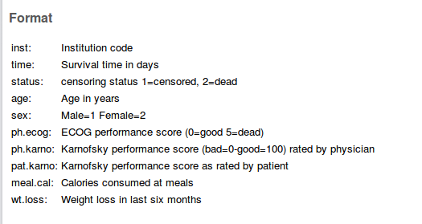

\section{Survival analysis}
\frame{\sectionpage}
## Survival analysis


* So far, have seen:


* response variable counted or measured (regression)

* response variable categorized (logistic regression)

and have predicted response from explanatory variables.

* But what if response is time until event (eg. time of
survival after surgery)?

* Additional complication: event might not have happened at end of study (eg. patient still alive). But knowing that patient has "not died yet" presumably informative. Such data called {\em censored}. 

* Enter {\em survival analysis}, in particular the "Cox proportional hazards model". 

* Explanatory variables in this context often called {\em covariates}.


## Example: still dancing?


* 12 women who have just started taking dancing lessons are
followed for up to a year, to see whether they are still taking
dancing lessons, or have quit. The "event" here is "quit".

* This might depend on:


* a treatment (visit to a dance competition)

* woman's age (at start of study).


* Data:
{\scriptsize

```

Months  Quit   Treatment Age
1      1        0      16
2      1        0      24
2      1        0      18
3      0        0      27
4      1        0      25
7      1        1      26
8      1        1      36
10      1        1      38
10      0        1      45
12      1        1      47

```

}


## About the data


* `months` and `quit` are kind of combined response:


*  `Months` is number of months a woman was actually observed dancing

* `quit` is 1 if woman quit, 0 if still dancing at end of study.


* Treatment is 1 if woman went to dance competition, 0 otherwise.

* Fit model and see whether `Age` or `Treatment`
have effect on survival.

* Want to do predictions for probabilities of still dancing as
they depend on whatever is significant, and draw plot.


## The code


* Install packages `survival` and `survminer` if not done. 

* Load `survival`, `survminer`,
`broom` and `tidyverse`
packages, read data (column-aligned):
```{r message=F}
library(tidyverse)
library(survival)
library(survminer)
library(broom)
my_url <- "http://www.utsc.utoronto.ca/~butler/d29/dancing.txt"
dance <- read_table(my_url)
```
def 


## The data
```{r size="small"}
dance
```

   

## Examine response and fit model


* Response variable (has to be outside data frame):
```{r size="footnotesize"}
mth <- with(dance, Surv(Months, Quit))
mth
```

  

* Then fit model, predicting `mth` from explanatories:
```{r }
dance.1 <- coxph(mth ~ Treatment + Age, data = dance)
```
def 


## Output looks a lot like regression
```{r size="scriptsize"}
summary(dance.1)
```
def 

## Conclusions


* Use $\alpha=0.10$ here since not much data.

* Three tests at bottom like global F-test. Consensus that
something predicts survival time (whether or not dancer quit and how
long it took).

* `Age` (definitely), `Treatment` (marginally) both
predict survival time.


## Model checking


* With regression, usually plot residuals against fitted values.

* Not quite same here (nonlinear model), but ``martingale
residuals'' should have no pattern vs.\ "linear predictor".

* `ggcoxdiagnostics` from package `survminer`
makes plot, to which we add smooth. If smooth trend more or less
straight across, model OK. 

* Martingale residuals can go very negative, so won't always
look normal.


## Martingale residual plot for dance data
```{r fig.height=3}
ggcoxdiagnostics(dance.1) + geom_smooth(se = F)
```

   
This looks good (with only 12 points).

## Predicted survival probs
The function we use is called
`survfit`, though actually works rather like
`predict`. 
First create a data frame of values to predict from. We'll do all
combos of ages 20 and 40, treatment and not, using
`crossing` to get all the combos:
```{r size="small"}
treatments <- c(0, 1)
ages <- c(20, 40)
dance.new <- crossing(Treatment = treatments, Age = ages)
dance.new
```
def 

## The predictions
One prediction *for each time* for each combo of age and treatment:
```{r echo=F}
options(width = 80)
```

 
```{r size="footnotesize"}
s <- survfit(dance.1, newdata = dance.new, data = dance)
summary(s)
```
def 
\begin{multicols}{2}
```{r size="scriptsize"}
t(dance.new)
```

 
`dance.new` transposed (flipped around) shows which combo the
four lists of survival probabilities belong to.
\end{multicols}

## Conclusions from predicted probs


* Older women more likely to be still dancing than younger women
(compare "profiles" for same treatment group).

* Effect of treatment seems to be to increase prob of still
dancing (compare "profiles" for same age for treatment group
vs.\ not)

* Would be nice to see this on a graph. This is `ggsurvplot` from package `survminer`:
```{r }
g <- ggsurvplot(s, conf.int = F)
```

     


## Plotting survival probabilities
```{r fig.height=2.5}
g
```

   
\begin{small}
\begin{tabular}{rrr}
Stratum& Age& Treatment \\
\hline
1 & 20 & no\\
2 & 20 & yes\\
3 & 40 & no\\
4 & 40 & yes\\
\hline
\end{tabular}  
\end{small}

## Discussion
  


* Survivor curve farther to the right is better (better chance
of surviving longer).

* Best is age 40 with treatment, worst age 20 without.

* Appears to be:


* age effect (40 better than 20)

* treatment effect (treatment better than not)


* In analysis, treatment effect only marginally significant.


## A more realistic example: lung cancer


* When you
load in an R package, get data sets to illustrate 
functions in the package. 

* One such is `lung`. Data
set measuring survival in patients with advanced lung cancer. 

* Along with survival time, number of "performance scores"
included, measuring how well patients can perform daily
activities.

* Sometimes high good, but sometimes bad!

* Variables below,
from the help file data set (`?lung`).


## The variables


  

## Uh oh, missing values
```{r size="tiny"}
lung %>% slice(1:16)
```

       

## A closer look
```{r echo=F}
options(width = 90)
```

 
```{r size="tiny"}
summary(lung)
```

   

## Remove any obs with any missing values
```{r size="small"}
cc <- complete.cases(lung)
lung %>% filter(cc) -> lung.complete
lung.complete %>%
  select(meal.cal:wt.loss) %>%
  head(10)
```

   
Missing values seem to be gone.

## Check!
```{r size="tiny"}
summary(lung.complete)
```

   
No missing values left.

## Model 1: use everything except `inst`
```{r size="footnotesize"}
str(lung.complete)
```
def 
```{r }
resp <- with(lung.complete, Surv(time, status == 2))
lung.1 <- coxph(resp ~ . - inst - time - status,
  data = lung.complete
)
```
def 
"Dot" means "all the other variables".

## `summary of model 1: too tiny to see!`
```{r size="tiny"}
summary(lung.1)
```
def 

## Overall significance
The three tests of overall significance:
```{r size="small"}
glance(lung.1)[c(4, 6, 8)]
```
def 
All strongly significant. *Something* predicts survival.  

## Coefficients for model 1
```{r }
tidy(lung.1) %>% select(term, p.value) %>% arrange(p.value)
```
def 


* Model as a whole significant (strongly)

* `sex` and
`ph.ecog` definitely significant

* `age`, `pat.karno` and
`meal.cal` definitely not

*  others in
between

* Take out the three variables that are definitely not
significant, and try again.


## Model 2
```{r size="footnotesize"}
lung.2 <- update(lung.1, . ~ . - age - pat.karno - meal.cal)
tidy(lung.2) %>% select(term, p.value)
```
def 


* Compare with first model:
```{r size="footnotesize"}
anova(lung.2, lung.1)
```

       

* No harm in taking out those variables.


## Model 3, and last
Take out `ph.karno` and `wt.loss` as well.
```{r size="footnotesize"}
lung.3 <- update(lung.2, . ~ . - ph.karno - wt.loss)
tidy(lung.3) %>% select(term, estimate, p.value)
anova(lung.3, lung.2)
```
def 

## Commentary


* OK (just) to take out those two covariates.

* Both remaining variables strongly significant.

* Effect on survival time:


* Higher value of `sex` (female) has *negative* effect
on event (death).

* Higher value of `ph.ecog` has *positive* effect on death.

* i.\ e.\ being female or having lower `ph.ecog` score has
positive effect on survival.


* Picture?


## Plotting survival probabilities


* Create new data frame of values to predict for, then predict:

```{r size="footnotesize"}
sexes <- c(1, 2)
ph.ecogs <- 0:3
lung.new <- crossing(sex = sexes, ph.ecog = ph.ecogs)
lung.new
s <- survfit(lung.3, data = lung.complete, newdata = lung.new)
```
def 

## The plot
```{r fig.height=4}
ggsurvplot(s, conf.int = F)
```
def 

## Discussion of survival curves


* Best survival is teal-blue curve, stratum 5, females with
(`ph.ecog`) score 0.

* Next best: blue, stratum 6, females with score 1, and
red, stratum 1, males score 0.

* Worst: green, stratum 4, males score 3.

* For any given `ph.ecog` score, females have better
predicted survival than males.

* For both genders, a lower score associated with better
survival.

* `sex` coeff in model 3 negative, so being higher
`sex` value (female) goes with *less* hazard of dying.

* `ph.ecog` coeff in model 3 positive, so higher
`ph.ecog` score goes with *more* hazard of dying

* Two coeffs about same size, so being male rather than female
corresponds to 1-point increase in `ph.ecog` score. Note
how survival curves come in 3 pairs plus 2 odd.


## Martingale residuals for this model
```{r fig.height=2.25}
ggcoxdiagnostics(lung.3) + geom_smooth(se = F)
```

   
No problems here.

## When the Cox model fails


* Invent some data where survival is best at middling age, and
worse at high *and* low age:
```{r }
age <- seq(20, 60, 5)
survtime <- c(10, 12, 11, 21, 15, 20, 8, 9, 11)
stat <- c(1, 1, 1, 1, 0, 1, 1, 1, 1)
d <- tibble(age, survtime, stat)
y <- with(d, Surv(survtime, stat))
```

     

* Small survival time 15 in middle was actually censored, so would
have been longer if observed.


## Fit Cox model
\begin{footnotesize}
```{r }
y.1 <- coxph(y ~ age, data = d)
summary(y.1)
```

   
\end{footnotesize}

## Martingale residuals
```{r fig.height=2.25}
ggcoxdiagnostics(y.1) + geom_smooth(se = F)
```

   
Down-and-up indicates incorrect relationship between age and
survival. Add age-squared term.

## Attempt 2
```{r size="scriptsize"}
y.2 <- coxph(y ~ age + I(age^2), data = d)
summary(y.2)
```

       

## Martingale residuals this time
```{r fig.height=2.5}
ggcoxdiagnostics(y.2) + geom_smooth(se = F)
```

   
Not great, but less problematic than before.
 <<echo=F>>=
 pkgs = names(sessionInfo()$otherPkgs) 
 pkgs=paste('package:', pkgs, sep = "")
 x=lapply(pkgs, detach, character.only = TRUE, unload = TRUE)
 @   


