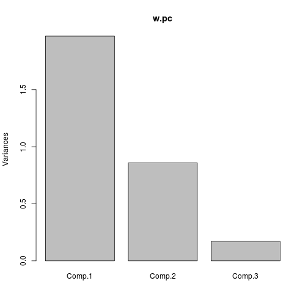
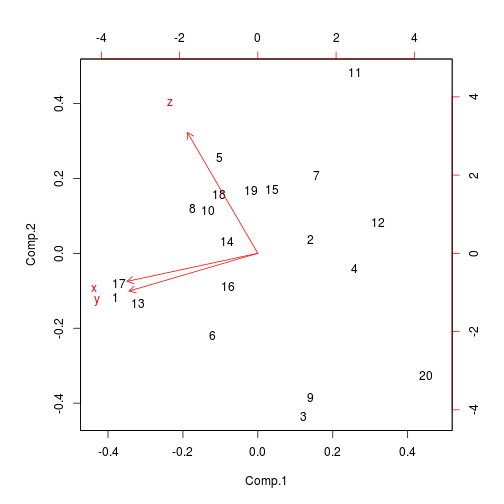
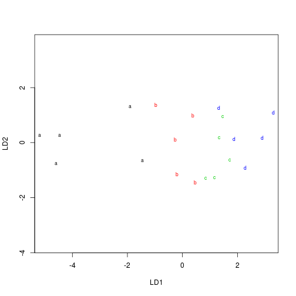

Review session
========================================================


Generating some data
--------------------

Generate a matrix of 60 random normals, in 3 columns:


```r
set.seed(457299)
z = matrix(rnorm(60, mean = 10, sd = 3), ncol = 3)
head(z)
```

```
##        [,1]   [,2]   [,3]
## [1,] 14.866 13.482  9.502
## [2,]  7.761 11.416  8.067
## [3,]  9.193 12.834  3.525
## [4,]  7.901  7.578  6.525
## [5,] 10.640 10.838 11.557
## [6,] 12.127 12.059  7.012
```


Making some correlated variables
--------------------------------

`x` and `y` are related, but `z` has nothing to do with them:


```r
w = data.frame(x = z[, 1], y = z[, 1] + 0.9 * z[, 2], z = z[, 3])
cor(w)
```

```
##        x      y      z
## x 1.0000 0.8268 0.2908
## y 0.8268 1.0000 0.2361
## z 0.2908 0.2361 1.0000
```

```r
rm(z)
```


Principal components
--------------------


```r
w.pc = princomp(w, cor = T)
summary(w.pc)
```

```
## Importance of components:
##                        Comp.1 Comp.2  Comp.3
## Standard deviation     1.4036 0.9267 0.41372
## Proportion of Variance 0.6567 0.2863 0.05705
## Cumulative Proportion  0.6567 0.9429 1.00000
```


2 components explain 94% of variability.

Scree plot (version 1)
----------


```r
plot(w.pc)
```

 


Scree plot (version 2)
---------------------


```r
plot(w.pc$sdev^2, type = "b")
abline(h = 1, lty = "dashed")
```

 


Decision to make:
------------------

* elbow at 2, suggests 1 component.
* 2nd eigenvalue close to 1, suggests 2 components.
* 1 component explains 66% of variability
* 2 components explain 94% of variability.

I go with 2 components.


Loadings
--------


```r
w.pc$loadings
```

```
## 
## Loadings:
##   Comp.1 Comp.2 Comp.3
## x -0.665 -0.216  0.714
## y -0.655 -0.291 -0.698
## z -0.359  0.932       
## 
##                Comp.1 Comp.2 Comp.3
## SS loadings     1.000  1.000  1.000
## Proportion Var  0.333  0.333  0.333
## Cumulative Var  0.333  0.667  1.000
```


Component 1 mostly x and y (negatively), component 2 mostly z. (z had nothing to do with x and y, which were related.)

Biplot
------


```r
biplot(w.pc)
```

 


Individuals
-----------

Individual 1 should be high on `x` and `y`, 12 (or 20) low on both.
Individual 3 should be low on `z`, 11 high (and also low on `x` and `y`)


```r
summary(w)
```

```
##        x               y              z        
##  Min.   : 4.84   Min.   :13.6   Min.   : 2.74  
##  1st Qu.: 7.76   1st Qu.:17.9   1st Qu.: 7.32  
##  Median :10.09   Median :19.8   Median : 9.34  
##  Mean   :10.02   Mean   :20.0   Mean   : 8.47  
##  3rd Qu.:12.41   3rd Qu.:22.6   3rd Qu.:10.19  
##  Max.   :14.87   Max.   :27.0   Max.   :11.75
```

```r
pickout = c(1, 12, 20, 3, 11)
w[pickout, ]
```

```
##         x     y      z
## 1  14.866 27.00  9.502
## 12  6.379 13.64  7.420
## 20  4.839 14.86  2.736
## 3   9.193 20.74  3.525
## 11  5.034 14.07 11.750
```


Summary
-------

<pre>

Observation |   x    |   y    |   z 
------------|--------|--------|---------
          1 | high   | high   | average
         12 | low    | low    | average
         20 | low    | low    | low
         3  | average| average| low
         11 | low    | low    | high
         
</pre>

Without using a biplot
----------------------

Look at loadings first to determine which variables have to do with which components:


```r
w.pc$loadings
```

```
## 
## Loadings:
##   Comp.1 Comp.2 Comp.3
## x -0.665 -0.216  0.714
## y -0.655 -0.291 -0.698
## z -0.359  0.932       
## 
##                Comp.1 Comp.2 Comp.3
## SS loadings     1.000  1.000  1.000
## Proportion Var  0.333  0.333  0.333
## Cumulative Var  0.333  0.667  1.000
```


* Component 1 mostly `x` and `y` (negative)
* Component 2 `z` (positive)


Plotting component scores
-------------------------


```r
labels = as.character(1:20)
plot(w.pc$scores, type = "n")
text(w.pc$scores, labels)
```

 


Individuals on:

* left: *high* on `x`, `y`
* right: *low* on `x`, `y`
* top: *high* on `z`
* bottom: *low* on `z`

Adding a group variable
-----------------------


```r
cbind(w, group)
```

```
##         x     y      z group
## 1  14.866 27.00  9.502     c
## 2   7.761 18.04  8.067     b
## 3   9.193 20.74  3.525     a
## 4   7.901 14.72  6.525     a
## 5  10.640 20.39 11.557     d
## 6  12.127 22.98  7.012     a
## 7   6.765 17.41  9.662     c
## 8  12.374 21.57 10.609     d
## 9  10.012 18.60  3.847     a
## 10 13.288 19.11 10.249     d
## 11  5.034 14.07 11.750     d
## 12  6.379 13.64  7.420     b
## 13 13.806 26.59  9.019     b
## 14 12.515 19.18  9.174     b
## 15  7.762 20.34 10.023     c
## 16 10.158 23.12  8.128     b
## 17 14.545 26.77  9.814     c
## 18  9.663 22.54 10.699     d
## 19 10.800 18.24 10.173     c
## 20  4.839 14.86  2.736     a
```


Manova: are the groups different on any of the variables?
---------------------------------------------------------


```r
gf = factor(group)
attach(w)
response = cbind(x, y, z)
detach(w)
w.man = manova(response ~ gf)
summary(w.man)
```

```
##           Df Pillai approx F num Df den Df Pr(>F)  
## gf         3  0.947     2.46      9     48  0.021 *
## Residuals 16                                       
## ---
## Signif. codes:  0 '***' 0.001 '**' 0.01 '*' 0.05 '.' 0.1 ' ' 1
```


Yes, something distinguishes groups.


Which variable(s) distinguish groups?
-------------------------------------

Discriminant analysis.


```r
library(MASS)
w.lda = lda(group ~ x + y + z, data = w)
w.lda$scaling
```

```
##        LD1      LD2     LD3
## x -0.09778  0.25938  0.4814
## y  0.04896 -0.37284 -0.1843
## z  0.95083  0.05488 -0.0723
```


LD1 best distinguishes groups, and is almost entirely `z`. 

Discriminant predictions
------------------------

Or, how separate are the groups?


```r
w.lda2 = lda(group ~ x + y + z, data = w, CV = T)
table(group, pred = w.lda2$class)
```

```
##      pred
## group a b c d
##     a 3 2 0 0
##     b 0 3 2 0
##     c 0 0 2 3
##     d 0 1 2 2
```


Not actually that distinguishable.

Plot groups by colour
---------------------


```r
colour = as.integer(gf)
plot(w.lda, dimen = 2, col = colour)
```

 

Groups a little mixed up with neighbours.

Posterior probabilities
-----------------------


```r
o = order(group)
wp = round(w.lda2$posterior, 3)
tmp = data.frame(w, group, pred = w.lda2$class, wp)
tmp[o, ]
```

```
##         x     y      z group pred     a     b     c     d
## 3   9.193 20.74  3.525     a    a 1.000 0.000 0.000 0.000
## 4   7.901 14.72  6.525     a    b 0.113 0.874 0.012 0.000
## 6  12.127 22.98  7.012     a    b 0.007 0.975 0.018 0.000
## 9  10.012 18.60  3.847     a    a 1.000 0.000 0.000 0.000
## 20  4.839 14.86  2.736     a    a 1.000 0.000 0.000 0.000
## 2   7.761 18.04  8.067     b    b 0.006 0.714 0.244 0.036
## 12  6.379 13.64  7.420     b    b 0.216 0.694 0.076 0.015
## 13 13.806 26.59  9.019     b    c 0.000 0.186 0.746 0.068
## 14 12.515 19.18  9.174     b    c 0.000 0.318 0.410 0.271
## 16 10.158 23.12  8.128     b    b 0.004 0.526 0.445 0.025
## 1  14.866 27.00  9.502     c    c 0.000 0.443 0.455 0.101
## 7   6.765 17.41  9.662     c    d 0.000 0.240 0.332 0.428
## 15  7.762 20.34 10.023     c    d 0.000 0.121 0.431 0.448
## 17 14.545 26.77  9.814     c    c 0.000 0.282 0.554 0.164
## 19 10.800 18.24 10.173     c    d 0.000 0.198 0.180 0.623
## 5  10.640 20.39 11.557     d    d 0.000 0.012 0.242 0.745
## 8  12.374 21.57 10.609     d    c 0.000 0.099 0.461 0.440
## 10 13.288 19.11 10.249     d    b 0.000 0.533 0.383 0.084
## 11  5.034 14.07 11.750     d    d 0.000 0.003 0.171 0.825
## 18  9.663 22.54 10.699     d    c 0.000 0.054 0.706 0.240
```


Repeated measures
=================


Example
---------


```r
rm = read.table("rm1.txt", header = T)
rm
```

```
##   treatment t1 t2 t3 t4
## 1         a 10 10 10 16
## 2         a  8  9  8 15
## 3         a 11  9 11 21
## 4         b  5  6  6 14
## 5         b  4  6  7 16
## 6         b  7  5  5 12
```


4 measurements per individual, at times 1, 2, 3, 4. Two treatments `a` and `b`.


Run through `lm` first 
----------------------

with multivariate response:


```r
attach(rm)
response = cbind(t1, t2, t3, t4)
response
```

```
##      t1 t2 t3 t4
## [1,] 10 10 10 16
## [2,]  8  9  8 15
## [3,] 11  9 11 21
## [4,]  5  6  6 14
## [5,]  4  6  7 16
## [6,]  7  5  5 12
```

```r
rm.lm = lm(response ~ treatment)
```


* `rm.lm` is stepping stone only: use as input to `Manova` in a moment.
* Between-subjects model in `lm`: response just depends on `treatment`.

Setting up for `Manova`
-----------------------

Have to tell R that the 4 columns of responses are repeated measures:


```r
times = colnames(response)
times.df = data.frame(times)
times.df
```

```
##   times
## 1    t1
## 2    t2
## 3    t3
## 4    t4
```

```r
library(car)
```

```
## Loading required package: nnet
```

```r
rm.manova = Manova(rm.lm, idata = times.df, idesign = ~times)
```


Results
-------


```r
rm.manova
```

```
## 
## Type II Repeated Measures MANOVA Tests: Pillai test statistic
##                 Df test stat approx F num Df den Df Pr(>F)    
## (Intercept)      1     0.991      445      1      4  3e-05 ***
## treatment        1     0.808       17      1      4  0.015 *  
## times            1     0.992       81      3      2  0.012 *  
## treatment:times  1     0.075        0      3      2  0.980    
## ---
## Signif. codes:  0 '***' 0.001 '**' 0.01 '*' 0.05 '.' 0.1 ' ' 1
```


* Significant difference between treatments
* Significant time effect
* No significant interaction between treatment and time (pattern of responses over time same for each treatment)

The data, again
----------------


```r
rm
```

```
##   treatment t1 t2 t3 t4
## 1         a 10 10 10 16
## 2         a  8  9  8 15
## 3         a 11  9 11 21
## 4         b  5  6  6 14
## 5         b  4  6  7 16
## 6         b  7  5  5 12
```


* Treatment `a` numbers consistently higher than treatment `b` numbers (comparing at same time)
* Time `t4` numbers consistently higher than others (comparing within an individual)
* "Jump" at time `t4` seems same for both treatments.


Interaction plot preparation
----------------------------

Why were the results what we got? Want interaction plot, but first have to convert data from "wide format" (all responses on one row) to "long format" (one response per row):


```r
times
```

```
## [1] "t1" "t2" "t3" "t4"
```

```r
detach(rm)
rm2 = reshape(rm, varying = times, sep = "", direction = "long")
head(rm2, n = 10)
```

```
##     treatment time  t id
## 1.1         a    1 10  1
## 2.1         a    1  8  2
## 3.1         a    1 11  3
## 4.1         b    1  5  4
## 5.1         b    1  4  5
## 6.1         b    1  7  6
## 1.2         a    2 10  1
## 2.2         a    2  9  2
## 3.2         a    2  9  3
## 4.2         b    2  6  4
```


The interaction plot
--------------------


```r
attach(rm2)
interaction.plot(time, treatment, t)
```

 


* responses for treatment a consistently higher than for treatment b (treatment effect)
* traces parallel: effect of treatment same for all times (no interaction)
* response constant for first 3 times, but sharp increase for 4th (time effect)

Fiddling with the data
----------------------


```r
rm
```

```
##   treatment t1 t2 t3 t4
## 1         a 10 10 10 16
## 2         a  8  9  8 15
## 3         a 11  9 11 21
## 4         b  5  6  6 14
## 5         b  4  6  7 16
## 6         b  7  5  5 12
```


How could you change the data:

* to remove the time effect?
* to remove the treatment effect?
* to introduce a significant interaction?
