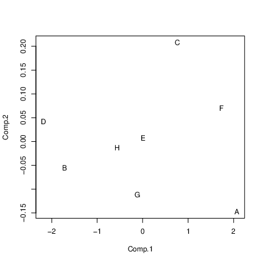
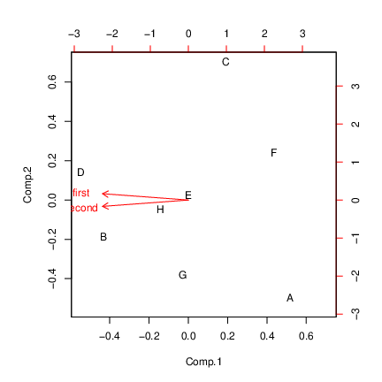

# Principal components


## Principal Components


* Have measurements on (possibly large) number of variables on some individuals.

* Question: can we describe data using fewer variables (because original variables correlated in some way)?

* Look for direction (linear combination of original variables) in which values *most spread out*. This is *first principal component*.

* Second principal component then direction uncorrelated with this in which values then most spread out. And so on.


## Principal components


* See whether small number of principal components captures most of variation in data.

* Might try to interpret principal components.

* If 2 components good, can make plot of data.

* (Like discriminant analysis, but no groups.)

* "What are important ways that these data vary?"


##  Packages

You might not have installed the first of these. See over for
instructions. 


```r
library(ggbiplot) # see over
library(tidyverse)
library(ggrepel)
```

 


##   Installing `ggbiplot`


* `ggbiplot` not on CRAN, so usual
`install.packages` will not work. This is same procedure you used for `smmr` in C32:

* Install package `devtools` first (once):

```r
install.packages("devtools")
```

     

* Then install `ggbiplot` (once):

```r
library(devtools)
install_github("vqv/ggbiplot")
```

     


##  Small example: 2 test scores for 8 people xxx

\small

```r
my_url <- "http://www.utsc.utoronto.ca/~butler/d29/test12.txt"
test12 <- read_table2(my_url)
test12
```

```
## # A tibble: 8 x 3
##   first second id   
##   <dbl>  <dbl> <chr>
## 1     2      9 A    
## 2    16     40 B    
## 3     8     17 C    
## 4    18     43 D    
## 5    10     25 E    
## 6     4     10 F    
## 7    10     27 G    
## 8    12     30 H
```


```r
g <- ggplot(test12, aes(x = first, y = second, label = id)) +
  geom_point() + geom_text_repel()
```

\normalsize
 


##  The plot


```r
g + geom_smooth(method = "lm", se = F)
```


##  Principal component analysis


* Grab just the numeric columns:

```r
test12 %>% select_if(is.numeric) -> test12_numbers
```
     


* Strongly correlated, so data nearly 1-dimensional:


```r
cor(test12_numbers)
```

```
##           first   second
## first  1.000000 0.989078
## second 0.989078 1.000000
```

 
## Finding principal components

* Make a score summarizing this one dimension. Like this:


```r
test12.pc <- princomp(test12_numbers, cor = T)
summary(test12.pc)
```

```
## Importance of components:
##                          Comp.1      Comp.2
## Standard deviation     1.410347 0.104508582
## Proportion of Variance 0.994539 0.005461022
## Cumulative Proportion  0.994539 1.000000000
```

 


## Comments


* "Standard deviation" shows relative importance of components
(as for LDs in discriminant analysis)

* Here, first one explains almost all (99.4\%) of variability.

* That is, look only at first component and ignore second.

* `cor=T` standardizes all variables first. Usually wanted,
because variables measured on different scales. (Only omit if
variables measured on same scale and expect similar variability.)


##   Scree plot

```r
ggscreeplot(test12.pc)
```


   

Imagine scree plot continues at zero, so 2 components is a *big*
elbow (take one component).


## xxx  Component loadings
explain how each principal component depends on (standardized)
original variables (test scores):

\footnotesize

```r
test12.pc$loadings
```

```
## 
## Loadings:
##        Comp.1 Comp.2
## first   0.707  0.707
## second  0.707 -0.707
## 
##                Comp.1 Comp.2
## SS loadings       1.0    1.0
## Proportion Var    0.5    0.5
## Cumulative Var    0.5    1.0
```
\normalsize
   

First component basically sum of (standardized) test
scores. That is, person tends to score similarly on two tests, and a
composite score would summarize performance.


## xxx  Component scores

\small

```r
d <- data.frame(test12, test12.pc$scores)
d
```

```
##   first second id       Comp.1       Comp.2
## 1     2      9  A -2.071819003 -0.146981782
## 2    16     40  B  1.719862811 -0.055762223
## 3     8     17  C -0.762289708  0.207589512
## 4    18     43  D  2.176267535  0.042533250
## 5    10     25  E -0.007460609  0.007460609
## 6     4     10  F -1.734784030  0.070683441
## 7    10     27  G  0.111909141 -0.111909141
## 8    12     30  H  0.568313864 -0.013613668
```
\normalsize


* Person A is a low scorer, high positive `comp.1` score.

* Person D is high scorer, high negative `comp.1` score.

* Person E average scorer, near-zero `comp.1` score.

* `comp.2` says basically nothing.


##  Plot of scores


```r
ggplot(d, aes(x = Comp.1, y = Comp.2, label = id)) +
  geom_point() + geom_text_repel()
```


  



##  Comments


* Vertical scale exaggerates importance of `comp.2`.

* Fix up to get axes on same scale:

```r
g <- ggplot(d, aes(x = Comp.1, y = Comp.2, label = id)) +
  geom_point() + geom_text_repel() +
  coord_fixed()
```


* Shows how exam scores really spread out along one dimension:


```r
g
```


##  The biplot


* Plotting variables and individuals on one plot.

* Shows how components and original variables related.

* Shows how individuals score on each component, and therefore
suggests how they score on each variable.

* Add `labels` option to identify individuals:

```r
g <- ggbiplot(test12.pc, labels = test12$id)
```

     


##  The biplot

  



##  Comments


* Variables point almost same direction (left). Thus very
negative value on `comp.1` goes with high scores on both
tests, and test scores highly correlated.

* Position of individuals on plot according to scores on
principal components, implies values on original variables. Eg.:


* D very negative on `comp.1`, high scorer on both tests.

* A and F very positive on `comp.1`, poor scorers on
both tests.

* C positive on `comp.2`, high score on first
test relative to second.

* A negative on `comp.2`, high score on second test
relative to first.


## xxx  Track running data

Track running records (1984) for distances 100m to marathon, arranged
by country. Countries labelled by (mostly) Internet domain names (ISO
2-letter codes):


 

\scriptsize

```r
my_url <- "http://www.utsc.utoronto.ca/~butler/d29/men_track_field.txt"
track <- read_table(my_url)
track %>% sample_n(8)
```

```
## # A tibble: 8 x 9
##    m100  m200  m400  m800 m1500 m5000 m10000 marathon country
##   <dbl> <dbl> <dbl> <dbl> <dbl> <dbl>  <dbl>    <dbl> <chr>  
## 1  10.8  21.9  49    2.02  4.24  16.3   34.7     162. ws     
## 2  10.3  20.7  45.0  1.73  3.6   13.2   27.4     130. be     
## 3  10.4  20.6  45.6  1.76  3.58  13.4   28.2     134. cz     
## 4  10.3  20.8  45.9  1.79  3.64  13.4   27.7     129. jp     
## 5  10.6  21.5  47.8  1.84  3.92  14.7   30.8     149. id     
## 6  10.4  20.8  46.8  1.81  3.7   14.0   29.4     138. ar     
## 7  10.3  20.1  44.8  1.74  3.57  13.3   27.7     128. au     
## 8  10.2  20.6  45.6  1.77  3.61  13.3   27.9     131. se
```
\normalsize
 


## xxx  Country names
Also read in a table to look country names up in later:

\footnotesize

```r
my_url <- "http://www.utsc.utoronto.ca/~butler/d29/isocodes.csv"
iso <- read_csv(my_url)
iso
```

```
## # A tibble: 251 x 4
##    Country        ISO2  ISO3    M49
##    <chr>          <chr> <chr> <dbl>
##  1 <NA>           <NA>  <NA>     NA
##  2 Afghanistan    af    afg       4
##  3 Aland Islands  ax    ala     248
##  4 Albania        al    alb       8
##  5 Algeria        dz    dza      12
##  6 American Samoa as    asm      16
##  7 Andorra        ad    and      20
##  8 Angola         ao    ago      24
##  9 Anguilla       ai    aia     660
## 10 Antarctica     aq    ata      10
## # … with 241 more rows
```
\normalsize
 


##  Data and aims


* 
Times in seconds 100m--400m, in minutes for rest (800m up).

* This taken care of by standardization.

* 8 variables; can we summarize by fewer and gain some insight?

* In particular, if 2 components tell most of story, what do we see in a plot?


## xxx  Fit and examine principal components


\footnotesize

```r
track_num <- track %>% select_if(is.numeric)
track.pc <- princomp(track_num, cor = T)
summary(track.pc)
```

```
## Importance of components:
##                           Comp.1    Comp.2
## Standard deviation     2.5733531 0.9368128
## Proportion of Variance 0.8277683 0.1097023
## Cumulative Proportion  0.8277683 0.9374706
##                            Comp.3     Comp.4
## Standard deviation     0.39915052 0.35220645
## Proportion of Variance 0.01991514 0.01550617
## Cumulative Proportion  0.95738570 0.97289187
##                             Comp.5      Comp.6
## Standard deviation     0.282630981 0.260701267
## Proportion of Variance 0.009985034 0.008495644
## Cumulative Proportion  0.982876903 0.991372547
##                             Comp.7      Comp.8
## Standard deviation     0.215451919 0.150333291
## Proportion of Variance 0.005802441 0.002825012
## Cumulative Proportion  0.997174988 1.000000000
```
\normalsize
 


##   Scree plot


```r
ggscreeplot(track.pc)
```


 


##  How many components?


* As for discriminant analysis, look for "elbow" in scree plot.

* See one here at 3 components; everything 3 and beyond is "scree".

* So take 2 components.

* Note difference from discriminant analysis: want "large"
rather than "small", so go 1 step left of elbow.

* Another criterion: any component with eigenvalue bigger than
about 1 is worth including. 2nd one here has eigenvalue just less
than 1.

* Refer back to `summary`: cumulative proportion of
variance explained for 2 components is 93.7\%, pleasantly high. 2
components tell almost whole story.


## xxx  How do components depend on original variables?
Loadings:

\footnotesize

```r
track.pc$loadings
```

```
## 
## Loadings:
##          Comp.1 Comp.2 Comp.3 Comp.4 Comp.5 Comp.6 Comp.7 Comp.8
## m100      0.318  0.567  0.332  0.128  0.263  0.594  0.136  0.106
## m200      0.337  0.462  0.361 -0.259 -0.154 -0.656 -0.113       
## m400      0.356  0.248 -0.560  0.652 -0.218 -0.157              
## m800      0.369        -0.532 -0.480  0.540        -0.238       
## m1500     0.373 -0.140 -0.153 -0.405 -0.488  0.158  0.610  0.139
## m5000     0.364 -0.312  0.190        -0.254  0.141 -0.591  0.547
## m10000    0.367 -0.307  0.182        -0.133  0.219 -0.177 -0.797
## marathon  0.342 -0.439  0.263  0.300  0.498 -0.315  0.399  0.158
## 
##                Comp.1 Comp.2 Comp.3 Comp.4 Comp.5 Comp.6 Comp.7
## SS loadings     1.000  1.000  1.000  1.000  1.000  1.000  1.000
## Proportion Var  0.125  0.125  0.125  0.125  0.125  0.125  0.125
## Cumulative Var  0.125  0.250  0.375  0.500  0.625  0.750  0.875
##                Comp.8
## SS loadings     1.000
## Proportion Var  0.125
## Cumulative Var  1.000
```
\normalsize
   


## xxx  Comments


* `comp.1` loads about equally (has equal weight) on
times over all distances.

* `comp.2` has large positive loading for short
distances, large negative for long ones.

* `comp.3`: large negative for middle distance, large
positive especially for short distances.

* Country overall good at running will have lower than average record
times at all distances, so `comp.1`
*small*. Conversely, for countries bad at running,
`comp.1` very positive.

* Countries relatively better at sprinting (low times) will be
*negative* on `comp.2`; countries relatively better at
distance running *positive* on `comp.2`.


## xxx  Commands for plots


* Principal component scores (first two). Also need country names.

```r
d <- data.frame(track.pc$scores,
  country = track$country
)
names(d)
```

```
## [1] "Comp.1"  "Comp.2"  "Comp.3"  "Comp.4"  "Comp.5"  "Comp.6" 
## [7] "Comp.7"  "Comp.8"  "country"
```

```r
g1 <- ggplot(d, aes(x = Comp.1, y = Comp.2,
  label = country)) +
  geom_point() + geom_text_repel() + coord_fixed()
```

     


* Biplot:

```r
g2 <- ggbiplot(track.pc, labels = track$country)
```

   


## xxx  Principal components plot


```r
g1
```


     


## xxx  Comments on principal components plot


* Good running countries at left of plot: US, UK, Italy,
Russia, East and West Germany.

* Bad running countries at right: Western Samoa, Cook Islands.

* Better sprinting countries at bottom: US, Italy, Russia,
Brazil, Greece. `do` is Dominican Republic, where sprinting
records relatively good, distance records very bad.

* Better distance-running countries at top: Portugal, Norway,
Turkey, Ireland, New Zealand, Mexico. `ke` is Kenya.


## xxx  Biplot


```r
g2
```


  


## xxx  Comments on biplot


* Had to do some pre-work to interpret PC plot. Biplot more self-contained.

* All variable arrows point right; countries on right have large
(bad) record times overall, countries on left good overall.

* Imagine that variable arrows extend negatively as well. Bottom right = bad at
distance running, top left = good at distance running.

* Top right = bad at sprinting, bottom left = good at
sprinting.

* Doesn't require so much pre-interpretation of components.


## xxx  Best 8 running countries

Need to look up two-letter abbreviations in ISO table:

xxx \footnotesize

```r
d %>%
  arrange(Comp.1) %>%
  left_join(iso, by = c("country" = "ISO2")) %>%
  select(Comp.1, country, Country) %>%
  slice(1:8)
```

```
##      Comp.1 country                  Country
## 1 -3.462175      us United States of America
## 2 -3.052104      uk           United Kingdom
## 3 -2.752084      it                    Italy
## 4 -2.651062      ru       Russian Federation
## 5 -2.613964     dee             East Germany
## 6 -2.576272     dew             West Germany
## 7 -2.468919      au                Australia
## 8 -2.191917      fr                   France
```
\normalsize
   


## xxx  Worst 8 running countries

\footnotesize

```r
d %>%
  arrange(desc(Comp.1)) %>%
  left_join(iso, by = c("country" = "ISO2")) %>%
  select(Comp.1, country, Country) %>%
  slice(1:8)
```

```
##      Comp.1 country          Country
## 1 10.652914      ck     Cook Islands
## 2  7.297865      ws            Samoa
## 3  4.297909      mt            Malta
## 4  3.945224      pg Papua New Guinea
## 5  3.150886      sg        Singapore
## 6  2.787273      th         Thailand
## 7  2.773125      id        Indonesia
## 8  2.697066      gu             Guam
```
\normalsize
   


## xxx  Better at distance running

\footnotesize

```r
d %>%
  arrange(desc(Comp.2)) %>%
  left_join(iso, by = c("country" = "ISO2")) %>%
  select(Comp.2, country, Country) %>%
  slice(1:10)
```

```
##       Comp.2 country                   Country
## 1  1.6860391      cr                Costa Rica
## 2  1.5791490      kp             Korea (North)
## 3  1.5226742      ck              Cook Islands
## 4  1.3957839      tr                    Turkey
## 5  1.3167578      pt                  Portugal
## 6  1.2829272      gu                      Guam
## 7  1.0663756      no                    Norway
## 8  0.9547437      ir Iran, Islamic Republic of
## 9  0.9318729      nz               New Zealand
## 10 0.8495104      mx                    Mexico
```
\normalsize
   

## xxx  Better at sprinting

\footnotesize

```r
d %>%
  arrange(Comp.2) %>%
  left_join(iso, by = c("country" = "ISO2")) %>%
  select(Comp.2, country, Country) %>%
  slice(1:10)
```

```
##        Comp.2 country                  Country
## 1  -2.4715736      do       Dominican Republic
## 2  -1.9196130      ws                    Samoa
## 3  -1.8055052      sg                Singapore
## 4  -1.7832229      bm                  Bermuda
## 5  -1.7386063      my                 Malaysia
## 6  -1.6851772      th                 Thailand
## 7  -1.1204235      us United States of America
## 8  -0.9989821      it                    Italy
## 9  -0.7639385      ru       Russian Federation
## 10 -0.6470634      br                   Brazil
```
\normalsize
   


##  Plot with country names

```r
g <- d %>%
  left_join(iso, by = c("country" = "ISO2")) %>%
  select(Comp.1, Comp.2, Country) %>%
  ggplot(aes(x = Comp.1, y = Comp.2, label = Country)) +
  geom_point() + geom_text_repel(size = 1) +
  coord_fixed()
```

```
## Warning: Column `country`/`ISO2` joining factor and character
## vector, coercing into character vector
```

   


##  The plot


```r
g
```


   


## xxx  Principal components from correlation matrix
Create data file like this:

```
 1        0.9705 -0.9600
 0.9705   1      -0.9980
-0.9600  -0.9980  1
```

and read in like this:

```r
my_url <- "http://www.utsc.utoronto.ca/~butler/d29/cov.txt"
mat <- read_table(my_url, col_names = F)
mat
```

```
## # A tibble: 3 x 3
##       X1     X2     X3
##    <dbl>  <dbl>  <dbl>
## 1  1      0.970 -0.96 
## 2  0.970  1     -0.998
## 3 -0.96  -0.998  1
```

   


##  Pre-processing
A little pre-processing required:


* Turn into matrix (from data frame)

* Feed into `princomp` as `covmat=`


```r
mat.pc <- mat %>%
  as.matrix() %>%
  princomp(covmat = .)
```

   


##  Scree plot: one component fine


```r
ggscreeplot(mat.pc)
```


  


## xxx  Component loadings
Compare correlation matrix:

\scriptsize

```r
mat
```

```
## # A tibble: 3 x 3
##       X1     X2     X3
##    <dbl>  <dbl>  <dbl>
## 1  1      0.970 -0.96 
## 2  0.970  1     -0.998
## 3 -0.96  -0.998  1
```
\normalsize
  

with component loadings

\scriptsize

```r
mat.pc$loadings
```

```
## 
## Loadings:
##    Comp.1 Comp.2 Comp.3
## X1  0.573  0.812  0.112
## X2  0.581 -0.306 -0.755
## X3 -0.578  0.498 -0.646
## 
##                Comp.1 Comp.2 Comp.3
## SS loadings     1.000  1.000  1.000
## Proportion Var  0.333  0.333  0.333
## Cumulative Var  0.333  0.667  1.000
```
\normalsize

## Comments xxx for sign

* When X1 large, X2 also large, X3 small.

* Then `comp.1` *negative*.

* When X1 small, X2 small, X3 large.

* Then `comp.1` *positive*.


## xxx  No scores


* With correlation matrix rather than data, no component scores

* So no principal component plot

* and no biplot. 


 
