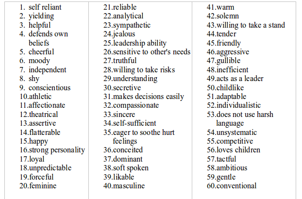
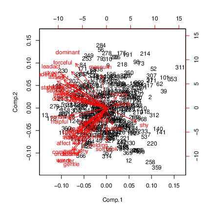

# Principal components


## Principal Components


* Have measurements on (possibly large) number of variables on some individuals.

* Question: can we describe data using fewer variables (because original variables correlated in some way)?

* Look for direction (linear combination of original variables) in which values *most spread out*. This is *first principal component*.

* Second principal component then direction uncorrelated with this in which values then most spread out. And so on.


## Principal components


* See whether small number of principal components captures most of variation in data.

* Might try to interpret principal components.

* If 2 components good, can make plot of data.

* (Like discriminant analysis, but no groups.)

* "What are important ways that these data vary?"


##  Packages

You might not have installed the first of these. See over for
instructions. 


```r
library(ggbiplot) # see over
library(tidyverse)
library(ggrepel)
```

 


##   Installing `ggbiplot`


* `ggbiplot` not on CRAN, so usual
`install.packages` will not work. This is same procedure you used for `smmr` in C32:

* Install package `devtools` first (once):

```r
install.packages("devtools")
```

     

* Then install `ggbiplot` (once):

```r
library(devtools)
install_github("vqv/ggbiplot")
```

     


##  Small example: 2 test scores for 8 people

\small

```r
my_url <- "http://www.utsc.utoronto.ca/~butler/d29/test12.txt"
test12 <- read_table2(my_url)
test12
```

```
## # A tibble: 8 x 3
##   first second id   
##   <dbl>  <dbl> <chr>
## 1     2      9 A    
## 2    16     40 B    
## 3     8     17 C    
## 4    18     43 D    
## 5    10     25 E    
## 6     4     10 F    
## 7    10     27 G    
## 8    12     30 H
```


```r
g <- ggplot(test12, aes(x = first, y = second, label = id)) +
  geom_point() + geom_text_repel()
```

\normalsize
 


##  The plot


```r
g + geom_smooth(method = "lm", se = F)
```


##  Principal component analysis


* Grab just the numeric columns:

```r
test12 %>% select_if(is.numeric) -> test12_numbers
```
     


* Strongly correlated, so data nearly 1-dimensional:


```r
cor(test12_numbers)
```

```
##           first   second
## first  1.000000 0.989078
## second 0.989078 1.000000
```

 
## Finding principal components

* Make a score summarizing this one dimension. Like this:


```r
test12.pc <- princomp(test12_numbers, cor = T)
summary(test12.pc)
```

```
## Importance of components:
##                          Comp.1      Comp.2
## Standard deviation     1.410347 0.104508582
## Proportion of Variance 0.994539 0.005461022
## Cumulative Proportion  0.994539 1.000000000
```

 


## Comments


* "Standard deviation" shows relative importance of components
(as for LDs in discriminant analysis)

* Here, first one explains almost all (99.4\%) of variability.

* That is, look only at first component and ignore second.

* `cor=T` standardizes all variables first. Usually wanted,
because variables measured on different scales. (Only omit if
variables measured on same scale and expect similar variability.)


##   Scree plot

```r
ggscreeplot(test12.pc)
```


   

Imagine scree plot continues at zero, so 2 components is a *big*
elbow (take one component).


##  Component loadings
explain how each principal component depends on (standardized)
original variables (test scores):

\footnotesize

```r
test12.pc$loadings
```

```
## 
## Loadings:
##        Comp.1 Comp.2
## first   0.707  0.707
## second  0.707 -0.707
## 
##                Comp.1 Comp.2
## SS loadings       1.0    1.0
## Proportion Var    0.5    0.5
## Cumulative Var    0.5    1.0
```
\normalsize
   

First component basically sum of (standardized) test
scores. That is, person tends to score similarly on two tests, and a
composite score would summarize performance.


##  Component scores

\small

```r
d <- data.frame(test12, test12.pc$scores)
d
```

```
##   first second id       Comp.1       Comp.2
## 1     2      9  A -2.071819003 -0.146981782
## 2    16     40  B  1.719862811 -0.055762223
## 3     8     17  C -0.762289708  0.207589512
## 4    18     43  D  2.176267535  0.042533250
## 5    10     25  E -0.007460609  0.007460609
## 6     4     10  F -1.734784030  0.070683441
## 7    10     27  G  0.111909141 -0.111909141
## 8    12     30  H  0.568313864 -0.013613668
```
\normalsize


* Person A is a low scorer, very negative `comp.1` score.

* Person D is high scorer, high positive `comp.1` score.

* Person E average scorer, near-zero `comp.1` score.

* `comp.2` says basically nothing.


##  Plot of scores


```r
ggplot(d, aes(x = Comp.1, y = Comp.2, label = id)) +
  geom_point() + geom_text_repel()
```


  


##  Comments


* Vertical scale exaggerates importance of `comp.2`.

* Fix up to get axes on same scale:

```r
g <- ggplot(d, aes(x = Comp.1, y = Comp.2, label = id)) +
  geom_point() + geom_text_repel() +
  coord_fixed()
```


* Shows how exam scores really spread out along one dimension:


```r
g
```


##  The biplot


* Plotting variables and individuals on one plot.

* Shows how components and original variables related.

* Shows how individuals score on each component, and therefore
suggests how they score on each variable.

* Add `labels` option to identify individuals:

```r
g <- ggbiplot(test12.pc, labels = test12$id)
```

     


##  The biplot

  


##  Comments


* Variables point almost same direction (left). Thus very
negative value on `comp.1` goes with high scores on both
tests, and test scores highly correlated.

* Position of individuals on plot according to scores on
principal components, implies values on original variables. Eg.:


* D very negative on `comp.1`, high scorer on both tests.

* A and F very positive on `comp.1`, poor scorers on
both tests.

* C positive on `comp.2`, high score on first
test relative to second.

* A negative on `comp.2`, high score on second test
relative to first.


##  Track running data

Track running records (1984) for distances 100m to marathon, arranged
by country. Countries labelled by (mostly) Internet domain names (ISO
2-letter codes):


 

\scriptsize

```r
my_url <- "http://www.utsc.utoronto.ca/~butler/d29/men_track_field.txt"
track <- read_table(my_url)
track %>% sample_n(10)
```

```
## # A tibble: 10 x 9
##     m100  m200  m400  m800 m1500 m5000 m10000 marathon country
##    <dbl> <dbl> <dbl> <dbl> <dbl> <dbl>  <dbl>    <dbl> <chr>  
##  1  10.6  21.5  47.8  1.84  3.92  14.7   30.8     149. id     
##  2  10.3  20.8  46.2  1.79  3.71  13.6   29.3     134. cl     
##  3  10.4  20.7  45.5  1.74  3.61  13.3   27.5     131. fi     
##  4  10.9  21.9  47.3  1.85  3.77  14.1   29.7     131. kp     
##  5  10.8  21.9  49    2.02  4.24  16.3   34.7     162. ws     
##  6  10.6  20.5  45.9  1.78  3.61  13.5   28.1     131. dk     
##  7  10.4  20.8  46.8  1.81  3.7   14.0   29.4     138. ar     
##  8  10.2  20.6  45.6  1.77  3.61  13.3   27.9     131. se     
##  9  10.1  20.4  45.3  1.73  3.57  13.3   28.0     132. fr     
## 10  10.5  21.0  45.1  1.74  3.62  13.4   27.6     129. nl
```
\normalsize
 


##  Country names
Also read in a table to look country names up in later:

\footnotesize

```r
my_url <- "http://www.utsc.utoronto.ca/~butler/d29/isocodes.csv"
iso <- read_csv(my_url)
iso
```

```
## # A tibble: 250 x 4
##    Country             ISO2  ISO3    M49
##    <chr>               <chr> <chr> <dbl>
##  1 Afghanistan         af    afg       4
##  2 Aland Islands       ax    ala     248
##  3 Albania             al    alb       8
##  4 Algeria             dz    dza      12
##  5 American Samoa      as    asm      16
##  6 Andorra             ad    and      20
##  7 Angola              ao    ago      24
##  8 Anguilla            ai    aia     660
##  9 Antarctica          aq    ata      10
## 10 Antigua and Barbuda ag    atg      28
## # … with 240 more rows
```
\normalsize
 


##  Data and aims


* 
Times in seconds 100m--400m, in minutes for rest (800m up).

* This taken care of by standardization.

* 8 variables; can we summarize by fewer and gain some insight?

* In particular, if 2 components tell most of story, what do we see in a plot?


##  Fit and examine principal components


\footnotesize

```r
track %>% select_if(is.numeric) -> track_num
track.pc <- princomp(track_num, cor = T)
summary(track.pc)
```

```
## Importance of components:
##                           Comp.1    Comp.2
## Standard deviation     2.5733531 0.9368128
## Proportion of Variance 0.8277683 0.1097023
## Cumulative Proportion  0.8277683 0.9374706
##                            Comp.3     Comp.4
## Standard deviation     0.39915052 0.35220645
## Proportion of Variance 0.01991514 0.01550617
## Cumulative Proportion  0.95738570 0.97289187
##                             Comp.5      Comp.6
## Standard deviation     0.282630981 0.260701267
## Proportion of Variance 0.009985034 0.008495644
## Cumulative Proportion  0.982876903 0.991372547
##                             Comp.7      Comp.8
## Standard deviation     0.215451919 0.150333291
## Proportion of Variance 0.005802441 0.002825012
## Cumulative Proportion  0.997174988 1.000000000
```
\normalsize
 


##   Scree plot


```r
ggscreeplot(track.pc)
```


 


##  How many components?


* As for discriminant analysis, look for "elbow" in scree plot.

* See one here at 3 components; everything 3 and beyond is "scree".

* So take 2 components.

* Note difference from discriminant analysis: want "large"
rather than "small", so go 1 step left of elbow.

* Another criterion: any component with eigenvalue bigger than
about 1 is worth including. 2nd one here has eigenvalue just less
than 1.

* Refer back to `summary`: cumulative proportion of
variance explained for 2 components is 93.7\%, pleasantly high. 2
components tell almost whole story.


##  How do components depend on original variables?
Loadings:

\footnotesize

```r
track.pc$loadings
```

```
## 
## Loadings:
##          Comp.1 Comp.2 Comp.3 Comp.4 Comp.5 Comp.6 Comp.7 Comp.8
## m100      0.318  0.567  0.332  0.128  0.263  0.594  0.136  0.106
## m200      0.337  0.462  0.361 -0.259 -0.154 -0.656 -0.113       
## m400      0.356  0.248 -0.560  0.652 -0.218 -0.157              
## m800      0.369        -0.532 -0.480  0.540        -0.238       
## m1500     0.373 -0.140 -0.153 -0.405 -0.488  0.158  0.610  0.139
## m5000     0.364 -0.312  0.190        -0.254  0.141 -0.591  0.547
## m10000    0.367 -0.307  0.182        -0.133  0.219 -0.177 -0.797
## marathon  0.342 -0.439  0.263  0.300  0.498 -0.315  0.399  0.158
## 
##                Comp.1 Comp.2 Comp.3 Comp.4 Comp.5 Comp.6 Comp.7
## SS loadings     1.000  1.000  1.000  1.000  1.000  1.000  1.000
## Proportion Var  0.125  0.125  0.125  0.125  0.125  0.125  0.125
## Cumulative Var  0.125  0.250  0.375  0.500  0.625  0.750  0.875
##                Comp.8
## SS loadings     1.000
## Proportion Var  0.125
## Cumulative Var  1.000
```
\normalsize
   


##  Comments


* `comp.1` loads about equally (has equal weight) on
times over all distances.

* `comp.2` has large positive loading for short
distances, large negative for long ones.

* `comp.3`: large negative for middle distance, large
positive especially for short distances.

* Country overall good at running will have lower than average record
times at all distances, so `comp.1`
*small*. Conversely, for countries bad at running,
`comp.1` very positive.

* Countries relatively better at sprinting (low times) will be
*negative* on `comp.2`; countries relatively better at
distance running *positive* on `comp.2`.


##  Commands for plots


* Principal component scores (first two). Also need country IDs.

```r
d <- data.frame(track.pc$scores,
  country = track$country
)
names(d)
```

```
## [1] "Comp.1"  "Comp.2"  "Comp.3"  "Comp.4"  "Comp.5"  "Comp.6" 
## [7] "Comp.7"  "Comp.8"  "country"
```

```r
g1 <- ggplot(d, aes(x = Comp.1, y = Comp.2,
  label = country)) +
  geom_point() + geom_text_repel() + coord_fixed()
```

     


* Biplot:

```r
g2 <- ggbiplot(track.pc, labels = track$country)
```

   


##   Principal components plot


```r
g1
```


     


##   Comments on principal components plot


* Good running countries at left of plot: US, UK, Italy,
Russia, East and West Germany.

* Bad running countries at right: Western Samoa, Cook Islands.

* Better sprinting countries at bottom: US, Italy, Russia,
Brazil, Greece. `do` is Dominican Republic, where sprinting
records relatively good, distance records very bad.

* Better distance-running countries at top: Portugal, Norway,
Turkey, Ireland, New Zealand, Mexico. `ke` is Kenya.


##   Biplot


```r
g2
```


  


##  Comments on biplot


* Had to do some pre-work to interpret PC plot. Biplot more self-contained.

* All variable arrows point right; countries on right have large
(bad) record times overall, countries on left good overall.

* Imagine that variable arrows extend negatively as well. Bottom right = bad at
distance running, top left = good at distance running.

* Top right = bad at sprinting, bottom left = good at
sprinting.

* Doesn't require so much pre-interpretation of components.


##  Best 8 running countries

Need to look up two-letter abbreviations in ISO table:

\footnotesize

```r
d %>%
  arrange(Comp.1) %>%
  left_join(iso, by = c("country" = "ISO2")) %>%
  select(Comp.1, country, Country) %>%
  slice(1:8)
```

```
##      Comp.1 country                  Country
## 1 -3.462175      us United States of America
## 2 -3.052104      uk           United Kingdom
## 3 -2.752084      it                    Italy
## 4 -2.651062      ru       Russian Federation
## 5 -2.613964     dee             East Germany
## 6 -2.576272     dew             West Germany
## 7 -2.468919      au                Australia
## 8 -2.191917      fr                   France
```
\normalsize
   


##  Worst 8 running countries

\footnotesize

```r
d %>%
  arrange(desc(Comp.1)) %>%
  left_join(iso, by = c("country" = "ISO2")) %>%
  select(Comp.1, country, Country) %>%
  slice(1:8)
```

```
##      Comp.1 country          Country
## 1 10.652914      ck     Cook Islands
## 2  7.297865      ws            Samoa
## 3  4.297909      mt            Malta
## 4  3.945224      pg Papua New Guinea
## 5  3.150886      sg        Singapore
## 6  2.787273      th         Thailand
## 7  2.773125      id        Indonesia
## 8  2.697066      gu             Guam
```
\normalsize
   


##  Better at distance running

\footnotesize

```r
d %>%
  arrange(desc(Comp.2)) %>%
  left_join(iso, by = c("country" = "ISO2")) %>%
  select(Comp.2, country, Country) %>%
  slice(1:10)
```

```
##       Comp.2 country                   Country
## 1  1.6860391      cr                Costa Rica
## 2  1.5791490      kp             Korea (North)
## 3  1.5226742      ck              Cook Islands
## 4  1.3957839      tr                    Turkey
## 5  1.3167578      pt                  Portugal
## 6  1.2829272      gu                      Guam
## 7  1.0663756      no                    Norway
## 8  0.9547437      ir Iran, Islamic Republic of
## 9  0.9318729      nz               New Zealand
## 10 0.8495104      mx                    Mexico
```
\normalsize
   

##  Better at sprinting

\footnotesize

```r
d %>%
  arrange(Comp.2) %>%
  left_join(iso, by = c("country" = "ISO2")) %>%
  select(Comp.2, country, Country) %>%
  slice(1:10)
```

```
##        Comp.2 country                  Country
## 1  -2.4715736      do       Dominican Republic
## 2  -1.9196130      ws                    Samoa
## 3  -1.8055052      sg                Singapore
## 4  -1.7832229      bm                  Bermuda
## 5  -1.7386063      my                 Malaysia
## 6  -1.6851772      th                 Thailand
## 7  -1.1204235      us United States of America
## 8  -0.9989821      it                    Italy
## 9  -0.7639385      ru       Russian Federation
## 10 -0.6470634      br                   Brazil
```
\normalsize
   


##  Plot with country names

```r
g <- d %>%
  left_join(iso, by = c("country" = "ISO2")) %>%
  select(Comp.1, Comp.2, Country) %>%
  ggplot(aes(x = Comp.1, y = Comp.2, label = Country)) +
  geom_point() + geom_text_repel(size = 1) +
  coord_fixed()
```

```
## Warning: Column `country`/`ISO2` joining factor and character
## vector, coercing into character vector
```

   


##  The plot


```r
g
```


   


##  Principal components from correlation matrix
Create data file like this:

```
 1        0.9705 -0.9600
 0.9705   1      -0.9980
-0.9600  -0.9980  1
```

and read in like this:

```r
my_url <- "http://www.utsc.utoronto.ca/~butler/d29/cov.txt"
mat <- read_table(my_url, col_names = F)
mat
```

```
## # A tibble: 3 x 3
##       X1     X2     X3
##    <dbl>  <dbl>  <dbl>
## 1  1      0.970 -0.96 
## 2  0.970  1     -0.998
## 3 -0.96  -0.998  1
```

   


##  Pre-processing
A little pre-processing required:


* Turn into matrix (from data frame)

* Feed into `princomp` as `covmat=`


```r
mat.pc <- mat %>%
  as.matrix() %>%
  princomp(covmat = .)
```

   


##  Scree plot: one component fine


```r
ggscreeplot(mat.pc)
```


  


##  Component loadings
Compare correlation matrix:

\scriptsize

```r
mat
```

```
## # A tibble: 3 x 3
##       X1     X2     X3
##    <dbl>  <dbl>  <dbl>
## 1  1      0.970 -0.96 
## 2  0.970  1     -0.998
## 3 -0.96  -0.998  1
```
\normalsize
  

with component loadings

\scriptsize

```r
mat.pc$loadings
```

```
## 
## Loadings:
##    Comp.1 Comp.2 Comp.3
## X1  0.573  0.812  0.112
## X2  0.581 -0.306 -0.755
## X3 -0.578  0.498 -0.646
## 
##                Comp.1 Comp.2 Comp.3
## SS loadings     1.000  1.000  1.000
## Proportion Var  0.333  0.333  0.333
## Cumulative Var  0.333  0.667  1.000
```
\normalsize

## Comments

* When X1 large, X2 also large, X3 small.

  * Then `comp.1` *positive*.

* When X1 small, X2 small, X3 large.

  * Then `comp.1` *negative*.


##  No scores


* With correlation matrix rather than data, no component scores

  * So no principal component plot

  * and no biplot. 


# Exploratory factor analysis

##  Principal components and factor analysis


* Principal components: 


  * Purely mathematical.

  * Find eigenvalues, eigenvectors of correlation matrix.

  * No testing whether observed components reproducible, or even probability model behind it.


* Factor analysis: 


  * some way towards fixing this (get test of appropriateness)

  * In factor analysis, each variable modelled as: "common factor" (eg. verbal ability) and "specific factor" (left over).

  * Choose the common factors to "best" reproduce pattern seen in correlation matrix.

  * Iterative procedure, different answer from principal components.


##  Packages

```r
library(lavaan) # for confirmatory, later
library(ggbiplot)
library(tidyverse)
```

   


##  Example


* 
145 children given 5 tests, called PARA, SENT, WORD, ADD and DOTS. 3 linguistic tasks (paragraph comprehension, sentence completion  and word meaning), 2 mathematical ones (addition and counting dots).

* Correlation matrix of scores on the tests:


```

para 1     0.722 0.714 0.203 0.095
sent 0.722 1     0.685 0.246 0.181
word 0.714 0.685 1     0.170 0.113
add  0.203 0.246 0.170 1     0.585
dots 0.095 0.181 0.113 0.585 1

```


* Is there small number of underlying "constructs" (unobservable) that explains this pattern of correlations?


##  To start: principal components

Using correlation matrix. Read that first:


```r
my_url <- "http://www.utsc.utoronto.ca/~butler/d29/rex2.txt"
kids <- read_delim(my_url, " ")
kids
```

```
## # A tibble: 5 x 6
##   test   para  sent  word   add  dots
##   <chr> <dbl> <dbl> <dbl> <dbl> <dbl>
## 1 para  1     0.722 0.714 0.203 0.095
## 2 sent  0.722 1     0.685 0.246 0.181
## 3 word  0.714 0.685 1     0.17  0.113
## 4 add   0.203 0.246 0.17  1     0.585
## 5 dots  0.095 0.181 0.113 0.585 1
```

## Principal components on correlation matrix


```r
kids %>%
  select_if(is.numeric) %>%
  as.matrix() %>%
  princomp(covmat = .) -> kids.pc
```


##  Scree plot

```r
ggscreeplot(kids.pc)
```


   


##  Principal component results


* Need 2 components. Loadings:

\footnotesize

```r
kids.pc$loadings
```

```
## 
## Loadings:
##      Comp.1 Comp.2 Comp.3 Comp.4 Comp.5
## para  0.534  0.245  0.114         0.795
## sent  0.542  0.164         0.660 -0.489
## word  0.523  0.247 -0.144 -0.738 -0.316
## add   0.297 -0.627  0.707              
## dots  0.241 -0.678 -0.680         0.143
## 
##                Comp.1 Comp.2 Comp.3 Comp.4 Comp.5
## SS loadings       1.0    1.0    1.0    1.0    1.0
## Proportion Var    0.2    0.2    0.2    0.2    0.2
## Cumulative Var    0.2    0.4    0.6    0.8    1.0
```
\normalsize

## Comments

* First component has a bit of everything, though especially the
first three tests.

* Second component rather more clearly `add` and `dots`.

* No scores, plots since no actual data.


##  Factor analysis


* Specify number of factors first, get solution with exactly
that many factors.

* Includes hypothesis test, need to specify how many children
wrote the tests.

* Works from correlation matrix via `covmat` or actual
data, like `princomp`.

* Introduces extra feature, *rotation*, to make
interpretation of loadings (factor-variable relation) easier.


##  Factor analysis for the kids data


* Create "covariance list" to include number of children who
wrote the tests.

* Feed this into `factanal`, specifying how many factors (2).


```r
km <- kids %>%
  select_if(is.numeric) %>%
  as.matrix()
km2 <- list(cov = km, n.obs = 145)
kids.f2 <- factanal(factors = 2, covmat = km2)
```

   


##  Uniquenesses


```r
kids.f2$uniquenesses
```

```
##      para      sent      word       add      dots 
## 0.2424457 0.2997349 0.3272312 0.5743568 0.1554076
```


* Uniquenesses say how "unique" a variable is (size of
specific factor). Small
uniqueness means that the variable is summarized by a factor (good).

* Very large uniquenesses are bad; `add`'s uniqueness is largest but not large enough to be worried about.

* Also see "communality" for this idea, where *large* is good and *small* is bad.


##  Loadings

\footnotesize

```r
kids.f2$loadings
```

```
## 
## Loadings:
##      Factor1 Factor2
## [1,] 0.867          
## [2,] 0.820   0.166  
## [3,] 0.816          
## [4,] 0.167   0.631  
## [5,]         0.918  
## 
##                Factor1 Factor2
## SS loadings      2.119   1.282
## Proportion Var   0.424   0.256
## Cumulative Var   0.424   0.680
```
\normalsize

* Loadings show how each factor depends on variables. Blanks
indicate "small", less than 0.1.

## Comments xxx

* Factor 1 clearly the "linguistic" tasks, factor 2 clearly
the "mathematical" ones.

* Two factors together explain 68\% of variability (like
regression R-squared).
    
- Which variables belong to which factor is *much* clearer than with principal components.

##  Are 2 factors enough? xxx

```r
kids.f2$STATISTIC
```

```
## objective 
## 0.5810578
```

```r
kids.f2$dof
```

```
## [1] 1
```

```r
kids.f2$PVAL
```

```
## objective 
##  0.445898
```

   

P-value not small, so 2 factors OK.


##  1 factor


```r
kids.f1 <- factanal(factors = 1, covmat = km2)
kids.f1$STATISTIC
```

```
## objective 
##  58.16534
```

```r
kids.f1$dof
```

```
## [1] 5
```

```r
kids.f1$PVAL
```

```
##    objective 
## 2.907856e-11
```

   

1 factor rejected (P-value small). Definitely need more than 1.


##  Track running records revisited

Read the data, run principal components, get biplot: 


```r
my_url <- "http://www.utsc.utoronto.ca/~butler/d29/men_track_field.txt"
track <- read_table(my_url)
track %>% select_if(is.numeric) -> track_num
track.pc <- princomp(track_num, cor = T)
g2 <- ggbiplot(track.pc, labels = track$country)
```

## The biplot


```r
g2
```


   


##  Benefit of rotation


* 100m and marathon arrows almost perpendicular, but components
don't match anything much:


* sprinting: bottom left and top right

* distance running: top left and bottom right.


* Can we arrange things so that components (factors) correspond
to something meaningful?


## xxx  Track records by factor analysis
Obtain factor scores (have actual data): xxx

\normalsize

```r
track %>%
  select_if(is.numeric) %>%
  factanal(2, scores = "r") -> track.f
```
\normalsize
   


##  Track data biplot
Not so nice-looking:  

```r
biplot(track.f$scores, track.f$loadings,
  xlabs = track$country
)
```


   


##  Comments


* This time 100m "up" (factor 2), marathon "right" (factor 1).

* Countries most negative on factor 2 good at sprinting.

* Countries most negative on factor 1 good at distance running.


##  Rotated factor loadings
\small

```r
track.f$loadings
```

```
## 
## Loadings:
##          Factor1 Factor2
## m100     0.291   0.914  
## m200     0.382   0.882  
## m400     0.543   0.744  
## m800     0.691   0.622  
## m1500    0.799   0.530  
## m5000    0.901   0.394  
## m10000   0.907   0.399  
## marathon 0.915   0.278  
## 
##                Factor1 Factor2
## SS loadings      4.112   3.225
## Proportion Var   0.514   0.403
## Cumulative Var   0.514   0.917
```
\normalsize


## Which countries are good at sprinting or distance running?

Make a data frame with the countries and scores in:


```r
scores <- data.frame(
  country = track$country,
  track.f$scores
)
scores %>% slice(1:6)
```

```
##   country     Factor1    Factor2
## 1      ar  0.33633782 -0.2651512
## 2      au -0.49395787 -0.8121335
## 3      at -0.74199914  0.1764151
## 4      be -0.79602754 -0.2388525
## 5      bm  1.46541593 -1.1704466
## 6      br  0.07780163 -0.8871291
```

 


##  The best sprinting countries
Most negative on factor 2:

\footnotesize

```r
scores %>%
  arrange(Factor2) %>%
  left_join(iso, by = c("country" = "ISO2")) %>%
  select(Country, Factor1, Factor2) %>%
  slice(1:10)
```

```
##                     Country     Factor1    Factor2
## 1  United States of America -0.21942697 -1.7251036
## 2                     Italy -0.18436705 -1.4990521
## 3        Dominican Republic  2.12906546 -1.4666402
## 4        Russian Federation -0.32473110 -1.2236590
## 5                   Bermuda  1.46541593 -1.1704466
## 6            United Kingdom -0.58969058 -1.0139983
## 7                    France -0.25301846 -0.9519162
## 8              West Germany -0.46748876 -0.9079005
## 9                    Canada -0.13690160 -0.8920777
## 10                   Brazil  0.07780163 -0.8871291
```
\normalsize
 


##  The best distance-running countries
Most negative on factor 1:

\footnotesize

```r
scores %>%
  arrange(Factor1) %>%
  left_join(iso, by = c("country" = "ISO2")) %>%
  select(Country, Factor1, Factor2) %>%
  slice(1:10)
```

```
##                      Country    Factor1     Factor2
## 1                   Portugal -1.2509805  0.78366889
## 2                     Norway -0.9920727  0.62299560
## 3                New Zealand -0.9813348  0.26603491
## 4                      Kenya -0.9749696 -0.07099477
## 5  Iran, Islamic Republic of -0.9231505  0.50271208
## 6                Netherlands -0.9078661  0.23948200
## 7                    Romania -0.8178386  0.18555001
## 8                     Mexico -0.8096291  0.51446762
## 9                    Finland -0.8094725 -0.05705220
## 10                   Belgium -0.7960275 -0.23885253
```
\normalsize
 

##  A bigger example: BEM sex role inventory


* 369 women asked to rate themselves on 60 traits, like "self-reliant" or "shy".

* Rating 1 "never or almost never true of me" to 7 ``always or
almost always true of me''.

* 60 personality traits is a lot. Can we find a smaller number
of factors that capture aspects of personality?

* The whole BEM sex role inventory on next page.


## xxx  The whole inventory


{width=5}


##  Some of the data


\scriptsize

```r
my_url <- "http://www.utsc.utoronto.ca/~butler/d29/factor.txt"
bem <- read_tsv(my_url)
bem
```

```
## # A tibble: 369 x 45
##    subno helpful reliant defbel yielding cheerful indpt athlet
##    <dbl>   <dbl>   <dbl>  <dbl>    <dbl>    <dbl> <dbl>  <dbl>
##  1     1       7       7      5        5        7     7      7
##  2     2       5       6      6        6        2     3      3
##  3     3       7       6      4        4        5     5      2
##  4     4       6       6      7        4        6     6      3
##  5     5       6       6      7        4        7     7      7
##  6     7       5       6      7        4        6     6      2
##  7     8       6       4      6        6        6     3      1
##  8     9       7       6      7        5        6     7      5
##  9    10       7       6      6        4        4     5      2
## 10    11       7       4      7        4        7     5      2
## # … with 359 more rows, and 37 more variables: shy <dbl>,
## #   assert <dbl>, strpers <dbl>, forceful <dbl>, affect <dbl>,
## #   flatter <dbl>, loyal <dbl>, analyt <dbl>, feminine <dbl>,
## #   sympathy <dbl>, moody <dbl>, sensitiv <dbl>, undstand <dbl>,
## #   compass <dbl>, leaderab <dbl>, soothe <dbl>, risk <dbl>,
## #   decide <dbl>, selfsuff <dbl>, conscien <dbl>,
## #   dominant <dbl>, masculin <dbl>, stand <dbl>, happy <dbl>,
## #   softspok <dbl>, warm <dbl>, truthful <dbl>, tender <dbl>,
## #   gullible <dbl>, leadact <dbl>, childlik <dbl>,
## #   individ <dbl>, foullang <dbl>, lovchil <dbl>, compete <dbl>,
## #   ambitiou <dbl>, gentle <dbl>
```
\normalsize
   


##  Principal components first
\ldots to decide on number of factors:

```r
bem.pc <- bem %>%
  select(-subno) %>%
  princomp(cor = T)
```

   


## xxx  The scree plot

```r
(g <- ggscreeplot(bem.pc))
```


 


* No obvious elbow.
  


##  Zoom in to search for elbow xxx

Possible elbows at 3 (2 factors) and 6 (5):


```r
g + scale_x_continuous(limits = c(0, 8))
```


##  but is 2 really good?

\scriptsize

```r
summary(bem.pc)
```

```
## Importance of components:
##                           Comp.1    Comp.2     Comp.3     Comp.4
## Standard deviation     2.7444993 2.2405789 1.55049106 1.43886350
## Proportion of Variance 0.1711881 0.1140953 0.05463688 0.04705291
## Cumulative Proportion  0.1711881 0.2852834 0.33992029 0.38697320
##                            Comp.5     Comp.6     Comp.7
## Standard deviation     1.30318840 1.18837867 1.15919129
## Proportion of Variance 0.03859773 0.03209645 0.03053919
## Cumulative Proportion  0.42557093 0.45766738 0.48820657
##                            Comp.8     Comp.9    Comp.10
## Standard deviation     1.07838912 1.07120568 1.04901318
## Proportion of Variance 0.02643007 0.02607913 0.02500974
## Cumulative Proportion  0.51463664 0.54071577 0.56572551
##                           Comp.11    Comp.12    Comp.13
## Standard deviation     1.03848656 1.00152287 0.97753974
## Proportion of Variance 0.02451033 0.02279655 0.02171782
## Cumulative Proportion  0.59023584 0.61303238 0.63475020
##                           Comp.14   Comp.15    Comp.16
## Standard deviation     0.95697572 0.9287543 0.92262649
## Proportion of Variance 0.02081369 0.0196042 0.01934636
## Cumulative Proportion  0.65556390 0.6751681 0.69451445
##                           Comp.17   Comp.18    Comp.19
## Standard deviation     0.90585705 0.8788668 0.86757525
## Proportion of Variance 0.01864948 0.0175547 0.01710652
## Cumulative Proportion  0.71316392 0.7307186 0.74782514
##                           Comp.20    Comp.21    Comp.22
## Standard deviation     0.84269120 0.83124925 0.80564654
## Proportion of Variance 0.01613928 0.01570398 0.01475151
## Cumulative Proportion  0.76396443 0.77966841 0.79441992
##                           Comp.23    Comp.24    Comp.25
## Standard deviation     0.78975423 0.78100835 0.77852606
## Proportion of Variance 0.01417527 0.01386305 0.01377506
## Cumulative Proportion  0.80859519 0.82245823 0.83623330
##                           Comp.26    Comp.27    Comp.28
## Standard deviation     0.74969868 0.74137885 0.72343693
## Proportion of Variance 0.01277382 0.01249188 0.01189457
## Cumulative Proportion  0.84900712 0.86149899 0.87339356
##                           Comp.29    Comp.30    Comp.31
## Standard deviation     0.71457305 0.70358645 0.69022738
## Proportion of Variance 0.01160488 0.01125077 0.01082759
## Cumulative Proportion  0.88499844 0.89624921 0.90707680
##                            Comp.32     Comp.33    Comp.34
## Standard deviation     0.654861232 0.640339974 0.63179848
## Proportion of Variance 0.009746437 0.009318984 0.00907203
## Cumulative Proportion  0.916823235 0.926142219 0.93521425
##                            Comp.35     Comp.36     Comp.37
## Standard deviation     0.616621295 0.602404917 0.570025368
## Proportion of Variance 0.008641405 0.008247538 0.007384748
## Cumulative Proportion  0.943855654 0.952103192 0.959487940
##                            Comp.38     Comp.39     Comp.40
## Standard deviation     0.560881809 0.538149460 0.530277613
## Proportion of Variance 0.007149736 0.006581928 0.006390781
## Cumulative Proportion  0.966637677 0.973219605 0.979610386
##                            Comp.41     Comp.42     Comp.43
## Standard deviation     0.512370708 0.505662309 0.480413465
## Proportion of Variance 0.005966449 0.005811236 0.005245389
## Cumulative Proportion  0.985576834 0.991388070 0.996633459
##                            Comp.44
## Standard deviation     0.384873772
## Proportion of Variance 0.003366541
## Cumulative Proportion  1.000000000
```
\normalsize


##  Comments


* Want overall fraction of variance explained (``cumulative
proportion'') to be reasonably high.

* 2 factors, 28.5\%. Terrible!

* Even 56\% (10 factors) not that good!

* Have to live with that.


##  Biplot


```r
ggbiplot(bem.pc, alpha = 0.3)
```


  



##  Comments


* Ignore individuals for now.

* Most variables point to 10 o'clock or 7 o'clock.

* Suggests factor analysis with rotation will get interpretable
factors (rotate to 6 o'clock and 9 o'clock, for example).

* Try for 2-factor solution (rough interpretation, will be bad):


```r
bem.2 <- bem %>%
  select(-subno) %>%
  factanal(factors = 2)
```


* Show output in pieces (just print `bem.2` to see all of it).


##  Uniquenesses, sorted

\scriptsize

```r
sort(bem.2$uniquenesses)
```

```
##  leaderab   leadact      warm    tender  dominant    gentle 
## 0.4091894 0.4166153 0.4764762 0.4928919 0.4942909 0.5064551 
##  forceful   strpers   compass     stand  undstand    assert 
## 0.5631857 0.5679398 0.5937073 0.6024001 0.6194392 0.6329347 
##    soothe    affect    decide  selfsuff  sympathy     indpt 
## 0.6596103 0.6616625 0.6938578 0.7210246 0.7231450 0.7282742 
##   helpful    defbel      risk   reliant   individ   compete 
## 0.7598223 0.7748448 0.7789761 0.7808058 0.7941998 0.7942910 
##  conscien     happy  sensitiv     loyal  ambitiou       shy 
## 0.7974820 0.8008966 0.8018851 0.8035264 0.8101599 0.8239496 
##  softspok  cheerful  masculin  yielding  feminine  truthful 
## 0.8339058 0.8394916 0.8453368 0.8688473 0.8829927 0.8889983 
##   lovchil    analyt    athlet   flatter  gullible     moody 
## 0.8924392 0.8968744 0.9229702 0.9409500 0.9583435 0.9730607 
##  childlik  foullang 
## 0.9800360 0.9821662
```
\normalsize
   
## Comments xxx

* Mostly high or very high (bad).

* Some smaller, eg.: Leadership ability (0.409),
Acts like leader (0.417),
Warm (0.476),
Tender (0.493).

* Smaller uniquenesses captured by one of our two factors.

- Larger uniquenesses are not: need more factors to capture them.


##  Factor loadings, some

\scriptsize

```r
bem.2$loadings
```

```
## 
## Loadings:
##          Factor1 Factor2
## helpful   0.314   0.376 
## reliant   0.453   0.117 
## defbel    0.434   0.193 
## yielding -0.131   0.338 
## cheerful  0.152   0.371 
## indpt     0.521         
## athlet    0.267         
## shy      -0.414         
## assert    0.605         
## strpers   0.657         
## forceful  0.649  -0.126 
## affect    0.178   0.554 
## flatter           0.223 
## loyal     0.151   0.417 
## analyt    0.295   0.127 
## feminine  0.113   0.323 
## sympathy          0.526 
## moody            -0.162 
## sensitiv  0.135   0.424 
## undstand          0.610 
## compass   0.114   0.627 
## leaderab  0.765         
## soothe            0.580 
## risk      0.442   0.161 
## decide    0.542   0.113 
## selfsuff  0.511   0.134 
## conscien  0.328   0.308 
## dominant  0.668  -0.245 
## masculin  0.276  -0.280 
## stand     0.607   0.172 
## happy     0.119   0.430 
## softspok -0.230   0.336 
## warm              0.719 
## truthful  0.109   0.315 
## tender            0.710 
## gullible -0.153   0.135 
## leadact   0.763         
## childlik -0.101         
## individ   0.445         
## foullang          0.133 
## lovchil           0.327 
## compete   0.450         
## ambitiou  0.414   0.137 
## gentle            0.702 
## 
##                Factor1 Factor2
## SS loadings      6.083   5.127
## Proportion Var   0.138   0.117
## Cumulative Var   0.138   0.255
```
\normalsize


##  Making a data frame
There are too many to read easily, so make a data frame. A
bit tricky:

\footnotesize

```r
loadings <- as.data.frame(unclass(bem.2$loadings)) %>%
  mutate(trait = rownames(bem.2$loadings))
loadings %>% slice(1:12)
```

```
##       Factor1      Factor2    trait
## 1   0.3137466  0.376484908  helpful
## 2   0.4532904  0.117140647  reliant
## 3   0.4336574  0.192602996   defbel
## 4  -0.1309965  0.337629288 yielding
## 5   0.1523718  0.370530549 cheerful
## 6   0.5212403  0.005870336    indpt
## 7   0.2670788  0.075542858   athlet
## 8  -0.4144579 -0.065372760      shy
## 9   0.6049588  0.033004846   assert
## 10  0.6569855  0.020777649  strpers
## 11  0.6487190 -0.126405816 forceful
## 12  0.1778911  0.553799444   affect
```
\normalsize
   


##  Pick out the big ones on factor 1

Arbitrarily defining $>0.4$ or $<-0.4$ as "big":

\scriptsize

```r
loadings %>% filter(abs(Factor1) > 0.4) 
```

```
##       Factor1      Factor2    trait
## 1   0.4532904  0.117140647  reliant
## 2   0.4336574  0.192602996   defbel
## 3   0.5212403  0.005870336    indpt
## 4  -0.4144579 -0.065372760      shy
## 5   0.6049588  0.033004846   assert
## 6   0.6569855  0.020777649  strpers
## 7   0.6487190 -0.126405816 forceful
## 8   0.7654924  0.069513572 leaderab
## 9   0.4416176  0.161238425     risk
## 10  0.5416796  0.112807957   decide
## 11  0.5109964  0.133626767 selfsuff
## 12  0.6676490 -0.244855780 dominant
## 13  0.6066864  0.171848896    stand
## 14  0.7627129 -0.040667202  leadact
## 15  0.4448064  0.089146147  individ
## 16  0.4504188  0.053207281  compete
## 17  0.4136498  0.136869589 ambitiou
```
\normalsize


##  Factor 2, the big ones

\footnotesize

```r
loadings %>% filter(abs(Factor2) > 0.4)
```

```
##        Factor1   Factor2    trait
## 1   0.17789112 0.5537994   affect
## 2   0.15121266 0.4166622    loyal
## 3   0.02301456 0.5256654 sympathy
## 4   0.13476970 0.4242037 sensitiv
## 5   0.09111299 0.6101294 undstand
## 6   0.11350643 0.6272223  compass
## 7   0.06061755 0.5802714   soothe
## 8   0.11893011 0.4300698    happy
## 9   0.07956978 0.7191610     warm
## 10  0.05113807 0.7102763   tender
## 11 -0.01873224 0.7022768   gentle
```
\normalsize
   


## xxx  Plotting the two factors
- A bi-plot, this time with the variables reduced in size. Looking for
unusual individuals.

- Have to run `factanal` again to get factor scores for plotting.


```r
bem %>% select(-subno) %>% factanal(,. factors=2, scores="r") -> bem.2a
biplot(bem.2a$scores, bem.2a$loadings, cex = c(0.5, 0.5))
```

 

- Numbers on plot are row numbers of `bem`
data frame.


##  The (awful) biplot


 


##  Comments


* Variables mostly up ("feminine") and right ("masculine"),
accomplished by rotation.

* Some unusual individuals: 311, 214 (low on factor 2), 366
(high on factor 2),
359, 258
(low on factor 1), 230 (high on factor 1).


##  Individual 366

\tiny

```r
bem %>% slice(366) %>% glimpse()
```

```
## Observations: 1
## Variables: 45
## $ subno    <dbl> 755
## $ helpful  <dbl> 7
## $ reliant  <dbl> 7
## $ defbel   <dbl> 5
## $ yielding <dbl> 7
## $ cheerful <dbl> 7
## $ indpt    <dbl> 7
## $ athlet   <dbl> 7
## $ shy      <dbl> 2
## $ assert   <dbl> 1
## $ strpers  <dbl> 3
## $ forceful <dbl> 1
## $ affect   <dbl> 7
## $ flatter  <dbl> 9
## $ loyal    <dbl> 7
## $ analyt   <dbl> 7
## $ feminine <dbl> 7
## $ sympathy <dbl> 7
## $ moody    <dbl> 1
## $ sensitiv <dbl> 7
## $ undstand <dbl> 7
## $ compass  <dbl> 6
## $ leaderab <dbl> 3
## $ soothe   <dbl> 7
## $ risk     <dbl> 7
## $ decide   <dbl> 7
## $ selfsuff <dbl> 7
## $ conscien <dbl> 7
## $ dominant <dbl> 1
## $ masculin <dbl> 1
## $ stand    <dbl> 7
## $ happy    <dbl> 7
## $ softspok <dbl> 7
## $ warm     <dbl> 7
## $ truthful <dbl> 7
## $ tender   <dbl> 7
## $ gullible <dbl> 1
## $ leadact  <dbl> 2
## $ childlik <dbl> 1
## $ individ  <dbl> 5
## $ foullang <dbl> 7
## $ lovchil  <dbl> 7
## $ compete  <dbl> 7
## $ ambitiou <dbl> 7
## $ gentle   <dbl> 7
```
\normalsize

## Comments xxx


* Individual 366 high on factor 2, but hard to see which traits should have high scores
(unless we remember).

* Idea: *tidy* original data frame to make easier to look
things up.


##  Tidying original data

\scriptsize

```r
bem_tidy <- bem %>%
  mutate(row = row_number()) %>%
  gather(trait, score, c(-subno, -row))
bem_tidy
```

```
## # A tibble: 16,236 x 4
##    subno   row trait   score
##    <dbl> <int> <chr>   <dbl>
##  1     1     1 helpful     7
##  2     2     2 helpful     5
##  3     3     3 helpful     7
##  4     4     4 helpful     6
##  5     5     5 helpful     6
##  6     7     6 helpful     5
##  7     8     7 helpful     6
##  8     9     8 helpful     7
##  9    10     9 helpful     7
## 10    11    10 helpful     7
## # … with 16,226 more rows
```
\normalsize
   


##  Recall data frame of loadings

\footnotesize

```r
loadings %>% slice(1:10)
```

```
##       Factor1      Factor2    trait
## 1   0.3137466  0.376484908  helpful
## 2   0.4532904  0.117140647  reliant
## 3   0.4336574  0.192602996   defbel
## 4  -0.1309965  0.337629288 yielding
## 5   0.1523718  0.370530549 cheerful
## 6   0.5212403  0.005870336    indpt
## 7   0.2670788  0.075542858   athlet
## 8  -0.4144579 -0.065372760      shy
## 9   0.6049588  0.033004846   assert
## 10  0.6569855  0.020777649  strpers
```
\normalsize
   

Want to add the factor scores for each trait to our tidy data frame
`bem_tidy`. This is a left-join (over), matching on the column
`trait` that is in both data frames (thus, the default):


##  Looking up loadings

\scriptsize

```r
bem_tidy %>% left_join(loadings) -> bem_tidy
```

```
## Joining, by = "trait"
```

```r
bem_tidy %>% sample_n(12)
```

```
## # A tibble: 12 x 6
##    subno   row trait    score  Factor1  Factor2
##    <dbl> <int> <chr>    <dbl>    <dbl>    <dbl>
##  1    99    61 dominant     5  0.668   -0.245  
##  2   101    62 selfsuff     4  0.511    0.134  
##  3   569   331 soothe       7  0.0606   0.580  
##  4   461   260 tender       6  0.0511   0.710  
##  5   123    78 affect       6  0.178    0.554  
##  6   469   266 soothe       6  0.0606   0.580  
##  7   301   175 indpt        7  0.521    0.00587
##  8   397   223 soothe       5  0.0606   0.580  
##  9   149    97 leaderab     5  0.765    0.0695 
## 10   192   113 sympathy     6  0.0230   0.526  
## 11   572   334 helpful      5  0.314    0.376  
## 12   581   340 foullang     4 -0.00493  0.133
```
\normalsize
   


##  Individual 366, high on Factor 2
So now pick out the rows of the tidy data frame that belong to
individual 366 (`row=366`) and for which the `Factor2`
score exceeds 0.4 in absolute value (our "big" from before):

\scriptsize

```r
bem_tidy %>% filter(row == 366, abs(Factor2) > 0.4)
```

```
## # A tibble: 11 x 6
##    subno   row trait    score Factor1 Factor2
##    <dbl> <int> <chr>    <dbl>   <dbl>   <dbl>
##  1   755   366 affect       7  0.178    0.554
##  2   755   366 loyal        7  0.151    0.417
##  3   755   366 sympathy     7  0.0230   0.526
##  4   755   366 sensitiv     7  0.135    0.424
##  5   755   366 undstand     7  0.0911   0.610
##  6   755   366 compass      6  0.114    0.627
##  7   755   366 soothe       7  0.0606   0.580
##  8   755   366 happy        7  0.119    0.430
##  9   755   366 warm         7  0.0796   0.719
## 10   755   366 tender       7  0.0511   0.710
## 11   755   366 gentle       7 -0.0187   0.702
```
\normalsize
 
As expected, high scorer on these.


##  Several individuals
Rows 311 and 214 were *low* on Factor 2, so their scores should
be low. Can we do them all at once?

\footnotesize

```r
bem_tidy %>% filter(
  row %in% c(366, 311, 214),
  abs(Factor2) > 0.4
)
```

```
## # A tibble: 33 x 6
##    subno   row trait    score Factor1 Factor2
##    <dbl> <int> <chr>    <dbl>   <dbl>   <dbl>
##  1   369   214 affect       1  0.178    0.554
##  2   534   311 affect       5  0.178    0.554
##  3   755   366 affect       7  0.178    0.554
##  4   369   214 loyal        7  0.151    0.417
##  5   534   311 loyal        4  0.151    0.417
##  6   755   366 loyal        7  0.151    0.417
##  7   369   214 sympathy     4  0.0230   0.526
##  8   534   311 sympathy     4  0.0230   0.526
##  9   755   366 sympathy     7  0.0230   0.526
## 10   369   214 sensitiv     7  0.135    0.424
## # … with 23 more rows
```
\normalsize
   

Can we display each individual in own column?


##  Individual by column
Un-`tidy`, that is, `spread`:

\tiny

```r
bem_tidy %>%
  filter(
    row %in% c(366, 311, 214),
    abs(Factor2) > 0.4
  ) %>%
  select(-subno, -Factor1, -Factor2) %>%
  spread(row, score)
```

```
## # A tibble: 11 x 4
##    trait    `214` `311` `366`
##    <chr>    <dbl> <dbl> <dbl>
##  1 affect       1     5     7
##  2 compass      5     4     6
##  3 gentle       2     3     7
##  4 happy        4     3     7
##  5 loyal        7     4     7
##  6 sensitiv     7     4     7
##  7 soothe       3     4     7
##  8 sympathy     4     4     7
##  9 tender       3     4     7
## 10 undstand     5     3     7
## 11 warm         1     3     7
```
\normalsize
 
366 high, 311 middling, 214 (sometimes) low.


##  Individuals 230, 258, 359
These were high, low, low on factor 1. Adapt code:

\tiny

```r
bem_tidy %>%
  filter(row %in% c(359, 258, 230), abs(Factor1) > 0.4) %>%
  select(-subno, -Factor1, -Factor2) %>%
  spread(row, score)
```

```
## # A tibble: 17 x 4
##    trait    `230` `258` `359`
##    <chr>    <dbl> <dbl> <dbl>
##  1 ambitiou     7     2     4
##  2 assert       7     3     1
##  3 compete      6     2     1
##  4 decide       7     1     2
##  5 defbel       7     1     1
##  6 dominant     7     1     1
##  7 forceful     7     1     1
##  8 individ      7     3     3
##  9 indpt        7     7     1
## 10 leadact      7     1     1
## 11 leaderab     7     1     1
## 12 reliant      7     4     1
## 13 risk         7     5     7
## 14 selfsuff     7     4     1
## 15 shy          2     7     5
## 16 stand        7     1     6
## 17 strpers      7     1     3
```
\normalsize
 


##  Is 2 factors enough?
Suspect not:

```r
bem.2$PVAL
```

```
##     objective 
## 1.458183e-150
```

   

2 factors resoundingly rejected. Need more. Have to go all the way to
15 factors to not reject:


```r
bem.15 <- bem %>%
  select(-subno) %>%
  factanal(factors = 15)
bem.15$PVAL
```

```
## objective 
##  0.132617
```

 

Even then, only just over 50\% of variability explained.

Let's have a look at the important things in those 15 factors.


##  Get 15-factor loadings
into a data frame, as before:  

\small

```r
loadings <- as.data.frame(unclass(bem.15$loadings)) %>%
  mutate(trait = rownames(bem.15$loadings))
```
\normalsize
   

then show the highest few loadings on each factor.


##  Factor 1 (of 15)

\footnotesize

```r
loadings %>%
  arrange(desc(abs(Factor1))) %>%
  select(Factor1, trait) %>%
  slice(1:10)
```

```
##      Factor1    trait
## 1  0.8127595  compass
## 2  0.6756043 undstand
## 3  0.6611293 sympathy
## 4  0.6408327 sensitiv
## 5  0.5971006   soothe
## 6  0.3481290     warm
## 7  0.2797159   gentle
## 8  0.2788627   tender
## 9  0.2501505  helpful
## 10 0.2340594 conscien
```
\normalsize
   
Compassionate, understanding, sympathetic, soothing: thoughtful of
others. 


##  Factor 2

\footnotesize

```r
loadings %>%
  arrange(desc(abs(Factor2))) %>%
  select(Factor2, trait) %>%
  slice(1:10)
```

```
##       Factor2    trait
## 1   0.7615492  strpers
## 2   0.7160312 forceful
## 3   0.6981500   assert
## 4   0.5041921 dominant
## 5   0.3929344 leaderab
## 6   0.3669560    stand
## 7   0.3507080  leadact
## 8  -0.3131682 softspok
## 9  -0.2866862      shy
## 10  0.2602525   analyt
```
\normalsize
   

Strong personality, forceful, assertive, dominant: getting ahead. 


##  Factor 3

\footnotesize

```r
loadings %>%
  arrange(desc(abs(Factor3))) %>%
  select(Factor3, trait) %>%
  slice(1:10)
```

```
##       Factor3    trait
## 1   0.6697542  reliant
## 2   0.6475496 selfsuff
## 3   0.6204018    indpt
## 4   0.3899607  helpful
## 5  -0.3393605 gullible
## 6   0.3333813  individ
## 7   0.3319003   decide
## 8   0.3294806 conscien
## 9   0.2877396 leaderab
## 10  0.2804170   defbel
```
\normalsize
   

Self-reliant, self-sufficient, independent: going it alone.


##  Factor 4

\footnotesize

```r
loadings %>%
  arrange(desc(abs(Factor4))) %>%
  select(Factor4, trait) %>%
  slice(1:10)
```

```
##      Factor4    trait
## 1  0.6956206   gentle
## 2  0.6920303   tender
## 3  0.5992467     warm
## 4  0.4465546   affect
## 5  0.3942568 softspok
## 6  0.2779793  lovchil
## 7  0.2444249 undstand
## 8  0.2442119    happy
## 9  0.2125905    loyal
## 10 0.2022861   soothe
```
\normalsize
   

Gentle, tender, warm (affectionate): caring for others.


##  Factor 5

\footnotesize

```r
loadings %>%
  arrange(desc(abs(Factor5))) %>%
  select(Factor5, trait) %>%
  slice(1:10)
```

```
##      Factor5    trait
## 1  0.6956846  compete
## 2  0.6743459 ambitiou
## 3  0.3453425     risk
## 4  0.3423456  individ
## 5  0.2808623   athlet
## 6  0.2695570 leaderab
## 7  0.2449656   decide
## 8  0.2064415 dominant
## 9  0.1928159  leadact
## 10 0.1854989  strpers
```
\normalsize
   

Ambitious, competitive (with a bit of risk-taking and individualism):
Being the best.


##  Factor 6

\footnotesize

```r
loadings %>%
  arrange(desc(abs(Factor6))) %>%
  select(Factor6, trait) %>%
  slice(1:10)
```

```
##       Factor6    trait
## 1   0.8675651  leadact
## 2   0.6078869 leaderab
## 3   0.3378645 dominant
## 4   0.2014835 forceful
## 5  -0.1915632      shy
## 6   0.1789256     risk
## 7   0.1703440 masculin
## 8   0.1639190   decide
## 9   0.1594585  compete
## 10  0.1466037   athlet
```
\normalsize
   

Acts like a leader, leadership ability (with a bit of Dominant):
Taking charge.


##  Factor 7

\footnotesize

```r
loadings %>%
  arrange(desc(abs(Factor7))) %>%
  select(Factor7, trait) %>%
  slice(1:10)
```

```
##       Factor7    trait
## 1   0.6698996    happy
## 2   0.6667105 cheerful
## 3  -0.5219125    moody
## 4   0.2191425   athlet
## 5   0.2126626     warm
## 6   0.1719953   gentle
## 7  -0.1640302 masculin
## 8   0.1601472  reliant
## 9   0.1472926 yielding
## 10  0.1410481  lovchil
```
\normalsize
   

Acts like a leader, leadership ability (with a bit of Dominant):
Taking charge.


##  Factor 8

\footnotesize

```r
loadings %>%
  arrange(desc(abs(Factor8))) %>%
  select(Factor8, trait) %>%
  slice(1:10)
```

```
##       Factor8    trait
## 1   0.6296764   affect
## 2   0.5158355  flatter
## 3  -0.2512066 softspok
## 4   0.2214623     warm
## 5   0.1878549   tender
## 6   0.1846225  strpers
## 7  -0.1804838      shy
## 8   0.1801992  compete
## 9   0.1658105    loyal
## 10  0.1548617  helpful
```
\normalsize
   
Affectionate, flattering: Making others feel good.


##  Factor 9

\footnotesize

```r
loadings %>%
  arrange(desc(abs(Factor9))) %>%
  select(Factor9, trait) %>%
  slice(1:10)
```

```
##       Factor9    trait
## 1   0.8633171    stand
## 2   0.3403294   defbel
## 3   0.2446971  individ
## 4   0.1941110     risk
## 5  -0.1715481      shy
## 6   0.1710978   decide
## 7   0.1197126   assert
## 8   0.1157729 conscien
## 9   0.1120308   analyt
## 10 -0.1115140 gullible
```
\normalsize
   

Taking a stand.


##  Factor 10

\footnotesize

```r
loadings %>%
  arrange(desc(abs(Factor10))) %>%
  select(Factor10, trait) %>%
  slice(1:10)
```

```
##       Factor10    trait
## 1   0.80751267 feminine
## 2  -0.26378513 masculin
## 3   0.24507184 softspok
## 4   0.23175597 conscien
## 5   0.20192035 selfsuff
## 6   0.17584233 yielding
## 7   0.14127067   gentle
## 8   0.11282028  flatter
## 9   0.10934531   decide
## 10 -0.09407978  lovchil
```
\normalsize

   

Feminine. (A little bit of not-masculine!)


##  Factor 11

\footnotesize

```r
loadings %>%
  arrange(desc(abs(Factor11))) %>%
  select(Factor11, trait) %>%
  slice(1:10)
```

```
##      Factor11    trait
## 1  0.91622589    loyal
## 2  0.18949077   affect
## 3  0.15883857 truthful
## 4  0.12464529  helpful
## 5  0.10440664   analyt
## 6  0.10076794   tender
## 7  0.09720457  lovchil
## 8  0.09635223 gullible
## 9  0.09350623 cheerful
## 10 0.08207596 conscien
```
\normalsize
   

Loyal.


##  Factor 12

\footnotesize

```r
loadings %>%
  arrange(desc(abs(Factor12))) %>%
  select(Factor12, trait) %>%
  slice(1:10)
```

```
##      Factor12    trait
## 1   0.6106933 childlik
## 2  -0.2845004 selfsuff
## 3  -0.2786751 conscien
## 4   0.2588843    moody
## 5   0.2013245      shy
## 6  -0.1669301   decide
## 7   0.1542031 masculin
## 8   0.1455526 dominant
## 9   0.1379163  compass
## 10 -0.1297408 leaderab
```
\normalsize
   

Childlike. (With a bit of moody, shy, not-self-sufficient, not-conscientious.)


##  Factor 13

\footnotesize

```r
loadings %>%
  arrange(desc(abs(Factor13))) %>%
  select(Factor13, trait) %>%
  slice(1:10)
```

```
##      Factor13    trait
## 1   0.5729242 truthful
## 2  -0.2776490 gullible
## 3   0.2631046    happy
## 4   0.1885152     warm
## 5  -0.1671924      shy
## 6   0.1646031    loyal
## 7  -0.1438127 yielding
## 8  -0.1302900   assert
## 9   0.1137074   defbel
## 10 -0.1105583  lovchil
```
\normalsize
   

Truthful. (With a bit of happy and not-gullible.)


##  Factor 14
\footnotesize


```r
loadings %>%
  arrange(desc(abs(Factor14))) %>%
  select(Factor14, trait) %>%
  slice(1:10)
```

```
##      Factor14    trait
## 1   0.4429926   decide
## 2   0.2369714 selfsuff
## 3   0.1945034 forceful
## 4  -0.1862756 softspok
## 5   0.1604175     risk
## 6  -0.1484606  strpers
## 7   0.1461972 dominant
## 8   0.1279456    happy
## 9   0.1154479  compass
## 10  0.1054078 masculin
```
\normalsize
   

Decisive. (With a bit of self-sufficient and not-soft-spoken.)


##  Factor 15
\footnotesize

```r
loadings %>%
  arrange(desc(abs(Factor15))) %>%
  select(Factor15, trait) %>%
  slice(1:10)
```

```
##      Factor15    trait
## 1  -0.3244092  compass
## 2   0.2471884   athlet
## 3   0.2292980 sensitiv
## 4   0.1986878     risk
## 5  -0.1638296   affect
## 6   0.1632164    moody
## 7  -0.1118135  individ
## 8   0.1100678     warm
## 9   0.1047347 cheerful
## 10  0.1012342  reliant
```
\normalsize
   

Not-compassionate, athletic, sensitive: A mixed bag. ("Cares about self"?)


##  Anything left out? Uniquenesses

\scriptsize

```r
enframe(bem.15$uniquenesses, name="quality", value="uniq") %>%
  arrange(desc(uniq)) %>%
  slice(1:10)
```

```
## # A tibble: 10 x 2
##    quality   uniq
##    <chr>    <dbl>
##  1 foullang 0.914
##  2 lovchil  0.824
##  3 analyt   0.812
##  4 yielding 0.791
##  5 masculin 0.723
##  6 athlet   0.722
##  7 shy      0.703
##  8 gullible 0.700
##  9 flatter  0.663
## 10 helpful  0.652
```
\normalsize
   

Uses foul language especially, also loves children and analytical. So
could use even more factors.


# Confirmatory factor analysis}

##  Confirmatory factor analysis


* Exploratory: what do data suggest as hidden underlying factors (in terms of variables observed)?

* Confirmatory: have *theory* about how underlying factors depend on observed variables; test whether theory supported by data:


* does theory provide *some* explanation (better than nothing)

* can we do better?


* Also can compare two theories about factors: is more complicated one significantly better than simpler one?


##  Children and tests again


* Previously had this correlation matrix of test scores (based on 145
children):


```r
km
```

```
##       para  sent  word   add  dots
## [1,] 1.000 0.722 0.714 0.203 0.095
## [2,] 0.722 1.000 0.685 0.246 0.181
## [3,] 0.714 0.685 1.000 0.170 0.113
## [4,] 0.203 0.246 0.170 1.000 0.585
## [5,] 0.095 0.181 0.113 0.585 1.000
```
 


* Will use package `lavaan` for confirmatory analysis.

* Can use actual data or correlation matrix.

* Latter (a bit) more work, as we see.


##  Two or three steps


* Make sure correlation matrix (if needed) is handy.

* Specify factor model (from theory)

* Fit factor model: does it fit acceptably? 


## xxx  Specifying a factor model


* Jargon: thing you cannot observe called **latent variable**.

* Thing you *can* observe called **manifest variable**.

* Model predicts latent variables from manifest variables.

* Model with one factor including all the tests:

```r
test.model.1 <- "ability=~para+sent+word+add+dots"
```
 


* and a model that we really believe, that there are two factors,
a verbal and a mathematical:

```r
test.model.2 <- "\nverbal=~para+sent+word\nmath=~add+dots"
```
 

* Note the format: really all one line between single quotes, but
putting it on several lines makes the layout clearer.

* Also note special notation `=textasciitilde` for ``this latent
variable depends on these observed variables''.  


##  Fitting a 1-factor model


* Need to specify model, correlation matrix, $n$ like this:


```r
fit1 <- cfa(test.model.1,
  sample.cov = km,
  sample.nobs = 145
)
```
 


* Has `summary`, or briefer version like this:

\scriptsize

```r
fit1
```

```
## lavaan 0.6-3 ended normally after 16 iterations
## 
##   Optimization method                           NLMINB
##   Number of free parameters                         10
## 
##   Number of observations                           145
## 
##   Estimator                                         ML
##   Model Fit Test Statistic                      59.886
##   Degrees of freedom                                 5
##   P-value (Chi-square)                           0.000
```
\normalsize

* Test of fit: null "model fits" *rejected*. We can do better.


##  Two-factor model

\scriptsize

```r
fit2 <- cfa(test.model.2, sample.cov = km, sample.nobs = 145)
fit2
```

```
## lavaan 0.6-3 ended normally after 25 iterations
## 
##   Optimization method                           NLMINB
##   Number of free parameters                         11
## 
##   Number of observations                           145
## 
##   Estimator                                         ML
##   Model Fit Test Statistic                       2.951
##   Degrees of freedom                                 4
##   P-value (Chi-square)                           0.566
```
\normalsize


* This fits OK: 2-factor model supported by the data.

* 1-factor model did not fit. We really need 2 factors.

* Same conclusion as from `factanal` earlier.


##  Comparing models


* Use `anova` as if this were a regression:

\scriptsize

```r
anova(fit1, fit2)
```

```
## Chi Square Difference Test
## 
##      Df    AIC    BIC   Chisq Chisq diff Df diff Pr(>Chisq)
## fit2  4 1776.7 1809.4  2.9509                              
## fit1  5 1831.6 1861.4 59.8862     56.935       1  4.504e-14
##         
## fit2    
## fit1 ***
## ---
## Signif. codes:  
## 0 '***' 0.001 '**' 0.01 '*' 0.05 '.' 0.1 ' ' 1
```
\normalsize


* 2-factor model fits significantly better than 1-factor.

* No surprise!


## xxx  Track and field data, yet again


* `cfa` works easier on actual data, such as the running records:

\footnotesize

```r
track %>% print(n = 6)
```

```
## # A tibble: 55 x 9
##    m100  m200  m400  m800 m1500 m5000 m10000 marathon
##   <dbl> <dbl> <dbl> <dbl> <dbl> <dbl>  <dbl>    <dbl>
## 1  10.4  20.8  46.8  1.81  3.7   14.0   29.4     138.
## 2  10.3  20.1  44.8  1.74  3.57  13.3   27.7     128.
## 3  10.4  20.8  46.8  1.79  3.6   13.3   27.7     136.
## 4  10.3  20.7  45.0  1.73  3.6   13.2   27.4     130.
## 5  10.3  20.6  45.9  1.8   3.75  14.7   30.6     147.
## 6  10.2  20.4  45.2  1.73  3.66  13.6   28.6     133.
## # … with 49 more rows, and 1 more variable: country <chr>
```
\normalsize


* Specify factor model. Factors seemed to be "sprinting" (up to
800m) and "distance running" (beyond):

\footnotesize

```r
track.model <- "\nsprint=~m100+m200+m400+m800\ndistance=~m1500+m5000+m10000+marathon"
```
\normalsize


##  Fit and examine the model


* Fit the model. The observed variables are on different
scales, so we should standardize them first via `std.ov`:

\scriptsize

```r
track.1 <- track %>%
  select(-country) %>%
  cfa(track.model, data = ., std.ov = T)
track.1
```

```
## lavaan 0.6-3 ended normally after 59 iterations
## 
##   Optimization method                           NLMINB
##   Number of free parameters                         17
## 
##   Number of observations                            55
## 
##   Estimator                                         ML
##   Model Fit Test Statistic                      87.608
##   Degrees of freedom                                19
##   P-value (Chi-square)                           0.000
```
\normalsize


* This fits badly. Can we do better?

* Idea: move middle distance races (800m, 1500m) into a third factor.


## xxx  Factor model 2


* Define factor model:


```r
track.model.2 <- "\nsprint=~m100+m200+m400\nmiddle=~m800+m1500\ndistance=~m5000+m10000+marathon"
```
 


* Fit and examine:

\scriptsize

```r
track.2 <- track %>%
  select(-country) %>%
  cfa(track.model.2, data = ., std.ov = T)
track.2
```

```
## lavaan 0.6-3 ended normally after 72 iterations
## 
##   Optimization method                           NLMINB
##   Number of free parameters                         19
## 
##   Number of observations                            55
## 
##   Estimator                                         ML
##   Model Fit Test Statistic                      40.089
##   Degrees of freedom                                17
##   P-value (Chi-square)                           0.001
```
\normalsize


* Fits  marginally better, though still badly.


##  Comparing the two models


* Second model doesn't fit well, but is it better than first?

\footnotesize

```r
anova(track.1, track.2)
```

```
## Chi Square Difference Test
## 
##         Df    AIC    BIC  Chisq Chisq diff Df diff
## track.2 17 535.49 573.63 40.089                   
## track.1 19 579.01 613.13 87.608     47.519       2
##         Pr(>Chisq)    
## track.2               
## track.1  4.802e-11 ***
## ---
## Signif. codes:  
## 0 '***' 0.001 '**' 0.01 '*' 0.05 '.' 0.1 ' ' 1
```
\normalsize

* Oh yes, a lot better.


 
