\section*{Course Outline}
\frame{\sectionpage}

## Course and instructor


*  Lecture: Wednesday 14:00-16:00 in HW 215. Optional computer
lab Monday 16:00-17:00 in BV 498.

*  Instructor: Ken Butler

*  Office: IC 471.

*  E-mail: `butler@utsc.utoronto.ca`

* Office hours: Monday 11:00-13:00. I am often around
otherwise. See if I'm in. Or make an appointment. E-mail always
good.

* Course website: 
[link](www.utsc.utoronto.ca/~butler/d29).

* Using Quercus for assignments/grades only; using website for
everything else.


## Texts


* There is no official text for this course. 

* You may find "R for Data Science", 
[link](http://r4ds.had.co.nz/) helpful for R background.

* I will refer frequently to my book of Problems and Solutions in Applied Statistics (PASIAS), [link](http://ritsokiguess.site/pasias/).

* Both of these resources are and will remain free.


## Programs, prerequisites and exclusions


* Prerequisites:


* For undergrads: STAC32. Not negotiable.

*  For grad students,
a first course in statistics, and some training in
regression and ANOVA. The less you know, the more you'll have to
catch up!


* This course is a required part of Applied Statistics minor.

* Exclusions: \textbf{this course is not for
Math/Statistics/CS majors/minors}. It is for students in other
fields who wish to learn some more advanced statistical
methods. The exclusions in the Calendar reflect this. 

* If you
are in one of those programs, you won't get program credit for
this course, **or for any future STA courses you take.**


## Computing


* Computing: big part of the course, {\bf not}
optional. Demonstrate that you can use 
R to analyze data, and can
critically interpret the output.

* For grad students who have not come through STAC32, I am happy
to offer extra help to get you up to speed.


## Assessment


* Grading: (2 hour) midterm, (3 hour) final exam. Assignments most
weeks, due Tuesday at 11:59pm. 
Graduate students (STA 1007) also required to
complete a project using one or more of the techniques learned in
class, on a dataset from their field of study.    Projects due on
the last day of classes.


* Assessment:
\begin{tabular}{lcc}
& STAD29 & STA 1007\\
Assignments & 20\% & 20\%\\
Midterm exam & 30\%  & 20\% \\
Project & - & 20\%\\
Final exam & 50\% & 40\%
\end{tabular}


* Assessments missed *with documentation* will cause a
re-weighting of other assessments of same type. No make-ups.

* You **must pass the final exam** to pass the course. If you
fail the final exam but would otherwise have passed the course, you
receive a grade of 45.


## Plagiarism


* [link](http://www.utoronto.ca/academicintegrity/academicoffenses.html)
defines academic offences at this university. Read it.

* Plagiarism is defined (at the end) as
\begin{quote}
The wrongful appropriation and purloining, and publication as one’s own, of the ideas, or the expression of the ideas ... of another.
\end{quote}

* The code and
explanations  that
you write and hand in must be \emph{yours and yours
alone}. 

* When you hand in work, it is implied that it is
*your* work. Handing in work, with your name on it, that was actually done by
someone else is an *academic offence*.

* If I am suspicious
that anyone's work is plagiarized, I will take action.


## Getting help


* The English Language Development Centre supports all students
in developing better Academic English and critical thinking skills
needed in academic communication. Make use of the personalized
support in academic writing skills development. Details and sign-up information:
[link](http://www.utsc.utoronto.ca/eld/).

*      Students with diverse learning styles and needs are welcome in this
course. In particular, if you have a disability/health consideration
that may require accommodations, please feel free to approach the AccessAbility Services Office as soon as possible. I will
work with you and AccessAbility Services to ensure you can achieve
your learning goals in this course. Enquiries are confidential. The
UTSC AccessAbility Services staff are available by
appointment to assess specific needs, provide referrals and arrange
appropriate accommodations: (416) 287-7560 or by e-mail: `ability@utsc.utoronto.ca`.


 
## What we (might) cover, part 1
\tableofcontents[sections={1-10}]  % You might wish to add the option [pausesections]


## What we (might) cover, part 2
\tableofcontents[sections={11-}]  % You might wish to add the option [pausesections]


%\usepackage[utf8]{inputenc}

\section{Review of (multiple) regression}
\frame{\sectionpage}
 <<setup2,echo=F>>=
 library(knitr)
 opts_chunk$set(dev = 'pdf')
 opts_chunk$set(comment=NA, fig.width=5, fig.height=3.5)
 options(width=45)
 #suppressMessages(library(tidyverse))
 @ %def 
## Regression


* Use regression when one variable is an outcome ({\em response}, $y$).

* See if/how response depends on other variable(s), {\em explanatory}, $x_1, x_2,\ldots$.

* Can have {\em one} or {\em more than one} explanatory variable, but always one response.

* Assumes a {\em straight-line} relationship between response and explanatory.

* Ask: 


* {\em is there} a relationship between $y$ and $x$'s, and if so, which ones?

* what does the relationship look like?


## Packages

```r
library(MASS) # for Box-Cox, later
library(tidyverse)
library(broom)
```

   


## A regression with one $x$

13 children, measure average total sleep time (ATST, mins) and age (years) for each. See if ATST depends on age. Data in `sleep.txt`, ATST then age. Read in data:

```r
my_url <- "http://www.utsc.utoronto.ca/~butler/d29/sleep.txt"
sleep <- read_delim(my_url, " ")
```

```
## Parsed with column specification:
## cols(
##   atst = col_double(),
##   age = col_double()
## )
```
def 


## Check data

```r
sleep
```

```
## # A tibble: 13 x 2
##     atst   age
##    <dbl> <dbl>
##  1  586   4.4 
##  2  462. 14   
##  3  491. 10.1 
##  4  565   6.7 
##  5  462  11.5 
##  6  532.  9.6 
##  7  478. 12.4 
##  8  515.  8.9 
##  9  493  11.1 
## 10  528.  7.75
## 11  576.  5.5 
## 12  532.  8.6 
## 13  530.  7.2
```

   

and make scatter plot of ATST (response) vs.\ age (explanatory) using
code overleaf:


## The scatterplot

```r
ggplot(sleep, aes(x = age, y = atst)) + geom_point()
```


def 

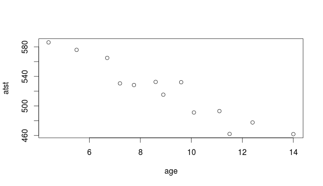


## Correlation


* Measures how well a straight line fits the data:

```r
with(sleep, cor(atst, age))
```

```
## [1] -0.9515469
```
def 


* $1$ is perfect upward trend, $-1$ is perfect downward trend, 0
is no trend.

* This one close to perfect downward trend.

* Can do correlations of whole data frame:

```r
cor(sleep)
```

```
##            atst        age
## atst  1.0000000 -0.9515469
## age  -0.9515469  1.0000000
```
def 

* Correlations of all possible pairs of variables.  


## Lowess curve


* Sometimes nice to guide the eye: is the trend straight, or not?

* Idea: *lowess curve*. "Locally weighted least squares",
not affected by outliers, not constrained to be linear.

* Lowess is a *guide*: even if straight line appropriate,
may wiggle/bend a little. Looking for *serious* problems with
linearity. 

* Add lowess curve to plot using `geom_smooth`:


## Plot with lowess curve

```r
ggplot(sleep, aes(x = age, y = atst)) + geom_point() +
  geom_smooth()
```

```
## `geom_smooth()` using method = 'loess' and formula 'y ~ x'
```


def 

## The regression

Scatterplot shows no obvious curve, and a pretty clear downward trend. So we can run the regression:

{\scriptsize

```r
sleep.1 <- lm(atst ~ age, data = sleep)
summary(sleep.1)
```

```
## 
## Call:
## lm(formula = atst ~ age, data = sleep)
## 
## Residuals:
##     Min      1Q  Median      3Q     Max 
## -23.011  -9.365   2.372   6.770  20.411 
## 
## Coefficients:
##             Estimate Std. Error t value Pr(>|t|)    
## (Intercept)  646.483     12.918   50.05 2.49e-14 ***
## age          -14.041      1.368  -10.26 5.70e-07 ***
## ---
## Signif. codes:  
## 0 '***' 0.001 '**' 0.01 '*' 0.05 '.' 0.1 ' ' 1
## 
## Residual standard error: 13.15 on 11 degrees of freedom
## Multiple R-squared:  0.9054,	Adjusted R-squared:  0.8968 
## F-statistic: 105.3 on 1 and 11 DF,  p-value: 5.7e-07
```
def 
}


## Conclusions


* The relationship appears to be a straight line, with a downward trend.

* $F$-tests for model as a whole and $t$-test for slope (same)
both confirm this (P-value $5.7\times 10^{-7}=0.00000057$).

* Slope is $-14$, so a 1-year increase in age goes with a 14-minute decrease in ATST on average.

* R-squared is correlation squared (when one $x$ anyway),
between 0 and 1 (1 good, 0 bad).

* Here R-squared is 0.9054, pleasantly high.


## Doing things with the regression output


* Output from regression (and eg. $t$-test) is all right to
look at, but hard to extract and re-use information from.

* Package `broom` extracts info from model output in way
that can be used in pipe (later):

```r
tidy(sleep.1)
```

```
## # A tibble: 2 x 5
##   term        estimate std.error statistic  p.value
##   <chr>          <dbl>     <dbl>     <dbl>    <dbl>
## 1 (Intercept)    646.      12.9       50.0 2.49e-14
## 2 age            -14.0      1.37     -10.3 5.70e- 7
```

```r
glance(sleep.1)
```

```
## # A tibble: 1 x 11
##   r.squared adj.r.squared sigma statistic p.value    df
##       <dbl>         <dbl> <dbl>     <dbl>   <dbl> <int>
## 1     0.905         0.897  13.2      105. 5.70e-7     2
## # … with 5 more variables: logLik <dbl>, AIC <dbl>,
## #   BIC <dbl>, deviance <dbl>, df.residual <int>
```

     


## Broom part 2

```r
sleep.1 %>% augment(sleep) %>% slice(1:8)
```

```
## # A tibble: 8 x 9
##    atst   age .fitted .se.fit .resid   .hat .sigma .cooksd
##   <dbl> <dbl>   <dbl>   <dbl>  <dbl>  <dbl>  <dbl>   <dbl>
## 1  586    4.4    585.    7.34   1.30 0.312    13.8 0.00320
## 2  462.  14      450.    7.68  11.8  0.341    13.0 0.319  
## 3  491.  10.1    505.    3.92 -13.6  0.0887   13.0 0.0568 
## 4  565    6.7    552.    4.87  12.6  0.137    13.1 0.0844 
## 5  462   11.5    485.    4.95 -23.0  0.141    11.3 0.294  
## 6  532.   9.6    512.    3.72  20.4  0.0801   12.0 0.114  
## 7  478.  12.4    472.    5.85   5.23 0.198    13.7 0.0243 
## 8  515.   8.9    522.    3.65  -6.32 0.0772   13.6 0.0105 
## # … with 1 more variable: .std.resid <dbl>
```

   
Useful for plotting residuals against an $x$-variable.
 for week 2:
 
 regression and multiple regression
 
 including univariate + tests
 ci, pi and influential points
 multiple, re-interpretation of tests, correlated x's
 residuals and plotting
 
 next: ci and pi with children aged 10 and 3
 then: maybe diagnostics

## CI for mean response and prediction intervals

Once useful regression exists, use it for prediction:


* To get a single number for prediction at a given $x$, substitute into regression equation, eg. age 10: predicted ATST is $646.48-14.04(10)=506$ minutes.

* To express uncertainty of this prediction:


* {\em CI for mean response} expresses uncertainty about mean ATST for all children aged 10, based on data.

* {\em Prediction interval} expresses uncertainty about predicted ATST for a new child aged 10 whose ATST not known. More uncertain.


* Also do above for a child aged 5.


## Intervals


* Make new data frame with these values for `age`

```r
my.age <- c(10, 5)
ages.new <- tibble(age = my.age)
ages.new
```

```
## # A tibble: 2 x 1
##     age
##   <dbl>
## 1    10
## 2     5
```

   


* Feed into `predict`:

```r
pc <- predict(sleep.1, ages.new, interval = "c")
pp <- predict(sleep.1, ages.new, interval = "p")
```
def 


## The intervals
Confidence intervals for mean response:

```r
cbind(ages.new, pc)
```

```
##   age      fit      lwr      upr
## 1  10 506.0729 497.5574 514.5883
## 2   5 576.2781 561.6578 590.8984
```
def 

Prediction intervals for new response:

```r
cbind(ages.new, pp)
```

```
##   age      fit      lwr      upr
## 1  10 506.0729 475.8982 536.2475
## 2   5 576.2781 543.8474 608.7088
```
def 

## Comments


* Age 10 closer to centre of data, so intervals are both narrower than those for age 5.

* Prediction intervals bigger than CI for mean (additional uncertainty).

* Technical note: output from `predict` is R
`matrix`, not data frame, so Tidyverse `bind_cols`
does not work. Use base R `cbind`.


## That grey envelope

```r
ggplot(sleep, aes(x = age, y = atst)) + geom_point() +
  geom_smooth(method = "lm") +
  scale_y_continuous(breaks = seq(420, 600, 20))
```


   

Marks confidence interval for mean for all $x$.


## Diagnostics
How to tell whether a straight-line regression is appropriate?

\vspace{3ex}


* Before: check scatterplot for straight trend.

* After: plot {\em residuals} (observed minus predicted response) against predicted values. Aim: a plot with no pattern.


\vspace{3ex}


## Output

```r
ggplot(sleep.1, aes(x = .fitted, y = .resid)) + geom_point()
```


def 

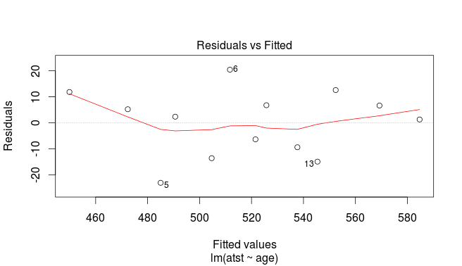


Not much pattern here (is residual predictable from predicted? No). Good, indicating regression appropriate.

## An inappropriate regression

Different data:  

```r
my_url <- "http://www.utsc.utoronto.ca/~butler/d29/curvy.txt"
curvy <- read_delim(my_url, " ")
```

```
## Parsed with column specification:
## cols(
##   xx = col_double(),
##   yy = col_double()
## )
```
def 

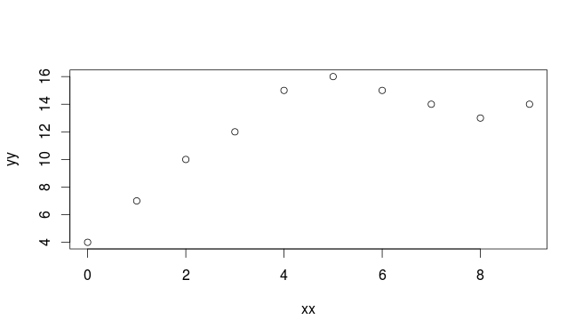


## Scatterplot

```r
ggplot(curvy, aes(x = xx, y = yy)) + geom_point()
```


   


## Regression line, anyway

{\footnotesize

```r
curvy.1 <- lm(yy ~ xx, data = curvy)
summary(curvy.1)
```

```
## 
## Call:
## lm(formula = yy ~ xx, data = curvy)
## 
## Residuals:
##    Min     1Q Median     3Q    Max 
## -3.582 -2.204  0.000  1.514  3.509 
## 
## Coefficients:
##             Estimate Std. Error t value Pr(>|t|)   
## (Intercept)   7.5818     1.5616   4.855  0.00126 **
## xx            0.9818     0.2925   3.356  0.00998 **
## ---
## Signif. codes:  
## 0 '***' 0.001 '**' 0.01 '*' 0.05 '.' 0.1 ' ' 1
## 
## Residual standard error: 2.657 on 8 degrees of freedom
## Multiple R-squared:  0.5848,	Adjusted R-squared:  0.5329 
## F-statistic: 11.27 on 1 and 8 DF,  p-value: 0.009984
```
def 
}

## Residual plot

```r
ggplot(curvy.1, aes(x = .fitted, y = .resid)) + geom_point()
```


def 

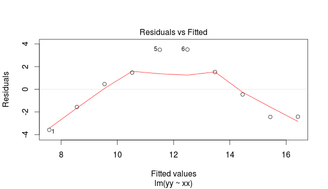


## No good: fixing it up


* Residual plot has {\em curve}: middle residuals positive, high and low ones negative. Bad.

* Fitting a curve would be better. Try this:

```r
curvy.2 <- lm(yy ~ xx + I(xx^2), data = curvy)
```
def 


* Adding `xx`-squared term, to allow for curve.

* Another way to do same thing: specify how model *changes*:

```r
curvy.2a <- update(curvy.1, . ~ . + I(xx^2))
```

 


## Regression 2
{\scriptsize

```r
summary(curvy.2)
```

```
## 
## Call:
## lm(formula = yy ~ xx + I(xx^2), data = curvy)
## 
## Residuals:
##     Min      1Q  Median      3Q     Max 
## -1.2091 -0.3602 -0.2364  0.8023  1.2636 
## 
## Coefficients:
##             Estimate Std. Error t value Pr(>|t|)    
## (Intercept)  3.90000    0.77312   5.045 0.001489 ** 
## xx           3.74318    0.40006   9.357 3.31e-05 ***
## I(xx^2)     -0.30682    0.04279  -7.170 0.000182 ***
## ---
## Signif. codes:  
## 0 '***' 0.001 '**' 0.01 '*' 0.05 '.' 0.1 ' ' 1
## 
## Residual standard error: 0.9833 on 7 degrees of freedom
## Multiple R-squared:  0.9502,	Adjusted R-squared:  0.936 
## F-statistic: 66.83 on 2 and 7 DF,  p-value: 2.75e-05
```
def 
}


## Comments


* `xx`-squared term definitely significant (P-value
0.000182), so need this curve to describe relationship.

* Adding squared term has made R-squared go up from 0.5848 to
0.9502: great improvement.

* This is a definite curve!


## The residual plot now

```r
ggplot(curvy.2, aes(x = .fitted, y = .resid)) + geom_point()
```


def 

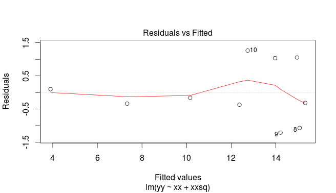


No problems any more.  


## Another way to handle curves


* Above, saw that changing $x$ (adding $x^2$) was a way of
handling curved relationships.

* Another way: change $y$ (transformation).

* Can guess how to change $y$, or might be theory:


* example: relationship $y=ae^{bx}$ (exponential growth): 

* take
logs to get $\ln y=\ln a + bx$.

* Taking logs has made relationship linear ($\ln y$ as response).


* Or, *estimate* transformation, using Box-Cox method. 


## Box-Cox


* Install package `MASS` via
`install.packages("MASS")` (only need to do *once*)

* Every R session you want to use something in `MASS`, type
`library(MASS)`


## Some made-up data

```r
my_url <- "http://www.utsc.utoronto.ca/~butler/d29/madeup.csv"
madeup <- read_csv(my_url)
madeup
```

```
## # A tibble: 8 x 3
##     row     x     y
##   <dbl> <dbl> <dbl>
## 1     1     0  17.9
## 2     2     1  33.6
## 3     3     2  82.7
## 4     4     3  31.2
## 5     5     4 177. 
## 6     6     5 359. 
## 7     7     6 469. 
## 8     8     7 583.
```
def 
Seems to be faster-than-linear growth, maybe exponential growth. Scatterplot?


## The scatterplot: faster than linear growth

```r
ggplot(madeup, aes(x = x, y = y)) + geom_point() +
  geom_smooth()
```

```
## `geom_smooth()` using method = 'loess' and formula 'y ~ x'
```


def 


## Running Box-Cox


* `library(MASS)` first.

* Feed `boxcox` a model formula with a squiggle in it,
such as you would use for `lm`.

* Output: a graph (next page):

```r
boxcox(y ~ x, data = madeup)
```
def 


## The Box-Cox output

def 


## Comments


* $\lambda$ (lambda) is the power by which you should transform
$y$ to get the relationship straight (straighter). Power 0 is
"take logs"

* Middle dotted line marks best single value of $\lambda$ (here
about 0.1).

* Outer dotted lines mark 95\% CI for $\lambda$, here $-0.3$ to
0.7, approx. (Rather uncertain about best transformation.)

* Any power transformation within the CI supported by data. In
this case, log ($\lambda=0$) and square root ($\lambda=0.5$) good,
but no transformation ($\lambda=1$)  not.

* Pick a "round-number" value of $\lambda$ like
$2,1,0.5,0,-0.5,-1$. Here 0 and 0.5 good values to pick. 


## Did transformation straighten things?


* Calculate transformed $y$ and plot against $x$. Here try log:

```r
madeup %>%
  mutate(log_y = log(y)) %>%
  ggplot(aes(x = x, y = log_y)) + geom_point() +
  geom_smooth()
```

```
## `geom_smooth()` using method = 'loess' and formula 'y ~ x'
```


def 

Looks much straighter.


## Regression with transformed $y$


```r
madeup.1 <- lm(log(y) ~ x, data = madeup)
glance(madeup.1)
```

```
## # A tibble: 1 x 11
##   r.squared adj.r.squared sigma statistic p.value    df
##       <dbl>         <dbl> <dbl>     <dbl>   <dbl> <int>
## 1     0.883         0.864 0.501      45.3 5.24e-4     2
## # … with 5 more variables: logLik <dbl>, AIC <dbl>,
## #   BIC <dbl>, deviance <dbl>, df.residual <int>
```

```r
tidy(madeup.1)
```

```
## # A tibble: 2 x 5
##   term        estimate std.error statistic  p.value
##   <chr>          <dbl>     <dbl>     <dbl>    <dbl>
## 1 (Intercept)    2.91     0.323       8.99 0.000106
## 2 x              0.520    0.0773      6.73 0.000524
```


R-squared now decently high.
%%%%%%%%%%%%%%%%%%%%%%%%%%%%%%%%%%%%%%%%%%%

## Multiple regression


* What if more than one $x$? Extra issues: % regression ex from before


* Now one intercept and a slope for each $x$: how to interpret?

* Which $x$-variables actually help to predict $y$?

* Different interpretations of "global" $F$-test and individual $t$-tests.

* R-squared no longer correlation squared, but still
interpreted as "higher better".


* In `lm` line, add extra $x$s after `~`.

* Interpretation not so easy (and other problems that can occur).


## Multiple regression example

Study of women and visits to health professionals, and how the number of visits might be related to other variables:

\begin{description}
\item[timedrs:] number of visits to health professionals (over course of study)
\item[phyheal:] number of physical health problems
\item[menheal:] number of mental health problems
\item[stress:] result of questionnaire about number and type of life changes
\end{description}

`timedrs` response, others explanatory.


## The data

```r
my_url <- "http://www.utsc.utoronto.ca/~butler/d29/regressx.txt"
visits <- read_delim(my_url, " ")
```

```
## Parsed with column specification:
## cols(
##   subjno = col_double(),
##   timedrs = col_double(),
##   phyheal = col_double(),
##   menheal = col_double(),
##   stress = col_double()
## )
```
def 


## Check data, fit multiple regression

```r
visits
```

```
## # A tibble: 465 x 5
##    subjno timedrs phyheal menheal stress
##     <dbl>   <dbl>   <dbl>   <dbl>  <dbl>
##  1      1       1       5       8    265
##  2      2       3       4       6    415
##  3      3       0       3       4     92
##  4      4      13       2       2    241
##  5      5      15       3       6     86
##  6      6       3       5       5    247
##  7      7       2       5       6     13
##  8      8       0       4       5     12
##  9      9       7       5       4    269
## 10     10       4       3       9    391
## # … with 455 more rows
```

```r
visits.1 <- lm(timedrs ~ phyheal + menheal + stress,
  data = visits
)
```

   


## The regression

{\scriptsize

```r
summary(visits.1)
```

```
## 
## Call:
## lm(formula = timedrs ~ phyheal + menheal + stress, data = visits)
## 
## Residuals:
##     Min      1Q  Median      3Q     Max 
## -14.792  -4.353  -1.815   0.902  65.886 
## 
## Coefficients:
##              Estimate Std. Error t value Pr(>|t|)    
## (Intercept) -3.704848   1.124195  -3.296 0.001058 ** 
## phyheal      1.786948   0.221074   8.083  5.6e-15 ***
## menheal     -0.009666   0.129029  -0.075 0.940318    
## stress       0.013615   0.003612   3.769 0.000185 ***
## ---
## Signif. codes:  
## 0 '***' 0.001 '**' 0.01 '*' 0.05 '.' 0.1 ' ' 1
## 
## Residual standard error: 9.708 on 461 degrees of freedom
## Multiple R-squared:  0.2188,	Adjusted R-squared:  0.2137 
## F-statistic: 43.03 on 3 and 461 DF,  p-value: < 2.2e-16
```
def 
}  

## The slopes

Model as a whole strongly significant even though R-sq not very big (lots of data). At least one of the $x$'s predicts `timedrs`.

\begin{footnotesize}

```r
tidy(visits.1)
```

```
## # A tibble: 4 x 5
##   term        estimate std.error statistic  p.value
##   <chr>          <dbl>     <dbl>     <dbl>    <dbl>
## 1 (Intercept) -3.70      1.12      -3.30   1.06e- 3
## 2 phyheal      1.79      0.221      8.08   5.60e-15
## 3 menheal     -0.00967   0.129     -0.0749 9.40e- 1
## 4 stress       0.0136    0.00361    3.77   1.85e- 4
```
def 
\end{footnotesize}

The physical health and stress variables definitely help to predict the number of visits, but {\em with those in the model} we don't need `menheal`.
However, look at prediction of `timedrs` from `menheal` by itself:


## Just `menheal`

{\footnotesize 

```r
visits.2 <- lm(timedrs ~ menheal, data = visits)
summary(visits.2)
```

```
## 
## Call:
## lm(formula = timedrs ~ menheal, data = visits)
## 
## Residuals:
##     Min      1Q  Median      3Q     Max 
## -13.826  -5.150  -2.818   1.177  72.513 
## 
## Coefficients:
##             Estimate Std. Error t value Pr(>|t|)    
## (Intercept)   3.8159     0.8702   4.385 1.44e-05 ***
## menheal       0.6672     0.1173   5.688 2.28e-08 ***
## ---
## Signif. codes:  
## 0 '***' 0.001 '**' 0.01 '*' 0.05 '.' 0.1 ' ' 1
## 
## Residual standard error: 10.6 on 463 degrees of freedom
## Multiple R-squared:  0.06532,	Adjusted R-squared:  0.0633 
## F-statistic: 32.35 on 1 and 463 DF,  p-value: 2.279e-08
```
def 
}


## `menheal by itself`


* `menheal` by itself {em does} significantly help to predict `timedrs`.

* But the R-sq is much less (6.5\% vs.\ 22\%).

* So other two variables do a better job of prediction.

* With those variables in the regression (`phyheal` and
`stress`), don't need `menheal` *as well*.


## Investigating via correlation
Leave out first column (`subjno`):

```r
visits %>% select(-subjno) %>% cor()
```

```
##           timedrs   phyheal   menheal    stress
## timedrs 1.0000000 0.4395293 0.2555703 0.2865951
## phyheal 0.4395293 1.0000000 0.5049464 0.3055517
## menheal 0.2555703 0.5049464 1.0000000 0.3697911
## stress  0.2865951 0.3055517 0.3697911 1.0000000
```
def 


* `phyheal` most strongly correlated with `timedrs`.

* Not much to choose between other two.

* But `menheal` has higher correlation with `phyheal`,
so not as much to *add* to prediction as `stress`.

* Goes to show things more complicated in multiple regression.


## Residual plot (from `timedrs on all)`

```r
ggplot(visits.1, aes(x = .fitted, y = .resid)) + geom_point()
```


def 

Apparently random. But\ldots

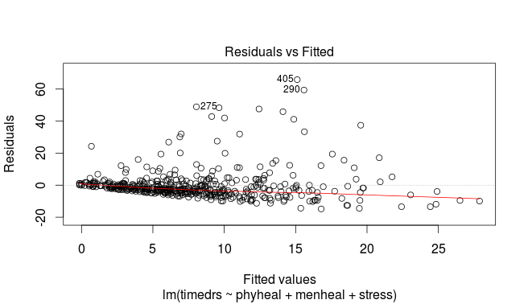


## Normal quantile plot of residuals

```r
ggplot(visits.1, aes(sample = .resid)) + stat_qq() + stat_qq_line()
```


   


## Absolute residuals
Is there trend in *size* of residuals (fan-out)? Plot
*absolute value* of residual against fitted value:


```r
ggplot(visits.1, aes(x = .fitted, y = abs(.resid))) +
  geom_point() + geom_smooth()
```

```
## `geom_smooth()` using method = 'loess' and formula 'y ~ x'
```


 


## Comments


* On the normal quantile plot:


* highest (most positive) residuals are *way* too high

* distribution of residuals skewed to right (not normal at all)


* On plot of absolute residuals:


* size of residuals getting bigger as fitted values increase

* predictions getting more variable as fitted values increase

* that is, predictions getting *less accurate* as fitted
values increase, but predictions should be equally accurate all
way along.


* Both indicate problems with regression, of kind that
transformation of response often fixes: that is, predict
*function* of response `timedrs` instead of
`timedrs` itself.


## Fixing the problems


* Residuals not normal (skewed right), increase in size with
fitted value.

* Sometimes residuals are {\em very} positive: observed a {\em lot} larger than predicted.

* Try {\em  transforming} response: use log or square root of response. (Note that response is {\em count}, often skewed to right.)

* Try regression again, with transformed response instead of
original one.

* Then check residual plot to see that it is OK now.

```r
visits.3 <- lm(log(timedrs + 1) ~ phyheal + menheal + stress,
  data = visits
)
```
def 

* `timedrs+1`  because some `timedrs` values 0,
can't take log of 0.

* Won't usually need to worry about this, but when response could
be zero/negative, fix that before transformation.


## Output

{\scriptsize

```r
summary(visits.3)
```

```
## 
## Call:
## lm(formula = log(timedrs + 1) ~ phyheal + menheal + stress, data = visits)
## 
## Residuals:
##      Min       1Q   Median       3Q      Max 
## -1.95865 -0.44076 -0.02331  0.42304  2.36797 
## 
## Coefficients:
##              Estimate Std. Error t value Pr(>|t|)    
## (Intercept) 0.3903862  0.0882908   4.422 1.22e-05 ***
## phyheal     0.2019361  0.0173624  11.631  < 2e-16 ***
## menheal     0.0071442  0.0101335   0.705    0.481    
## stress      0.0013158  0.0002837   4.638 4.58e-06 ***
## ---
## Signif. codes:  
## 0 '***' 0.001 '**' 0.01 '*' 0.05 '.' 0.1 ' ' 1
## 
## Residual standard error: 0.7625 on 461 degrees of freedom
## Multiple R-squared:  0.3682,	Adjusted R-squared:  0.3641 
## F-statistic: 89.56 on 3 and 461 DF,  p-value: < 2.2e-16
```
def 
}


## Comments


* Model as a whole strongly significant again 

* R-sq higher than before (37\% vs.\ 22\%) suggesting things more linear now

* Same conclusion re `menheal`: can take out of regression.

* Should look at residual plots (next pages). Have we fixed problems?


## Residuals against fitted values

```r
ggplot(visits.3, aes(x = .fitted, y = .resid)) +
  geom_point()
```


   


## Normal quantile plot of residuals

```r
ggplot(visits.3, aes(sample = .resid)) + stat_qq() + stat_qq_line()
```


   


## Absolute residuals against fitted

```r
ggplot(visits.3, aes(x = .fitted, y = abs(.resid))) +
  geom_point() + geom_smooth()
```

```
## `geom_smooth()` using method = 'loess' and formula 'y ~ x'
```


   


## Comments


* Residuals vs.\ fitted looks a lot more random.

* Normal quantile plot looks a lot more normal (though still a
little right-skewness)

* Absolute residuals: not so much trend (though still some).

* Not perfect, but much improved.


## Box-Cox transformations


* Taking log of `timedrs` and having it work: lucky
guess. How to find good transformation?

* Box-Cox again.

* Extra problem: some of `timedrs` values are 0, but
Box-Cox expects all +. Note response for `boxcox`:

```r
boxcox(timedrs + 1 ~ phyheal + menheal + stress, data = visits)
```
def 


## Try 1

def 


## Comments on try 1


* Best: $\lambda$ just less than zero.

* Hard to see scale. 

* Focus on $\lambda$ in $(-0.3,0.1)$:
{\small    

```r
my.lambda <- seq(-0.3, 0.1, 0.01)
my.lambda
```

```
##  [1] -0.30 -0.29 -0.28 -0.27 -0.26 -0.25 -0.24 -0.23 -0.22
## [10] -0.21 -0.20 -0.19 -0.18 -0.17 -0.16 -0.15 -0.14 -0.13
## [19] -0.12 -0.11 -0.10 -0.09 -0.08 -0.07 -0.06 -0.05 -0.04
## [28] -0.03 -0.02 -0.01  0.00  0.01  0.02  0.03  0.04  0.05
## [37]  0.06  0.07  0.08  0.09  0.10
```
def 
}


## Try 2

```r
boxcox(timedrs + 1 ~ phyheal + menheal + stress,
  lambda = my.lambda,
  data = visits
)
```


def 


## Comments


* Best: $\lambda$ just about $-0.07$.

* CI for $\lambda$ about $(-0.14,0.01)$.

* Only nearby round number: $\lambda=0$, log transformation.

* So we made lucky guess with log before!


## Testing more than one $x$ at once

The $t$-tests test only whether one variable could be taken out of the
regression you're looking at. To test significance of more than one
variable at once, fit model with and without variables and use
`anova` to compare fit of models:
{\small

```r
visits.5 <- lm(log(timedrs + 1) ~ phyheal + menheal + stress, data = visits)
visits.6 <- lm(log(timedrs + 1) ~ stress, data = visits)
anova(visits.6, visits.5)
```

```
## Analysis of Variance Table
## 
## Model 1: log(timedrs + 1) ~ stress
## Model 2: log(timedrs + 1) ~ phyheal + menheal + stress
##   Res.Df    RSS Df Sum of Sq      F    Pr(>F)    
## 1    463 371.47                                  
## 2    461 268.01  2    103.46 88.984 < 2.2e-16 ***
## ---
## Signif. codes:  
## 0 '***' 0.001 '**' 0.01 '*' 0.05 '.' 0.1 ' ' 1
```
def 
}


## Results of tests


* Models don't fit equally well, so big one fits better.

* Or "taking both variables out makes the fit worse, so don't do it".

*   Taking out those $x$'s
is a mistake. Or putting them in is a good idea.


## The punting data
Data set `punting.txt` contains 4 variables for 13 right-footed
football kickers (punters): left leg and right leg strength (lbs),
distance punted (ft), another variable called "fred". Predict
punting distance from other variables:
\begin{scriptsize}

```

left                right               punt         fred
170               170                162.50       171 
130               140                144.0        136   
170               180                174.50       174 
160               160                163.50       161 
150               170                192.0        159 
150               150                171.75       151 
180               170                162.0        174 
110               110                104.83       111 
110               120                105.67       114 
120               130                117.58       126 
140               120                140.25       129  
130               140                150.17       136 
150               160                165.17       154 

```

\end{scriptsize}


## Reading in


* Separated by *multiple spaces* with *columns lined up*:

```r
my_url <- "http://www.utsc.utoronto.ca/~butler/d29/punting.txt"
punting <- read_table(my_url)
```

```
## Parsed with column specification:
## cols(
##   left = col_double(),
##   right = col_double(),
##   punt = col_double(),
##   fred = col_double()
## )
```

     


## The data

```r
punting
```

```
## # A tibble: 13 x 4
##     left right  punt  fred
##    <dbl> <dbl> <dbl> <dbl>
##  1   170   170  162.   171
##  2   130   140  144    136
##  3   170   180  174.   174
##  4   160   160  164.   161
##  5   150   170  192    159
##  6   150   150  172.   151
##  7   180   170  162    174
##  8   110   110  105.   111
##  9   110   120  106.   114
## 10   120   130  118.   126
## 11   140   120  140.   129
## 12   130   140  150.   136
## 13   150   160  165.   154
```

   


## Regression and output

```r
punting.1 <- lm(punt ~ left + right + fred, data = punting)
summary(punting.1)
```

```
## 
## Call:
## lm(formula = punt ~ left + right + fred, data = punting)
## 
## Residuals:
##      Min       1Q   Median       3Q      Max 
## -14.9325 -11.5618  -0.0315   9.0415  20.0886 
## 
## Coefficients:
##             Estimate Std. Error t value Pr(>|t|)
## (Intercept)  -4.6855    29.1172  -0.161    0.876
## left          0.2679     2.1111   0.127    0.902
## right         1.0524     2.1477   0.490    0.636
## fred         -0.2672     4.2266  -0.063    0.951
## 
## Residual standard error: 14.68 on 9 degrees of freedom
## Multiple R-squared:  0.7781,	Adjusted R-squared:  0.7042 
## F-statistic: 10.52 on 3 and 9 DF,  p-value: 0.00267
```
def 

## Comments


* Overall regression strongly significant, R-sq high.

* None of the $x$'s significant! Why?

* $t$-tests only say that you could take any one of the $x$'s out without damaging the fit; doesn't matter which one.

* Explanation: look at {\em correlations}. 


## The correlations  

```r
cor(punting)
```

```
##            left     right      punt      fred
## left  1.0000000 0.8957224 0.8117368 0.9722632
## right 0.8957224 1.0000000 0.8805469 0.9728784
## punt  0.8117368 0.8805469 1.0000000 0.8679507
## fred  0.9722632 0.9728784 0.8679507 1.0000000
```
def 


* {\em All} correlations are high: $x$'s with `punt` (good) and
with each other (bad, at least confusing).

* What to do? Probably do just as well to pick one variable, say
`right` since kickers are right-footed.


## Just `right`
{\small

```r
punting.2 <- lm(punt ~ right, data = punting)
anova(punting.2, punting.1)
```

```
## Analysis of Variance Table
## 
## Model 1: punt ~ right
## Model 2: punt ~ left + right + fred
##   Res.Df    RSS Df Sum of Sq      F Pr(>F)
## 1     11 1962.5                           
## 2      9 1938.2  2    24.263 0.0563 0.9456
```
def 
}
No significant loss by dropping other two variables.


## Comparing R-squareds
{\small

```r
summary(punting.1)$r.squared
```

```
## [1] 0.7781401
```

```r
summary(punting.2)$r.squared
```

```
## [1] 0.7753629
```
def 
}

Basically no difference. In regression (over), `right` significant:


## Regression results

{\footnotesize

```r
summary(punting.2)
```

```
## 
## Call:
## lm(formula = punt ~ right, data = punting)
## 
## Residuals:
##      Min       1Q   Median       3Q      Max 
## -15.7576 -11.0611   0.3656   7.8890  19.0423 
## 
## Coefficients:
##             Estimate Std. Error t value Pr(>|t|)    
## (Intercept)  -3.6930    25.2649  -0.146    0.886    
## right         1.0427     0.1692   6.162 7.09e-05 ***
## ---
## Signif. codes:  
## 0 '***' 0.001 '**' 0.01 '*' 0.05 '.' 0.1 ' ' 1
## 
## Residual standard error: 13.36 on 11 degrees of freedom
## Multiple R-squared:  0.7754,	Adjusted R-squared:  0.7549 
## F-statistic: 37.97 on 1 and 11 DF,  p-value: 7.088e-05
```
def 
}

## But\ldots


* Maybe we got the *form* of the relationship with
`left` wrong.

* Check: plot *residuals* from previous regression (without
`left`) against `left`.

* Residuals here are ``punting distance adjusted for right
leg strength''.

* If there is some kind of relationship with `left`, we
should include in model.

* Plot of residuals against original variable: `augment`
from `broom`.


## Augmenting `punting.2`

```r
punting.2 %>% augment(punting) -> punting.2.aug
punting.2.aug %>% slice(1:8)
```

```
## # A tibble: 8 x 11
##    left right  punt  fred .fitted .se.fit  .resid   .hat
##   <dbl> <dbl> <dbl> <dbl>   <dbl>   <dbl>   <dbl>  <dbl>
## 1   170   170  162.   171    174.    5.29 -11.1   0.157 
## 2   130   140  144    136    142.    3.93   1.72  0.0864
## 3   170   180  174.   174    184.    6.60  -9.49  0.244 
## 4   160   160  164.   161    163.    4.25   0.366 0.101 
## 5   150   170  192    159    174.    5.29  18.4   0.157 
## 6   150   150  172.   151    153.    3.73  19.0   0.0778
## 7   180   170  162    174    174.    5.29 -11.6   0.157 
## 8   110   110  105.   111    111.    7.38  -6.17  0.305 
## # … with 3 more variables: .sigma <dbl>, .cooksd <dbl>,
## #   .std.resid <dbl>
```

   


## Residuals against `left`

```r
ggplot(punting.2.aug, aes(x = left, y = .resid)) +
  geom_point()
```


   


## Comments


* There is a *curved* relationship with `left`.

* We should add `left`-squared to the regression (and
therefore put `left` back in when we do that):

```r
punting.3 <- lm(punt ~ left + I(left^2) + right,
  data = punting
)
```

     


## Regression with `left-squared`

```r
summary(punting.3)
```

```
## 
## Call:
## lm(formula = punt ~ left + I(left^2) + right, data = punting)
## 
## Residuals:
##      Min       1Q   Median       3Q      Max 
## -11.3777  -5.3599   0.0459   4.5088  13.2669 
## 
## Coefficients:
##               Estimate Std. Error t value Pr(>|t|)   
## (Intercept) -4.623e+02  9.902e+01  -4.669  0.00117 **
## left         6.888e+00  1.462e+00   4.710  0.00110 **
## I(left^2)   -2.302e-02  4.927e-03  -4.672  0.00117 **
## right        7.396e-01  2.292e-01   3.227  0.01038 * 
## ---
## Signif. codes:  
## 0 '***' 0.001 '**' 0.01 '*' 0.05 '.' 0.1 ' ' 1
## 
## Residual standard error: 7.931 on 9 degrees of freedom
## Multiple R-squared:  0.9352,	Adjusted R-squared:  0.9136 
## F-statistic:  43.3 on 3 and 9 DF,  p-value: 1.13e-05
```

   


## Comments


* This was definitely a good idea (R-squared has clearly increased).

* We would never have seen it without plotting residuals from
`punting.2` (without `left`) against `left`.

* Negative slope for `leftsq` means that increased left-leg
strength only increases punting distance up to a point: beyond that,
it decreases again.


```
## Error in FUN(X[[i]], ...): invalid 'name' argument
```

 


 

\section{Logistic regression (ordinal/nominal response)}
\frame{\sectionpage}
## Logistic regression


* When response variable is measured/counted, regression can work well.

* But what if response is yes/no, lived/died, success/failure?

* Model {\em probability} of success.

* Probability must be between 0 and 1; need method that ensures this.

* {\em Logistic regression} does this. In R, is a
*generalized linear model* with binomial "family": 
`glm(ytextasciitilde x,family="binomial")`

* Begin with simplest case.


## Packages

```r
library(MASS)
library(tidyverse)
library(broom)
library(nnet)
```

   


## The rats, part 1


* Rats given dose of some poison; either live or die:
\begin{small}

```

dose status
0 lived
1 died
2 lived
3 lived
4 died
5 died

```

\end{small}

* Read the data:

```r
my_url <- "http://www.utsc.utoronto.ca/~butler/d29/rat.txt"
rats <- read_delim(my_url, " ")
```

```
## Parsed with column specification:
## cols(
##   dose = col_double(),
##   status = col_character()
## )
```
def 


## Basic logistic regression


* Data:

```r
rats
```

```
## # A tibble: 6 x 2
##    dose status
##   <dbl> <chr> 
## 1     0 lived 
## 2     1 died  
## 3     2 lived 
## 4     3 lived 
## 5     4 died  
## 6     5 died
```

   


* Make response into a factor first:

```r
rats2 <- rats %>% mutate(status = factor(status))
```

   


* then fit model:

```r
status.1 <-
  glm(status ~ dose, family = "binomial", data = rats2)
```

   


   


## Output


```r
summary(status.1)
```

```
## 
## Call:
## glm(formula = status ~ dose, family = "binomial", data = rats2)
## 
## Deviance Residuals: 
##       1        2        3        4        5        6  
##  0.5835  -1.6254   1.0381   1.3234  -0.7880  -0.5835  
## 
## Coefficients:
##             Estimate Std. Error z value Pr(>|z|)
## (Intercept)   1.6841     1.7979   0.937    0.349
## dose         -0.6736     0.6140  -1.097    0.273
## 
## (Dispersion parameter for binomial family taken to be 1)
## 
##     Null deviance: 8.3178  on 5  degrees of freedom
## Residual deviance: 6.7728  on 4  degrees of freedom
## AIC: 10.773
## 
## Number of Fisher Scoring iterations: 4
```
def 


## Interpreting the output


* Like (multiple) regression, get
tests of significance of individual $x$'s

*     Here not significant (only 6 observations).

* "Slope" for dose is negative, meaning that as dose increases, probability of event modelled (survival) decreases.


## Output part 2: predicted survival probs

```r
p <- predict(status.1, type = "response")
cbind(rats, p)
```

```
##   dose status         p
## 1    0  lived 0.8434490
## 2    1   died 0.7331122
## 3    2  lived 0.5834187
## 4    3  lived 0.4165813
## 5    4   died 0.2668878
## 6    5   died 0.1565510
```
def 

## The rats, more


* More realistic: more rats at each dose (say 10).

* Listing each rat on one line makes a big data file.

* Use format below: dose, number of survivals, number of deaths.

```

dose lived died
0    10    0
1     7    3 
2     6    4 
3     4    6 
4     2    8 
5     1    9  

```


* 6 lines of data correspond to 60 actual rats.

* Saved in `rat2.txt`.


## These data

```r
my_url <- "http://www.utsc.utoronto.ca/~butler/d29/rat2.txt"
rat2 <- read_delim(my_url, " ")
```

```
## Parsed with column specification:
## cols(
##   dose = col_double(),
##   lived = col_double(),
##   died = col_double()
## )
```

```r
rat2
```

```
## # A tibble: 6 x 3
##    dose lived  died
##   <dbl> <dbl> <dbl>
## 1     0    10     0
## 2     1     7     3
## 3     2     6     4
## 4     3     4     6
## 5     4     2     8
## 6     5     1     9
```
def 


## This logistic regression

```r
response <- with(rat2, cbind(lived, died))
rat2.1 <- glm(response ~ dose,
  family = "binomial",
  data = rat2
)
```

     


* Note construction of *two-column* response, \#survivals in
first column, \#deaths in second.

* The response variable is an R `matrix`:

```r
class(response)
```

```
## [1] "matrix"
```

   


## Output


```r
summary(rat2.1)
```

```
## 
## Call:
## glm(formula = response ~ dose, family = "binomial", data = rat2)
## 
## Deviance Residuals: 
##       1        2        3        4        5        6  
##  1.3421  -0.7916  -0.1034   0.1034   0.0389   0.1529  
## 
## Coefficients:
##             Estimate Std. Error z value Pr(>|z|)    
## (Intercept)   2.3619     0.6719   3.515 0.000439 ***
## dose         -0.9448     0.2351  -4.018 5.87e-05 ***
## ---
## Signif. codes:  
## 0 '***' 0.001 '**' 0.01 '*' 0.05 '.' 0.1 ' ' 1
## 
## (Dispersion parameter for binomial family taken to be 1)
## 
##     Null deviance: 27.530  on 5  degrees of freedom
## Residual deviance:  2.474  on 4  degrees of freedom
## AIC: 18.94
## 
## Number of Fisher Scoring iterations: 4
```
def 


## Predicted survival probs

```r
p <- predict(rat2.1, type = "response")
cbind(rat2, p)
```

```
##   dose lived died         p
## 1    0    10    0 0.9138762
## 2    1     7    3 0.8048905
## 3    2     6    4 0.6159474
## 4    3     4    6 0.3840526
## 5    4     2    8 0.1951095
## 6    5     1    9 0.0861238
```
def 


## Comments


* Significant effect of dose. 

* Effect of larger dose is to decrease survival probability
("slope" negative; also see in decreasing predictions.)


## Multiple logistic regression


* With more than one $x$, works much like multiple regression.

* Example: study of patients with blood poisoning severe enough to warrant surgery. Relate survival to other potential risk factors.

* Variables, 1=present, 0=absent:


* survival (death from sepsis=1), response

* shock

* malnutrition

* alcoholism

* age (as numerical variable)

* bowel infarction


* See what relates to death.


## Read in data

```r
my_url <- "http://www.utsc.utoronto.ca/~butler/d29/sepsis.txt"
sepsis <- read_delim(my_url, " ")
```

```
## Parsed with column specification:
## cols(
##   death = col_double(),
##   shock = col_double(),
##   malnut = col_double(),
##   alcohol = col_double(),
##   age = col_double(),
##   bowelinf = col_double()
## )
```
def 


## The data

```r
sepsis
```

```
## # A tibble: 106 x 6
##    death shock malnut alcohol   age bowelinf
##    <dbl> <dbl>  <dbl>   <dbl> <dbl>    <dbl>
##  1     0     0      0       0    56        0
##  2     0     0      0       0    80        0
##  3     0     0      0       0    61        0
##  4     0     0      0       0    26        0
##  5     0     0      0       0    53        0
##  6     1     0      1       0    87        0
##  7     0     0      0       0    21        0
##  8     1     0      0       1    69        0
##  9     0     0      0       0    57        0
## 10     0     0      1       0    76        0
## # … with 96 more rows
```

   


## Fit model

```r
sepsis.1 <- glm(death ~ shock + malnut + alcohol + age +
  bowelinf,
family = "binomial",
data = sepsis
)
```

   


## Output part 1

```r
tidy(sepsis.1)
```

```
## # A tibble: 6 x 5
##   term        estimate std.error statistic  p.value
##   <chr>          <dbl>     <dbl>     <dbl>    <dbl>
## 1 (Intercept)  -9.75      2.54       -3.84 0.000124
## 2 shock         3.67      1.16        3.15 0.00161 
## 3 malnut        1.22      0.728       1.67 0.0948  
## 4 alcohol       3.35      0.982       3.42 0.000635
## 5 age           0.0922    0.0303      3.04 0.00237 
## 6 bowelinf      2.80      1.16        2.40 0.0162
```
def 


* All P-values fairly small

* but `malnut` not significant: remove.


## Removing `malnut`

```r
sepsis.2 <- update(sepsis.1, . ~ . - malnut)
tidy(sepsis.2)
```

```
## # A tibble: 5 x 5
##   term        estimate std.error statistic  p.value
##   <chr>          <dbl>     <dbl>     <dbl>    <dbl>
## 1 (Intercept)  -8.89      2.32       -3.84 0.000124
## 2 shock         3.70      1.10        3.35 0.000797
## 3 alcohol       3.19      0.917       3.47 0.000514
## 4 age           0.0898    0.0292      3.07 0.00211 
## 5 bowelinf      2.39      1.07        2.23 0.0260
```
def 


* Everything significant now.


## Comments
$  


* Most of the original $x$'s helped predict death. Only `malnut` seemed not to add anything.

* Removed `malnut` and tried again.

* Everything remaining is significant (though `bowelinf`
actually became *less* significant).

* All coefficients are *positive*, so having any of the risk
factors (or being older)
*increases* risk of death.  


## Predictions from model without "malnut"


* A few chosen at random:


```r
sepsis.pred <- predict(sepsis.2, type = "response")
d <- data.frame(sepsis, sepsis.pred)
myrows <- c(4, 1, 2, 11, 32)
slice(d, myrows)
```

```
##   death shock malnut alcohol age bowelinf sepsis.pred
## 1     0     0      0       0  26        0 0.001415347
## 2     0     0      0       0  56        0 0.020552383
## 3     0     0      0       0  80        0 0.153416834
## 4     1     0      0       1  66        1 0.931290137
## 5     1     0      0       1  49        0 0.213000997
```
def 


* Survival chances pretty good if no risk factors, though decreasing with age.

* Having more than one risk factor reduces survival chances dramatically.

* Usually good job of predicting survival; sometimes death predicted to survive.


## Assessing proportionality of odds for age


* An assumption we made is that log-odds of survival depends
linearly on age.

* Hard to get your head around, but 
basic idea is that survival chances go continuously up (or down)
with age, instead of (for example) going up and then down.

* In this case, seems reasonable, but should check:


## Residuals vs.\ age

```r
ggplot(augment(sepsis.2), aes(x = age, y = .resid)) +
  geom_point()
```


def 


* No apparent problems overall.

* Confusing "line" across: no risk factors, survived. 


## Probability and odds


* For probability $p$, odds is $p/(1-p)$. Examples:
\vfill
\begin{tabular}{rrrl}
\hline
Prob.\ & Odds & log-odds & in words\\
\hline
0.5 & $0.5/0.5=1/1=1.00$ & 0.00 &  "even money"\\
0.1 & $0.1/0.9=1/9=0.11$ & $-2.20$ & "9 to 1"\\
0.4 & $0.4/0.6=1/1.5=0.67$ & $-0.41$ & "1.5 to 1"\\
0.8 & $0.8/0.2=4/1=4.00$ & 1.39 & "4 to 1 on"\\
\hline
\end{tabular}
\vfill

* Gamblers use odds: if you win at 9 to 1 odds, get original
stake back plus 9 times the stake.

* Probability has to be between 0 and 1

* Odds between 0 and infinity

* *Log*-odds can be anything: any log-odds corresponds to
valid probability.


## Odds ratio


* Suppose 90 of 100 men drank wine last week, but only 20 of 100 women.

* Prob of man drinking wine $90/100=0.9$, woman $20/100=0.2$.

* Odds of man drinking wine $0.9/0.1=9$, woman $0.2/0.8=0.25$.

* Ratio of odds is $9/0.25=36$.

* Way of quantifying difference between men and women: ``odds of
drinking wine 36 times larger for males than females''. 


## Sepsis data again


* Recall prediction of probability of death from risk factors:

```r
sepsis.2.tidy <- tidy(sepsis.2)
sepsis.2.tidy
```

```
## # A tibble: 5 x 5
##   term        estimate std.error statistic  p.value
##   <chr>          <dbl>     <dbl>     <dbl>    <dbl>
## 1 (Intercept)  -8.89      2.32       -3.84 0.000124
## 2 shock         3.70      1.10        3.35 0.000797
## 3 alcohol       3.19      0.917       3.47 0.000514
## 4 age           0.0898    0.0292      3.07 0.00211 
## 5 bowelinf      2.39      1.07        2.23 0.0260
```

     


* Slopes in column `estimate`.


## Multiplying the odds


* Can interpret slopes by taking "exp" of them. We ignore intercept.

```r
cc <- exp(sepsis.2.tidy$estimate)
data.frame(sepsis.2.tidy$term, expcoeff = round(cc, 2))
```

```
##   sepsis.2.tidy.term expcoeff
## 1        (Intercept)     0.00
## 2              shock    40.50
## 3            alcohol    24.19
## 4                age     1.09
## 5           bowelinf    10.88
```
def 


* These say ``how much do you *multiply* odds of death by
for increase of 1 in corresponding risk factor?'' Or, what is odds
ratio for that factor being 1 (present) vs.\ 0 (absent)?

* Eg.\ being alcoholic vs.\ not increases odds of death by 24 times

* One year older multiplies odds by about 1.1 times. Over 40 years,
about  $1.09^{40}=31$ times. 


## Odds ratio and relative risk


* **Relative risk** is ratio of probabilities.

* Above: 90 of 100 men (0.9) drank wine, 20 of 100 women (0.2).

* Relative risk 0.9/0.2=4.5. (odds ratio was 36).

* When probabilities small, relative risk and odds ratio similar.

* Eg.\ prob of man having disease 0.02, woman 0.01.

* Relative risk $0.02/0.01=2$.
\begin{multicols}{2}

* Odds for men and for women:


```r
(od1 <- 0.02 / 0.98)
```

```
## [1] 0.02040816
```

```r
(od2 <- 0.01 / 0.99)
```

```
## [1] 0.01010101
```
def


* Odds ratio 

```r
od1 / od2
```

```
## [1] 2.020408
```
def 


* Very close to 2.
\end{multicols}


## More than 2 response categories


* With 2 response categories, model the probability of one, and prob of other is one minus that. So doesn't matter which category you model.

* With more than 2 categories, have to think more carefully about the categories: are they


* {\em ordered}: you can put them in a natural order (like low, medium, high)

* {\em nominal}: ordering the categories doesn't make sense (like red, green, blue).


* R handles both kinds of response; learn how.


## Ordinal response: the miners


* 
Model probability of being in given category {\em or lower}.

* Example: coal-miners often suffer disease pneumoconiosis. Likelihood of disease believed to be greater 
among miners who have worked longer. 

* Severity of disease measured on categorical scale: 1 = none, 2
= moderate, 3 = severe.

* Data are frequencies:

```

Exposure None Moderate Severe
5.8    98      0       0
15.0    51      2       1
21.5    34      6       3
27.5    35      5       8
33.5    32      10      9
39.5    23      7       8
46.0    12      6      10
51.5     4      2       5

```


## Reading the data

Data in aligned columns with more than one space between, so: 

```r
my_url <- "http://www.utsc.utoronto.ca/~butler/d29/miners-tab.txt"
freqs <- read_table(my_url)
```

```
## Parsed with column specification:
## cols(
##   Exposure = col_double(),
##   None = col_double(),
##   Moderate = col_double(),
##   Severe = col_double()
## )
```
def 


## The data

```r
freqs
```

```
## # A tibble: 8 x 4
##   Exposure  None Moderate Severe
##      <dbl> <dbl>    <dbl>  <dbl>
## 1      5.8    98        0      0
## 2     15      51        2      1
## 3     21.5    34        6      3
## 4     27.5    35        5      8
## 5     33.5    32       10      9
## 6     39.5    23        7      8
## 7     46      12        6     10
## 8     51.5     4        2      5
```

   


## Tidying and row proportions

```r
freqs %>%
  gather(Severity, Freq, None:Severe) %>%
  group_by(Exposure) %>%
  mutate(proportion = Freq / sum(Freq)) -> miners
```

   


## Result

```r
miners
```

```
## # A tibble: 24 x 4
## # Groups:   Exposure [8]
##    Exposure Severity  Freq proportion
##       <dbl> <chr>    <dbl>      <dbl>
##  1      5.8 None        98     1     
##  2     15   None        51     0.944 
##  3     21.5 None        34     0.791 
##  4     27.5 None        35     0.729 
##  5     33.5 None        32     0.627 
##  6     39.5 None        23     0.605 
##  7     46   None        12     0.429 
##  8     51.5 None         4     0.364 
##  9      5.8 Moderate     0     0     
## 10     15   Moderate     2     0.0370
## # … with 14 more rows
```

     


## Plot proportions against exposure

```r
ggplot(miners, aes(
  x = Exposure, y = proportion,
  colour = Severity
)) + geom_point() + geom_line()
```


   


## Reminder of data setup
\begin{footnotesize}

```r
miners
```

```
## # A tibble: 24 x 4
## # Groups:   Exposure [8]
##    Exposure Severity  Freq proportion
##       <dbl> <chr>    <dbl>      <dbl>
##  1      5.8 None        98     1     
##  2     15   None        51     0.944 
##  3     21.5 None        34     0.791 
##  4     27.5 None        35     0.729 
##  5     33.5 None        32     0.627 
##  6     39.5 None        23     0.605 
##  7     46   None        12     0.429 
##  8     51.5 None         4     0.364 
##  9      5.8 Moderate     0     0     
## 10     15   Moderate     2     0.0370
## # … with 14 more rows
```

   
\end{footnotesize}


## Creating an ordered factor


* Problem: on plot, `Severity` categories in \emph{wrong
order}. 

* *In the data frame*, categories in *correct* order.

* Package `forcats` (in `tidyverse`) has functions for creating factors to specifications.

* `fct_inorder` takes levels *in order they appear in data*: 

```r
miners %>%
  mutate(sev_ord = fct_inorder(Severity)) -> miners
```

     


* To check:

```r
levels(miners$sev_ord)
```

```
## [1] "None"     "Moderate" "Severe"
```

   


## New data frame


```r
miners
```

```
## # A tibble: 24 x 5
## # Groups:   Exposure [8]
##    Exposure Severity  Freq proportion sev_ord 
##       <dbl> <chr>    <dbl>      <dbl> <fct>   
##  1      5.8 None        98     1      None    
##  2     15   None        51     0.944  None    
##  3     21.5 None        34     0.791  None    
##  4     27.5 None        35     0.729  None    
##  5     33.5 None        32     0.627  None    
##  6     39.5 None        23     0.605  None    
##  7     46   None        12     0.429  None    
##  8     51.5 None         4     0.364  None    
##  9      5.8 Moderate     0     0      Moderate
## 10     15   Moderate     2     0.0370 Moderate
## # … with 14 more rows
```

 

## Improved plot

```r
ggplot(miners, aes(
  x = Exposure, y = proportion,
  colour = sev_ord
)) + geom_point() + geom_line()
```


   

## Fitting ordered logistic model

Use function `polr` from package `MASS`. Like `glm`.

```r
sev.1 <- polr(sev_ord ~ Exposure,
  weights = Freq,
  data = miners
)
```
def 


## Output: not very illuminating

```r
summary(sev.1)
```

```
## 
## Re-fitting to get Hessian
```

```
## Call:
## polr(formula = sev_ord ~ Exposure, data = miners, weights = Freq)
## 
## Coefficients:
##           Value Std. Error t value
## Exposure 0.0959    0.01194   8.034
## 
## Intercepts:
##                 Value   Std. Error t value
## None|Moderate    3.9558  0.4097     9.6558
## Moderate|Severe  4.8690  0.4411    11.0383
## 
## Residual Deviance: 416.9188 
## AIC: 422.9188
```

   

## Does exposure have an effect?
Fit model without `Exposure`, and compare
using `anova`. Note `1` for model with just intercept:


 


```r
sev.0 <- polr(sev_ord ~ 1, weights = Freq, data = miners)
anova(sev.0, sev.1)
```

```
## Likelihood ratio tests of ordinal regression models
## 
## Response: sev_ord
##      Model Resid. df Resid. Dev   Test
## 1        1       369   505.1621       
## 2 Exposure       368   416.9188 1 vs 2
##      Df LR stat. Pr(Chi)
## 1                       
## 2     1 88.24324       0
```
def 
Exposure definitely has effect on severity of disease. 


## Another way


* What (if anything) can we drop from model with `exposure`?

```r
drop1(sev.1, test = "Chisq")
```

```
## Single term deletions
## 
## Model:
## sev_ord ~ Exposure
##          Df    AIC    LRT  Pr(>Chi)    
## <none>      422.92                     
## Exposure  1 509.16 88.243 < 2.2e-16 ***
## ---
## Signif. codes:  
##   0 '***' 0.001 '**' 0.01 '*' 0.05
##   '.' 0.1 ' ' 1
```

     


* Nothing. Exposure definitely has effect.


## Predicted probabilities

Make new data frame out of all the exposure values (from original data
frame), and predict from that:


 

```r
sev.new <- tibble(Exposure = freqs$Exposure)
pr <- predict(sev.1, sev.new, type = "p")
miners.pred <- cbind(sev.new, pr)
miners.pred
```

```
##   Exposure      None   Moderate     Severe
## 1      5.8 0.9676920 0.01908912 0.01321885
## 2     15.0 0.9253445 0.04329931 0.03135614
## 3     21.5 0.8692003 0.07385858 0.05694115
## 4     27.5 0.7889290 0.11413004 0.09694093
## 5     33.5 0.6776641 0.16207145 0.16026444
## 6     39.5 0.5418105 0.20484198 0.25334756
## 7     46.0 0.3879962 0.22441555 0.38758828
## 8     51.5 0.2722543 0.21025011 0.51749563
```
def 

## Comments


* Model appears to match data: as exposure goes up, prob of None
goes down, Severe goes up (sharply for high exposure).

* Like original data frame, this one nice to look at but
*not tidy*. We want to make graph, so tidy it.

* Also want the severity values in right order.

* Usual `gather`, plus a bit:

```r
miners.pred %>%
  gather(Severity, probability, -Exposure) %>%
  mutate(sev_ord = fct_inorder(Severity)) -> preds
```

     


## Some of the gathered predictions

```r
preds %>% slice(1:15)
```

```
##    Exposure Severity probability  sev_ord
## 1       5.8     None  0.96769203     None
## 2      15.0     None  0.92534455     None
## 3      21.5     None  0.86920028     None
## 4      27.5     None  0.78892903     None
## 5      33.5     None  0.67766411     None
## 6      39.5     None  0.54181046     None
## 7      46.0     None  0.38799618     None
## 8      51.5     None  0.27225426     None
## 9       5.8 Moderate  0.01908912 Moderate
## 10     15.0 Moderate  0.04329931 Moderate
## 11     21.5 Moderate  0.07385858 Moderate
## 12     27.5 Moderate  0.11413004 Moderate
## 13     33.5 Moderate  0.16207145 Moderate
## 14     39.5 Moderate  0.20484198 Moderate
## 15     46.0 Moderate  0.22441555 Moderate
```

   


## Plotting predicted and observed proportions


* Plot:


*  predicted probabilities, lines (shown) joining points (not shown)

* data, just the points. 


* Unfamiliar process: data from two *different* data frames:

```r
g <- ggplot(preds, aes(
  x = Exposure, y = probability,
  colour = sev_ord
)) + geom_line() +
  geom_point(data = miners, aes(y = proportion))
```

   


* Idea: final `geom_point` uses data in `miners`
rather than `preds`, $y$-variable for plot is `proportion`
from that data frame, but $x$-coordinate is `Exposure`, as it
was before, and `colour` is `Severity` as before. The
final `geom_point` "inherits" from the first `aes`
as needed.

* Data conform to fitted relationship pretty well:


## The plot

```r
g
```


 mlogit.pdf

## Unordered responses


* With unordered (nominal) responses, can use {\em generalized logit}.

* Example: 735 people, record age and sex (male 0, female 1), which of 3 brands of some product preferred.

* Data in `mlogit.csv` separated by commas (so
`read_csv` will work):

```r
my_url <- "http://www.utsc.utoronto.ca/~butler/d29/mlogit.csv"
brandpref <- read_csv(my_url)
```

```
## Parsed with column specification:
## cols(
##   brand = col_double(),
##   sex = col_double(),
##   age = col_double()
## )
```
def 


## The data

```r
brandpref
```

```
## # A tibble: 735 x 3
##    brand   sex   age
##    <dbl> <dbl> <dbl>
##  1     1     0    24
##  2     1     0    26
##  3     1     0    26
##  4     1     1    27
##  5     1     1    27
##  6     3     1    27
##  7     1     0    27
##  8     1     0    27
##  9     1     1    27
## 10     1     0    27
## # … with 725 more rows
```

   


## Bashing into shape, and fitting model


* `sex` and `brand` not meaningful as numbers, so
turn into factors:

```r
brandpref <- brandpref %>%
  mutate(sex = factor(sex)) %>%
  mutate(brand = factor(brand))
```
def 

* We use `multinom` from package `nnet`. Works
like `polr`.


```r
brands.1 <- multinom(brand ~ age + sex, data = brandpref)
```

```
## # weights:  12 (6 variable)
## initial  value 807.480032 
## iter  10 value 702.976983
## final  value 702.970704 
## converged
```
def 


## Can we drop anything?


* Unfortunately `drop1` seems not to work:

```r
drop1(brands.1, test = "Chisq", trace = 0)
```

```
## trying - age
```

```
## Error in if (trace) {: argument is not interpretable as logical
```

   

* so fall back on fitting model without what you want to test, and
comparing using `anova`.    


## Do age/sex help predict brand? 1/2

Fit models without each of age and sex:

```r
brands.2 <- multinom(brand ~ age, data = brandpref)
```

```
## # weights:  9 (4 variable)
## initial  value 807.480032 
## iter  10 value 706.796323
## iter  10 value 706.796322
## final  value 706.796322 
## converged
```

```r
brands.3 <- multinom(brand ~ sex, data = brandpref)
```

```
## # weights:  9 (4 variable)
## initial  value 807.480032 
## final  value 791.861266 
## converged
```
def 


## Do age/sex help predict brand? 2/2

```r
anova(brands.2, brands.1)
```

```
## Likelihood ratio tests of Multinomial Models
## 
## Response: brand
##       Model Resid. df Resid. Dev   Test    Df LR stat.    Pr(Chi)
## 1       age      1466   1413.593                                 
## 2 age + sex      1464   1405.941 1 vs 2     2 7.651236 0.02180495
```

```r
anova(brands.3, brands.1)
```

```
## Likelihood ratio tests of Multinomial Models
## 
## Response: brand
##       Model Resid. df Resid. Dev   Test    Df LR stat. Pr(Chi)
## 1       sex      1466   1583.723                              
## 2 age + sex      1464   1405.941 1 vs 2     2 177.7811       0
```
def 


## Do age/sex help predict brand? 3/3


* `age` definitely significant (second `anova`)

* `sex` seems significant also (first `anova`)

* Keep both.


## Another way to build model


* Start from model with everything and run `step`:

```r
step(brands.1, trace = 0)
```

```
## trying - age 
## trying - sex
```

```
## Call:
## multinom(formula = brand ~ age + sex, data = brandpref)
## 
## Coefficients:
##   (Intercept)       age      sex1
## 2   -11.77469 0.3682075 0.5238197
## 3   -22.72141 0.6859087 0.4659488
## 
## Residual Deviance: 1405.941 
## AIC: 1417.941
```

     

* Final model contains both `age` and `sex` so neither
could be removed.


## Predictions: all possible combinations

Create data frame with various age and sex:


```r
ages <- c(24, 28, 32, 35, 38)
sexes <- factor(0:1)
new <- crossing(age = ages, sex = sexes)
new
```

```
## # A tibble: 10 x 2
##      age sex  
##    <dbl> <fct>
##  1    24 0    
##  2    24 1    
##  3    28 0    
##  4    28 1    
##  5    32 0    
##  6    32 1    
##  7    35 0    
##  8    35 1    
##  9    38 0    
## 10    38 1
```
def 


## Making predictions

```r
p <- predict(brands.1, new, type = "probs")
probs <- cbind(new, p)
```

   


## The predictions


```r
probs
```

```
##    age sex          1          2           3
## 1   24   0 0.94795822 0.05022928 0.001812497
## 2   24   1 0.91532076 0.08189042 0.002788820
## 3   28   0 0.79313204 0.18329690 0.023571058
## 4   28   1 0.69561789 0.27143910 0.032943012
## 5   32   0 0.40487271 0.40810321 0.187024082
## 6   32   1 0.29086347 0.49503135 0.214105181
## 7   35   0 0.13057819 0.39724053 0.472181272
## 8   35   1 0.08404134 0.43168592 0.484272746
## 9   38   0 0.02598163 0.23855071 0.735467663
## 10  38   1 0.01623089 0.25162197 0.732147148
```

   


* Young males (`sex=0`) prefer brand 1, 
but older males prefer brand 3.

* Females similar, but like brand 1 less and
brand 2 more.


## Making a plot


* Plot fitted probability against age, distinguishing brand by
colour and gender by plotting symbol.

* Also join points by lines, and distinguish lines by gender. 

* I thought about facetting, but this seems to come out clearer.

* First need tidy data frame, by familiar process:

```r
probs.long <- probs %>%
  gather(brand, probability, -(age:sex))
sample_n(probs.long, 7) # 7 random rows
```

```
##   age sex brand probability
## 1  32   1     3  0.21410518
## 2  24   1     2  0.08189042
## 3  28   1     3  0.03294301
## 4  38   0     2  0.23855071
## 5  24   0     1  0.94795822
## 6  32   0     1  0.40487271
## 7  32   1     1  0.29086347
```

     


## The plot

```r
ggplot(probs.long, aes(
  x = age, y = probability,
  colour = brand, shape = sex
)) +
  geom_point() + geom_line(aes(linetype = sex))
```


   

## Digesting the plot


* Brand vs.\ age: younger people (of both genders) prefer brand
1, but older people (of both genders) prefer brand 3. (Explains
significant age effect.)

* Brand vs.\ sex: females (dashed) like brand 1 less than males
(solid), like brand 2 more (for all ages). 
more.

* Not much brand difference between genders (solid and dashed
lines of same colours close), but enough to be significant.

* Model didn't include interaction, so modelled effect of gender
on brand same for each age, modelled effect of age same for each
gender. 


## Alternative data format

Summarize all people of same brand preference, same sex, same age on one line of data file with frequency on end:

{

```

1 0 24 1
1 0 26 2
1 0 27 4
1 0 28 4
1 0 29 7
1 0 30 3
...

```

}

Whole data set in 65 lines not 735! But how?


## Getting alternative data format

```r
brandpref %>%
  group_by(age, sex, brand) %>%
  summarize(Freq = n()) %>%
  ungroup() -> b
b %>% slice(1:6)
```

```
## # A tibble: 6 x 4
##     age sex   brand  Freq
##   <dbl> <fct> <fct> <int>
## 1    24 0     1         1
## 2    26 0     1         2
## 3    27 0     1         4
## 4    27 1     1         4
## 5    27 1     3         1
## 6    28 0     1         4
```

   

## Fitting models, almost the same


* Just have to remember `weights` to incorporate
frequencies.

* Otherwise `multinom` assumes you have just 1 obs
on each line!

* Again turn (numerical) `sex` and `brand` into factors:

```r
bf <- b %>%
  mutate(sex = factor(sex)) %>%
  mutate(brand = factor(brand))
b.1 <- multinom(brand ~ age + sex, data = bf, weights = Freq)
```

```
## # weights:  12 (6 variable)
## initial  value 807.480032 
## iter  10 value 702.976983
## final  value 702.970704 
## converged
```

```r
b.2 <- multinom(brand ~ age, data = bf, weights = Freq)
```

```
## # weights:  9 (4 variable)
## initial  value 807.480032 
## iter  10 value 706.796323
## iter  10 value 706.796322
## final  value 706.796322 
## converged
```
def 


## P-value for `sex identical`

```r
anova(b.2, b.1)
```

```
## Likelihood ratio tests of Multinomial Models
## 
## Response: brand
##       Model Resid. df Resid. Dev   Test    Df LR stat.    Pr(Chi)
## 1       age       126   1413.593                                 
## 2 age + sex       124   1405.941 1 vs 2     2 7.651236 0.02180495
```
def 

Same P-value as before, so we haven't changed anything important.


## Including data on plot


* Everyone's age given as whole
number, so maybe not too many different ages with sensible amount
of data at each:

```r
b %>%
  group_by(age) %>%
  summarize(total = sum(Freq))
```

```
## # A tibble: 14 x 2
##      age total
##    <dbl> <int>
##  1    24     1
##  2    26     2
##  3    27     9
##  4    28    15
##  5    29    19
##  6    30    23
##  7    31    40
##  8    32   333
##  9    33    55
## 10    34    64
## 11    35    35
## 12    36    85
## 13    37    22
## 14    38    32
```
$ %$


## Comments and next


* Not great (especially at low end), but live with it.

* Need proportions of frequencies in each brand for each
age-gender combination. Mimic what we did for miners:

```r
b %>%
  group_by(age, sex) %>%
  mutate(proportion = Freq / sum(Freq)) -> brands
```

     


## Checking proportions for age 32

```r
brands %>% filter(age == 32)
```

```
## # A tibble: 6 x 5
## # Groups:   age, sex [2]
##     age sex   brand  Freq proportion
##   <dbl> <fct> <fct> <int>      <dbl>
## 1    32 0     1        48      0.407
## 2    32 0     2        51      0.432
## 3    32 0     3        19      0.161
## 4    32 1     1        62      0.288
## 5    32 1     2       117      0.544
## 6    32 1     3        36      0.167
```

   


* First three proportions (males) add up to 1.

* Last three proportions (females) add up to 1.

* So looks like proportions of right thing.


## Attempting plot


* Take code from previous plot and:


* remove `geom_point` for fitted values

* add `geom_point` with correct `data=` and
`aes` to plot data.


```r
g <- ggplot(probs.long, aes(
  x = age, y = probability,
  colour = brand, shape = sex
)) +
  geom_line(aes(linetype = sex)) +
  geom_point(data = brands, aes(y = proportion))
```

     


* Data seem to correspond more or less to fitted curves:


## The plot

```r
g
```


   


## But\ldots


* Some of the plotted points based on a lot of people, and some
only a few.

* Idea: make the *size* of plotted point bigger if point
based on a lot of people (in `Freq`).

* Hope that larger points then closer to predictions.

* Code:

```r
g <- ggplot(probs.long, aes(
  x = age, y = probability,
  colour = brand, shape = sex
)) +
  geom_line(aes(linetype = sex)) +
  geom_point(
    data = brands,
    aes(y = proportion, size = Freq)
  )
```

     


## The plot

```r
g
```


   


## Trying interaction between age and gender


   
\begin{scriptsize}

```r
b.4 <- update(b.1, . ~ . + age:sex)
```

```
## # weights:  15 (8 variable)
## initial  value 807.480032 
## iter  10 value 704.811229
## iter  20 value 702.582802
## final  value 702.582761 
## converged
```

```r
anova(b.1, b.4)
```

```
## Likelihood ratio tests of Multinomial Models
## 
## Response: brand
##                 Model Resid. df Resid. Dev   Test    Df
## 1           age + sex       124   1405.941             
## 2 age + sex + age:sex       122   1405.166 1 vs 2     2
##    LR stat.  Pr(Chi)
## 1                   
## 2 0.7758861 0.678451
```

   
\end{scriptsize}


* No evidence that effect of age on brand preference differs for
the two genders.
 <<echo=F>>=
 pkgs = names(sessionInfo()$otherPkgs) 
 pkgs=paste('package:', pkgs, sep = "")
 x=lapply(pkgs, detach, character.only = TRUE, unload = TRUE)
 @   


  


\section{Survival analysis}
\frame{\sectionpage}
## Survival analysis


* So far, have seen:


* response variable counted or measured (regression)

* response variable categorized (logistic regression)

and have predicted response from explanatory variables.

* But what if response is time until event (eg. time of
survival after surgery)?

* Additional complication: event might not have happened at end of study (eg. patient still alive). But knowing that patient has "not died yet" presumably informative. Such data called {\em censored}. 

* Enter {\em survival analysis}, in particular the "Cox proportional hazards model". 

* Explanatory variables in this context often called {\em covariates}.


## Example: still dancing?


* 12 women who have just started taking dancing lessons are
followed for up to a year, to see whether they are still taking
dancing lessons, or have quit. The "event" here is "quit".

* This might depend on:


* a treatment (visit to a dance competition)

* woman's age (at start of study).


* Data:
{\scriptsize

```

Months  Quit   Treatment Age
1      1        0      16
2      1        0      24
2      1        0      18
3      0        0      27
4      1        0      25
7      1        1      26
8      1        1      36
10      1        1      38
10      0        1      45
12      1        1      47

```

}


## About the data


* `months` and `quit` are kind of combined response:


*  `Months` is number of months a woman was actually observed dancing

* `quit` is 1 if woman quit, 0 if still dancing at end of study.


* Treatment is 1 if woman went to dance competition, 0 otherwise.

* Fit model and see whether `Age` or `Treatment`
have effect on survival.

* Want to do predictions for probabilities of still dancing as
they depend on whatever is significant, and draw plot.


## The code


* Install packages `survival` and `survminer` if not done. 

* Load `survival`, `survminer`,
`broom` and `tidyverse`
packages, read data (column-aligned):

```r
library(tidyverse)
library(survival)
library(survminer)
```

```
## Warning: package 'survminer' was built under R version 3.5.1
```

```
## Warning: package 'ggpubr' was built under R version 3.5.1
```

```
## Warning: package 'magrittr' was built under R version 3.5.1
```

```r
library(broom)
my_url <- "http://www.utsc.utoronto.ca/~butler/d29/dancing.txt"
dance <- read_table(my_url)
```
def 


## The data

```r
dance
```

```
## # A tibble: 12 x 4
##    Months  Quit Treatment   Age
##     <dbl> <dbl>     <dbl> <dbl>
##  1      1     1         0    16
##  2      2     1         0    24
##  3      2     1         0    18
##  4      3     0         0    27
##  5      4     1         0    25
##  6      5     1         0    21
##  7     11     1         0    55
##  8      7     1         1    26
##  9      8     1         1    36
## 10     10     1         1    38
## 11     10     0         1    45
## 12     12     1         1    47
```

   

## Examine response and fit model


* Response variable (has to be outside data frame):

```r
mth <- with(dance, Surv(Months, Quit))
mth
```

```
##  [1]  1   2   2   3+  4   5  11   7   8  10  10+ 12
```

  

* Then fit model, predicting `mth` from explanatories:

```r
dance.1 <- coxph(mth ~ Treatment + Age, data = dance)
```
def 


## Output looks a lot like regression

```r
summary(dance.1)
```

```
## Call:
## coxph(formula = mth ~ Treatment + Age, data = dance)
## 
##   n= 12, number of events= 10 
## 
##               coef exp(coef) se(coef)      z Pr(>|z|)  
## Treatment -4.44915   0.01169  2.60929 -1.705   0.0882 .
## Age       -0.36619   0.69337  0.15381 -2.381   0.0173 *
## ---
## Signif. codes:  
## 0 '***' 0.001 '**' 0.01 '*' 0.05 '.' 0.1 ' ' 1
## 
##           exp(coef) exp(-coef) lower .95 upper .95
## Treatment   0.01169     85.554 7.026e-05    1.9444
## Age         0.69337      1.442 5.129e-01    0.9373
## 
## Concordance= 0.964  (se = 0.039 )
## Likelihood ratio test= 21.68  on 2 df,   p=2e-05
## Wald test            = 5.67  on 2 df,   p=0.06
## Score (logrank) test = 14.75  on 2 df,   p=6e-04
```
def 

## Conclusions


* Use $\alpha=0.10$ here since not much data.

* Three tests at bottom like global F-test. Consensus that
something predicts survival time (whether or not dancer quit and how
long it took).

* `Age` (definitely), `Treatment` (marginally) both
predict survival time.


## Model checking


* With regression, usually plot residuals against fitted values.

* Not quite same here (nonlinear model), but ``martingale
residuals'' should have no pattern vs.\ "linear predictor".

* `ggcoxdiagnostics` from package `survminer`
makes plot, to which we add smooth. If smooth trend more or less
straight across, model OK. 

* Martingale residuals can go very negative, so won't always
look normal.


## Martingale residual plot for dance data

```r
ggcoxdiagnostics(dance.1) + geom_smooth(se = F)
```

```
## `geom_smooth()` using method = 'loess' and formula 'y ~ x'
```


   
This looks good (with only 12 points).

## Predicted survival probs
The function we use is called
`survfit`, though actually works rather like
`predict`. 
First create a data frame of values to predict from. We'll do all
combos of ages 20 and 40, treatment and not, using
`crossing` to get all the combos:

```r
treatments <- c(0, 1)
ages <- c(20, 40)
dance.new <- crossing(Treatment = treatments, Age = ages)
dance.new
```

```
## # A tibble: 4 x 2
##   Treatment   Age
##       <dbl> <dbl>
## 1         0    20
## 2         0    40
## 3         1    20
## 4         1    40
```
def 

## The predictions
One prediction *for each time* for each combo of age and treatment:


 

```r
s <- survfit(dance.1, newdata = dance.new, data = dance)
summary(s)
```

```
## Call: survfit(formula = dance.1, newdata = dance.new, data = dance)
## 
##  time n.risk n.event survival1 survival2 survival3 survival4
##     1     12       1  8.76e-01  1.00e+00  9.98e-01     1.000
##     2     11       2  3.99e-01  9.99e-01  9.89e-01     1.000
##     4      8       1  1.24e-01  9.99e-01  9.76e-01     1.000
##     5      7       1  2.93e-02  9.98e-01  9.60e-01     1.000
##     7      6       1 2.96e-323  6.13e-01  1.70e-04     0.994
##     8      5       1  0.00e+00  2.99e-06  1.35e-98     0.862
##    10      4       1  0.00e+00  3.61e-20  0.00e+00     0.593
##    11      2       1  0.00e+00  0.00e+00  0.00e+00     0.000
##    12      1       1  0.00e+00  0.00e+00  0.00e+00     0.000
```
def 
\begin{multicols}{2}

```r
t(dance.new)
```

```
##           [,1] [,2] [,3] [,4]
## Treatment    0    0    1    1
## Age         20   40   20   40
```

 
`dance.new` transposed (flipped around) shows which combo the
four lists of survival probabilities belong to.
\end{multicols}

## Conclusions from predicted probs


* Older women more likely to be still dancing than younger women
(compare "profiles" for same treatment group).

* Effect of treatment seems to be to increase prob of still
dancing (compare "profiles" for same age for treatment group
vs.\ not)

* Would be nice to see this on a graph. This is `ggsurvplot` from package `survminer`:

```r
g <- ggsurvplot(s, conf.int = F)
```

     


## Plotting survival probabilities

```r
g
```


   
\begin{small}
\begin{tabular}{rrr}
Stratum& Age& Treatment \\
\hline
1 & 20 & no\\
2 & 20 & yes\\
3 & 40 & no\\
4 & 40 & yes\\
\hline
\end{tabular}  
\end{small}

## Discussion
  


* Survivor curve farther to the right is better (better chance
of surviving longer).

* Best is age 40 with treatment, worst age 20 without.

* Appears to be:


* age effect (40 better than 20)

* treatment effect (treatment better than not)


* In analysis, treatment effect only marginally significant.


## A more realistic example: lung cancer


* When you
load in an R package, get data sets to illustrate 
functions in the package. 

* One such is `lung`. Data
set measuring survival in patients with advanced lung cancer. 

* Along with survival time, number of "performance scores"
included, measuring how well patients can perform daily
activities.

* Sometimes high good, but sometimes bad!

* Variables below,
from the help file data set (`?lung`).


## The variables


  

## Uh oh, missing values

```r
lung %>% slice(1:16)
```

```
##    inst time status age sex ph.ecog ph.karno pat.karno meal.cal wt.loss
## 1     3  306      2  74   1       1       90       100     1175      NA
## 2     3  455      2  68   1       0       90        90     1225      15
## 3     3 1010      1  56   1       0       90        90       NA      15
## 4     5  210      2  57   1       1       90        60     1150      11
## 5     1  883      2  60   1       0      100        90       NA       0
## 6    12 1022      1  74   1       1       50        80      513       0
## 7     7  310      2  68   2       2       70        60      384      10
## 8    11  361      2  71   2       2       60        80      538       1
## 9     1  218      2  53   1       1       70        80      825      16
## 10    7  166      2  61   1       2       70        70      271      34
## 11    6  170      2  57   1       1       80        80     1025      27
## 12   16  654      2  68   2       2       70        70       NA      23
## 13   11  728      2  68   2       1       90        90       NA       5
## 14   21   71      2  60   1      NA       60        70     1225      32
## 15   12  567      2  57   1       1       80        70     2600      60
## 16    1  144      2  67   1       1       80        90       NA      15
```

       

## A closer look


 

```r
summary(lung)
```

```
##       inst            time            status           age             sex       
##  Min.   : 1.00   Min.   :   5.0   Min.   :1.000   Min.   :39.00   Min.   :1.000  
##  1st Qu.: 3.00   1st Qu.: 166.8   1st Qu.:1.000   1st Qu.:56.00   1st Qu.:1.000  
##  Median :11.00   Median : 255.5   Median :2.000   Median :63.00   Median :1.000  
##  Mean   :11.09   Mean   : 305.2   Mean   :1.724   Mean   :62.45   Mean   :1.395  
##  3rd Qu.:16.00   3rd Qu.: 396.5   3rd Qu.:2.000   3rd Qu.:69.00   3rd Qu.:2.000  
##  Max.   :33.00   Max.   :1022.0   Max.   :2.000   Max.   :82.00   Max.   :2.000  
##  NA's   :1                                                                       
##     ph.ecog          ph.karno        pat.karno         meal.cal         wt.loss       
##  Min.   :0.0000   Min.   : 50.00   Min.   : 30.00   Min.   :  96.0   Min.   :-24.000  
##  1st Qu.:0.0000   1st Qu.: 75.00   1st Qu.: 70.00   1st Qu.: 635.0   1st Qu.:  0.000  
##  Median :1.0000   Median : 80.00   Median : 80.00   Median : 975.0   Median :  7.000  
##  Mean   :0.9515   Mean   : 81.94   Mean   : 79.96   Mean   : 928.8   Mean   :  9.832  
##  3rd Qu.:1.0000   3rd Qu.: 90.00   3rd Qu.: 90.00   3rd Qu.:1150.0   3rd Qu.: 15.750  
##  Max.   :3.0000   Max.   :100.00   Max.   :100.00   Max.   :2600.0   Max.   : 68.000  
##  NA's   :1        NA's   :1        NA's   :3        NA's   :47       NA's   :14
```

   

## Remove any obs with any missing values

```r
cc <- complete.cases(lung)
lung %>% filter(cc) -> lung.complete
lung.complete %>%
  select(meal.cal:wt.loss) %>%
  head(10)
```

```
##    meal.cal wt.loss
## 1      1225      15
## 2      1150      11
## 3       513       0
## 4       384      10
## 5       538       1
## 6       825      16
## 7       271      34
## 8      1025      27
## 9      2600      60
## 10     1150      -5
```

   
Missing values seem to be gone.

## Check!

```r
summary(lung.complete)
```

```
##       inst            time            status           age             sex       
##  Min.   : 1.00   Min.   :   5.0   Min.   :1.000   Min.   :39.00   Min.   :1.000  
##  1st Qu.: 3.00   1st Qu.: 174.5   1st Qu.:1.000   1st Qu.:57.00   1st Qu.:1.000  
##  Median :11.00   Median : 268.0   Median :2.000   Median :64.00   Median :1.000  
##  Mean   :10.71   Mean   : 309.9   Mean   :1.719   Mean   :62.57   Mean   :1.383  
##  3rd Qu.:15.00   3rd Qu.: 419.5   3rd Qu.:2.000   3rd Qu.:70.00   3rd Qu.:2.000  
##  Max.   :32.00   Max.   :1022.0   Max.   :2.000   Max.   :82.00   Max.   :2.000  
##     ph.ecog          ph.karno        pat.karno         meal.cal         wt.loss       
##  Min.   :0.0000   Min.   : 50.00   Min.   : 30.00   Min.   :  96.0   Min.   :-24.000  
##  1st Qu.:0.0000   1st Qu.: 70.00   1st Qu.: 70.00   1st Qu.: 619.0   1st Qu.:  0.000  
##  Median :1.0000   Median : 80.00   Median : 80.00   Median : 975.0   Median :  7.000  
##  Mean   :0.9581   Mean   : 82.04   Mean   : 79.58   Mean   : 929.1   Mean   :  9.719  
##  3rd Qu.:1.0000   3rd Qu.: 90.00   3rd Qu.: 90.00   3rd Qu.:1162.5   3rd Qu.: 15.000  
##  Max.   :3.0000   Max.   :100.00   Max.   :100.00   Max.   :2600.0   Max.   : 68.000
```

   
No missing values left.

## Model 1: use everything except `inst`

```r
str(lung.complete)
```

```
## 'data.frame':	167 obs. of  10 variables:
##  $ inst     : num  3 5 12 7 11 1 7 6 12 22 ...
##  $ time     : num  455 210 1022 310 361 ...
##  $ status   : num  2 2 1 2 2 2 2 2 2 2 ...
##  $ age      : num  68 57 74 68 71 53 61 57 57 70 ...
##  $ sex      : num  1 1 1 2 2 1 1 1 1 1 ...
##  $ ph.ecog  : num  0 1 1 2 2 1 2 1 1 1 ...
##  $ ph.karno : num  90 90 50 70 60 70 70 80 80 90 ...
##  $ pat.karno: num  90 60 80 60 80 80 70 80 70 100 ...
##  $ meal.cal : num  1225 1150 513 384 538 ...
##  $ wt.loss  : num  15 11 0 10 1 16 34 27 60 -5 ...
```
def 

```r
resp <- with(lung.complete, Surv(time, status == 2))
lung.1 <- coxph(resp ~ . - inst - time - status,
  data = lung.complete
)
```
def 
"Dot" means "all the other variables".

## `summary of model 1: too tiny to see!`

```r
summary(lung.1)
```

```
## Call:
## coxph(formula = resp ~ . - inst - time - status, data = lung.complete)
## 
##   n= 167, number of events= 120 
## 
##                 coef  exp(coef)   se(coef)      z Pr(>|z|)   
## age        1.080e-02  1.011e+00  1.160e-02  0.931  0.35168   
## sex       -5.536e-01  5.749e-01  2.016e-01 -2.746  0.00603 **
## ph.ecog    7.395e-01  2.095e+00  2.250e-01  3.287  0.00101 **
## ph.karno   2.244e-02  1.023e+00  1.123e-02  1.998  0.04575 * 
## pat.karno -1.207e-02  9.880e-01  8.116e-03 -1.488  0.13685   
## meal.cal   2.835e-05  1.000e+00  2.594e-04  0.109  0.91298   
## wt.loss   -1.420e-02  9.859e-01  7.766e-03 -1.828  0.06748 . 
## ---
## Signif. codes:  0 '***' 0.001 '**' 0.01 '*' 0.05 '.' 0.1 ' ' 1
## 
##           exp(coef) exp(-coef) lower .95 upper .95
## age          1.0109     0.9893    0.9881    1.0341
## sex          0.5749     1.7395    0.3872    0.8534
## ph.ecog      2.0950     0.4773    1.3479    3.2560
## ph.karno     1.0227     0.9778    1.0004    1.0455
## pat.karno    0.9880     1.0121    0.9724    1.0038
## meal.cal     1.0000     1.0000    0.9995    1.0005
## wt.loss      0.9859     1.0143    0.9710    1.0010
## 
## Concordance= 0.653  (se = 0.029 )
## Likelihood ratio test= 28.16  on 7 df,   p=2e-04
## Wald test            = 27.5  on 7 df,   p=3e-04
## Score (logrank) test = 28.31  on 7 df,   p=2e-04
```
def 

## Overall significance
The three tests of overall significance:

```r
glance(lung.1)[c(4, 6, 8)]
```

```
## # A tibble: 1 x 3
##   p.value.log p.value.sc p.value.wald
##         <dbl>      <dbl>        <dbl>
## 1    0.000205   0.000193     0.000271
```
def 
All strongly significant. *Something* predicts survival.  

## Coefficients for model 1

```r
tidy(lung.1) %>% select(term, p.value) %>% arrange(p.value)
```

```
## # A tibble: 7 x 2
##   term      p.value
##   <chr>       <dbl>
## 1 ph.ecog   0.00101
## 2 sex       0.00603
## 3 ph.karno  0.0457 
## 4 wt.loss   0.0675 
## 5 pat.karno 0.137  
## 6 age       0.352  
## 7 meal.cal  0.913
```
def 


* Model as a whole significant (strongly)

* `sex` and
`ph.ecog` definitely significant

* `age`, `pat.karno` and
`meal.cal` definitely not

*  others in
between

* Take out the three variables that are definitely not
significant, and try again.


## Model 2

```r
lung.2 <- update(lung.1, . ~ . - age - pat.karno - meal.cal)
tidy(lung.2) %>% select(term, p.value)
```

```
## # A tibble: 4 x 2
##   term      p.value
##   <chr>       <dbl>
## 1 sex      0.00409 
## 2 ph.ecog  0.000112
## 3 ph.karno 0.101   
## 4 wt.loss  0.108
```
def 


* Compare with first model:

```r
anova(lung.2, lung.1)
```

```
## Analysis of Deviance Table
##  Cox model: response is  resp
##  Model 1: ~ sex + ph.ecog + ph.karno + wt.loss
##  Model 2: ~ (inst + time + status + age + sex + ph.ecog + ph.karno + pat.karno + meal.cal + wt.loss) - inst - time - status
##    loglik Chisq Df P(>|Chi|)
## 1 -495.67                   
## 2 -494.03 3.269  3     0.352
```

       

* No harm in taking out those variables.


## Model 3, and last
Take out `ph.karno` and `wt.loss` as well.

```r
lung.3 <- update(lung.2, . ~ . - ph.karno - wt.loss)
tidy(lung.3) %>% select(term, estimate, p.value)
```

```
## # A tibble: 2 x 3
##   term    estimate  p.value
##   <chr>      <dbl>    <dbl>
## 1 sex       -0.510 0.00958 
## 2 ph.ecog    0.483 0.000266
```

```r
anova(lung.3, lung.2)
```

```
## Analysis of Deviance Table
##  Cox model: response is  resp
##  Model 1: ~ sex + ph.ecog
##  Model 2: ~ sex + ph.ecog + ph.karno + wt.loss
##    loglik  Chisq Df P(>|Chi|)  
## 1 -498.38                      
## 2 -495.67 5.4135  2   0.06675 .
## ---
## Signif. codes:  0 '***' 0.001 '**' 0.01 '*' 0.05 '.' 0.1 ' ' 1
```
def 

## Commentary


* OK (just) to take out those two covariates.

* Both remaining variables strongly significant.

* Effect on survival time:


* Higher value of `sex` (female) has *negative* effect
on event (death).

* Higher value of `ph.ecog` has *positive* effect on death.

* i.\ e.\ being female or having lower `ph.ecog` score has
positive effect on survival.


* Picture?


## Plotting survival probabilities


* Create new data frame of values to predict for, then predict:


```r
sexes <- c(1, 2)
ph.ecogs <- 0:3
lung.new <- crossing(sex = sexes, ph.ecog = ph.ecogs)
lung.new
```

```
## # A tibble: 8 x 2
##     sex ph.ecog
##   <dbl>   <int>
## 1     1       0
## 2     1       1
## 3     1       2
## 4     1       3
## 5     2       0
## 6     2       1
## 7     2       2
## 8     2       3
```

```r
s <- survfit(lung.3, data = lung.complete, newdata = lung.new)
```
def 

## The plot

```r
ggsurvplot(s, conf.int = F)
```


def 

## Discussion of survival curves


* Best survival is teal-blue curve, stratum 5, females with
(`ph.ecog`) score 0.

* Next best: blue, stratum 6, females with score 1, and
red, stratum 1, males score 0.

* Worst: green, stratum 4, males score 3.

* For any given `ph.ecog` score, females have better
predicted survival than males.

* For both genders, a lower score associated with better
survival.

* `sex` coeff in model 3 negative, so being higher
`sex` value (female) goes with *less* hazard of dying.

* `ph.ecog` coeff in model 3 positive, so higher
`ph.ecog` score goes with *more* hazard of dying

* Two coeffs about same size, so being male rather than female
corresponds to 1-point increase in `ph.ecog` score. Note
how survival curves come in 3 pairs plus 2 odd.


## Martingale residuals for this model

```r
ggcoxdiagnostics(lung.3) + geom_smooth(se = F)
```

```
## `geom_smooth()` using method = 'loess' and formula 'y ~ x'
```


   
No problems here.

## When the Cox model fails


* Invent some data where survival is best at middling age, and
worse at high *and* low age:

```r
age <- seq(20, 60, 5)
survtime <- c(10, 12, 11, 21, 15, 20, 8, 9, 11)
stat <- c(1, 1, 1, 1, 0, 1, 1, 1, 1)
d <- tibble(age, survtime, stat)
y <- with(d, Surv(survtime, stat))
```

     

* Small survival time 15 in middle was actually censored, so would
have been longer if observed.


## Fit Cox model
\begin{footnotesize}

```r
y.1 <- coxph(y ~ age, data = d)
summary(y.1)
```

```
## Call:
## coxph(formula = y ~ age, data = d)
## 
##   n= 9, number of events= 8 
## 
##        coef exp(coef) se(coef)     z Pr(>|z|)
## age 0.01984   1.02003  0.03446 0.576    0.565
## 
##     exp(coef) exp(-coef) lower .95 upper .95
## age      1.02     0.9804    0.9534     1.091
## 
## Concordance= 0.545  (se = 0.105 )
## Likelihood ratio test= 0.33  on 1 df,   p=0.6
## Wald test            = 0.33  on 1 df,   p=0.6
## Score (logrank) test = 0.33  on 1 df,   p=0.6
```

   
\end{footnotesize}

## Martingale residuals

```r
ggcoxdiagnostics(y.1) + geom_smooth(se = F)
```

```
## `geom_smooth()` using method = 'loess' and formula 'y ~ x'
```


   
Down-and-up indicates incorrect relationship between age and
survival. Add age-squared term.

## Attempt 2

```r
y.2 <- coxph(y ~ age + I(age^2), data = d)
summary(y.2)
```

```
## Call:
## coxph(formula = y ~ age + I(age^2), data = d)
## 
##   n= 9, number of events= 8 
## 
##               coef exp(coef)  se(coef)      z Pr(>|z|)  
## age      -0.380184  0.683736  0.241617 -1.573   0.1156  
## I(age^2)  0.004832  1.004844  0.002918  1.656   0.0977 .
## ---
## Signif. codes:  0 '***' 0.001 '**' 0.01 '*' 0.05 '.' 0.1 ' ' 1
## 
##          exp(coef) exp(-coef) lower .95 upper .95
## age         0.6837     1.4626    0.4258     1.098
## I(age^2)    1.0048     0.9952    0.9991     1.011
## 
## Concordance= 0.758  (se = 0.123 )
## Likelihood ratio test= 3.26  on 2 df,   p=0.2
## Wald test            = 3.16  on 2 df,   p=0.2
## Score (logrank) test = 3.75  on 2 df,   p=0.2
```

       

## Martingale residuals this time

```r
ggcoxdiagnostics(y.2) + geom_smooth(se = F)
```

```
## `geom_smooth()` using method = 'loess' and formula 'y ~ x'
```


   
Not great, but less problematic than before.
 <<echo=F>>=
 pkgs = names(sessionInfo()$otherPkgs) 
 pkgs=paste('package:', pkgs, sep = "")
 x=lapply(pkgs, detach, character.only = TRUE, unload = TRUE)
 @   


 

\section{Analysis of variance}
\frame{\sectionpage}

## Analysis of variance


* Analysis of variance used with:


* counted/measured response

* categorical explanatory variable(s)

* that is, data divided into groups, and see if response significantly different among groups

* or, see whether knowing group membership helps to predict response.


* Typically two stages:


* $F$-test to detect {\em any} differences among/due to groups

* if $F$-test significant, do {\em multiple comparisons} to see which groups significantly different from which.

* Need special multiple comparisons method because just doing (say) two-sample $t$-tests on each pair of groups gives too big a chance of finding "significant" differences by accident.


## Packages
These:

```r
library(tidyverse)
library(broom)
```

   


## Example: Pain threshold and hair colour


* Do people with different hair colour have different abilities
to deal with pain?

* Men and women of various ages divided into 4 groups by hair
colour: light and dark blond, light and dark brown.

* Each subject given a pain sensitivity test resulting in pain
threshold score: higher score is higher pain tolerance.

* 19 subjects altogether.


## The data
In `hairpain.txt`:
\begin{multicols}{2}

```

hair pain
lightblond 62
lightblond 60
lightblond 71
lightblond 55
lightblond 48
darkblond 63
darkblond 57
darkblond 52
darkblond 41
darkblond 43
lightbrown 42
lightbrown 50
lightbrown 41
lightbrown 37
darkbrown 32
darkbrown 39
darkbrown 51
darkbrown 30
darkbrown 35

```

\end{multicols}

## Summarizing the groups

```r
my_url <- "http://www.utsc.utoronto.ca/~butler/d29/hairpain.txt"
hairpain <- read_delim(my_url, " ")
```

```
## Parsed with column specification:
## cols(
##   hair = col_character(),
##   pain = col_double()
## )
```

```r
hairpain %>%
  group_by(hair) %>%
  summarize(
    n = n(),
    xbar = mean(pain),
    s = sd(pain)
  )
```

```
## # A tibble: 4 x 4
##   hair           n  xbar     s
##   <chr>      <int> <dbl> <dbl>
## 1 darkblond      5  51.2  9.28
## 2 darkbrown      5  37.4  8.32
## 3 lightblond     5  59.2  8.53
## 4 lightbrown     4  42.5  5.45
```

 

Brown-haired people seem to have lower pain tolerance.


## Boxplot

```r
ggplot(hairpain, aes(x = hair, y = pain)) + geom_boxplot()
```


   


## Assumptions


* Data should be:


* normally distributed within each group

* same spread for each group


* `darkbrown` group has upper outlier (suggests not normal)

* `darkblond` group has smaller IQR than other groups.

* But, groups *small*.

* Shrug shoulders and continue for moment. 


## Testing equality of SDs


*   via **Levene's test** in package `car`:


```r
car::leveneTest(pain ~ hair, data = hairpain)
```

```
## Warning in leveneTest.default(y = y, group = group, ...): group coerced to factor.
```

```
## Levene's Test for Homogeneity of Variance (center = median)
##       Df F value Pr(>F)
## group  3  0.3927   0.76
##       15
```

   


* No evidence (at all) of difference among group SDs.

* Possibly because groups *small*.


## Analysis of variance

```r
hairpain.1 <- aov(pain ~ hair, data = hairpain)
summary(hairpain.1)
```

```
##             Df Sum Sq Mean Sq F value  Pr(>F)   
## hair         3   1361   453.6   6.791 0.00411 **
## Residuals   15   1002    66.8                   
## ---
## Signif. codes:  0 '***' 0.001 '**' 0.01 '*' 0.05 '.' 0.1 ' ' 1
```

   


* P-value small: the mean pain tolerances for the four groups are
*not* all the same.

* Which groups differ from which, and how?


## Multiple comparisons


* Which groups differ from which? Multiple
comparisons method. Lots.

* Problem: by comparing all the groups with each other, doing
many tests, have large chance to (possibly incorrectly) reject
$H_0:$ groups have equal means.

* 4 groups: 6 comparisons (1 vs 2, 1 vs 3, \ldots, 3 vs 4). 5 groups: 10
comparisons. Thus 6 (or 10) chances to make mistake.

* Get "familywise error rate" of 0.05 (whatever), no
matter how many comparisons you’re doing.

* My favourite: Tukey, or ``honestly
significant differences'': how far apart might largest, smallest
group means be (if actually no differences). Group means more
different: significantly different.


## Tukey


* `TukeyHSD:`

{\footnotesize

```r
TukeyHSD(hairpain.1)
```

```
##   Tukey multiple comparisons of means
##     95% family-wise confidence level
## 
## Fit: aov(formula = pain ~ hair, data = hairpain)
## 
## $hair
##                        diff        lwr        upr     p adj
## darkbrown-darkblond   -13.8 -28.696741  1.0967407 0.0740679
## lightblond-darkblond    8.0  -6.896741 22.8967407 0.4355768
## lightbrown-darkblond   -8.7 -24.500380  7.1003795 0.4147283
## lightblond-darkbrown   21.8   6.903259 36.6967407 0.0037079
## lightbrown-darkbrown    5.1 -10.700380 20.9003795 0.7893211
## lightbrown-lightblond -16.7 -32.500380 -0.8996205 0.0366467
```
def 
}


## The old-fashioned way


* List group means in order

* Draw lines connecting groups that are *not* significantly
different:

```

darkbrown lightbrown  darkblond lightblond
37.4      42.5       51.2       59.2
-------------------------
---------------

```


* `lightblond` significantly higher than everything
except `darkblond` (at $\alpha=0.05$).

* `darkblond` in middle ground: not significantly less
than `lightblond`, not significantly greater than
`darkbrown` and `lightbrown`.

* More data might resolve this.

* Looks as if blond-haired people do have higher pain tolerance,
but not completely clear.


## Some other multiple-comparison methods


* Work any time you do $k$ tests at once (not just ANOVA).

* **Bonferroni**: multiply all P-values by $k$.

* **Holm**: multiply smallest P-value by $k$, next-smallest by
$k-1$, etc.

* **False discovery rate**: multiply smallest P-value by $k/1$,
2nd-smallest by $k/2$, \ldots, $i$-th smallest by $k/i$.

* Stop after non-rejection.


## Example


* P-values 0.005, 0.015, 0.03, 0.06 (4 tests all done at once)
Use $\alpha=0.05$.


* Bonferroni: 


* 
Multiply all P-values by 4 (4 tests).

* 
Reject only 1st null.


* Holm: 


* 
Times smallest P-value by 4: $0.005*4=0.020<0.05$, reject.

* 
Times next smallest by 3: $0.015*3=0.045<0.05$, reject.

* Times next smallest by 2: $0.03*2=0.06>0.05$, do not reject. Stop.


## \ldots Continued


*   With P-values 0.005, 0.015, 0.03, 0.06:

* False discovery rate:


* Times smallest P-value by 4: $0.005*4=0.02<0.05$: reject.

* Times second smallest by $4/2$: $0.015*4/2=0.03<0.05$, reject.

* Times third smallest by $4/3$: $0.03*4/3=0.04<0.05$, reject.

* Times fourth smallest by $4/4$: 0.06*4/4=0.06>0.05, do not reject. Stop.


## `pairwise.t.test`
\begin{multicols}{2}
{\tiny

```r
attach(hairpain)
pairwise.t.test(pain, hair, p.adj = "none")
```

```
## 
## 	Pairwise comparisons using t tests with pooled SD 
## 
## data:  pain and hair 
## 
##            darkblond darkbrown lightblond
## darkbrown  0.01748   -         -         
## lightblond 0.14251   0.00075   -         
## lightbrown 0.13337   0.36695   0.00817   
## 
## P value adjustment method: none
```

```r
pairwise.t.test(pain, hair, p.adj = "holm")
```

```
## 
## 	Pairwise comparisons using t tests with pooled SD 
## 
## data:  pain and hair 
## 
##            darkblond darkbrown lightblond
## darkbrown  0.0699    -         -         
## lightblond 0.4001    0.0045    -         
## lightbrown 0.4001    0.4001    0.0408    
## 
## P value adjustment method: holm
```

   


```r
pairwise.t.test(pain, hair, p.adj = "fdr")
```

```
## 
## 	Pairwise comparisons using t tests with pooled SD 
## 
## data:  pain and hair 
## 
##            darkblond darkbrown lightblond
## darkbrown  0.0350    -         -         
## lightblond 0.1710    0.0045    -         
## lightbrown 0.1710    0.3670    0.0245    
## 
## P value adjustment method: fdr
```

```r
pairwise.t.test(pain, hair, p.adj = "bon")
```

```
## 
## 	Pairwise comparisons using t tests with pooled SD 
## 
## data:  pain and hair 
## 
##            darkblond darkbrown lightblond
## darkbrown  0.1049    -         -         
## lightblond 0.8550    0.0045    -         
## lightbrown 0.8002    1.0000    0.0490    
## 
## P value adjustment method: bonferroni
```

 
}
\end{multicols}


## Comments


* P-values all adjusted upwards from "none".

* Required because 6 tests at once.

* Highest P-values for Bonferroni: most "conservative".

* Prefer Tukey or FDR or Holm.

* Tukey only applies to ANOVA, not to other cases of multiple
testing. 


## Rats and vitamin B


* What is the effect of dietary vitamin B on the kidney?

* A number of rats were randomized to receive either a
B-supplemented diet or a regular diet.

* Desired to control for initial size of rats, so classified
into size classes `lean` and `obese`.

* After 20 weeks, rats' kidneys weighed.

* Variables:


* Response: `kidneyweight` (grams).

* Explanatory: `diet`, `ratsize`.


* Read in data:

```r
my_url <- "http://www.utsc.utoronto.ca/~butler/d29/vitaminb.txt"
vitaminb <- read_delim(my_url, " ")
```

```
## Parsed with column specification:
## cols(
##   ratsize = col_character(),
##   diet = col_character(),
##   kidneyweight = col_double()
## )
```

     


## The data

```r
vitaminb
```

```
## # A tibble: 28 x 3
##    ratsize diet     kidneyweight
##    <chr>   <chr>           <dbl>
##  1 lean    regular          1.62
##  2 lean    regular          1.8 
##  3 lean    regular          1.71
##  4 lean    regular          1.81
##  5 lean    regular          1.47
##  6 lean    regular          1.37
##  7 lean    regular          1.71
##  8 lean    vitaminb         1.51
##  9 lean    vitaminb         1.65
## 10 lean    vitaminb         1.45
## # … with 18 more rows
```

   


## *Grouped boxplot*

```r
ggplot(vitaminb, aes(
  x = ratsize, y = kidneyweight,
  fill = diet
)) + geom_boxplot()
```


   


## What's going on?


* Calculate group means:

```r
summary <- vitaminb %>%
  group_by(ratsize, diet) %>%
  summarize(mean = mean(kidneyweight))
summary
```

```
## # A tibble: 4 x 3
## # Groups:   ratsize [2]
##   ratsize diet      mean
##   <chr>   <chr>    <dbl>
## 1 lean    regular   1.64
## 2 lean    vitaminb  1.53
## 3 obese   regular   2.64
## 4 obese   vitaminb  2.67
```

   

* Rat size: a large and consistent effect.

* Diet: small/no effect (compare same rat size, different
diet).

* Effect of rat size *same* for each diet: no interaction.


## ANOVA with interaction

```r
vitaminb.1 <- aov(kidneyweight ~ ratsize * diet,
  data = vitaminb
)
summary(vitaminb.1)
```

```
##              Df Sum Sq Mean Sq F value   Pr(>F)    
## ratsize       1  8.068   8.068 141.179 1.53e-11 ***
## diet          1  0.012   0.012   0.218    0.645    
## ratsize:diet  1  0.036   0.036   0.638    0.432    
## Residuals    24  1.372   0.057                     
## ---
## Signif. codes:  0 '***' 0.001 '**' 0.01 '*' 0.05 '.' 0.1 ' ' 1
```

   

Significance/nonsignificance as we expected. Note no significant
interaction (can be removed). 


## Interaction plot


* Plot mean of response variable against one of the explanatory, using
other one as groups. Start from summary:

```r
g <- ggplot(summary, aes(
  x = ratsize, y = mean,
  colour = diet, group = diet
)) +
  geom_point() + geom_line()
```

    


* For this, have to give *both* `group` and `colour`.


## The interaction plot

```r
g
```


Lines basically parallel, indicating no interaction.


## Take out interaction

```r
vitaminb.2 <- update(vitaminb.1, . ~ . - ratsize:diet)
summary(vitaminb.2)
```

```
##             Df Sum Sq Mean Sq F value   Pr(>F)    
## ratsize      1  8.068   8.068 143.256 7.59e-12 ***
## diet         1  0.012   0.012   0.221    0.643    
## Residuals   25  1.408   0.056                     
## ---
## Signif. codes:  0 '***' 0.001 '**' 0.01 '*' 0.05 '.' 0.1 ' ' 1
```

   


* No Tukey for `diet`: not significant.

* No Tukey for `ratsize`: only two sizes, and already know
that obese rats have larger kidneys than lean ones.

* Bottom line: diet has no effect on kidney size once you control
for size of rat.


## The auto noise data
In 1973, the President of Texaco cited an automobile filter
developed by Associated Octel Company as effective in reducing
pollution. However, questions had been raised about the effects of
filter silencing. He referred to the data included in the report
(and below) as evidence
that the silencing properties of the Octel filter were at least
equal to those of standard silencers. 

```r
my_url <- "http://www.utsc.utoronto.ca/~butler/d29/autonoise.txt"
autonoise <- read_table(my_url)
```

```
## Parsed with column specification:
## cols(
##   noise = col_double(),
##   size = col_character(),
##   type = col_character(),
##   side = col_character()
## )
```

 


## The data

```r
autonoise
```

```
## # A tibble: 36 x 4
##    noise size  type  side 
##    <dbl> <chr> <chr> <chr>
##  1   840 M     Std   R    
##  2   770 L     Octel L    
##  3   820 M     Octel R    
##  4   775 L     Octel R    
##  5   825 M     Octel L    
##  6   840 M     Std   R    
##  7   845 M     Std   L    
##  8   825 M     Octel L    
##  9   815 M     Octel L    
## 10   845 M     Std   R    
## # … with 26 more rows
```

   


## Making boxplot


* Make a boxplot, but have combinations of filter type and
engine size.

* Use grouped boxplot again, thus:

```r
g <- autonoise %>%
  ggplot(aes(x = size, y = noise, fill = type)) +
  geom_boxplot()
```

   


## The boxplot

```r
g
```


   


* Difference in engine noise between Octel and standard is larger for
medium engine size than for large or small.

* Some evidence of differences in spreads (ignore for now).


## ANOVA

```r
autonoise.1 <- aov(noise ~ size * type, data = autonoise)
summary(autonoise.1)
```

```
##             Df Sum Sq Mean Sq F value   Pr(>F)    
## size         2  26051   13026 199.119  < 2e-16 ***
## type         1   1056    1056  16.146 0.000363 ***
## size:type    2    804     402   6.146 0.005792 ** 
## Residuals   30   1962      65                     
## ---
## Signif. codes:  0 '***' 0.001 '**' 0.01 '*' 0.05 '.' 0.1 ' ' 1
```

   


* The interaction is significant, as we suspected from the boxplots.

* The within-group spreads don't look very equal, but only based
on 6 obs each.


## Tukey: ouch!

```r
autonoise.2 <- TukeyHSD(autonoise.1)
autonoise.2$`size:type`
```

```
##                        diff        lwr        upr        p adj
## M:Octel-L:Octel  51.6666667  37.463511  65.869823 6.033496e-11
## S:Octel-L:Octel  52.5000000  38.296844  66.703156 4.089762e-11
## L:Std-L:Octel     5.0000000  -9.203156  19.203156 8.890358e-01
## M:Std-L:Octel    75.8333333  61.630177  90.036489 4.962697e-14
## S:Std-L:Octel    55.8333333  41.630177  70.036489 9.002910e-12
## S:Octel-M:Octel   0.8333333 -13.369823  15.036489 9.999720e-01
## L:Std-M:Octel   -46.6666667 -60.869823 -32.463511 6.766649e-10
## M:Std-M:Octel    24.1666667   9.963511  38.369823 1.908995e-04
## S:Std-M:Octel     4.1666667 -10.036489  18.369823 9.454142e-01
## L:Std-S:Octel   -47.5000000 -61.703156 -33.296844 4.477636e-10
## M:Std-S:Octel    23.3333333   9.130177  37.536489 3.129974e-04
## S:Std-S:Octel     3.3333333 -10.869823  17.536489 9.787622e-01
## M:Std-L:Std      70.8333333  56.630177  85.036489 6.583623e-14
## S:Std-L:Std      50.8333333  36.630177  65.036489 8.937329e-11
## S:Std-M:Std     -20.0000000 -34.203156  -5.796844 2.203265e-03
```

 


## Interaction plot


* This time, don't have summary of mean noise for each size-type
combination. 

* One way is to compute summaries (means) first, and feed into
`ggplot` as in vitamin B example.

* Or, have `ggplot` compute them for us, thus:

```r
g <- ggplot(autonoise, aes(
  x = size, y = noise,
  colour = type, group = type
)) +
  stat_summary(fun.y = mean, geom = "point") +
  stat_summary(fun.y = mean, geom = "line")
```

     


## Interaction plot

```r
g
```


The lines are definitely *not* parallel, showing that the effect
of `type` is different for medium-sized engines than for others.


## If you don't like that\ldots
\ldots then compute the means first, in a pipeline:


```r
autonoise %>%
  group_by(size, type) %>%
  summarize(mean_noise = mean(noise)) %>%
  ggplot(aes(
    x = size, y = mean_noise, group = type,
    colour = type
  )) + geom_point() + geom_line()
```


   

## Simple effects for auto noise example


* In auto noise example, weren't interested in all comparisons
between car size and filter type combinations.

* Wanted to demonstrate (lack of) difference between filter types
*for each car type*. 

* These are called **simple effects** of one variable
(filter type)
conditional on other variable (car type).

* To do this, pull out just the data for small cars, compare
noise for the two filter types. Then repeat for medium and large
cars. (Three one-way ANOVAs.)


## Do it using `dplyr tools`


* Small cars:

```r
autonoise %>%
  filter(size == "S") %>%
  aov(noise ~ type, data = .) %>%
  summary()
```

```
##             Df Sum Sq Mean Sq F value Pr(>F)
## type         1   33.3   33.33   0.548  0.476
## Residuals   10  608.3   60.83
```

     


* No filter difference for small cars.

* For Medium, change `S` to `M` and repeat.


## Simple effect of filter type for medium cars
{\small

```r
autonoise %>%
  filter(size == "M") %>%
  aov(noise ~ type, data = .) %>%
  summary()
```

```
##             Df Sum Sq Mean Sq F value   Pr(>F)    
## type         1 1752.1  1752.1   68.93 8.49e-06 ***
## Residuals   10  254.2    25.4                     
## ---
## Signif. codes:  0 '***' 0.001 '**' 0.01 '*' 0.05 '.' 0.1 ' ' 1
```

   
}


* There *is* an effect of filter type for medium cars. Look
at means to investigate:
{\footnotesize

```r
autonoise %>%
  filter(size == "M") %>%
  group_by(type) %>%
  summarize(m = mean(noise))
```

```
## # A tibble: 2 x 2
##   type      m
##   <chr> <dbl>
## 1 Octel  822.
## 2 Std    846.
```

   
}


## Medium and large cars


* Octel filters produce *less* noise for medium cars.

* Large cars:

```r
autonoise %>%
  filter(size == "L") %>%
  aov(noise ~ type, data = .) %>%
  summary()
```

```
##             Df Sum Sq Mean Sq F value Pr(>F)
## type         1     75      75   0.682  0.428
## Residuals   10   1100     110
```

   


* No significant difference again.

* Or use `glance` from `broom`:


```r
autonoise %>%
  filter(size == "L") %>%
  aov(noise ~ type, data = .) %>%
  glance()
```

```
## # A tibble: 1 x 11
##   r.squared adj.r.squared sigma statistic p.value    df logLik   AIC   BIC deviance
##       <dbl>         <dbl> <dbl>     <dbl>   <dbl> <int>  <dbl> <dbl> <dbl>    <dbl>
## 1    0.0638       -0.0298  10.5     0.682   0.428     2  -44.1  94.3  95.7     1100
## # … with 1 more variable: df.residual <int>
```

   


## All at once, using split/apply/combine
The "split" part:


```r
autonoise %>%
  group_by(size) %>%
  nest()
```

```
## # A tibble: 3 x 2
##   size  data             
##   <chr> <list>           
## 1 M     <tibble [12 × 3]>
## 2 L     <tibble [12 × 3]>
## 3 S     <tibble [12 × 3]>
```

   

Now have *three* rows, with the data frame for each size encoded
as *one element* of this data frame.


## Apply


*   Write function to do `aov` on a
data frame with columns `noise` and `type`,
returning P-value:

```r
aov_pval <- function(x) {
  noise.1 <- aov(noise ~ type, data = x)
  gg <- glance(noise.1)
  gg$p.value
}
```

     


* Test it:

```r
autonoise %>%
  filter(size == "L") %>%
  aov_pval()
```

```
## [1] 0.428221
```

   


* Check.


## Combine


* Apply this function to each of the nested data frames (one per
engine size):

```r
autonoise %>%
  group_by(size) %>%
  nest() %>%
  mutate(p_val = map_dbl(data, ~ aov_pval(.)))
```

```
## # A tibble: 3 x 3
##   size  data                   p_val
##   <chr> <list>                 <dbl>
## 1 M     <tibble [12 × 3]> 0.00000849
## 2 L     <tibble [12 × 3]> 0.428     
## 3 S     <tibble [12 × 3]> 0.476
```

     

* `map_dbl` because `aov_pval` returns a decimal
number (a `dbl`). Investigate what happens if you use
`map` instead.


## Tidy up


* The `data` column was stepping-stone to getting
answer. Don't need it any more:

```r
simple_effects <- autonoise %>%
  group_by(size) %>%
  nest() %>%
  mutate(p_val = map_dbl(data, ~ aov_pval(.))) %>%
  select(-data)
simple_effects
```

```
## # A tibble: 3 x 2
##   size       p_val
##   <chr>      <dbl>
## 1 M     0.00000849
## 2 L     0.428     
## 3 S     0.476
```

     


## Simultaneous tests


* When testing simple effects, doing several tests at once. (In
this case, 3.)

* Have to adjust P-values for this. Eg.\ Holm:

```r
simple_effects %>%
  arrange(p_val) %>%
  mutate(multiplier = 4 - row_number()) %>%
  mutate(p_val_adj = p_val * multiplier)
```

```
## # A tibble: 3 x 4
##   size       p_val multiplier p_val_adj
##   <chr>      <dbl>      <dbl>     <dbl>
## 1 M     0.00000849          3 0.0000255
## 2 L     0.428               2 0.856    
## 3 S     0.476               1 0.476
```

     

\begin{footnotesize}

* No change in rejection decisions.

* Octel filters sig.\ better in terms of noise for
medium cars, and not sig.\ different for other sizes.

* Octel filters never significantly worse than standard
ones. 
\end{footnotesize}


## Confidence intervals


* Perhaps better way of assessing simple effects: look at
*confidence intervals* rather than tests.

* Gives us sense of accuracy of estimation, and thus whether
non-significance might be lack of power: ``absence of evidence is
not evidence of absence''.

* Works here because *two* filter types, using
`t.test` for each engine type.

* Want to show that the Octel filter is equivalent to or better
than the standard filter, in terms of engine noise.


## Equivalence and noninferiority


* Known as "equivalence testing" in medical world. A good
read:
[link](http://www.ncbi.nlm.nih.gov/pmc/articles/PMC3019319/). Basic
idea: decide on size of difference $\delta$ that would be considered
"equivalent", and if CI entirely inside $\pm \delta$, have
evidence in favour of equivalence.

* We really want to show that the Octel filters are "no worse"
than the standard one: that is, equivalent *or better* than
standard filters.

* Such a "noninferiority test" done by checking that
`upper limit` of CI, new minus old, is *less* than
$\delta$. (This requires careful thinking about (i) which way
around the difference is and (ii) whether a higher or lower value
is better.)


## CI for small cars
Same idea as for simple effect test:


```r
autonoise %>%
  filter(size == "S") %>%
  t.test(noise ~ type, data = .) %>%
  .[["conf.int"]]
```

```
## [1] -14.517462   7.850795
## attr(,"conf.level")
## [1] 0.95
```

 

## CI for medium cars

```r
autonoise %>%
  filter(size == "M") %>%
  t.test(noise ~ type, data = .) %>%
  .[["conf.int"]]
```

```
## [1] -30.75784 -17.57549
## attr(,"conf.level")
## [1] 0.95
```

 

## CI for large cars

```r
autonoise %>%
  filter(size == "L") %>%
  t.test(noise ~ type, data = .) %>%
  .[["conf.int"]]
```

```
## [1] -19.270673   9.270673
## attr(,"conf.level")
## [1] 0.95
```

 


## Or, all at once: split/apply/combine

```r
ci_func <- function(x) {
  tt <- t.test(noise ~ type, data = x)
  tt$conf.int
}
cis <- autonoise %>%
  group_by(size) %>%
  nest() %>%
  mutate(ci = map(data, ~ ci_func(.))) %>%
  unnest(ci)
```

   

\begin{multicols}{2}

```r
cis
```

```
## # A tibble: 6 x 2
##   size      ci
##   <chr>  <dbl>
## 1 M     -30.8 
## 2 M     -17.6 
## 3 L     -19.3 
## 4 L       9.27
## 5 S     -14.5 
## 6 S       7.85
```


\begin{small}


* Function to get CI of difference in noise means for types
of filter on input data frame

* Group by `size`, nest (mini-df per size)

* Calculate CI for each thing in `data` (ie.\ each
`size`). `map`: CI is two numbers long

* `unnest` `ci` column to see two numbers
in each CI.

\end{small}
\end{multicols}


## CIs and noninferiority test


* Suppose we decide that a 20 dB difference would be considered
equivalent. (I have no idea whether that is reasonable.)

* Intervals: \vspace{2ex}

```r
cis %>%
  mutate(hilo = rep(c("lower", "upper"), 3)) %>%
  spread(hilo, ci)
```

```
## # A tibble: 3 x 3
##   size  lower  upper
##   <chr> <dbl>  <dbl>
## 1 L     -19.3   9.27
## 2 M     -30.8 -17.6 
## 3 S     -14.5   7.85
```
     \begin{tabular}{lrr}
       Engine size & Lower & Upper \\
       \hline
       Small & --14.5 &7.9 \\
       Medium & --30.8 &--17.6\\
       Large & --19.3&9.3\\
       \hline
     \end{tabular} \vspace{2ex}

* In all cases, upper limit of CI is less than 20 dB. The Octel
filters are "noninferior" to the standard ones.

* Caution: we did 3 procedures at once again. The true
confidence level is not 95\%. (Won't worry about that here.)


## Contrasts in ANOVA


* Sometimes, don't want to compare *all* groups, only
*some* of them.

* Might be able to specify these comparisons ahead of time;
other comparisons of no interest.

* Wasteful to do ANOVA and Tukey.


## Example: chainsaw kickback


* From [link](http://www.ohio.edu/plantbio/staff/mccarthy/quantmet/lectures/ANOVA2.pdf).

* Forest manager concerned about safety of chainsaws issued to
field crew. 4 models of chainsaws, measure "kickback" (degrees
of deflection) for 5 of each:

```

 A  B  C  D
-----------
42 28 57 29
17 50 45 29
24 44 48 22
39 32 41 34
43 61 54 30

```


* So far, standard 1-way ANOVA: what differences are there
among models?


## chainsaw kickback (2)


* But: models A and D are designed to be used at home, while
models B and C are industrial models.

* Suggests these comparisons of interest:


* home vs.\ industrial

* the two home models A vs.\ D

* the two industrial models B vs.\ C.


* Don't need to compare *all* the pairs of models.


## What is a contrast?


* Contrast is a linear combination of group means.

* Notation: $\mu_A$ for (population) mean of group $A$, and so on.

* In example, compare two home models: $H_0: \mu_A-\mu_D=0$.

* Compare two industrial models: $H_0: \mu_B-\mu_C=0$.

* Compare average of two home models vs.\ average of two
industrial models: $H_0: {1\over2}(\mu_A+\mu_D)-{1\over
2}(\mu_B+\mu_C)=0$ or $H_0: 0.5\mu_A-0.5\mu_B-0.5\mu_C+0.5\mu_D=0$.

* Note that coefficients of contrasts add to 0, and right-hand
side is 0.


## Contrasts in R


* Comparing two home models A and D ($\mu_A-\mu_D=0$):

```r
c.home <- c(1, 0, 0, -1)
```

     


* Comparing two industrial models B and C ($\mu_B-\mu_C=0$):

```r
c.industrial <- c(0, 1, -1, 0)
```

   


* Comparing home average vs.\ industrial average ($0.5\mu_A-0.5\mu_B-0.5\mu_C+0.5\mu_D=0$):

```r
c.home.ind <- c(0.5, -0.5, -0.5, 0.5)
```

   


## Orthogonal contrasts


* What happens if we multiply the contrast coefficients one by one?

```r
c.home * c.industrial
```

```
## [1] 0 0 0 0
```

```r
c.home * c.home.ind
```

```
## [1]  0.5  0.0  0.0 -0.5
```

```r
c.industrial * c.home.ind
```

```
## [1]  0.0 -0.5  0.5  0.0
```

     

* in each case, the results **add up to zero**. Such
contrasts are called **orthogonal**.


## Orthogonal contrasts (2)


* Compare these:

```r
c1 <- c(1, -1, 0)
c1
```

```
## [1]  1 -1  0
```

```r
c2 <- c(0, 1, -1)
c2
```

```
## [1]  0  1 -1
```

```r
c1 * c2
```

```
## [1]  0 -1  0
```

 
Does not add up to zero, so `c1` and `c2` are *not*
orthogonal.

* Orthogonal contrasts are much easier to deal with. 


* Can use non-orthogonal contrasts, but much more trouble (and
beyond us).


## Starting the analysis

```r
my_url <- "http://www.utsc.utoronto.ca/~butler/d29/chainsaw.txt"
chain.wide <- read_table(my_url)
```

```
## Parsed with column specification:
## cols(
##   A = col_double(),
##   B = col_double(),
##   C = col_double(),
##   D = col_double()
## )
```

```r
chain.wide
```

```
## # A tibble: 5 x 4
##       A     B     C     D
##   <dbl> <dbl> <dbl> <dbl>
## 1    42    28    57    29
## 2    17    50    45    29
## 3    24    44    48    22
## 4    39    32    41    34
## 5    43    61    54    30
```

   


## Tidying
Need all the kickbacks in *one* column:


```r
chain <- gather(chain.wide, model, kickback, A:D,
  factor_key = T
)
```

 


## Starting the analysis (2)
The proper data frame, displayed in two pieces:
\begin{multicols}{2}

```r
chain %>% slice(1:10)
```

```
## # A tibble: 10 x 2
##    model kickback
##    <fct>    <dbl>
##  1 A           42
##  2 A           17
##  3 A           24
##  4 A           39
##  5 A           43
##  6 B           28
##  7 B           50
##  8 B           44
##  9 B           32
## 10 B           61
```

 


```r
chain %>% slice(11:20)
```

```
## # A tibble: 10 x 2
##    model kickback
##    <fct>    <dbl>
##  1 C           57
##  2 C           45
##  3 C           48
##  4 C           41
##  5 C           54
##  6 D           29
##  7 D           29
##  8 D           22
##  9 D           34
## 10 D           30
```

 
\end{multicols}


## Setting up contrasts

```r
m <- cbind(c.home, c.industrial, c.home.ind)
m
```

```
##      c.home c.industrial c.home.ind
## [1,]      1            0        0.5
## [2,]      0            1       -0.5
## [3,]      0           -1       -0.5
## [4,]     -1            0        0.5
```

```r
contrasts(chain$model) <- m
```

   


## ANOVA as regression
Now run ANOVA *as if regression*:
{\scriptsize

```r
chain.1 <- lm(kickback ~ model, data = chain)
summary(chain.1)
```

```
## 
## Call:
## lm(formula = kickback ~ model, data = chain)
## 
## Residuals:
##    Min     1Q Median     3Q    Max 
## -16.00  -7.10   0.60   6.25  18.00 
## 
## Coefficients:
##                   Estimate Std. Error t value Pr(>|t|)    
## (Intercept)         38.450      2.179  17.649 6.52e-12 ***
## modelc.home          2.100      3.081   0.682  0.50524    
## modelc.industrial   -3.000      3.081  -0.974  0.34469    
## modelc.home.ind    -15.100      4.357  -3.466  0.00319 ** 
## ---
## Signif. codes:  0 '***' 0.001 '**' 0.01 '*' 0.05 '.' 0.1 ' ' 1
## 
## Residual standard error: 9.743 on 16 degrees of freedom
## Multiple R-squared:  0.4562,	Adjusted R-squared:  0.3542 
## F-statistic: 4.474 on 3 and 16 DF,  p-value: 0.01833
```

 
}


## Conclusions

```r
tidy(chain.1) %>% select(term, p.value)
```

```
## # A tibble: 4 x 2
##   term               p.value
##   <chr>                <dbl>
## 1 (Intercept)       6.52e-12
## 2 modelc.home       5.05e- 1
## 3 modelc.industrial 3.45e- 1
## 4 modelc.home.ind   3.19e- 3
```

     


* Two home models not sig.\ diff.\ (P-value 0.51)

* Two industrial models not sig.\ diff.\ (P-value 0.34)

* Home, industrial
models *are* sig.\ diff.\ (P-value 0.0032).


## Means by model


* The means:

```r
chain %>%
  group_by(model) %>%
  summarize(mean.kick = mean(kickback)) %>%
  arrange(desc(mean.kick))
```

```
## # A tibble: 4 x 2
##   model mean.kick
##   <fct>     <dbl>
## 1 C          49  
## 2 B          43  
## 3 A          33  
## 4 D          28.8
```

 

* Home models A \& D have less kickback than industrial ones B \& C.

* Makes sense because industrial users should get training to cope
with additional kickback.


   


 


\section{Analysis of covariance}
\frame{\sectionpage}
## Analysis of covariance


* ANOVA: explanatory variables categorical (divide data into groups)

* traditionally, analysis of covariance has categorical $x$'s plus one numerical $x$ ("covariate") to be adjusted for.

* `lm` handles this too.

* Simple example: two treatments (drugs) (`a` and `b`), with before and after scores. 


* 
Does knowing before score and/or treatment help to predict after score?

* Is after score different by treatment/before score?


## Data

Treatment, before, after:

\begin{multicols}{2}


```

a 5 20
a 10 23
a 12 30
a 9 25
a 23 34
a 21 40
a 14 27
a 18 38
a 6 24
a 13 31
b 7 19
b 12 26
b 27 33
b 24 35
b 18 30
b 22 31
b 26 34
b 21 28
b 14 23
b 9 22

```

\end{multicols}


## Packages
`tidyverse` and `broom`:

```r
library(tidyverse)
```

```
## ── Attaching packages ───────────────────────────────────────────────── tidyverse 1.2.1 ──
```

```
## ✔ ggplot2 3.1.1          ✔ purrr   0.3.2     
## ✔ tibble  2.1.1          ✔ dplyr   0.8.0.1   
## ✔ tidyr   0.8.3.9000     ✔ stringr 1.4.0     
## ✔ readr   1.3.1          ✔ forcats 0.3.0
```

```
## Warning: package 'ggplot2' was built under R version 3.5.3
```

```
## Warning: package 'tibble' was built under R version 3.5.3
```

```
## Warning: package 'tidyr' was built under R version 3.5.3
```

```
## Warning: package 'readr' was built under R version 3.5.2
```

```
## Warning: package 'purrr' was built under R version 3.5.3
```

```
## Warning: package 'dplyr' was built under R version 3.5.2
```

```
## Warning: package 'stringr' was built under R version 3.5.2
```

```
## Warning: package 'forcats' was built under R version 3.5.1
```

```
## ── Conflicts ──────────────────────────────────────────────────── tidyverse_conflicts() ──
## ✖ dplyr::filter() masks stats::filter()
## ✖ dplyr::lag()    masks stats::lag()
```

```r
library(broom)
```

```
## Warning: package 'broom' was built under R version 3.5.2
```

   


## Making a plot

```r
my_url <- "http://www.utsc.utoronto.ca/~butler/d29/ancova.txt"
prepost <- read_delim(my_url, " ")
```

```
## Parsed with column specification:
## cols(
##   drug = col_character(),
##   before = col_double(),
##   after = col_double()
## )
```

```r
glimpse(prepost)
```

```
## Observations: 20
## Variables: 3
## $ drug   <chr> "a", "a", "a", "a", "a", "a", "a", "a", "a", "a", "b", "b", "b", "b", "b…
## $ before <dbl> 5, 10, 12, 9, 23, 21, 14, 18, 6, 13, 7, 12, 27, 24, 18, 22, 26, 21, 14, 9
## $ after  <dbl> 20, 23, 30, 25, 34, 40, 27, 38, 24, 31, 19, 26, 33, 35, 30, 31, 34, 28, …
```

```r
g <- ggplot(prepost, aes(x = before, y = after, colour = drug)) +
  geom_point()
```
def 


## The plot

```r
g
```


def 


## Comments


```r
g
```


   


* As before score goes up, after score goes up.

* Red points (drug A) generally above blue points (drug B), for
comparable before score.

* Suggests before score effect *and* drug effect.


## The means

```r
prepost %>%
  group_by(drug) %>%
  summarize(
    before_mean = mean(before),
    after_mean = mean(after)
  )
```

```
## # A tibble: 2 x 3
##   drug  before_mean after_mean
##   <chr>       <dbl>      <dbl>
## 1 a            13.1       29.2
## 2 b            18         28.1
```
def 


* Mean "after" score slightly higher for treatment A.

* Mean "before" score much higher for treatment B.

* Greater {\em improvement} on treatment A. 


## Testing for interaction

```r
prepost.1 <- lm(after ~ before * drug, data = prepost)
anova(prepost.1)
```

```
## Analysis of Variance Table
## 
## Response: after
##             Df Sum Sq Mean Sq F value    Pr(>F)    
## before       1 430.92  430.92 62.6894  6.34e-07 ***
## drug         1 115.31  115.31 16.7743 0.0008442 ***
## before:drug  1  12.34   12.34  1.7948 0.1990662    
## Residuals   16 109.98    6.87                      
## ---
## Signif. codes:  0 '***' 0.001 '**' 0.01 '*' 0.05 '.' 0.1 ' ' 1
```
def 


* Interaction not significant. Will remove later.


## Predictions, with interaction included
\begin{multicols}{2}
Make combinations of before score and drug:

```r
new <- crossing(
  before = c(5, 15, 25),
  drug = c("a", "b")
)
new
```

```
## # A tibble: 6 x 2
##   before drug 
##    <dbl> <chr>
## 1      5 a    
## 2      5 b    
## 3     15 a    
## 4     15 b    
## 5     25 a    
## 6     25 b
```

   

Do predictions:


```r
pred <- predict(prepost.1, new)
preds <- bind_cols(new, pred = pred)
preds
```

```
## # A tibble: 6 x 3
##   before drug   pred
##    <dbl> <chr> <dbl>
## 1      5 a      21.3
## 2      5 b      18.7
## 3     15 a      31.1
## 4     15 b      25.9
## 5     25 a      40.8
## 6     25 b      33.2
```

 
\end{multicols}


## Making a plot with lines for each `drug`

```r
g <- ggplot(
  prepost,
  aes(x = before, y = after, colour = drug)
) +
  geom_point() +
  geom_line(data = preds, aes(y = pred))
```
def 


* Last line could (more easily) be 


```r
geom_smooth(method = "lm", se = F)
```

 

which would work here, but not for later plot.

* Here, final line:


*   joins points by lines \emph{for different data
set} (`preds` rather than `prepost`),

*   *different $y$* (`pred` rather than `after`),

* but same $x$ (`x=before` inherited from first `aes`).


## The plot

```r
g
```


def 

 
* Lines almost parallel, but not quite.
 
* Non-parallelism (interaction) not significant.
 

## Taking out interaction
{\small

```r
prepost.2 <- update(prepost.1, . ~ . - before:drug)
anova(prepost.2)
```

```
## Analysis of Variance Table
## 
## Response: after
##           Df Sum Sq Mean Sq F value    Pr(>F)    
## before     1 430.92  430.92  59.890 5.718e-07 ***
## drug       1 115.31  115.31  16.025 0.0009209 ***
## Residuals 17 122.32    7.20                      
## ---
## Signif. codes:  0 '***' 0.001 '**' 0.01 '*' 0.05 '.' 0.1 ' ' 1
```
def 
}


* Take out non-significant interaction.

* `before` and `drug` strongly significant.

* Do predictions again and plot them.


## Predicted values again (no-interaction model)

```r
pred <- predict(prepost.2, new)
preds <- bind_cols(new, pred = pred)
preds
```

```
## # A tibble: 6 x 3
##   before drug   pred
##    <dbl> <chr> <dbl>
## 1      5 a      22.5
## 2      5 b      17.3
## 3     15 a      30.8
## 4     15 b      25.6
## 5     25 a      39.0
## 6     25 b      33.9
```

 
Each increase of 10 in before score results in 8.3 in predicted after
score, *the same for both drugs*.


## Making a plot, again

```r
g <- ggplot(
  prepost,
  aes(x = before, y = after, colour = drug)
) +
  geom_point() +
  geom_line(data = preds, aes(y = pred))
```
def 
Exactly same as before, but using new predictions.


## The no-interaction plot of predicted values

```r
g
```


def 
Lines now *parallel*. No-interaction model forces them
to have the same slope. 


## Different look at model output


* `anova(prepost.2)` tests for significant effect of
before score and of drug, but doesn't help with interpretation.

* `summary(prepost.2)` views as regression with slopes:
\begin{scriptsize}

```r
summary(prepost.2)
```

```
## 
## Call:
## lm(formula = after ~ before + drug, data = prepost)
## 
## Residuals:
##     Min      1Q  Median      3Q     Max 
## -3.6348 -2.5099 -0.2038  1.8871  4.7453 
## 
## Coefficients:
##             Estimate Std. Error t value Pr(>|t|)    
## (Intercept)  18.3600     1.5115  12.147 8.35e-10 ***
## before        0.8275     0.0955   8.665 1.21e-07 ***
## drugb        -5.1547     1.2876  -4.003 0.000921 ***
## ---
## Signif. codes:  0 '***' 0.001 '**' 0.01 '*' 0.05 '.' 0.1 ' ' 1
## 
## Residual standard error: 2.682 on 17 degrees of freedom
## Multiple R-squared:  0.817,	Adjusted R-squared:  0.7955 
## F-statistic: 37.96 on 2 and 17 DF,  p-value: 5.372e-07
```

       
\end{scriptsize}


## Understanding those slopes

```r
tidy(prepost.2)
```

```
## # A tibble: 3 x 5
##   term        estimate std.error statistic  p.value
##   <chr>          <dbl>     <dbl>     <dbl>    <dbl>
## 1 (Intercept)   18.4      1.51       12.1  8.35e-10
## 2 before         0.827    0.0955      8.66 1.21e- 7
## 3 drugb         -5.15     1.29       -4.00 9.21e- 4
```

     


* `before` ordinary numerical variable; `drug`
categorical. 

* `lm` uses first category `druga` as baseline.

* Intercept is prediction of after score for before score 0 and
*drug A*.

* `before` slope is predicted change in after score when
before score increases by 1 (usual slope)

* Slope for `drugb` is *change* in predicted after
score for being on drug B rather than drug A. Same for *any*
before score (no interaction).

* In `summary(prepost.1)`, `before:drugb` would be change in
*slope* for being on drug B rather than A.


## Summary


* ANCOVA model: fits different regression line for each group,
predicting response from covariate.

* ANCOVA model with interaction between factor and covariate
allows different slopes for each line.

* Sometimes those lines can cross over!

* If interaction not significant, take out. Lines then parallel.

* With parallel lines, groups have consistent effect regardless
of value of covariate.


   


 


\section{Multivariate ANOVA}
\frame{\sectionpage}
## Multivariate analysis of variance


* Standard ANOVA has just one response variable.

* What if you have more than one response?

* Try an ANOVA on each response separately.

* But might miss some kinds of interesting dependence between the responses that distinguish the groups.


## Packages

```r
library(car)
```

```
## Warning: package 'car' was built under R version 3.5.1
```

```
## Loading required package: carData
```

```
## Warning: package 'carData' was built under R version 3.5.1
```

```r
library(tidyverse)
```

```
## ── Attaching packages ───────────────────────────────────────────────── tidyverse 1.2.1 ──
```

```
## ✔ ggplot2 3.1.1          ✔ purrr   0.3.2     
## ✔ tibble  2.1.1          ✔ dplyr   0.8.0.1   
## ✔ tidyr   0.8.3.9000     ✔ stringr 1.4.0     
## ✔ readr   1.3.1          ✔ forcats 0.3.0
```

```
## Warning: package 'ggplot2' was built under R version 3.5.3
```

```
## Warning: package 'tibble' was built under R version 3.5.3
```

```
## Warning: package 'tidyr' was built under R version 3.5.3
```

```
## Warning: package 'readr' was built under R version 3.5.2
```

```
## Warning: package 'purrr' was built under R version 3.5.3
```

```
## Warning: package 'dplyr' was built under R version 3.5.2
```

```
## Warning: package 'stringr' was built under R version 3.5.2
```

```
## Warning: package 'forcats' was built under R version 3.5.1
```

```
## ── Conflicts ──────────────────────────────────────────────────── tidyverse_conflicts() ──
## ✖ dplyr::filter() masks stats::filter()
## ✖ dplyr::lag()    masks stats::lag()
## ✖ dplyr::recode() masks car::recode()
## ✖ purrr::some()   masks car::some()
```

   


## Small example


* Measure yield and seed weight of plants grown under 2 conditions: low and high amounts of fertilizer.

* Data (fertilizer, yield, seed weight):

```r
my_url <- "http://www.utsc.utoronto.ca/~butler/d29/manova1.txt"
hilo <- read_delim(my_url, " ")
```

```
## Parsed with column specification:
## cols(
##   fertilizer = col_character(),
##   yield = col_double(),
##   weight = col_double()
## )
```
def 

* 2 responses, yield and seed weight.


## The data

```r
hilo
```

```
## # A tibble: 8 x 3
##   fertilizer yield weight
##   <chr>      <dbl>  <dbl>
## 1 low           34     10
## 2 low           29     14
## 3 low           35     11
## 4 low           32     13
## 5 high          33     14
## 6 high          38     12
## 7 high          34     13
## 8 high          35     14
```

   


## Boxplot for yield for each fertilizer group

```r
ggplot(hilo, aes(x = fertilizer, y = yield)) + geom_boxplot()
```


def 
Yields overlap for fertilizer groups.


## Boxplot for weight for each fertilizer group

```r
ggplot(hilo, aes(x = fertilizer, y = weight)) + geom_boxplot()
```


def 

Weights overlap for fertilizer groups.


## ANOVAs for yield and weight

{\small

```r
hilo.y <- aov(yield ~ fertilizer, data = hilo)
summary(hilo.y)
```

```
##             Df Sum Sq Mean Sq F value Pr(>F)
## fertilizer   1   12.5  12.500   2.143  0.194
## Residuals    6   35.0   5.833
```

```r
hilo.w <- aov(weight ~ fertilizer, data = hilo)
summary(hilo.w)
```

```
##             Df Sum Sq Mean Sq F value Pr(>F)
## fertilizer   1  3.125   3.125   1.471  0.271
## Residuals    6 12.750   2.125
```
def 
}

Neither response depends significantly on fertilizer. But\ldots


## Plotting both responses at once

Have two response variables (not more), so can plot the
response variables against *each other*, labelling points by
which fertilizer group they're from.


```r
g <- ggplot(hilo, aes(
  x = yield, y = weight,
  colour = fertilizer
)) + geom_point()
```

 

Want line through points $(31,14)$ and $(38,10)$ (why? Later):


```r
d <- tribble(
  ~line_x, ~line_y,
  31, 14,
  38, 10
)
g <- g + geom_line(data = d, aes(
  x = line_x, y = line_y,
  colour = NULL
))
```

 

\begin{small}
Fitting regression line through points in `d`. 
Adding to previous `ggplot`, so `geom_smooth` 
inherits `colour` from first one. This data frame has
no `fertilizer` (previous `colour`), so have to unset.
\end{small}


## The plot

```r
g
```


def 


## MANOVA

```r
g
```


   

\begin{small}


* High-fertilizer plants have both yield and weight high.

* True even though no sig difference in yield or weight individually.

* Drew line separating highs from lows on plot.

\end{small}


## MANOVA finds multivariate differences


* Is difference found by diagonal line significant? MANOVA finds out.

```r
response <- with(hilo, cbind(yield, weight))
hilo.1 <- manova(response ~ fertilizer, data = hilo)
summary(hilo.1)
```

```
##            Df  Pillai approx F num Df den Df  Pr(>F)  
## fertilizer  1 0.80154   10.097      2      5 0.01755 *
## Residuals   6                                         
## ---
## Signif. codes:  0 '***' 0.001 '**' 0.01 '*' 0.05 '.' 0.1 ' ' 1
```
def 

* Yes! Difference between groups is *diagonally*, not just up/down
(weight) or left-right (yield). The *yield-weight combination* matters.


## Strategy


* Create new response variable by gluing together columns of
responses, using `cbind`.

* Use `manova` with new response, looks like `lm` otherwise.

* With more than 2 responses, cannot draw graph. What then?

* If MANOVA test significant, cannot use Tukey. What then?

* Use {\em discriminant analysis} (of which more later).


## Another way to do MANOVA
Install (once) and load package `car`:

```r
library(car)
```
def 


## Another way\ldots


```r
hilo.2.lm <- lm(response ~ fertilizer, data = hilo)
hilo.2 <- Manova(hilo.2.lm)
hilo.2
```

```
## 
## Type II MANOVA Tests: Pillai test statistic
##            Df test stat approx F num Df den Df  Pr(>F)  
## fertilizer  1   0.80154   10.097      2      5 0.01755 *
## ---
## Signif. codes:  0 '***' 0.001 '**' 0.01 '*' 0.05 '.' 0.1 ' ' 1
```

   


* Same result as small-m `manova`.

* `Manova` will also do *repeated measures*, coming up
later.


## Another example: peanuts


*  Three different varieties
of peanuts (mysteriously, 5, 6 and 8) planted in two different
locations.

* Three response variables: `y`, `smk` and
`w`.


```r
my_url <- "http://www.utsc.utoronto.ca/~butler/d29/peanuts.txt"
(peanuts.orig <- read_delim(my_url, " "))
```

```
## # A tibble: 12 x 6
##      obs location variety     y   smk     w
##    <dbl>    <dbl>   <dbl> <dbl> <dbl> <dbl>
##  1     1        1       5  195.  153.  51.4
##  2     2        1       5  194.  168.  53.7
##  3     3        2       5  190.  140.  55.5
##  4     4        2       5  180.  121.  44.4
##  5     5        1       6  203   157.  49.8
##  6     6        1       6  196.  166   45.8
##  7     7        2       6  203.  166.  60.4
##  8     8        2       6  198.  162.  54.1
##  9     9        1       8  194.  164.  57.8
## 10    10        1       8  187   165.  58.6
## 11    11        2       8  202.  167.  65  
## 12    12        2       8  200   174.  67.2
```
def 


## Setup for analysis


```r
peanuts <- peanuts.orig %>%
  mutate(
    location = factor(location),
    variety = factor(variety)
  )
response <- with(peanuts, cbind(y, smk, w))
head(response)
```

```
##          y   smk    w
## [1,] 195.3 153.1 51.4
## [2,] 194.3 167.7 53.7
## [3,] 189.7 139.5 55.5
## [4,] 180.4 121.1 44.4
## [5,] 203.0 156.8 49.8
## [6,] 195.9 166.0 45.8
```
def 


## Analysis (using `Manova)`


```r
peanuts.1 <- lm(response ~ location * variety, data = peanuts)
peanuts.2 <- Manova(peanuts.1)
peanuts.2
```

```
## 
## Type II MANOVA Tests: Pillai test statistic
##                  Df test stat approx F num Df den Df   Pr(>F)   
## location          1   0.89348  11.1843      3      4 0.020502 * 
## variety           2   1.70911   9.7924      6     10 0.001056 **
## location:variety  2   1.29086   3.0339      6     10 0.058708 . 
## ---
## Signif. codes:  0 '***' 0.001 '**' 0.01 '*' 0.05 '.' 0.1 ' ' 1
```
def 


* Interaction not quite significant, but main effects are.

* Combined response variable `(y,smk,w)` definitely depends
on location and on variety

* Weak dependence of `(y,smk,w)` on the location-variety *combination.*

* Understanding that dependence beyond our scope right now.


   


 


\section{Repeated measures by profile analysis}
\frame{\sectionpage}

## Repeated measures by profile analysis


* More than one response {\em measurement} for each subject. Might be


* measurements of the same thing at different times

* measurements of different but related things


* Generalization of matched pairs ("matched triples", etc.).

* Variation: each subject does several different treatments at different times (called {\em crossover design}).

* Expect measurements on same subject to be correlated, so
assumptions of independence will fail.

* Called {\em repeated measures}. Different approaches, but {\em
profile analysis} uses `Manova` (set up right way).

* Another approach uses *mixed models* (random effects).


## Packages

```r
library(car)
```

```
## Warning: package 'car' was built under R version 3.5.1
```

```
## Loading required package: carData
```

```
## Warning: package 'carData' was built under R version 3.5.1
```

```r
library(tidyverse)
```

```
## ── Attaching packages ───────────────────────────────────────────────── tidyverse 1.2.1 ──
```

```
## ✔ ggplot2 3.1.1          ✔ purrr   0.3.2     
## ✔ tibble  2.1.1          ✔ dplyr   0.8.0.1   
## ✔ tidyr   0.8.3.9000     ✔ stringr 1.4.0     
## ✔ readr   1.3.1          ✔ forcats 0.3.0
```

```
## Warning: package 'ggplot2' was built under R version 3.5.3
```

```
## Warning: package 'tibble' was built under R version 3.5.3
```

```
## Warning: package 'tidyr' was built under R version 3.5.3
```

```
## Warning: package 'readr' was built under R version 3.5.2
```

```
## Warning: package 'purrr' was built under R version 3.5.3
```

```
## Warning: package 'dplyr' was built under R version 3.5.2
```

```
## Warning: package 'stringr' was built under R version 3.5.2
```

```
## Warning: package 'forcats' was built under R version 3.5.1
```

```
## ── Conflicts ──────────────────────────────────────────────────── tidyverse_conflicts() ──
## ✖ dplyr::filter() masks stats::filter()
## ✖ dplyr::lag()    masks stats::lag()
## ✖ dplyr::recode() masks car::recode()
## ✖ purrr::some()   masks car::some()
```

   

## Example: histamine in dogs


* 8 dogs take part in experiment.

* Dogs randomized to one of 2 different drugs.

* Response: log of blood concentration of histamine 0, 1, 3 and 5 minutes after taking drug. (Repeated measures.)

* Data in `dogs.txt`, column-aligned.


## Read in data

```r
my_url <- "http://www.utsc.utoronto.ca/~butler/d29/dogs.txt"
dogs <- read_table(my_url)
```

```
## Parsed with column specification:
## cols(
##   dog = col_character(),
##   drug = col_character(),
##   x = col_character(),
##   lh0 = col_double(),
##   lh1 = col_double(),
##   lh3 = col_double(),
##   lh5 = col_double()
## )
```

   


## Setting things up

```r
dogs
```

```
## # A tibble: 8 x 7
##   dog   drug         x       lh0   lh1   lh3   lh5
##   <chr> <chr>        <chr> <dbl> <dbl> <dbl> <dbl>
## 1 A     Morphine     N     -3.22 -1.61 -2.3  -2.53
## 2 B     Morphine     N     -3.91 -2.81 -3.91 -3.91
## 3 C     Morphine     N     -2.66  0.34 -0.73 -1.43
## 4 D     Morphine     N     -1.77 -0.56 -1.05 -1.43
## 5 E     Trimethaphan N     -3.51 -0.48 -1.17 -1.51
## 6 F     Trimethaphan N     -3.51  0.05 -0.31 -0.51
## 7 G     Trimethaphan N     -2.66 -0.19  0.07 -0.22
## 8 H     Trimethaphan N     -2.41  1.14  0.72  0.21
```

```r
response <- with(dogs, cbind(lh0, lh1, lh3, lh5))
dogs.lm <- lm(response ~ drug, data = dogs)
```
def 


## The repeated measures MANOVA

Get list of response variable names; we call them `times`. Save
in data frame.

{\footnotesize

```r
times <- colnames(response)
times.df <- data.frame(times)
dogs.manova <- Manova(dogs.lm,
  idata = times.df,
  idesign = ~times
)
dogs.manova
```

```
## 
## Type II Repeated Measures MANOVA Tests: Pillai test statistic
##             Df test stat approx F num Df den Df   Pr(>F)   
## (Intercept)  1   0.76347  19.3664      1      6 0.004565 **
## drug         1   0.34263   3.1272      1      6 0.127406   
## times        1   0.94988  25.2690      3      4 0.004631 **
## drug:times   1   0.89476  11.3362      3      4 0.020023 * 
## ---
## Signif. codes:  0 '***' 0.001 '**' 0.01 '*' 0.05 '.' 0.1 ' ' 1
```
def 
}

Interaction significant. Pattern of response over time different
for the two drugs.


## Wide and long format


* Want to investigate interaction.

* But data frame has several observations per line ("wide format"):

```r
dogs %>% print(n = 5)
```

```
## # A tibble: 8 x 7
##   dog   drug         x       lh0   lh1   lh3   lh5
##   <chr> <chr>        <chr> <dbl> <dbl> <dbl> <dbl>
## 1 A     Morphine     N     -3.22 -1.61 -2.3  -2.53
## 2 B     Morphine     N     -3.91 -2.81 -3.91 -3.91
## 3 C     Morphine     N     -2.66  0.34 -0.73 -1.43
## 4 D     Morphine     N     -1.77 -0.56 -1.05 -1.43
## 5 E     Trimethaphan N     -3.51 -0.48 -1.17 -1.51
## # … with 3 more rows
```
def 

* Plotting works with data in "long format":
one response per line.

* The responses are log-histamine at different times, labelled
`lh`-something. Call them all `lh` and put them in
one column, with the time they belong to labelled.


## Running `gather, try 1`

```r
dogs %>% gather(time, lh, lh0:lh5) %>% print(n = 12)
```

```
## # A tibble: 32 x 5
##    dog   drug         x     time     lh
##    <chr> <chr>        <chr> <chr> <dbl>
##  1 A     Morphine     N     lh0   -3.22
##  2 B     Morphine     N     lh0   -3.91
##  3 C     Morphine     N     lh0   -2.66
##  4 D     Morphine     N     lh0   -1.77
##  5 E     Trimethaphan N     lh0   -3.51
##  6 F     Trimethaphan N     lh0   -3.51
##  7 G     Trimethaphan N     lh0   -2.66
##  8 H     Trimethaphan N     lh0   -2.41
##  9 A     Morphine     N     lh1   -1.61
## 10 B     Morphine     N     lh1   -2.81
## 11 C     Morphine     N     lh1    0.34
## 12 D     Morphine     N     lh1   -0.56
## # … with 20 more rows
```

   


## Getting the times
Not quite right: for the times, we want just the numbers, not the
letters `lh` every time. Want new variable
containing just number in `time`:
`parse_number`. 


```r
dogs %>%
  gather(timex, lh, lh0:lh5) %>%
  mutate(time = parse_number(timex)) %>%
  print(n = 10)
```

```
## # A tibble: 32 x 6
##    dog   drug         x     timex    lh  time
##    <chr> <chr>        <chr> <chr> <dbl> <dbl>
##  1 A     Morphine     N     lh0   -3.22     0
##  2 B     Morphine     N     lh0   -3.91     0
##  3 C     Morphine     N     lh0   -2.66     0
##  4 D     Morphine     N     lh0   -1.77     0
##  5 E     Trimethaphan N     lh0   -3.51     0
##  6 F     Trimethaphan N     lh0   -3.51     0
##  7 G     Trimethaphan N     lh0   -2.66     0
##  8 H     Trimethaphan N     lh0   -2.41     0
##  9 A     Morphine     N     lh1   -1.61     1
## 10 B     Morphine     N     lh1   -2.81     1
## # … with 22 more rows
```

 


## What I did differently


* I realized that `gather` was going to produce something
like `lh1`, which I needed to do something further with, so
this time I gave it a temporary name `timex`.

* This enabled me to use the name `time` for the actual
numeric time.

* This works now, so next save into a new data frame `dogs.long`.


## Saving the chained results

```r
dogs.long <- dogs %>%
  gather(timex, lh, lh0:lh5) %>%
  mutate(time = parse_number(timex))
```

 

This says:


* Take data frame dogs, and then:

* Combine the columns `lh0` through `lh5` into one
column called `lh`, with the column that each `lh`
value originally came from labelled by `timex`, and then:

* Pull out numeric values in `timex`, saving in `time` and then:

* save the result in a data frame `dogs.long`.

## `reshape`

  
  
* Converts between wide and long format.
  
* Need to tell R what our repeated-measures responses are.
  
* Convenient variable naming: all responses are `lh`
    followed by a number representing time.
  
* Like this:
  

 
<<>>=
detach(dogs)
d2=reshape(dogs,varying=3:6,sep="",
    direction="long")
@ %def 


## Long data frame, top 12 lines

 
<<>>=
head(d2,n=12)
@ %def 
  

`id`  labels dog, `time` labels time. Perfect for
interaction plot.
  


## Interaction plot

```r
ggplot(dogs.long, aes(
  x = time, y = lh,
  colour = drug, group = drug
)) +
  stat_summary(fun.y = mean, geom = "point") +
  stat_summary(fun.y = mean, geom = "line")
```


   

## Comments


* Plot mean `lh` value at each time, joining points on same
drug by lines.

* drugs same at time 0

* after that, Trimethaphan higher than Morphine.

* Effect of drug not consistent over time: significant interaction.


## Take out time zero


* Lines on interaction plot would then be parallel, and so interaction should
no longer be significant.

* Go back to original "wide" `dogs` data frame.


```r
response <- with(dogs, cbind(lh1, lh3, lh5)) # excluding time zero
dogs.lm <- lm(response ~ drug, data = dogs)
times <- colnames(response)
times.df <- data.frame(times)
dogs.manova <- Manova(dogs.lm,
  idata = times.df,
  idesign = ~times
)
```
def 


## Results and comments

```r
dogs.manova
```

```
## 
## Type II Repeated Measures MANOVA Tests: Pillai test statistic
##             Df test stat approx F num Df den Df   Pr(>F)   
## (Intercept)  1   0.54582   7.2106      1      6 0.036281 * 
## drug         1   0.44551   4.8207      1      6 0.070527 . 
## times        1   0.85429  14.6569      2      5 0.008105 **
## drug:times   1   0.43553   1.9289      2      5 0.239390   
## ---
## Signif. codes:  0 '***' 0.001 '**' 0.01 '*' 0.05 '.' 0.1 ' ' 1
```
def 


* Correct: interaction no longer significant.

* Significant effect of time.

* Drug effect not quite significant (some variety among dogs
within drug).


## Is the non-significant drug effect reasonable?


* Plot *actual data*: `lh` against `days`,
labelling observations by drug: "spaghetti plot".

* Uses long data frame (confusing, yes I know):

* Plot (time,lh) points coloured  by drug

* and connecting measurements for each *dog* by lines.

* This time, we want `group=dog` (want the measurements for each
*dog* joined by lines), but `colour=drug`:

```r
g <- ggplot(dogs.long, aes(
  x = time, y = lh,
  colour = drug, group = dog
)) +
  geom_point() + geom_line()
```

   


## The spaghetti plot

```r
g
```


   


## Comments


* For each dog over time, there is a strong increase and gradual
decrease in log-histamine. This
explains the significant time effect.

* The pattern is more or less the same for each dog, regardless
of drug. This explains the non-significant interaction.

* Most of the trimethaphan dogs (blue) have higher log-histamine
throughout (time 1 and after), and some of the morphine dogs have
lower.

* *But* two of the morphine dogs have log-histamine
profiles like the trimethaphan dogs. This ambiguity is probably
why the `drug` effect is not quite significant.


## The exercise data


* 30 people took part in an exercise study.

* Each subject was
randomly assigned to one of two diets ("low fat" or ``non-low
fat'') and to one of three exercise programs ("at rest",
"walking", "running").

* There are $2\times3 = 6$ experimental treatments, and thus
each one is replicated $30/6=5$ times.

* Nothing unusual so far.

* However, each subject had their pulse rate measured at three
different times (1, 15 and 30 minutes after starting their
exercise), so have repeated measures.


## Reading the data
Separated by *tabs*:  

```r
my_url <- "http://www.utsc.utoronto.ca/~butler/d29/exercise.txt"
exercise.long <- read_tsv(my_url)
```

```
## Parsed with column specification:
## cols(
##   id = col_double(),
##   diet = col_character(),
##   exertype = col_character(),
##   pulse = col_double(),
##   time = col_character()
## )
```

   


## The data


```r
exercise.long %>% print(n = 8)
```

```
## # A tibble: 90 x 5
##      id diet      exertype pulse time 
##   <dbl> <chr>     <chr>    <dbl> <chr>
## 1     1 nonlowfat atrest      85 min01
## 2     1 nonlowfat atrest      85 min15
## 3     1 nonlowfat atrest      88 min30
## 4     2 nonlowfat atrest      90 min01
## 5     2 nonlowfat atrest      92 min15
## 6     2 nonlowfat atrest      93 min30
## 7     3 nonlowfat atrest      97 min01
## 8     3 nonlowfat atrest      97 min15
## # … with 82 more rows
```

   


* This is "long format", which is usually what we want.

* But for repeated measures analysis, we want *wide* format!

* "undo" gather: `spread`.


## Making wide format


* Spread needs three things: a data frame, a column that is
going to be split, and the column to make the values out of:

```r
exercise.wide <- spread(exercise.long, time, pulse)
exercise.wide %>% print(n = 6)
```

```
## # A tibble: 30 x 6
##      id diet      exertype min01 min15 min30
##   <dbl> <chr>     <chr>    <dbl> <dbl> <dbl>
## 1     1 nonlowfat atrest      85    85    88
## 2     2 nonlowfat atrest      90    92    93
## 3     3 nonlowfat atrest      97    97    94
## 4     4 nonlowfat atrest      80    82    83
## 5     5 nonlowfat atrest      91    92    91
## 6     6 lowfat    atrest      83    83    84
## # … with 24 more rows
```


* See how we would normally `gather` \texttt{min01, min15,
min30} into one column called `pulse` labelled by the
number of minutes? But `Manova` needs it the other way.


## Setting up the repeated-measures analysis


* Make a response variable consisting of `min01, min15, min30`:

```r
response <- with(
  exercise.wide,
  cbind(min01, min15, min30)
)
```


* Predict that from `diet` and `exertype` and
interaction using `lm`:

```r
exercise.1 <- lm(response ~ diet * exertype,
  data = exercise.wide
)
```

   


* Run this through `Manova`:

```r
times <- colnames(response)
times.df <- data.frame(times)
exercise.2 <- Manova(exercise.1,
  idata = times.df,
  idesign = ~times
)
```

   


## Results
\begin{scriptsize}

```r
exercise.2
```

```
## 
## Type II Repeated Measures MANOVA Tests: Pillai test statistic
##                     Df test stat approx F num Df den Df    Pr(>F)    
## (Intercept)          1   0.99767  10296.7      1     24 < 2.2e-16 ***
## diet                 1   0.37701     14.5      1     24 0.0008483 ***
## exertype             2   0.79972     47.9      2     24 4.166e-09 ***
## diet:exertype        2   0.28120      4.7      2     24 0.0190230 *  
## times                1   0.78182     41.2      2     23 2.491e-08 ***
## diet:times           1   0.25153      3.9      2     23 0.0357258 *  
## exertype:times       2   0.83557      8.6      4     48 2.538e-05 ***
## diet:exertype:times  2   0.51750      4.2      4     48 0.0054586 ** 
## ---
## Signif. codes:  0 '***' 0.001 '**' 0.01 '*' 0.05 '.' 0.1 ' ' 1
```

       
\end{scriptsize}


* Three-way interaction significant, so cannot remove anything.

* Pulse rate depends on diet and exercise type *combination*,
and *that* is different for each time.


## Making some graphs


* Three-way  interactions are difficult to understand. To make
an attempt, look at some graphs.

* Plot time trace of pulse rates for each individual, joined by
lines, and make *separate* plots for each
`diet-exertype` combo.

* `ggplot` again. Using *long* data frame:


```r
g <- ggplot(exercise.long, aes(
  x = time, y = pulse,
  group = id
)) + geom_point() + geom_line() +
  facet_grid(diet ~ exertype)
```

 


* `facet_grid(diet~exertype)`: do a separate plot for each
combination of diet and exercise type, with diets going down the
page and exercise types going across. (Graphs are usually landscape,
so have the factor `exertype` with more levels going across.)


## The graph(s)

```r
g
```


   


## Comments on graphs


* For subjects who were at rest, no change in pulse rate over
time, for both diet groups.

* For walking subjects, not much change in pulse rates over
time. Maybe a small increase on average between 1 and 15 minutes.

* For both running groups, an overall increase in pulse rate
over time, but the increase is stronger for the `lowfat`
group.

* No consistent effect of diet over all exercise groups.

* No consistent effect of exercise type over both diet groups.

* No consistent effect of time over all diet-exercise type combos.


## "Simple effects" of diet for the subjects who ran


* Looks as if there is only any substantial time effect for the
runners. For them, does diet have an effect?

* Pull out only the runners from the wide data:

```r
runners.wide <- exercise.wide %>%
  filter(exertype == "running")
```

     

* Create response variable and do MANOVA. Some of this looks like
before, but I have different data now:

```r
response <- with(runners.wide, cbind(min01, min15, min30))
runners.1 <- lm(response ~ diet, data = runners.wide)
times <- colnames(response)
times.df <- data.frame(times)
runners.2 <- Manova(runners.1,
  idata = times.df,
  idesign = ~times
)
```

   


## Results
{\footnotesize

```r
runners.2
```

```
## 
## Type II Repeated Measures MANOVA Tests: Pillai test statistic
##             Df test stat approx F num Df den Df    Pr(>F)    
## (Intercept)  1   0.99912   9045.3      1      8 1.668e-13 ***
## diet         1   0.84986     45.3      1      8 0.0001482 ***
## times        1   0.92493     43.1      2      7 0.0001159 ***
## diet:times   1   0.68950      7.8      2      7 0.0166807 *  
## ---
## Signif. codes:  0 '***' 0.001 '**' 0.01 '*' 0.05 '.' 0.1 ' ' 1
```

   
}


* The `diet` by `time` interaction is still
significant (at $\alpha=0.05$): the effect of time on pulse rates is different for
the two diets.

* At $\alpha=0.01$, the interaction is not significant, and then
we have only two (very) significant main effects of `diet`
and `time`. 


## How is the effect of diet different over time?


* Table of means. Only I need long data for this, so make it (in
a pipe):

```r
summ <- runners.wide %>%
  gather(time, pulse, min01:min30) %>%
  group_by(time, diet) %>%
  summarize(
    mean = mean(pulse),
    sd = sd(pulse)
  )
```

 


* Result of `summarize` is data frame, so can save it (and
do more with it if needed).


## Understanding diet-time interaction


* The summary:

```r
summ
```

```
## # A tibble: 6 x 4
## # Groups:   time [3]
##   time  diet       mean    sd
##   <chr> <chr>     <dbl> <dbl>
## 1 min01 lowfat     98.2  3.70
## 2 min01 nonlowfat  94    4.53
## 3 min15 lowfat    124.   8.62
## 4 min15 nonlowfat 110.  13.1 
## 5 min30 lowfat    141.   7.20
## 6 min30 nonlowfat 111.   7.92
```

   

* Pulse rates at any given time higher for `lowfat` (diet
effect), 

* Pulse rates increase over time of exercise (time effect),

* but the *amount by which pulse rate higher* for a diet depends on
time: `diet` by `time` interaction.


## Interaction plot


* We went to trouble of finding means by group, so making
interaction plot is now mainly easy:

```r
ggplot(summ, aes(
  x = time, y = mean, colour = diet,
  group = diet
)) + geom_point() + geom_line()
```


   


* The lines are not parallel, so there is interaction between diet
and time.


   


 


\section{Discriminant analysis}
\frame{\sectionpage}
## Discriminant analysis


* ANOVA and MANOVA: predict a (counted/measured) response from group membership.

* Discriminant analysis: predict group membership based on counted/measured variables.

* Covers same ground as logistic regression (and its variations), but emphasis on classifying observed data into correct groups.

* Does so by searching for linear combination of original variables that best separates data into groups (canonical variables).

* Assumption here that groups are known (for data we have). If trying to "best separate" data into unknown groups, see {\em cluster analysis}.

* Examples: revisit seed yield and weight data, peanut data,
professions/activities data; remote-sensing data.


## Packages

```r
library(MASS)
library(tidyverse)
```

```
## ── Attaching packages ───────────────────────────────────────────────── tidyverse 1.2.1 ──
```

```
## ✔ ggplot2 3.1.1          ✔ purrr   0.3.2     
## ✔ tibble  2.1.1          ✔ dplyr   0.8.0.1   
## ✔ tidyr   0.8.3.9000     ✔ stringr 1.4.0     
## ✔ readr   1.3.1          ✔ forcats 0.3.0
```

```
## Warning: package 'ggplot2' was built under R version 3.5.3
```

```
## Warning: package 'tibble' was built under R version 3.5.3
```

```
## Warning: package 'tidyr' was built under R version 3.5.3
```

```
## Warning: package 'readr' was built under R version 3.5.2
```

```
## Warning: package 'purrr' was built under R version 3.5.3
```

```
## Warning: package 'dplyr' was built under R version 3.5.2
```

```
## Warning: package 'stringr' was built under R version 3.5.2
```

```
## Warning: package 'forcats' was built under R version 3.5.1
```

```
## ── Conflicts ──────────────────────────────────────────────────── tidyverse_conflicts() ──
## ✖ dplyr::filter() masks stats::filter()
## ✖ dplyr::lag()    masks stats::lag()
## ✖ dplyr::select() masks MASS::select()
```

```r
library(ggrepel)
```

```
## Warning: package 'ggrepel' was built under R version 3.5.1
```

```r
library(ggbiplot)
```

```
## Warning: package 'ggbiplot' was built under R version 3.5.1
```

```
## Loading required package: plyr
```

```
## Warning: package 'plyr' was built under R version 3.5.1
```

```
## ----------------------------------------------------------------------------------------
```

```
## You have loaded plyr after dplyr - this is likely to cause problems.
## If you need functions from both plyr and dplyr, please load plyr first, then dplyr:
## library(plyr); library(dplyr)
```

```
## ----------------------------------------------------------------------------------------
```

```
## 
## Attaching package: 'plyr'
```

```
## The following objects are masked from 'package:dplyr':
## 
##     arrange, count, desc, failwith, id, mutate, rename, summarise, summarize
```

```
## The following object is masked from 'package:purrr':
## 
##     compact
```

```
## Loading required package: scales
```

```
## Warning: package 'scales' was built under R version 3.5.1
```

```
## 
## Attaching package: 'scales'
```

```
## The following object is masked from 'package:purrr':
## 
##     discard
```

```
## The following object is masked from 'package:readr':
## 
##     col_factor
```

```
## Loading required package: grid
```

   

`ggrepel` allows labelling points on a plot so they don't
overwrite each other.


## About `select`


* Both `dplyr` (in `tidyverse`) and `MASS`
have a function called `select`, and \emph{they do
different things}.

* How do you know which `select` is going to get called? 

* With `library`, the one loaded *last* is visible,
and others are not.

* Thus we can access the `select` in `dplyr` but
not the one in `MASS`. If we wanted that one, we'd have to
say `MASS::select`.

* This is why I loaded `MASS` before
`tidyverse`. If I had done it the other way around, the
`tidyverse` `select`, which I want to use, would have
been the invisible one.  


## Example 1: seed yields and weights

```r
my_url <- "http://www.utsc.utoronto.ca/~butler/d29/manova1.txt"
hilo <- read_delim(my_url, " ")
g <- ggplot(hilo, aes(
  x = yield, y = weight,
  colour = fertilizer
)) + geom_point(size = 4)
```

 

\begin{minipage}[t]{0.6\linewidth}

```r
g
```


   
\end{minipage}
\begin{minipage}[t]{0.38\linewidth}
\vspace{0.1\textheight}
Recall data from MANOVA: needed a multivariate analysis to find
difference in seed yield and weight based on whether they were high
or low fertilizer.
\end{minipage}

## Basic discriminant analysis


```r
hilo.1 <- lda(fertilizer ~ yield + weight, data = hilo)
```

 


* Uses `lda` from package MASS.

* "Predicting" group membership from measured variables.


## Output

```r
hilo.1
```

```
## Call:
## lda(fertilizer ~ yield + weight, data = hilo)
## 
## Prior probabilities of groups:
## high  low 
##  0.5  0.5 
## 
## Group means:
##      yield weight
## high  35.0  13.25
## low   32.5  12.00
## 
## Coefficients of linear discriminants:
##               LD1
## yield  -0.7666761
## weight -1.2513563
```

 


## Things to take from output


* Group means: high-fertilizer plants have (slightly) higher
mean yield and weight than low-fertilizer plants.

* "Coefficients of linear discriminants": \texttt{LD1,
LD2,}\ldots are scores constructed from observed variables that
best separate the groups.


* For any plant, get LD1 score by taking $-0.76$ times yield
plus $-1.25$ times weight, add up, standardize.

* Understand by pretending all variables standardized (mean 0,
$+$ above mean, $-$ below mean). If yield and weight high (above
average), contribute a $+$ to LD1 score, so LD1
*negative*. If yield and weight low (think $-$), LD1 score
*positive*.

* High-fertilizer plants have higher yield and weight, thus
negative LD1 score. Low-fertilizer plants have low yield and
weight, thus positive LD1 score.

* One LD1 score for each observation. Plot with actual groups.


## How many linear discriminants?


* Number of variables

* Number of groups *minus 1*

* Smaller of these

* Seed yield and weight: 2 variables, 2 groups,
$\min(2,2-1)=1$. 


## Getting LD scores
Feed output from LDA into `predict`:


```r
hilo.pred <- predict(hilo.1)
```

 

Component $x$ contains LD score(s), here in descending order:


```r
d <- cbind(hilo, hilo.pred$x) %>% arrange(desc(LD1))
```

```
## [conflicted] `arrange` found in 2 packages.
## Either pick the one you want with `::` 
## * plyr::arrange
## * dplyr::arrange
## Or declare a preference with `conflict_prefer()`
## * conflict_prefer("arrange", "plyr")
## * conflict_prefer("arrange", "dplyr")
```

```r
d
```

```
## # A tibble: 2 x 2
##   line_x line_y
##    <dbl>  <dbl>
## 1     31     14
## 2     38     10
```

 

High fertilizer have yield and weight high, negative LD1 scores.


## Plotting LD1 scores
With one LD score, plot against (true) groups, eg. boxplot:

```r
ggplot(d, aes(x = fertilizer, y = LD1)) + geom_boxplot()
```

```
## Error in FUN(X[[i]], ...): object 'fertilizer' not found
```


   


## Potentially misleading


* These are like regression slopes:

```r
hilo.1$scaling
```

```
##               LD1
## yield  -0.7666761
## weight -1.2513563
```

     


* Reflect change in LD1 score for 1-unit change in variables.

* But one-unit change in variables might not be comparable:

```r
summary(hilo)
```

```
##   fertilizer            yield           weight     
##  Length:8           Min.   :29.00   Min.   :10.00  
##  Class :character   1st Qu.:32.75   1st Qu.:11.75  
##  Mode  :character   Median :34.00   Median :13.00  
##                     Mean   :33.75   Mean   :12.62  
##                     3rd Qu.:35.00   3rd Qu.:14.00  
##                     Max.   :38.00   Max.   :14.00
```

   


* Here, IQRs *identical*, so 1-unit change in each variable
means same thing.


## What else is in `hilo.pred?`

```r
names(hilo.pred)
```

```
## [1] "class"     "posterior" "x"
```

     


* `class`: predicted fertilizer level (based on values of
`yield` and `weight`).

* `posterior`: predicted probability of being low or high
fertilizer given `yield` and `weight`.
 


## Predictions and predicted groups
\ldots based on `yield` and `weight`:


```r
cbind(hilo, predicted = hilo.pred$class)
```

```
##   fertilizer yield weight predicted
## 1        low    34     10       low
## 2        low    29     14       low
## 3        low    35     11       low
## 4        low    32     13       low
## 5       high    33     14      high
## 6       high    38     12      high
## 7       high    34     13      high
## 8       high    35     14      high
```

```r
table(obs = hilo$fertilizer, pred = hilo.pred$class)
```

```
##       pred
## obs    high low
##   high    4   0
##   low     0   4
```

 


## Understanding the predicted groups


* Each predicted fertilizer level is exactly same as observed
one (perfect prediction).

* Table shows no errors: all values on top-left to bottom-right
diagonal. 


## Posterior probabilities
show how clear-cut the classification decisions were:

```r
pp <- round(hilo.pred$posterior, 4)
d <- cbind(hilo, hilo.pred$x, pp)
d
```

```
##   fertilizer yield weight        LD1   high    low
## 1        low    34     10  3.0931414 0.0000 1.0000
## 2        low    29     14  1.9210963 0.0012 0.9988
## 3        low    35     11  1.0751090 0.0232 0.9768
## 4        low    32     13  0.8724245 0.0458 0.9542
## 5       high    33     14 -1.1456079 0.9818 0.0182
## 6       high    38     12 -2.4762756 0.9998 0.0002
## 7       high    34     13 -0.6609276 0.9089 0.0911
## 8       high    35     14 -2.6789600 0.9999 0.0001
```
$
Only obs.\ 7 has any doubt: `yield` low for a high-fertilizer,
but high `weight` makes up for it.
 
## Contour plot of `LD1`

First, get some new yield and weight values for prediction. Then
predict `LD1` for them:
  
<<>>=
yy=seq(29,38,0.5)
ww=seq(10,14,0.5)
hilo.new=expand.grid(yield=yy,weight=ww)
hilo.pred=predict(hilo.lda,hilo.new)
@ 

Then: plot original data, and overlay contours showing value of
`LD1` for each `yield` and `weight` (over):
  


## Contour plot

  \begin{minipage}[t]{0.7\linewidth}
    
<<santini,fig.height=5>>=
plot(yield,weight,col=fno,pch=fno)
z=matrix(hilo.pred$x,length(yy),
  length(ww),byrow=F)
contour(yy,ww,z,add=T)
@   
  \end{minipage}
  \begin{minipage}[t]{0.25\linewidth}
    
    
* `LD1` $<0$: top right
    
* `LD1` $>0$: bottom left
    
* `LD1=0`: boundary between high and low
    
  \end{minipage}
  
<<echo=FALSE>>=
detach(hilo)
@   
  


## Example 2: the peanuts


```r
my_url <- "http://www.utsc.utoronto.ca/~butler/d29/peanuts.txt"
peanuts <- read_delim(my_url, " ")
peanuts
```

```
## # A tibble: 12 x 6
##      obs location variety     y   smk     w
##    <dbl>    <dbl>   <dbl> <dbl> <dbl> <dbl>
##  1     1        1       5  195.  153.  51.4
##  2     2        1       5  194.  168.  53.7
##  3     3        2       5  190.  140.  55.5
##  4     4        2       5  180.  121.  44.4
##  5     5        1       6  203   157.  49.8
##  6     6        1       6  196.  166   45.8
##  7     7        2       6  203.  166.  60.4
##  8     8        2       6  198.  162.  54.1
##  9     9        1       8  194.  164.  57.8
## 10    10        1       8  187   165.  58.6
## 11    11        2       8  202.  167.  65  
## 12    12        2       8  200   174.  67.2
```

 

Recall: `location` and `variety` both significant in
MANOVA. Make combo of them (over):


## Location-variety combos

```r
peanuts %>% unite(combo, c(variety, location)) ->
peanuts.combo
peanuts.combo
```

```
## # A tibble: 12 x 5
##      obs combo     y   smk     w
##    <dbl> <chr> <dbl> <dbl> <dbl>
##  1     1 5_1    195.  153.  51.4
##  2     2 5_1    194.  168.  53.7
##  3     3 5_2    190.  140.  55.5
##  4     4 5_2    180.  121.  44.4
##  5     5 6_1    203   157.  49.8
##  6     6 6_1    196.  166   45.8
##  7     7 6_2    203.  166.  60.4
##  8     8 6_2    198.  162.  54.1
##  9     9 8_1    194.  164.  57.8
## 10    10 8_1    187   165.  58.6
## 11    11 8_2    202.  167.  65  
## 12    12 8_2    200   174.  67.2
```
def 


## Discriminant analysis

```r
peanuts.1 <- lda(combo ~ y + smk + w, data = peanuts.combo)
peanuts.1$scaling
```

```
##            LD1         LD2         LD3
## y   -0.4027356 -0.02967881  0.18839237
## smk -0.1727459  0.06794271 -0.09386294
## w    0.5792456  0.16300221  0.07341123
```

```r
peanuts.1$svd
```

```
## [1] 6.141323 2.428396 1.075589
```

   


* Now 3 LDs (3 variables, 6 groups, $\min(3,6-1)=3$).

* First: relationship of LDs to original variables. Look for
coeffs far from zero: here,


*   high `LD1` mainly high `w`
or low `y`.

* high `LD2` mainly high `w`.


* `svd` values show relative importance of LDs:
`LD1` much more important than `LD2`.


## Group means by variable

```r
peanuts.1$means
```

```
##          y    smk     w
## 5_1 194.80 160.40 52.55
## 5_2 185.05 130.30 49.95
## 6_1 199.45 161.40 47.80
## 6_2 200.15 163.95 57.25
## 8_1 190.25 164.80 58.20
## 8_2 200.75 170.30 66.10
```
$


* `5_2` clearly smallest on `y`, `smk`, near
smallest on `w`

* `8_2` clearly biggest on `smk`, `w`, also
largest on `y`

* `8_1` large on `w`, small on `y`.

* `scaling` links LDs with original variables,
`means` links original variables with groups.

* Implies: link between groups and LDs.


## The predictions and misclassification

```r
peanuts.pred <- predict(peanuts.1)
table(
  obs = peanuts.combo$combo,
  pred = peanuts.pred$class
)
```

```
##      pred
## obs   5_1 5_2 6_1 6_2 8_1 8_2
##   5_1   2   0   0   0   0   0
##   5_2   0   2   0   0   0   0
##   6_1   0   0   2   0   0   0
##   6_2   1   0   0   1   0   0
##   8_1   0   0   0   0   2   0
##   8_2   0   0   0   0   0   2
```
$
Actually classified very well. Only one `6_2` classified as a
`5_1`, rest all correct.


## Posterior probabilities


```r
pp <- round(peanuts.pred$posterior, 2)
peanuts.combo %>%
  select(-c(y, smk, w)) %>%
  cbind(., pred = peanuts.pred$class, pp)
```

```
##    obs combo pred  5_1 5_2 6_1  6_2  8_1  8_2
## 1    1   5_1  5_1 0.69   0   0 0.31 0.00 0.00
## 2    2   5_1  5_1 0.73   0   0 0.27 0.00 0.00
## 3    3   5_2  5_2 0.00   1   0 0.00 0.00 0.00
## 4    4   5_2  5_2 0.00   1   0 0.00 0.00 0.00
## 5    5   6_1  6_1 0.00   0   1 0.00 0.00 0.00
## 6    6   6_1  6_1 0.00   0   1 0.00 0.00 0.00
## 7    7   6_2  6_2 0.13   0   0 0.87 0.00 0.00
## 8    8   6_2  5_1 0.53   0   0 0.47 0.00 0.00
## 9    9   8_1  8_1 0.02   0   0 0.02 0.75 0.21
## 10  10   8_1  8_1 0.00   0   0 0.00 0.99 0.01
## 11  11   8_2  8_2 0.00   0   0 0.00 0.03 0.97
## 12  12   8_2  8_2 0.00   0   0 0.00 0.06 0.94
```

   

*Some* doubt about which combo each plant belongs in, but not too
much. The one misclassified plant was a close call.
$


## Discriminant scores, again


* How are discriminant scores related to original variables?

* Construct data frame with original data and discriminant
scores side by side:

```r
peanuts.1$scaling
```

```
##            LD1         LD2         LD3
## y   -0.4027356 -0.02967881  0.18839237
## smk -0.1727459  0.06794271 -0.09386294
## w    0.5792456  0.16300221  0.07341123
```

```r
lds <- round(peanuts.pred$x, 2)
mm <- with(
  peanuts.combo,
  data.frame(combo, y, smk, w, lds)
)
```

   

* LD1 positive if `w` large and/or `y` small.

* LD2 positive if `w` large.    

* But, what if `y, smk, w` differ in spread?


## Discriminant scores for data


```r
mm
```

```
##    combo     y   smk    w   LD1   LD2   LD3
## 1    5_1 195.3 153.1 51.4 -1.42 -1.01  0.26
## 2    5_1 194.3 167.7 53.7 -2.20  0.38 -1.13
## 3    5_2 189.7 139.5 55.5  5.56 -1.10  0.79
## 4    5_2 180.4 121.1 44.4  6.06 -3.89 -0.05
## 5    6_1 203.0 156.8 49.8 -6.08 -1.25  1.25
## 6    6_1 195.9 166.0 45.8 -7.13 -1.07 -1.24
## 7    6_2 202.7 166.1 60.4 -1.43  1.12  1.10
## 8    6_2 197.6 161.8 54.1 -2.28 -0.05  0.08
## 9    8_1 193.5 164.5 57.8  1.05  0.86 -0.67
## 10   8_1 187.0 165.1 58.6  4.02  1.22 -1.90
## 11   8_2 201.5 166.8 65.0  1.60  1.95  1.15
## 12   8_2 200.0 173.8 67.2  2.27  2.83  0.37
```

   


* Obs.\ 5 and 6 have most negative `LD1`: large `y`,
small `w`.

* Obs.\ 4 has most negative `LD2`: small `w`.


## Predict typical LD1 scores
First and third quartiles for three response variables (reading down):

```r
quartiles <- peanuts %>%
  select(y:w) %>%
  map_df(quantile, c(0.25, 0.75))
quartiles
```

```
## # A tibble: 2 x 3
##       y   smk     w
##   <dbl> <dbl> <dbl>
## 1  193.  156.  51  
## 2  200.  166.  59.0
```

```r
new <- with(quartiles, crossing(y, smk, w))
```

   


## The combinations

```r
new
```

```
## # A tibble: 8 x 3
##       y   smk     w
##   <dbl> <dbl> <dbl>
## 1  193.  156.  51  
## 2  193.  156.  59.0
## 3  193.  166.  51  
## 4  193.  166.  59.0
## 5  200.  156.  51  
## 6  200.  156.  59.0
## 7  200.  166.  51  
## 8  200.  166.  59.0
```

```r
pp <- predict(peanuts.1, new)
```

   


## Predicted typical LD1 scores

```r
cbind(new, pp$x) %>% arrange(LD1)
```

```
## [conflicted] `arrange` found in 2 packages.
## Either pick the one you want with `::` 
## * plyr::arrange
## * dplyr::arrange
## Or declare a preference with `conflict_prefer()`
## * conflict_prefer("arrange", "plyr")
## * conflict_prefer("arrange", "dplyr")
```

   


* Very negative LD1 score with large `y` and small
`w`

* `smk` doesn't contribute much to LD1

* Very positive LD1 score with small `y` and large
`w`.

* Same as we saw from Coefficients of Linear Discriminants.


## Plot LD1 vs.\ LD2, labelling by combo

```r
g <- ggplot(mm, aes(
  x = LD1, y = LD2, colour = combo,
  label = combo
)) + geom_point() +
  geom_text_repel() + guides(colour = F)
g
```


   


## "Bi-plot" from `ggbiplot`
 <<echo=F,message=F>>=
 library(plyr)
 library(tidyverse)
 library(ggbiplot)
 @   
 
 <<eval=F>>=
 library(ggbiplot)
 @ 
 

```r
ggbiplot(peanuts.1,
  groups = factor(peanuts.combo$combo)
)
```


$ %$ %$


## Installing `ggbiplot`


* `ggbiplot` not on CRAN, so usual
`install.packages` will not work.

* Install package `devtools` first (once):

```r
install.packages("devtools")
```

     

* Then install `ggbiplot` (once):

```r
library(devtools)
install_github("vqv/ggbiplot")
```

     


## Cross-validation


* So far, have predicted group membership from same data used to
form the groups --- dishonest!

* Better: *cross-validation*: form groups from all
observations *except one*, then predict group membership for
that left-out observation.

* No longer cheating!

* Illustrate with peanuts data again.


## Misclassifications


* Fitting and prediction all in one go:

```r
peanuts.cv <- lda(combo ~ y + smk + w,
  data = peanuts.combo, CV = T
)
table(
  obs = peanuts.combo$combo,
  pred = peanuts.cv$class
)
```

```
##      pred
## obs   5_1 5_2 6_1 6_2 8_1 8_2
##   5_1   0   0   0   2   0   0
##   5_2   0   1   0   0   1   0
##   6_1   0   0   2   0   0   0
##   6_2   1   0   0   1   0   0
##   8_1   0   1   0   0   0   1
##   8_2   0   0   0   0   0   2
```

   


* Some more misclassification this time.


## Repeat of LD plot

```r
g
```


   


## Posterior probabilities

```r
pp <- round(peanuts.cv$posterior, 3)
data.frame(
  obs = peanuts.combo$combo,
  pred = peanuts.cv$class, pp
)
```

```
##    obs pred  X5_1 X5_2  X6_1  X6_2  X8_1  X8_2
## 1  5_1  6_2 0.162 0.00 0.000 0.838 0.000 0.000
## 2  5_1  6_2 0.200 0.00 0.000 0.799 0.000 0.000
## 3  5_2  8_1 0.000 0.18 0.000 0.000 0.820 0.000
## 4  5_2  5_2 0.000 1.00 0.000 0.000 0.000 0.000
## 5  6_1  6_1 0.194 0.00 0.669 0.137 0.000 0.000
## 6  6_1  6_1 0.000 0.00 1.000 0.000 0.000 0.000
## 7  6_2  6_2 0.325 0.00 0.000 0.667 0.001 0.008
## 8  6_2  5_1 0.821 0.00 0.000 0.179 0.000 0.000
## 9  8_1  8_2 0.000 0.00 0.000 0.000 0.000 1.000
## 10 8_1  5_2 0.000 1.00 0.000 0.000 0.000 0.000
## 11 8_2  8_2 0.001 0.00 0.000 0.004 0.083 0.913
## 12 8_2  8_2 0.000 0.00 0.000 0.000 0.167 0.833
```

   


## Why more misclassification?


* When predicting group membership for one observation, only
uses the *other one* in that group.

* So if two in a pair are far apart, or if two groups overlap,
great potential for misclassification.

* Groups `5_1` and `6_2` overlap.

* `5_2` closest to `8_1`s looks more like an
`8_1` than a `5_2` (other one far away).

* `8_1`s relatively far apart and close to other things,
so one appears to be a `5_2` and the other an `8_2`.


## Example 3: professions and leisure activities


* 15 individuals from three different professions (politicians,
administrators and belly dancers) each participate in four
different leisure activities: reading, dancing, TV watching and
skiing. After each activity they rate it on a 0--10 scale.

* Some of the data:


```

bellydancer 7 10 6 5
bellydancer 8 9 5 7
bellydancer 5 10 5 8
politician 5 5 5 6
politician 4 5 6 5
admin 4 2 2 5
admin 7 1 2 4
admin 6 3 3 3

```


* How can we best use the scores on the activities to predict a person's profession?

* Or, what combination(s) of scores best separate data into profession groups?


## Discriminant analysis


```r
my_url <- "http://www.utsc.utoronto.ca/~butler/d29/profile.txt"
active <- read_delim(my_url, " ")
active.1 <- lda(job ~ reading + dance + tv + ski, data = active)
active.1$svd
```

```
## [1] 9.856638 3.434555
```

```r
active.1$scaling
```

```
##                 LD1        LD2
## reading -0.01297465  0.4748081
## dance   -0.95212396  0.4614976
## tv      -0.47417264 -1.2446327
## ski      0.04153684  0.2033122
```

   


* Two discriminants, first fair bit more important than second.

* `LD1` depends (negatively) most on `dance`, a bit
on `tv`.

* `LD2` depends mostly on `tv`.


## Misclassification

```r
active.pred <- predict(active.1)
table(obs = active$job, pred = active.pred$class)
```

```
##              pred
## obs           admin bellydancer politician
##   admin           5           0          0
##   bellydancer     0           5          0
##   politician      0           0          5
```

   

Everyone correctly classified.


## Plotting LDs

```r
mm <- data.frame(job = active$job, active.pred$x, person = 1:15)
g <- ggplot(mm, aes(
  x = LD1, y = LD2,
  colour = job, label = job
)) + geom_point() +
  geom_text_repel() + guides(colour = F)
g
```


   


## Biplot

```r
ggbiplot(active.1, groups = active$job)
```


   


## Comments on plot


* Groups well separated: bellydancers top left, administrators
top right, politicians lower middle.

* Bellydancers most negative on `LD1`: like dancing most.

* Administrators most positive on `LD1`: like dancing least.

* Politicians most negative on `LD2`: like TV-watching most.


## Plotting individual `persons`
Make `label` be identifier of person. Now need legend:


```r
ggplot(mm, aes(
  x = LD1, y = LD2,
  colour = job, label = person
)) + geom_point() +
  geom_text_repel()
```


   


## Posterior probabilities


```r
pp <- round(active.pred$posterior, 3)
data.frame(obs = active$job, pred = active.pred$class, pp)
```

```
##            obs        pred admin bellydancer politician
## 1  bellydancer bellydancer 0.000       1.000      0.000
## 2  bellydancer bellydancer 0.000       1.000      0.000
## 3  bellydancer bellydancer 0.000       1.000      0.000
## 4  bellydancer bellydancer 0.000       1.000      0.000
## 5  bellydancer bellydancer 0.000       0.997      0.003
## 6   politician  politician 0.003       0.000      0.997
## 7   politician  politician 0.000       0.000      1.000
## 8   politician  politician 0.000       0.000      1.000
## 9   politician  politician 0.000       0.002      0.998
## 10  politician  politician 0.000       0.000      1.000
## 11       admin       admin 1.000       0.000      0.000
## 12       admin       admin 1.000       0.000      0.000
## 13       admin       admin 1.000       0.000      0.000
## 14       admin       admin 1.000       0.000      0.000
## 15       admin       admin 0.982       0.000      0.018
```

   
Not much doubt.


## Cross-validating the jobs-activities data
Recall: no need for `predict`. Just pull out `class` and
make a table:  

```r
active.cv <- lda(job ~ reading + dance + tv + ski,
  data = active, CV = T
)
table(obs = active$job, pred = active.cv$class)
```

```
##              pred
## obs           admin bellydancer politician
##   admin           5           0          0
##   bellydancer     0           4          1
##   politician      0           0          5
```

   

This time one of the bellydancers was classified as a politician.


## and look at the posterior probabilities
picking out the ones where things are not certain:


```r
pp <- round(active.cv$posterior, 3)
data.frame(obs = active$job, pred = active.cv$class, pp) %>%
  mutate(max = pmax(admin, bellydancer, politician)) %>%
  filter(max < 0.9995)
```

```
## [conflicted] `mutate` found in 2 packages.
## Either pick the one you want with `::` 
## * plyr::mutate
## * dplyr::mutate
## Or declare a preference with `conflict_prefer()`
## * conflict_prefer("mutate", "plyr")
## * conflict_prefer("mutate", "dplyr")
```
$


* Bellydancer was "definitely" a politician!

* One of the administrators might have been a politician too.


## Why did things get misclassified?
\begin{minipage}[t]{0.7\linewidth}


       
\end{minipage}
\begin{minipage}[t]{0.28\linewidth}


* Go back to plot of discriminant scores:

* one bellydancer much closer to the politicians,

* one administrator a bit closer to the politicians.

\end{minipage}

## Example 4: remote-sensing data


* View 38 crops from air, measure 4 variables `x1-x4`.

* Go back and record what each crop was.

* Can we use the 4 variables to distinguish crops?


## Reading in

```r
my_url <- "http://www.utsc.utoronto.ca/~butler/d29/remote-sensing.txt"
crops <- read_table(my_url)
```

```
## Parsed with column specification:
## cols(
##   crop = col_character(),
##   x1 = col_double(),
##   x2 = col_double(),
##   x3 = col_double(),
##   x4 = col_double(),
##   cr = col_character()
## )
```

   

## Starting off: number of LDs

```r
crops.lda <- lda(crop ~ x1 + x2 + x3 + x4, data = crops)
crops.lda$svd
```

```
## [1] 2.2858251 1.1866352 0.6394041 0.2303634
```

 


* 4 LDs (four variables, six groups).

* 1st one important, maybe 2nd as well.


## Connecting original variables and LDs

```r
crops.lda$means
```

```
##                  x1       x2       x3       x4
## Clover     46.36364 32.63636 34.18182 36.63636
## Corn       15.28571 22.71429 27.42857 33.14286
## Cotton     34.50000 32.66667 35.00000 39.16667
## Soybeans   21.00000 27.00000 23.50000 29.66667
## Sugarbeets 31.00000 32.16667 20.00000 40.50000
```

```r
round(crops.lda$scaling, 3)
```

```
##       LD1    LD2    LD3    LD4
## x1 -0.061  0.009 -0.030 -0.015
## x2 -0.025  0.043  0.046  0.055
## x3  0.016 -0.079  0.020  0.009
## x4  0.000 -0.014  0.054 -0.026
```

   


* Links groups to original variables to LDs.


## `LD1 and texttt{LD2`}

```r
round(crops.lda$scaling, 3)
```

```
##       LD1    LD2    LD3    LD4
## x1 -0.061  0.009 -0.030 -0.015
## x2 -0.025  0.043  0.046  0.055
## x3  0.016 -0.079  0.020  0.009
## x4  0.000 -0.014  0.054 -0.026
```
$


* `LD1` mostly `x1` (minus), so clover low on
`LD1`, corn high.

* `LD2` `x3` (minus), `x2` (plus), so
sugarbeets should be high on `LD2`.


## Predictions


* Thus:

```r
crops.pred <- predict(crops.lda)
table(obs = crops$crop, pred = crops.pred$class)
```

```
##             pred
## obs          Clover Corn Cotton Soybeans Sugarbeets
##   Clover          6    0      3        0          2
##   Corn            0    6      0        1          0
##   Cotton          3    0      1        2          0
##   Soybeans        0    1      1        3          1
##   Sugarbeets      1    1      0        2          2
```

   

* Not very good, eg. only 6 of 11 `Clover` classified correctly.

* Set up for plot:

```r
mm <- data.frame(crop = crops$crop, crops.pred$x)
```

   


## Plotting the LDs

```r
ggplot(mm, aes(x = LD1, y = LD2, colour = crop)) +
  geom_point()
```


   


## Biplot

```r
ggbiplot(crops.lda, groups = crops$crop)
```


   


\begin{frame}[figure]{Comments}


* Corn high on LD1 (right).

* Clover all over the place, but mostly low on LD1 (left).

* Sugarbeets tend to be high on LD2.

* Cotton tends to be low on LD2.

* Very mixed up.


## Try removing Clover


* the `dplyr` way:

```r
crops %>% filter(crop != "Clover") -> crops2
crops2.lda <- lda(crop ~ x1 + x2 + x3 + x4, data = crops2)
```

   


* LDs for `crops2` will be different from before.

* Concentrate on plot and posterior probs.


```r
crops2.pred <- predict(crops2.lda)
mm <- data.frame(crop = crops2$crop, crops2.pred$x)
```

   


## `lda output`
Different from before:


```r
crops2.lda$means
```

```
##                  x1       x2       x3       x4
## Corn       15.28571 22.71429 27.42857 33.14286
## Cotton     34.50000 32.66667 35.00000 39.16667
## Soybeans   21.00000 27.00000 23.50000 29.66667
## Sugarbeets 31.00000 32.16667 20.00000 40.50000
```

```r
crops2.lda$svd
```

```
## [1] 3.3639389 1.6054750 0.4180292
```

```r
crops2.lda$scaling
```

```
##            LD1          LD2           LD3
## x1  0.14077479  0.007780184 -0.0312610362
## x2  0.03006972  0.007318386  0.0085401510
## x3 -0.06363974 -0.099520895 -0.0005309869
## x4 -0.00677414 -0.035612707  0.0577718649
```
def 


## Plot

A bit more clustered:

```r
ggplot(mm, aes(x = LD1, y = LD2, colour = crop)) +
  geom_point()
```


   


## Biplot

```r
ggbiplot(crops2.lda, groups = crops2$crop)
```


   


## Quality of classification

```r
table(obs = crops2$crop, pred = crops2.pred$class)
```

```
##             pred
## obs          Corn Cotton Soybeans Sugarbeets
##   Corn          6      0        1          0
##   Cotton        0      4        2          0
##   Soybeans      2      0        3          1
##   Sugarbeets    0      0        3          3
```

   

Better.


## Posterior probs, the wrong ones

def 
{\footnotesize  

```r
post <- round(crops2.pred$posterior, 3)
data.frame(obs = crops2$crop, pred = crops2.pred$class, post) %>%
  filter(obs != pred)
```

```
##          obs       pred  Corn Cotton Soybeans Sugarbeets
## 1       Corn   Soybeans 0.443  0.034    0.494      0.029
## 2   Soybeans Sugarbeets 0.010  0.107    0.299      0.584
## 3   Soybeans       Corn 0.684  0.009    0.296      0.011
## 4   Soybeans       Corn 0.467  0.199    0.287      0.047
## 5     Cotton   Soybeans 0.056  0.241    0.379      0.324
## 6     Cotton   Soybeans 0.066  0.138    0.489      0.306
## 7 Sugarbeets   Soybeans 0.381  0.146    0.395      0.078
## 8 Sugarbeets   Soybeans 0.106  0.144    0.518      0.232
## 9 Sugarbeets   Soybeans 0.088  0.207    0.489      0.216
```

   
}


* These were the misclassified ones, but the posterior probability
of being correct was not usually too low.

* The correctly-classified ones are not very clear-cut either.


## MANOVA
Began discriminant analysis as a followup to MANOVA. Do our variables
significantly separate the crops (excluding Clover)?


```r
response <- with(crops2, cbind(x1, x2, x3, x4))
crops2.manova <- manova(response ~ crop, data = crops2)
summary(crops2.manova)
```

```
##           Df Pillai approx F num Df den Df  Pr(>F)  
## crop       3 0.9113   2.1815     12     60 0.02416 *
## Residuals 21                                        
## ---
## Signif. codes:  
## 0 '***' 0.001 '**' 0.01 '*' 0.05 '.' 0.1 ' ' 1
```

 

Yes, at least one of the crops differs (in means) from the others. So
it is worth doing this analysis.

We did this the wrong way around, though!


## The right way around


* *First*, do a MANOVA to see whether any of the groups
differ significantly on any of the variables.

* *If the MANOVA is significant*, do a discriminant
analysis in the hopes of understanding how the groups are different.

* For remote-sensing data (without Clover):


* LD1 a fair bit more important than LD2 (definitely ignore LD3).

* LD1 depends mostly on `x1`, on which Cotton was high
and Corn was low. 


* Discriminant analysis in MANOVA plays the same kind of role
that Tukey does in ANOVA.


   


 


\section{Cluster analysis}
\frame{\sectionpage}
## Cluster Analysis


* One side-effect of discriminant analysis: could draw picture of data (if 1st 2s `LD`s told most of story) and see which individuals "close" to each other.

* Discriminant analysis requires knowledge of groups.

* Without knowledge of groups, use {\em cluster analysis}: see which individuals close, which groups suggested by data.

* Idea: see how individuals group into "clusters" of nearby individuals.

* Base on "dissimilarities" between individuals.

* Or base on standard deviations and correlations between variables (assesses dissimilarity behind scenes).


## Packages

```r
library(MASS) # for lda later
library(tidyverse)
```

```
## ── Attaching packages ─────────────────── tidyverse 1.2.1 ──
```

```
## ✔ ggplot2 3.1.1          ✔ purrr   0.3.2     
## ✔ tibble  2.1.1          ✔ dplyr   0.8.0.1   
## ✔ tidyr   0.8.3.9000     ✔ stringr 1.4.0     
## ✔ readr   1.3.1          ✔ forcats 0.3.0
```

```
## Warning: package 'ggplot2' was built under R version 3.5.3
```

```
## Warning: package 'tibble' was built under R version 3.5.3
```

```
## Warning: package 'tidyr' was built under R version 3.5.3
```

```
## Warning: package 'readr' was built under R version 3.5.2
```

```
## Warning: package 'purrr' was built under R version 3.5.3
```

```
## Warning: package 'dplyr' was built under R version 3.5.2
```

```
## Warning: package 'stringr' was built under R version 3.5.2
```

```
## Warning: package 'forcats' was built under R version 3.5.1
```

```
## ── Conflicts ────────────────────── tidyverse_conflicts() ──
## ✖ dplyr::filter() masks stats::filter()
## ✖ dplyr::lag()    masks stats::lag()
## ✖ dplyr::select() masks MASS::select()
```

```r
library(ggrepel)
```

```
## Warning: package 'ggrepel' was built under R version 3.5.1
```

   


## One to ten in 11 languages
\begin{tabular}{lcccccc}
& English & Norwegian & Danish & Dutch & German\\
\hline
1 & one & en & en & een & eins\\
2 & two & to & to & twee & zwei\\
3 & three & tre & tre & drie & drei\\
4 & four & fire & fire & vier & vier\\
5 & five & fem & fem & vijf & funf\\
6 & six & seks & seks & zes & sechs\\
7 & seven & sju & syv & zeven & sieben\\
8 & eight & atte & otte & acht & acht\\
9 & nine & ni & ni & negen & neun\\
10 & ten & ti & ti & tien & zehn\\
\hline
\end{tabular}


## One to ten
\begin{small}
\begin{tabular}{lcccccc}
& French & Spanish & Italian & Polish & Hungarian & Finnish\\
\hline
1 & un & uno & uno & jeden & egy & yksi\\
2 & deux & dos & due & dwa & ketto & kaksi\\
3 & trois & tres & tre & trzy &  harom & kolme\\
4 & quatre & cuatro & quattro & cztery & negy & nelja\\
5 & cinq & cinco & cinque & piec & ot & viisi\\
6 & six & seis & sei & szesc & hat & kuusi\\
7 & sept & siete & sette & siedem & het & seitseman \\
8 & huit & ocho & otto & osiem & nyolc & kahdeksan\\
9 & neuf & nueve & nove & dziewiec & kilenc & yhdeksan \\
10 & dix & diez & dieci & dziesiec & tiz & kymmenen\\
\hline
\end{tabular}
\end{small}


## Dissimilarities and languages example


* Can define dissimilarities how you like (whatever makes sense in application).

* Sometimes defining "similarity" makes more sense; can turn this into dissimilarity by subtracting from some maximum.

* Example: numbers 1--10 in various European languages. Define
similarity between two languages by counting how often the same
number has a name starting with the same letter (and dissimilarity
by how often number has names starting with different letter).

* Crude (doesn't even look at most of the words), but see how effective.


## Two kinds of cluster analysis


* Looking at process of forming clusters (of similar languages):
**hierarchical cluster analysis** (`hclust`).


* Start with each individual in cluster by itself.

* Join "closest" clusters one by one until all individuals in one cluster.

* How to define closeness of two *clusters*? Not obvious,
investigate in a moment.


* Know how many clusters: which division into that many clusters
is "best" for individuals? **K-means clustering** (`kmeans`).


## Two made-up clusters


   

How to measure distance between set of red points and set of blue
ones? 


## Single-linkage distance
Find the red point and the blue point that are closest together:

```
## Error in loadNamespace(j <- i[[1L]], c(lib.loc, .libPaths()), versionCheck = vI[[j]]): there is no package called 'mgcv'
```

```
## Error in apply(distances, 1, min): object 'distances' not found
```

```
## Error in apply(distances, 2, min): object 'distances' not found
```

```
## Error in `[.data.frame`(a, wm1, ): object 'wm1' not found
```

```
## Error in fortify(data): object 'closest' not found
```

   

Single-linkage distance between 2 clusters is distance between their
closest points.


## Complete linkage
Find the red and blue points that are farthest apart:

```
## Error in apply(distances, 1, max): object 'distances' not found
```

```
## Error in apply(distances, 2, max): object 'distances' not found
```

```
## Error in `[.data.frame`(a, wm1, ): object 'wm1' not found
```

```
## Error in fortify(data): object 'closest' not found
```


Complete-linkage distance is distance between farthest points. 


## Ward's method
Work out mean of each cluster and join point to its mean:


   

(i) Work out sum of squared distances of points from means.


## Ward's method part 2
Now imagine combining the two clusters and working out overall
mean. Join each point to this mean:


   
(ii) Calc sum of squared distances of points to combined mean.


## Ward's method part 3


* (ii) will be bigger than (i) (points closer to own cluster
mean than combined mean).

* Ward's distance is (ii) minus (i).

* Think of as "cost" of combining clusters:


* if clusters close together, (ii) only a little larger than
(i)

* if clusters far apart, (ii) a lot larger than (i) (as in
example). 


## Hierarchical clustering revisited


* Single linkage, complete linkage, Ward are ways of measuring
closeness of clusters.

* Use them, starting with each observation in own cluster, to
repeatedly combine two closest clusters until all points in one
cluster.

* They will give different answers (clustering stories). 

* Single linkage tends to make "stringy" clusters because
clusters can be very different apart from two closest points.

* Complete linkage insists on whole clusters being similar.

* Ward tends to form many small clusters first.


## Dissimilarity data in R
Dissimilarities for language data <a name="p:numberd">*</a> were how many
number names had *different* first letter:


 


```r
my_url <- "http://www.utsc.utoronto.ca/~butler/d29/languages.txt"
number.d <- read_table(my_url)
number.d
```

```
## # A tibble: 11 x 12
##    la       en    no    dk    nl    de    fr    es    it
##    <chr> <dbl> <dbl> <dbl> <dbl> <dbl> <dbl> <dbl> <dbl>
##  1 en        0     2     2     7     6     6     6     6
##  2 no        2     0     1     5     4     6     6     6
##  3 dk        2     1     0     6     5     6     5     5
##  4 nl        7     5     6     0     5     9     9     9
##  5 de        6     4     5     5     0     7     7     7
##  6 fr        6     6     6     9     7     0     2     1
##  7 es        6     6     5     9     7     2     0     1
##  8 it        6     6     5     9     7     1     1     0
##  9 pl        7     7     6    10     8     5     3     4
## 10 hu        9     8     8     8     9    10    10    10
## 11 fi        9     9     9     9     9     9     9     8
## # … with 3 more variables: pl <dbl>, hu <dbl>, fi <dbl>
```

 


## Making a distance object

```r
d <- number.d %>%
  select(-la) %>%
  as.dist()
d
```

```
##    en no dk nl de fr es it pl hu
## no  2                           
## dk  2  1                        
## nl  7  5  6                     
## de  6  4  5  5                  
## fr  6  6  6  9  7               
## es  6  6  5  9  7  2            
## it  6  6  5  9  7  1  1         
## pl  7  7  6 10  8  5  3  4      
## hu  9  8  8  8  9 10 10 10 10   
## fi  9  9  9  9  9  9  9  8  9  8
```

```r
class(d)
```

```
## [1] "dist"
```

   


## Cluster analysis and dendrogram

```r
d.hc <- hclust(d, method = "single")
plot(d.hc)
```


   


## Comments


* Tree shows how languages combined into clusters.

* First (bottom), Spanish, French, Italian joined into one
cluster, Norwegian and Danish into another.

* Later, English joined to Norse languages, Polish to Romance group.

* Then German, Dutch make a Germanic group.

* Finally, Hungarian and Finnish joined to each other and
everything else.


## Clustering process
\begin{minipage}[t]{0.45\linewidth}


def 
{\small    

```r
d.hc$labels
```

```
##  [1] "en" "no" "dk" "nl"
##  [5] "de" "fr" "es" "it"
##  [9] "pl" "hu" "fi"
```

```r
d.hc$merge
```

```
##       [,1] [,2]
##  [1,]   -2   -3
##  [2,]   -6   -8
##  [3,]   -7    2
##  [4,]   -1    1
##  [5,]   -9    3
##  [6,]   -5    4
##  [7,]   -4    6
##  [8,]    5    7
##  [9,]  -10    8
## [10,]  -11    9
```

 
}
\end{minipage}
\begin{minipage}[t]{0.5\linewidth}
\vspace{0.5in}


* Lines of `merge` show what was combined

* First, languages 2 and 3 (`no` and `dk`)

* Then languages 6 and 8 (`fr` and `it`)

* Then \#7 combined with cluster formed at step 2 (`es`
joined to `fr` and `it`).

* Then `en` joined to `no` and `dk` \ldots

* Finally `fi` joined to all others.

\end{minipage}


## Complete linkage

```r
d.hc <- hclust(d, method = "complete")
plot(d.hc)
```


  


## Ward

```r
d.hc <- hclust(d, method = "ward.D")
plot(d.hc)
```


   


## Chopping the tree


* Three clusters (from Ward) looks good:

```r
cutree(d.hc, 3)
```

```
## en no dk nl de fr es it 
##  1  1  1  1  1  2  2  2 
## pl hu fi 
##  2  3  3
```

     


## Drawing those clusters on the tree

```r
plot(d.hc)
rect.hclust(d.hc, 3)
```


   


## Comparing single-linkage and Ward


* In Ward, Dutch and German get joined earlier (before joining to Germanic cluster).

* Also Hungarian and Finnish get combined earlier.


## Making those dissimilarities

Original data:


def 

```r
my_url <- "http://www.utsc.utoronto.ca/~butler/d29/one-ten.txt"
lang <- read_delim(my_url, " ")
lang
```

```
## # A tibble: 10 x 11
##    en    no    dk    nl    de     fr     es    it     pl    
##    <chr> <chr> <chr> <chr> <chr>  <chr>  <chr> <chr>  <chr> 
##  1 one   en    en    een   eins   un     uno   uno    jeden 
##  2 two   to    to    twee  zwei   deux   dos   due    dwa   
##  3 three tre   tre   drie  drei   trois  tres  tre    trzy  
##  4 four  fire  fire  vier  vier   quatre cuat… quatt… cztery
##  5 five  fem   fem   vijf  funf   cinq   cinco cinque piec  
##  6 six   seks  seks  zes   sechs  six    seis  sei    szesc 
##  7 seven sju   syv   zeven sieben sept   siete sette  siedem
##  8 eight atte  otte  acht  acht   huit   ocho  otto   osiem 
##  9 nine  ni    ni    negen neun   neuf   nueve nove   dziew…
## 10 ten   ti    ti    tien  zehn   dix    diez  dieci  dzies…
## # … with 2 more variables: hu <chr>, fi <chr>
```

 

It would be a lot easier to extract the first letter if the number
names were all in one column.


## Tidy, and extract first letter

```r
lang.long <- lang %>%
  mutate(number = row_number()) %>%
  gather(language, name, -number) %>%
  mutate(first = str_sub(name, 1, 1))
lang.long %>% print(n = 12)
```

```
## # A tibble: 110 x 4
##    number language name  first
##     <int> <chr>    <chr> <chr>
##  1      1 en       one   o    
##  2      2 en       two   t    
##  3      3 en       three t    
##  4      4 en       four  f    
##  5      5 en       five  f    
##  6      6 en       six   s    
##  7      7 en       seven s    
##  8      8 en       eight e    
##  9      9 en       nine  n    
## 10     10 en       ten   t    
## 11      1 no       en    e    
## 12      2 no       to    t    
## # … with 98 more rows
```

   


## Calculating dissimilarity


* Suppose we wanted dissimilarity between English and
Norwegian. It's the number of first letters that are different.

* First get the lines for English:

```r
english <- lang.long %>% filter(language == "en")
english
```

```
## # A tibble: 10 x 4
##    number language name  first
##     <int> <chr>    <chr> <chr>
##  1      1 en       one   o    
##  2      2 en       two   t    
##  3      3 en       three t    
##  4      4 en       four  f    
##  5      5 en       five  f    
##  6      6 en       six   s    
##  7      7 en       seven s    
##  8      8 en       eight e    
##  9      9 en       nine  n    
## 10     10 en       ten   t
```

     


## And then the lines for Norwegian

```r
norwegian <- lang.long %>% filter(language == "no")
norwegian
```

```
## # A tibble: 10 x 4
##    number language name  first
##     <int> <chr>    <chr> <chr>
##  1      1 no       en    e    
##  2      2 no       to    t    
##  3      3 no       tre   t    
##  4      4 no       fire  f    
##  5      5 no       fem   f    
##  6      6 no       seks  s    
##  7      7 no       sju   s    
##  8      8 no       atte  a    
##  9      9 no       ni    n    
## 10     10 no       ti    t
```

   

And now we want to put them side by side, matched by number. This is
what `left_join` does. (A "join" is a lookup of values in
one table using another.)


## The join


   

```r
english %>% left_join(norwegian, by = "number")
```

```
## # A tibble: 10 x 7
##    number language.x name.x first.x language.y name.y first.y
##     <int> <chr>      <chr>  <chr>   <chr>      <chr>  <chr>  
##  1      1 en         one    o       no         en     e      
##  2      2 en         two    t       no         to     t      
##  3      3 en         three  t       no         tre    t      
##  4      4 en         four   f       no         fire   f      
##  5      5 en         five   f       no         fem    f      
##  6      6 en         six    s       no         seks   s      
##  7      7 en         seven  s       no         sju    s      
##  8      8 en         eight  e       no         atte   a      
##  9      9 en         nine   n       no         ni     n      
## 10     10 en         ten    t       no         ti     t
```

   

`first.x` is 1st letter of English word, `first.y` 1st
letter of Norwegian word.


## Counting the different ones

```r
english %>%
  left_join(norwegian, by = "number") %>%
  mutate(different = (first.x != first.y)) %>%
  summarize(diff = sum(different))
```

```
## # A tibble: 1 x 1
##    diff
##   <int>
## 1     2
```

   

Words for 1 and 8 start with different letter; rest are same.


## Function to do this for any two languages

```r
countdiff <- function(lang.1, lang.2, d) {
  lang1d <- d %>% filter(language == lang.1)
  lang2d <- d %>% filter(language == lang.2)
  lang1d %>%
    left_join(lang2d, by = "number") %>%
    mutate(different = (first.x != first.y)) %>%
    summarize(diff = sum(different)) %>%
    pull(diff)
}
```

   
Test:


```r
countdiff("en", "no", lang.long)
```

```
## [1] 2
```

 


## For all pairs of languages?


* First need all the languages:


     

```r
languages <- names(lang)
languages
```

```
##  [1] "en" "no" "dk" "nl" "de" "fr" "es" "it" "pl"
## [10] "hu" "fi"
```

     


* and then all *pairs* of languages:

```r
pairs <- crossing(lang = languages, lang2 = languages) %>% print(n = 12)
```

```
## # A tibble: 121 x 2
##    lang  lang2
##    <chr> <chr>
##  1 de    de   
##  2 de    dk   
##  3 de    en   
##  4 de    es   
##  5 de    fi   
##  6 de    fr   
##  7 de    hu   
##  8 de    it   
##  9 de    nl   
## 10 de    no   
## 11 de    pl   
## 12 dk    de   
## # … with 109 more rows
```

   


## Run `countdiff for all those language pairs`

```r
thediffs <- pairs %>%
  mutate(diff = map2_int(lang, lang2, countdiff, lang.long)) %>%
  print(n = 12)
```

```
## # A tibble: 121 x 3
##    lang  lang2  diff
##    <chr> <chr> <int>
##  1 de    de        0
##  2 de    dk        5
##  3 de    en        6
##  4 de    es        7
##  5 de    fi        9
##  6 de    fr        7
##  7 de    hu        9
##  8 de    it        7
##  9 de    nl        5
## 10 de    no        4
## 11 de    pl        8
## 12 dk    de        5
## # … with 109 more rows
```

   


## Make square table of these


def 

```r
thediffs %>% spread(lang2, diff)
```

```
## # A tibble: 11 x 12
##    lang     de    dk    en    es    fi    fr    hu    it
##    <chr> <int> <int> <int> <int> <int> <int> <int> <int>
##  1 de        0     5     6     7     9     7     9     7
##  2 dk        5     0     2     5     9     6     8     5
##  3 en        6     2     0     6     9     6     9     6
##  4 es        7     5     6     0     9     2    10     1
##  5 fi        9     9     9     9     0     9     8     9
##  6 fr        7     6     6     2     9     0    10     1
##  7 hu        9     8     9    10     8    10     0    10
##  8 it        7     5     6     1     9     1    10     0
##  9 nl        5     6     7     9     9     9     8     9
## 10 no        4     1     2     6     9     6     8     6
## 11 pl        8     6     7     3     9     5    10     4
## # … with 3 more variables: nl <int>, no <int>, pl <int>
```

   

and that was where we began.

## Another example

Birth, death and infant mortality rates for 97 countries (variables not dissimilarities):

{\scriptsize

```

24.7  5.7  30.8 Albania         12.5 11.9  14.4 Bulgaria
13.4 11.7  11.3 Czechoslovakia  12   12.4   7.6 Former_E._Germany
11.6 13.4  14.8 Hungary         14.3 10.2    16 Poland
13.6 10.7  26.9 Romania           14    9  20.2 Yugoslavia
17.7   10    23 USSR            15.2  9.5  13.1 Byelorussia_SSR
13.4 11.6    13 Ukrainian_SSR   20.7  8.4  25.7 Argentina
46.6   18   111 Bolivia         28.6  7.9    63 Brazil
23.4  5.8  17.1 Chile           27.4  6.1    40 Columbia
32.9  7.4    63 Ecuador         28.3  7.3    56 Guyana
...

```

}


* Want to find groups of similar countries (and how many groups, which countries in each group).

* Tree would be unwieldy with 97 countries.

* More automatic way of finding given number of clusters?


## Reading in

```r
my_url <- "http://www.utsc.utoronto.ca/~butler/d29/birthrate.txt"
vital <- read_table(my_url)
```

```
## Parsed with column specification:
## cols(
##   birth = col_double(),
##   death = col_double(),
##   infant = col_double(),
##   country = col_character()
## )
```

 


## The data


```r
vital
```

```
## # A tibble: 97 x 4
##    birth death infant country       
##    <dbl> <dbl>  <dbl> <chr>         
##  1  24.7   5.7   30.8 Albania       
##  2  13.4  11.7   11.3 Czechoslovakia
##  3  11.6  13.4   14.8 Hungary       
##  4  13.6  10.7   26.9 Romania       
##  5  17.7  10     23   USSR          
##  6  13.4  11.6   13   Ukrainian_SSR 
##  7  46.6  18    111   Bolivia       
##  8  23.4   5.8   17.1 Chile         
##  9  32.9   7.4   63   Ecuador       
## 10  34.8   6.6   42   Paraguay      
## # … with 87 more rows
```

   


## Standardizing


* Infant mortality rate numbers bigger than others, consequence of
measurement scale (arbitrary).

* Standardize (numerical) columns of data frame to have mean 0, SD
1, done by `scale`.


```r
vital.s <- vital %>% mutate_if(is.numeric, scale)
```

   


## Three clusters
Pretend we know 3 clusters is good. Take off the 4th column (of
countries) and run `kmeans` on the resulting data frame,
asking for 3 clusters:


   


```r
vital.km3 <- vital.s %>% select(-4) %>% kmeans(3)
names(vital.km3)
```

```
## [1] "cluster"      "centers"      "totss"       
## [4] "withinss"     "tot.withinss" "betweenss"   
## [7] "size"         "iter"         "ifault"
```

   
A lot of output, so look at these individually.

## What's in the output?


* Cluster sizes:

```r
vital.km3$size
```

```
## [1] 29 44 24
```
def 


* Cluster centres:

```r
vital.km3$centers
```

```
##        birth      death     infant
## 1  0.4737967 -0.4878149  0.2466440
## 2 -0.9593341 -0.4322350 -0.8904328
## 3  1.1862748  1.3818738  1.3344318
```
def 


* Cluster 2 has lower than average rates on everything; cluster 3
has much higher than average.


## Cluster sums of squares and membership

```r
vital.km3$withinss
```

```
## [1] 14.96356 25.13922 26.78049
```
def 

Cluster 1 compact relative to others (countries in cluster 1  more similar).


```r
vital.km3$cluster
```

```
##  [1] 2 2 2 2 2 2 3 2 1 1 2 3 2 2 2 2 2 2 2 2 2 3 1 2 2 1 1 3
## [29] 2 1 2 1 1 2 2 1 1 1 3 3 1 1 3 3 1 3 3 3 1 2 2 2 2 2 2 1
## [57] 1 1 1 2 2 2 2 2 2 2 2 2 2 2 2 1 1 1 1 2 3 2 1 1 3 1 2 1
## [85] 3 3 3 3 1 3 3 3 3 3 1 3 3
```
def 

The cluster membership for each of the 97 countries.

## Store countries and clusters to which they belong

```r
vital.3 <- tibble(
  country = vital.s$country,
  cluster = vital.km3$cluster
)
```

   

Next, which countries in which cluster? 

Write function to extract them:


```r
get_countries <- function(i, d) {
  d %>% filter(cluster == i) %>% pull(country)
}
```

 


## Cluster membership: cluster 2

```r
get_countries(2, vital.3)
```

```
##  [1] "Albania"              "Czechoslovakia"      
##  [3] "Hungary"              "Romania"             
##  [5] "USSR"                 "Ukrainian_SSR"       
##  [7] "Chile"                "Uruguay"             
##  [9] "Finland"              "France"              
## [11] "Greece"               "Italy"               
## [13] "Norway"               "Spain"               
## [15] "Switzerland"          "Austria"             
## [17] "Canada"               "Israel"              
## [19] "Kuwait"               "China"               
## [21] "Korea"                "Singapore"           
## [23] "Thailand"             "Bulgaria"            
## [25] "Former_E._Germany"    "Poland"              
## [27] "Yugoslavia"           "Byelorussia_SSR"     
## [29] "Argentina"            "Venezuela"           
## [31] "Belgium"              "Denmark"             
## [33] "Germany"              "Ireland"             
## [35] "Netherlands"          "Portugal"            
## [37] "Sweden"               "U.K."                
## [39] "Japan"                "U.S.A."              
## [41] "Bahrain"              "United_Arab_Emirates"
## [43] "Hong_Kong"            "Sri_Lanka"
```

   


## Cluster 3

```r
get_countries(3, vital.3)
```

```
##  [1] "Bolivia"      "Mexico"       "Afghanistan" 
##  [4] "Bangladesh"   "Gabon"        "Ghana"       
##  [7] "Namibia"      "Sierra_Leone" "Swaziland"   
## [10] "Uganda"       "Zaire"        "Cambodia"    
## [13] "Nepal"        "Angola"       "Congo"       
## [16] "Ethiopia"     "Gambia"       "Malawi"      
## [19] "Mozambique"   "Nigeria"      "Somalia"     
## [22] "Sudan"        "Tanzania"     "Zambia"
```

   


## Cluster 1


```r
get_countries(1, vital.3)
```

```
##  [1] "Ecuador"      "Paraguay"     "Iran"        
##  [4] "Oman"         "Turkey"       "India"       
##  [7] "Mongolia"     "Pakistan"     "Algeria"     
## [10] "Botswana"     "Egypt"        "Libya"       
## [13] "Morocco"      "South_Africa" "Zimbabwe"    
## [16] "Brazil"       "Columbia"     "Guyana"      
## [19] "Peru"         "Iraq"         "Jordan"      
## [22] "Lebanon"      "Saudi_Arabia" "Indonesia"   
## [25] "Malaysia"     "Philippines"  "Vietnam"     
## [28] "Kenya"        "Tunisia"
```

   


## Problem!


* `kmeans` uses randomization. So result of one run might
be different from another run.

* Example: just run again on 3 clusters, `table` of results:


 

```r
vital.km3a <- vital.s %>% select(-4) %>% kmeans(3)
table(
  first = vital.km3$cluster,
  second = vital.km3a$cluster
)
```

```
##      second
## first  1  2  3
##     1  1  0 28
##     2  0 40  4
##     3 24  0  0
```


* Clusters are similar but *not same*.

* Solution: `nstart` option on `kmeans` runs that
many times, takes best. Should be same every time:

```r
vital.km3b <- vital.s %>%
  select(-4) %>%
  kmeans(3, nstart = 20)
```

   


## How many clusters?


* Three was just a guess.

* Idea: try a whole bunch of \#clusters (say 2--20), obtain measure of
goodness of fit for each, make plot.

* Appropriate measure is `tot.withinss`.

* Use loop to run `kmeans` for each \#clusters, keep
track of `tot.withinss`.


## Function to get `tot.withinss`
\ldots for an input number of clusters, taking only numeric columns
of input data frame:

```r
ss <- function(i, d) {
  km <- d %>%
    select_if(is.numeric) %>%
    kmeans(i, nstart = 20)
  km$tot.withinss
}
```

  

Note: writing function to be as general as possible, so that we can
re-use it later.


## Constructing within-cluster SS
Make a data frame with desired numbers of clusters, and fill it with
the total within-group sums of squares. ``For each number of
clusters, run `ss`'', so `map_dbl`.

```r
ssd <- tibble(clusters = 2:20) %>%
  mutate(wss = map_dbl(clusters, ss, vital.s)) %>%
  print(n = 10)
```

```
## # A tibble: 19 x 2
##    clusters   wss
##       <int> <dbl>
##  1        2 117. 
##  2        3  66.9
##  3        4  51.4
##  4        5  37.5
##  5        6  28.7
##  6        7  24.7
##  7        8  22.3
##  8        9  19.6
##  9       10  17.5
## 10       11  16.2
## # … with 9 more rows
```

   


## Scree plot


```r
ggplot(ssd, aes(x = clusters, y = wss)) + geom_point() +
  geom_line()
```


   


## Interpreting scree plot


* Lower `wss` better.

* But lower for larger \#clusters, harder to explain.

* Compromise: low-ish `wss` and low-ish \#clusters.

* Look for "elbow" in plot.

* Idea: this is where `wss` decreases fast then slow.

* On our plot, small elbow at 6 clusters. Try this many clusters.


## Six clusters, using `nstart`

```r
vital.km6 <- vital.s %>%
  select(-4) %>%
  kmeans(6, nstart = 20)
vital.km6$size
```

```
## [1] 24  8 30 15 18  2
```

```r
vital.km6$centers
```

```
##        birth      death     infant
## 1  0.4160993 -0.5169988  0.2648754
## 2  1.3043848  2.1896567  1.9470306
## 3 -1.1737104 -0.1856375 -0.9534370
## 4 -0.4357690 -1.1438599 -0.7281108
## 5  1.2092406  0.7441347  1.0278003
## 6 -0.2199722  2.1116577 -0.4544435
```

```r
vital.6 <- tibble(
  country = vital.s$country,
  cluster = vital.km6$cluster
)
```

   


## Cluster 1
Below-average death rate, though other rates a little higher than average:

```r
get_countries(1, vital.6)
```

```
##  [1] "Ecuador"      "Paraguay"     "Oman"        
##  [4] "Turkey"       "India"        "Mongolia"    
##  [7] "Pakistan"     "Algeria"      "Egypt"       
## [10] "Libya"        "Morocco"      "South_Africa"
## [13] "Zimbabwe"     "Brazil"       "Guyana"      
## [16] "Peru"         "Iraq"         "Jordan"      
## [19] "Lebanon"      "Saudi_Arabia" "Indonesia"   
## [22] "Philippines"  "Vietnam"      "Tunisia"
```

   

## Cluster 2
High on everything:

```r
get_countries(2, vital.6)
```

```
## [1] "Afghanistan"  "Sierra_Leone" "Angola"      
## [4] "Ethiopia"     "Gambia"       "Malawi"      
## [7] "Mozambique"   "Somalia"
```

   

## Cluster 3
Low on everything, though death rate close to average:

```r
get_countries(3, vital.6)
```

```
##  [1] "Czechoslovakia"    "Hungary"          
##  [3] "Romania"           "USSR"             
##  [5] "Ukrainian_SSR"     "Uruguay"          
##  [7] "Finland"           "France"           
##  [9] "Greece"            "Italy"            
## [11] "Norway"            "Spain"            
## [13] "Switzerland"       "Austria"          
## [15] "Canada"            "Bulgaria"         
## [17] "Former_E._Germany" "Poland"           
## [19] "Yugoslavia"        "Byelorussia_SSR"  
## [21] "Belgium"           "Denmark"          
## [23] "Germany"           "Ireland"          
## [25] "Netherlands"       "Portugal"         
## [27] "Sweden"            "U.K."             
## [29] "Japan"             "U.S.A."
```

   

## Cluster 4
Low on everything, especially death rate:

```r
get_countries(4, vital.6)
```

```
##  [1] "Albania"              "Chile"               
##  [3] "Israel"               "Kuwait"              
##  [5] "China"                "Singapore"           
##  [7] "Thailand"             "Argentina"           
##  [9] "Columbia"             "Venezuela"           
## [11] "Bahrain"              "United_Arab_Emirates"
## [13] "Hong_Kong"            "Malaysia"            
## [15] "Sri_Lanka"
```

   

## Cluster 5
Higher than average on everything, though not the highest:

```r
get_countries(5, vital.6)
```

```
##  [1] "Bolivia"    "Iran"       "Bangladesh"
##  [4] "Botswana"   "Gabon"      "Ghana"     
##  [7] "Namibia"    "Swaziland"  "Uganda"    
## [10] "Zaire"      "Cambodia"   "Nepal"     
## [13] "Congo"      "Kenya"      "Nigeria"   
## [16] "Sudan"      "Tanzania"   "Zambia"
```

   

## Cluster 6
Very high death rate, just below average on all else:

```r
get_countries(6, vital.6)
```

```
## [1] "Mexico" "Korea"
```

   


## Comparing our 3 and 6-cluster solutions

```r
table(three = vital.km3$cluster, six = vital.km6$cluster)
```

```
##      six
## three  1  2  3  4  5  6
##     1 24  0  0  2  3  0
##     2  0  0 30 13  0  1
##     3  0  8  0  0 15  1
```

   

Compared to 3-cluster solution:


* most of cluster 1 gone to (new) cluster 1

* cluster 2 split into clusters 3 and 4 (two types of "richer" countries)

* cluster 3 split into clusters 2 and 5 (two types of "poor"
countries, divided by death rate).

* cluster 6 (Mexico and Korea) was split before.


## Getting a picture from `kmeans`


* Use multidimensional scaling (later)

* Use discriminant analysis on clusters found, treating them as
"known" groups.


## MANOVA and discriminant analysis


* Go back to 1st 3 columns of `vital.s` (variables,
standardized), plus `cf` (cluster as factor).
`clus` (6 clusters).

* First, do they actually differ by group? (MANOVA):

```r
v <- vital.s %>% select(-4) %>% as.matrix()
cf <- as.factor(vital.km6$cluster)
vital.manova <- manova(v ~ cf)
summary(vital.manova)
```

```
##           Df Pillai approx F num Df den Df
## cf         5 1.9215   32.427     15    273
## Residuals 91                              
##              Pr(>F)    
## cf        < 2.2e-16 ***
## Residuals              
## ---
## Signif. codes:  
## 0 '***' 0.001 '**' 0.01 '*' 0.05 '.' 0.1 ' ' 1
```
def 

Oh yes.


## Discriminant analysis


* So what makes the groups different?

* Uses package `MASS` (loaded):

```r
vital.lda <- lda(cf ~ birth + death + infant, data = vital.s)
vital.lda$svd
```

```
## [1] 21.687195  8.851811  1.773006
```

```r
vital.lda$scaling
```

```
##              LD1        LD2        LD3
## birth  2.6879695  1.1224202  1.9483853
## death  0.6652712 -2.7213044  0.6049358
## infant 2.1111801  0.7650912 -2.3542296
```
def 

* LD1 is some of everything, but not so much death rate
(high=poor, low=rich).

* LD2 mainly death rate, high or low.


## To make a plot


* Get predictions first:

```r
vital.pred <- predict(vital.lda)
d <- data.frame(
  country = vital.s$country,
  cluster = vital.km6$cluster, vital.pred$x
)
glimpse(d)
```

```
## Observations: 97
## Variables: 5
## $ country <fct> Albania, Czechoslovakia, Hungar…
## $ cluster <int> 4, 3, 3, 3, 3, 3, 5, 4, 1, 1, 3…
## $ LD1     <dbl> -2.74034473, -5.01874312, -4.97…
## $ LD2     <dbl> 2.2311427, -2.5427640, -3.62910…
## $ LD3     <dbl> -0.086392118, 0.067491502, -0.1…
```
$ %$ %$


* `d` contains country names, cluster memberships and
discriminant scores. Plot `LD1` against `LD2`,
colouring points by cluster and labelling by country:

```r
g <- ggplot(d, aes(
  x = LD1, y = LD2, colour = factor(cluster),
  label = country
)) + geom_point() +
  geom_text_repel(size = 2) + guides(colour = F)
```

   


## The plot

```r
g
```


   


## Final example: a hockey league


* 
An Ontario hockey league has teams in 21 cities. How can we arrange those teams into 4 geographical divisions?

* Distance data in spreadsheet.

* Take out spaces in team names.

* Save as "text/csv".

* Distances, so back to `hclust`.


## A map


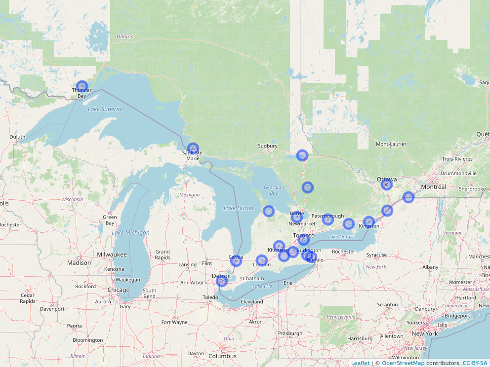


## Attempt 1


```r
my_url <- "http://www.utsc.utoronto.ca/~butler/d29/ontario-road-distances.csv"
ontario <- read_csv(my_url)
ontario.d <- ontario %>% select(-1) %>% as.dist()
ontario.hc <- hclust(ontario.d, method = "ward.D")
```

   


## Plot, with 4 clusters

```r
plot(ontario.hc)
rect.hclust(ontario.hc, 4)
```


   


## Comments


* Can't have divisions of 1 team!

* "Southern" divisions way too big!

* Try splitting into more. I found 7 to be good:


## Seven clusters

```r
plot(ontario.hc)
rect.hclust(ontario.hc, 7)
```


   


## Divisions now


* I want to put Huntsville and North Bay together with northern teams.

* I'll put the Eastern teams together. Gives:


* North: Sault Ste Marie, Sudbury, Huntsville, North Bay

* East: Brockville, Cornwall, Ottawa, Peterborough,
Belleville, Kingston

* West:  Windsor, London, Sarnia

* Central: Owen Sound, Barrie, Toronto, Niagara Falls, St
Catharines, Brantford, Hamilton, Kitchener


* Getting them same size beyond us!


## Another map


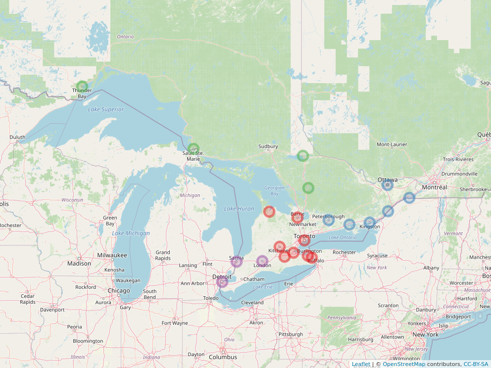


   


 


\section{Multidimensional scaling}

\frame{\sectionpage}
## Multidimensional Scaling


* Have distances between individuals.

* Want to draw a picture (map) in 2 dimensions showing
individuals so that distances (or order of distances) as close
together as possible. (Or maybe 3 with `rgl`.)

* If want to preserve actual distances, called {\em metric
multidimensional scaling} (in R, `cmdscale`).

* If only want to preserve order of distances, called {\em
non-metric multidimensional scaling} (in R, `isoMDS` in
package `MASS`).

* Metric scaling has solution that can be worked out exactly.

* Non-metric only has iterative solution.

* Assess quality of fit, see whether use of resulting map is
reasonable. (Try something obviously 3-dimensional and assess its
failure.)


## Packages
The usual, plus a new one:

```r
library(MASS)
library(tidyverse)
```

```
## Warning: package 'ggplot2' was built under R
## version 3.5.3
```

```
## Warning: package 'tibble' was built under R
## version 3.5.3
```

```
## Warning: package 'tidyr' was built under R version
## 3.5.3
```

```
## Warning: package 'readr' was built under R version
## 3.5.2
```

```
## Warning: package 'purrr' was built under R version
## 3.5.3
```

```
## Warning: package 'dplyr' was built under R version
## 3.5.2
```

```
## Warning: package 'stringr' was built under R
## version 3.5.2
```

```
## Warning: package 'forcats' was built under R
## version 3.5.1
```

```r
library(ggrepel)
```

```
## Warning: package 'ggrepel' was built under R
## version 3.5.1
```

```r
library(ggmap)
```

```
## Warning: package 'ggmap' was built under R version
## 3.5.2
```

```r
library(shapes)
```

```
## Warning: package 'shapes' was built under R
## version 3.5.1
```

   

## Metric scaling: European cities

CSV file `europe.csv` contains road distances (in km) between 16 European cities. Can we reproduce a map of Europe from these distances?

Read in data:


 


```r
my_url <- "http://www.utsc.utoronto.ca/~butler/d29/europe.csv"
europe <- read_csv(my_url)
```

```
## Warning: Missing column names filled in: 'X1' [1]
```

```
## Parsed with column specification:
## cols(
##   X1 = col_character(),
##   Amsterdam = col_double(),
##   Athens = col_double(),
##   Barcelona = col_double(),
##   Berlin = col_double(),
##   Cologne = col_double(),
##   Copenhagen = col_double(),
##   Edinburgh = col_double(),
##   Geneva = col_double(),
##   London = col_double(),
##   Madrid = col_double(),
##   Marseille = col_double(),
##   Munich = col_double(),
##   Paris = col_double(),
##   Prague = col_double(),
##   Rome = col_double(),
##   Vienna = col_double()
## )
```

 


## The data

```r
europe
```

```
## # A tibble: 16 x 17
##    X1    Amsterdam Athens Barcelona Berlin Cologne Copenhagen
##    <chr>     <dbl>  <dbl>     <dbl>  <dbl>   <dbl>      <dbl>
##  1 Amst…         0   3082      1639    649     280        904
##  2 Athe…      3082      0      3312   2552    2562       3414
##  3 Barc…      1639   3312         0   1899    1539       2230
##  4 Berl…       649   2552      1899      0     575        743
##  5 Colo…       280   2562      1539    575       0        730
##  6 Cope…       904   3414      2230    743     730          0
##  7 Edin…      1180   3768      2181   1727    1206       1864
##  8 Gene…      1014   2692       758   1141     765       1531
##  9 Lond…       494   3099      1512   1059     538       1196
## 10 Madr…      1782   3940       628   2527    1776       2597
## 11 Mars…      1323   2997       515   1584    1208       1914
## 12 Muni…       875   2210      1349    604     592       1204
## 13 Paris       515   3140      1125   1094     508       1329
## 14 Prag…       973   2198      1679    354     659       1033
## 15 Rome       1835   2551      1471   1573    1586       2352
## 16 Vien…      1196   1886      1989    666     915       1345
## # … with 10 more variables: Edinburgh <dbl>, Geneva <dbl>,
## #   London <dbl>, Madrid <dbl>, Marseille <dbl>, Munich <dbl>,
## #   Paris <dbl>, Prague <dbl>, Rome <dbl>, Vienna <dbl>
```

   

## Multidimensional scaling


* Create distance object first using all but first column of
`europe`. `europe` has distances in it already, so make
into `dist` with `as.dist`.

* Then run multidimensional scaling and look at result:

```r
europe.d <- europe %>% select(-1) %>% as.dist()
europe.scale <- cmdscale(europe.d)
head(europe.scale)
```

```
##                   [,1]      [,2]
## Amsterdam  -348.162277  528.2657
## Athens     2528.610410 -509.5208
## Barcelona  -695.970779 -984.6093
## Berlin      384.178025  634.5239
## Cologne       5.153446  356.7230
## Copenhagen -187.104072 1142.5926
```

   


* This is a `matrix` of $x$ and $y$ coordinates.


## As a data frame; make picture
We know how to plot data frames, so make one first.  

```r
europe_coord <- europe.scale %>%
  as_tibble() %>%
  mutate(city = europe$City) %>%
  print(n = 12)
```

```
## Warning: `as_tibble.matrix()` requires a matrix with column names or a `.name_repair` argument. Using compatibility `.name_repair`.
## This warning is displayed once per session.
```

```
## Warning: Unknown or uninitialised column: 'City'.
```

```
## # A tibble: 16 x 2
##          V1      V2
##       <dbl>   <dbl>
##  1  -348.     528. 
##  2  2529.    -510. 
##  3  -696.    -985. 
##  4   384.     635. 
##  5     5.15   357. 
##  6  -187.    1143. 
##  7  -882.     894. 
##  8  -161.    -330. 
##  9  -434.     427. 
## 10 -1364.   -1069. 
## 11  -390.    -706. 
## 12   345.     -66.8
## # … with 4 more rows
```

```r
g <- ggplot(europe_coord, aes(x = V1, y = V2, label = city)) +
  geom_point() + geom_text_repel()
```

   


## The map

```r
g
```

```
## Error in FUN(X[[i]], ...): object 'city' not found
```


   


## Making a function


* Idea: given input distance matrix (as stored in a CSV file),
output a map (like the one on the previous page).

```r
mds_map <- function(filename) {
  x <- read_csv(filename)
  dist <- x %>%
    select_if(is.numeric) %>%
    as.dist()
  x.scale <- cmdscale(dist) # this is a matrix
  x_coord <- x.scale %>%
    as_tibble() %>%
    mutate(place = row.names(x.scale))
  ggplot(x_coord, aes(x = V1, y = V2, label = place)) +
    geom_point() + geom_text_repel() +
    coord_fixed()
}
```

     


* Use `select_if` to pick out all the numerical columns
(no text), whichever they are.

* `x.scale` is matrix with no column headers. Turn into
data frame, acquires headers `V1` and `V2`.

* Get place names from `cmdscale` output.


## Does it work?

```r
mds_map("europe.csv")
```


   


## A square
\begin{multicols}{2}


* The data, in `square.csv`:
\begin{small}

```

x,A  ,B  ,C  ,D
A,0  ,1  ,1  ,1.4
B,1  ,0  ,1.4,1
C,1  ,1.4,0  ,1
D,1.4,1  ,1  ,0

```

\end{small}

* The map (on right):

```r
mds_map("square.csv")
```


       

\end{multicols}

## Drawing a map of the real Europe


* Works with package `ggmap`.

* First find latitudes and longitudes of our cities, called
*geocoding*:

```r
latlong <- geocode(europe$City)
latlong <- bind_cols(city = europe$City, latlong)
latlong %>% print(n = 6)
```
$ %$ %$


```
## # A tibble: 16 x 3
##   city         lon   lat
##   <chr>      <dbl> <dbl>
## 1 Amsterdam   4.90  52.4
## 2 Athens     23.7   38.0
## 3 Barcelona   2.17  41.4
## 4 Berlin     13.4   52.5
## 5 Cologne     6.96  50.9
## 6 Copenhagen 12.6   55.7
## # … with 10 more rows
```

 


* Just so you know, there is a limit
of 2500 queries per day (it queries Google Maps).


## Making the map


* Get a map of Europe from Google Maps (specify what you want a
map of any way you can in Google Maps). This one centres the map
on the city shown and zooms it so all the cities appear (I had to
experiment):

```r
map <- get_map("Memmingen DE", zoom = 5)
```

     


 

* Plot the map with `ggmap`. This is `ggplot`,
so add anything to it that you would
add to a `ggplot`, such as cities we want to show:

```r
g2 <- ggmap(map) +
  geom_point(
    data = latlong, aes(x = lon, y = lat),
    shape = 3, colour = "red"
  )
```

   


* We don't have a default data frame or `aes` for our
`geom_point`, so have to specify one.


## The real Europe with our cities

```r
g2
```


   


## Compare our scaling map

```
## Error in FUN(X[[i]], ...): object 'city' not found
```


   

## Comments


* North-south not quite right: Edinburgh and Copenhagen on same
latitude, also Amsterdam and Berlin; Athens should be south of Rome.

* Rotating clockwise by about 45 degrees should fix that.

* General point: MDS only uses distances, so answer can be
"off" by rotation (as here) or reflection (flipping over, say
exchanging west and east while leaving north and south same). 
 


## Exploring the map by plotting in 3 dimensions


* Package `rgl` makes 3D plots.

* We have to fake up a 3rd dimension (by setting all its values
to 1).

* Try this code:

```r
library(rgl)
es.2 <- cbind(europe.scale, 1)
plot3d(es.2, zlim = c(-1000, 1000))
text3d(es.2, text = d$city)
```

     

* Opens a graphics window with the cities plotted and named.

* Click and hold left mouse button to rotate plot. "Rotate away"
3rd dimension to get a possible map (that preserves distances). 


## Ontario, the same way
\ldots using our function:


```r
g <- mds_map("ontario-road-distances.csv")
g
```


   

Thunder Bay and Sault Ste Marie dominate the picture since they are
so far away from everywhere else.
 <<ontario>>=
 ontario=read.csv("ontario-road-distances.csv",header=T)
 ontario.d=as.dist(ontario)
 ontario.scale=cmdscale(ontario.d)
 d=data.frame(ontario.scale,city=colnames(ontario))
 g=ggplot(d,aes(x=X1,y=X2,label=city))+
   geom_point()+coord_fixed()+
   geom_text_repel()
 @ 
 

## Removing points


* Messy: have to find which rows and columns contain
those cities, then remove just those rows and columns.

* Better: 


* "tidy" the distance matrix

* then remove rows we don't need

* then "untidy" it again

* save into .csv file


* Illustrate with square data first (easier to see).


## Square data

```r
my_url <- "http://www.utsc.utoronto.ca/~butler/d29/square.csv"
square <- read_csv(my_url)
square
```

```
## # A tibble: 4 x 5
##   x         A     B     C     D
##   <chr> <dbl> <dbl> <dbl> <dbl>
## 1 A       0     1     1     1.4
## 2 B       1     0     1.4   1  
## 3 C       1     1.4   0     1  
## 4 D       1.4   1     1     0
```

   


## Make tidy

```r
square %>% gather(point, distance, -1)
```

```
## # A tibble: 16 x 3
##    x     point distance
##    <chr> <chr>    <dbl>
##  1 A     A          0  
##  2 B     A          1  
##  3 C     A          1  
##  4 D     A          1.4
##  5 A     B          1  
##  6 B     B          0  
##  7 C     B          1.4
##  8 D     B          1  
##  9 A     C          1  
## 10 B     C          1.4
## 11 C     C          0  
## 12 D     C          1  
## 13 A     D          1.4
## 14 B     D          1  
## 15 C     D          1  
## 16 D     D          0
```

   


## Remove all references to point C
In column `x` or `point`:

```r
square %>%
  gather(point, distance, -1) %>%
  filter(x != "C", point != "C")
```

```
## # A tibble: 9 x 3
##   x     point distance
##   <chr> <chr>    <dbl>
## 1 A     A          0  
## 2 B     A          1  
## 3 D     A          1.4
## 4 A     B          1  
## 5 B     B          0  
## 6 D     B          1  
## 7 A     D          1.4
## 8 B     D          1  
## 9 D     D          0
```

   


## Put back as distance matrix
and save as .csv when we are happy:

```r
noc <- square %>%
  gather(point, distance, -1) %>%
  filter(x != "C", point != "C") %>%
  spread(point, distance)
noc
```

```
## # A tibble: 3 x 4
##   x         A     B     D
##   <chr> <dbl> <dbl> <dbl>
## 1 A       0       1   1.4
## 2 B       1       0   1  
## 3 D       1.4     1   0
```

```r
noc %>% write_csv("no-c.csv")
```

   


## Make map of square-without-C

```r
mds_map("no-c.csv")
```


   


## Back to Ontario

```r
g
```


   

Get rid of Thunder Bay and Sault Ste Marie.


## Tidy, remove, untidy

```r
my_url <- "http://www.utsc.utoronto.ca/~butler/d29/ontario-road-distances.csv"
ontario2 <- read_csv(my_url) %>%
  gather(place, distance, -1) %>%
  filter(
    x != "Thunder Bay",
    place != "Thunder Bay",
    x != "Sault Ste Marie",
    place != "Sault Ste Marie"
  ) %>%
  spread(place, distance) %>%
  write_csv("southern-ontario.csv")
```

```
## Warning in (~x != "Thunder Bay") & ~place != "Thunder Bay":
## longer object length is not a multiple of shorter object length
```

```
## Warning in (~x != "Thunder Bay") & ~place != "Thunder Bay" & ~x !
## = "Sault Ste Marie": longer object length is not a multiple of
## shorter object length
```

```
## Each row of output must be identified by a unique combination of keys.
## Keys are shared for 399 rows:
## * 1, 2, 3, 4, 5, 6, 7, 8, 9, 10, 11, 12, 13, 14, 15, 16, 17, 18, 19, 20, 21
## * 22, 23, 24, 25, 26, 27, 28, 29, 30, 31, 32, 33, 34, 35, 36, 37, 38, 39, 40, 41, 42
## * 43, 44, 45, 46, 47, 48, 49, 50, 51, 52, 53, 54, 55, 56, 57, 58, 59, 60, 61, 62, 63
## * 64, 65, 66, 67, 68, 69, 70, 71, 72, 73, 74, 75, 76, 77, 78, 79, 80, 81, 82, 83, 84
## * 85, 86, 87, 88, 89, 90, 91, 92, 93, 94, 95, 96, 97, 98, 99, 100, 101, 102, 103, 104, 105
## * 106, 107, 108, 109, 110, 111, 112, 113, 114, 115, 116, 117, 118, 119, 120, 121, 122, 123, 124, 125, 126
## * 127, 128, 129, 130, 131, 132, 133, 134, 135, 136, 137, 138, 139, 140, 141, 142, 143, 144, 145, 146, 147
## * 148, 149, 150, 151, 152, 153, 154, 155, 156, 157, 158, 159, 160, 161, 162, 163, 164, 165, 166, 167, 168
## * 169, 170, 171, 172, 173, 174, 175, 176, 177, 178, 179, 180, 181, 182, 183, 184, 185, 186, 187, 188, 189
## * 190, 191, 192, 193, 194, 195, 196, 197, 198, 199, 200, 201, 202, 203, 204, 205, 206, 207, 208, 209, 210
## * 211, 212, 213, 214, 215, 216, 217, 218, 219, 220, 221, 222, 223, 224, 225, 226, 227, 228, 229, 230, 231
## * 232, 233, 234, 235, 236, 237, 238, 239, 240, 241, 242, 243, 244, 245, 246, 247, 248, 249, 250, 251, 252
## * 253, 254, 255, 256, 257, 258, 259, 260, 261, 262, 263, 264, 265, 266, 267, 268, 269, 270, 271, 272, 273
## * 274, 275, 276, 277, 278, 279, 280, 281, 282, 283, 284, 285, 286, 287, 288, 289, 290, 291, 292, 293, 294
## * 295, 296, 297, 298, 299, 300, 301, 302, 303, 304, 305, 306, 307, 308, 309, 310, 311, 312, 313, 314, 315
## * 316, 317, 318, 319, 320, 321, 322, 323, 324, 325, 326, 327, 328, 329, 330, 331, 332, 333, 334, 335, 336
## * 337, 338, 339, 340, 341, 342, 343, 344, 345, 346, 347, 348, 349, 350, 351, 352, 353, 354, 355, 356, 357
## * 358, 359, 360, 361, 362, 363, 364, 365, 366, 367, 368, 369, 370, 371, 372, 373, 374, 375, 376, 377, 378
## * 379, 380, 381, 382, 383, 384, 385, 386, 387, 388, 389, 390, 391, 392, 393, 394, 395, 396, 397, 398, 399
## Do you need to create unique ID with tibble::rowid_to_column()?
```

   


## Map of Southern Ontario

```r
g <- mds_map("southern-ontario.csv")
g
```


   

Came out geographically about right.


## What about that cluster of points?


* Plot looks generally good, but what about that cluster of points?

* "Zoom in" on area between $-150$ and $-100$ on $x$ axis, $-50$ to 0 on
$y$ axis.

* Code below overrides the `coord_fixed` we had before.


```r
g2 <- g + coord_fixed(xlim = c(-150, -100), ylim = c(-50, 0))
```

```
## Coordinate system already present. Adding new coordinate system, which will replace the existing one.
```

 


## Zoomed-in plot
Ignore the arrows to points off the map:

```r
g2
```


   


## Does that make sense?


* Get a Google map of the area, with the points labelled.

* First geocode the cities of interest:

```r
cities <- c(
  "Kitchener ON", "Hamilton ON", "Niagara Falls ON",
  "St Catharines ON", "Brantford ON"
)
latlong <- geocode(cities)
latlong <- bind_cols(city = cities, latlong) %>% print()
```

     


```
## # A tibble: 5 x 3
##   city               lon   lat
##   <chr>            <dbl> <dbl>
## 1 Kitchener ON     -80.5  43.5
## 2 Hamilton ON      -79.9  43.3
## 3 Niagara Falls ON -79.1  43.1
## 4 St Catharines ON -79.2  43.2
## 5 Brantford ON     -80.3  43.1
```

 


* Get a Google map of the area (experiment with zoom):

```r
map <- get_map("Hamilton ON", zoom = 8)
```
 get from file


 


* Plot map with cities marked.


## Making the Google map
Plot the map, plus the cities, plus labels for the cities:

```r
gmap <- ggmap(map) +
  geom_point(
    data = latlong,
    aes(x = lon, y = lat),
    shape = 3, colour = "red"
  ) +
  geom_text_repel(
    data = latlong,
    aes(label = city)
  )
```

   


\begin{frame}[frame]{The `mds` map and Google map}
\begin{multicols}{2}

```r
g2
```


     


```r
gmap
```


 
\end{multicols}
St Catharines and Niagara Falls should be the *other* side of
Hamilton! 


## Quality of fit


* Read in "southern Ontario" data set from file:

```r
my_url <- "http://www.utsc.utoronto.ca/~butler/d29/southern-ontario.csv"
ontario2 <- read_csv(my_url)
```

     

* Calling `cmdscale` with `eig=T` gives more info:


```r
ontario2.2 <- ontario2 %>%
  select_if(is.numeric) %>%
  cmdscale(eig = T)
names(ontario2.2)
```

```
## [1] "points" "eig"    "x"      "ac"     "GOF"
```

```r
ontario2.2$GOF
```

```
## [1] 0.8381590 0.8914059
```

```r
ontario2.3 <- ontario2 %>%
  select_if(is.numeric) %>%
  cmdscale(3, eig = T)
ontario2.3$GOF
```

```
## [1] 0.8852559 0.9414948
```

   


## Comments


* Coordinates now in `points`.

* `GOF` is R-squared-like measure saying how well map
distances match real ones. Higher is better.

* For Ontario road distances, `GOF` better for 3 dimensions
than 2, presumably to accommodate St Catharines and Niagara Falls?


## 3-dimensional coordinates, cities attached

```r
ontario2.3$points %>%
  as_tibble() %>%
  mutate(city = ontario2$x)
```

```
## # A tibble: 19 x 4
##        V1       V2      V3 city         
##     <dbl>    <dbl>   <dbl> <chr>        
##  1  -38.7  122.       4.17 Barrie       
##  2  146.   -82.8      1.53 Belleville   
##  3 -132.   -38.9     14.1  Brantford    
##  4  298.  -106.      -7.74 Brockville   
##  5  397.  -104.     -22.0  Cornwall     
##  6 -101.   -18.5     30.0  Hamilton     
##  7   62.4  198.     -14.0  Huntsville   
##  8  214.  -129.      10.8  Kingston     
##  9 -123.   -15.0     -6.44 Kitchener    
## 10 -208.   -51.6    -36.5  London       
## 11 -129.   -19.1    155.   Niagara Falls
## 12  146.   300.     -25.4  North Bay    
## 13  368.    -4.30   -47.2  Ottawa       
## 14 -145.   125.     -16.0  Owen Sound   
## 15   82.5    0.551   -6.92 Peterborough 
## 16 -299.   -39.4    -72.5  Sarnia       
## 17 -117.   -16.8    123.   St Catharines
## 18  -34.3   -4.75    15.8  Toronto      
## 19 -388.  -116.     -99.5  Windsor
```

   


## RGL code for 3 dimensions

```r
library(rgl)
plot3d(ontario.3)
text3d(ontario.3, text = d2$city)
```

 


\begin{frame}[fragile]{Comparing MDS solution with "reality":
Procrustes rotation}


* How to tell that an MDS map makes a good correspondence with ``what
should be''?

* Problem: MDS map might be rotated/scaled/reflected from reality.

* How to find rotation/scaling/reflection that best matches reality?

* Answer: **Procrustes rotation**.

* In R: `procOPA` in package `shapes`.


## "True" coordinates


* Get latitudes and longitudes of cities by geocoding, as
before. Glue "ON" onto city names to make sure we get right ones:

```r
lookup <- str_c(ontario2$x, " ON")
latlong <- geocode(lookup)
latlong <- bind_cols(city = ontario2$x, latlong) %>% print(n = 4)
```

     


```
## # A tibble: 19 x 3
##   city         lon   lat
##   <chr>      <dbl> <dbl>
## 1 Barrie     -79.7  44.4
## 2 Belleville -77.4  44.2
## 3 Brantford  -80.3  43.1
## 4 Brockville -75.7  44.6
## # … with 15 more rows
```

 

* Not $(x,y)$ coordinates: one degree of latitude is always
110.25 km, but one degree of longitude is only that at the equator
(less than that as you move further north, down to 0 km at north
pole).


## "True" coordinates part 2


* Make coordinates by multiplying by cosine of "typical" latitude.

* Find mean latitude:

```r
m <- mean(latlong$lat)
m
```

```
## [1] 44.01851
```

     


* Turn into radians and find its cosine:

```r
mult <- cos(m * pi / 180)
mult
```

```
## [1] 0.7191153
```

   


* Create "true" coords by multiplying the longitudes by
that. This needs to be R `matrix`, not data frame:

```r
truecoord <- with(latlong, cbind(V1 = lon * mult, V2 = lat))
```

   


## Using `procOPA`


* Feed 2 things into `procOPA`: first, "true"
coordinates, second MDS coordinates.

* Get out: 


*     (centred and scaled) first set of coordinates `Ahat`

* (centred and scaled) second set of coordinates `Bhat`

* sum of squared differences between two sets of coordinates `OSS`

* Rotation matrix `R`


* `Ahat` and `Bhat` coordinates supposed to
match as well as possible.

```r
ontario.pro <- procOPA(
  truecoord,
  ontario2.2$points
)
names(ontario.pro)
```

```
## [1] "R"    "s"    "Ahat" "Bhat" "OSS"  "rmsd"
```

     


## Make data frames of output, glue together


* Two sets of coordinates, `Ahat` are actual,
`Bhat` are from MDS.

```r
A <- ontario.pro$Ahat %>%
  as_tibble() %>%
  mutate(which = "actual", city = ontario2$x)
B <- ontario.pro$Bhat %>%
  as_tibble() %>%
  mutate(which = "MDS", city = ontario2$x)
dp <- bind_rows(A, B)
dp %>% sample_n(6)
```

```
## # A tibble: 6 x 4
##          V1     V2 which  city         
##       <dbl>  <dbl> <chr>  <chr>        
## 1  2.39      0.348 MDS    Brockville   
## 2  0.000652 -0.929 actual Niagara Falls
## 3 -1.00     -0.568 actual Kitchener    
## 4  1.22      0.144 actual Belleville   
## 5  0.551     0.291 actual Peterborough 
## 6 -1.22     -1.09  MDS    London
```
 ## `procOPA, part 2: plotting`
 
   
     
* Make data frames of each, glue together:
 <<size="small",warning=F>>=
 A=with(ontario.pro,data.frame(x=Ahat[,1],
   y=Ahat[,2],which="actual",city=ontario2$x)) 
 B=with(ontario.pro,data.frame(x=Bhat[,1],
   y=Bhat[,2],which="MDS",city=ontario2$x))
 dp=bind_rows(A,B)
 dp %>% sample_n(6)
 @   
 
   
 

## Procrustes rotation plot


* Strategy: plot all the locations, and colour them by whether
they were the true location (red) or the MDS one (blue), which is
in `which`. Label each location with the city name in the
appropriate colour.

* I realized it
was actually easy to join the two instances of a city by a line
(in green, here, 3rd line) by setting `group=city`:

```r
g_opa <- ggplot(dp, aes(
  x = V1, y = V2, colour = which,
  label = city
)) + geom_point() +
  geom_line(aes(group = city), colour = "green") +
  geom_text_repel(size = 2)
```

     

* On plot, look to see whether points that are same city are
joined by a short green line (good) or a long one (bad).


## The maps

  


## Comments


* True locations red, MDS locations blue

* Most things in roughly right place (esp.\ relative to other things)

* Extreme cities off by a bit, but OK relative to neighbours.

* St Catharines, Niagara Falls off by most.

* Sarnia, Windsor also off noticeably.

* These four cities had largest "third dimension" in 3D
representation  `ontario2.3`.


## Rotation matrix
Shows how MDS map needs to be rotated to get best match with actual coordinates:

```r
ontario.pro$R
```

```
##            [,1]      [,2]
## [1,]  0.8845749 0.4663981
## [2,] -0.4663981 0.8845749
```

   

Rotation angle $\theta$ such that $\cos\theta=0.885$,
$\sin\theta=0.466$: $\theta=23$ degrees (counterclockwise). 
$ %$ %$


## Is that right? Look at MDS map again

```r
g
```


   

23 degrees counterclockwise seems about right.


## A cube

```

a-----b
|\    |\
| c---- d
| |   | |
e-|---f |
\|    \|
g-----h

```


Cube has side length 1, so distance across diagonal on same face is $\sqrt{2}\simeq 1.4$ and "long" diagonal of cube is $\sqrt{3}\simeq 1.7$. 
\vspace{3ex}

Try MDS on this obviously 3-dimensional data.


## Cube data as distances

```r
my_url <- "http://www.utsc.utoronto.ca/~butler/d29/cube.txt"
cube <- read_delim(my_url, " ")
cube
```

```
## # A tibble: 8 x 9
##   x     `  a` `  b` `  c` `  d` `  e` `   f` ` g`  `  h`
##   <chr> <chr> <chr> <chr> <chr> <chr> <chr>  <chr> <chr>
## 1 a     "  0" " NA" " NA" " NA" " NA" "  NA" <NA>  " NA"
## 2 b     "  1" "  0" " NA" " NA" " NA" "  NA" <NA>  " NA"
## 3 c     "  1" "  1" "  0" " NA" " NA" "  NA" <NA>  " NA"
## 4 d     1.4   "  1" "  1" "  0" " NA" "  NA" <NA>  " NA"
## 5 e     "  1" 1.4   1.4   1.7   "  0" "  NA" <NA>  " NA"
## 6 f     1.4   "  1" 1.7   1.4   "  1" "   0" <NA>  " NA"
## 7 g     1.4   1.7   "  1" 1.4   "  1" " 1.4" " 0"  " NA"
## 8 h     1.7   1.4   1.4   "  1" 1.4   "   1" " 1"  "  0"
```

   


## Making `dist object`

```r
cube.d <- cube %>% select(-1) %>% as.dist()
```

```
## Warning in storage.mode(m) <- "numeric": NAs introduced by
## coercion
```

```r
cube.d
```

```
##        a   b   c   d   e    f   g
##   b  1.0                         
##   c  1.0 1.0                     
##   d  1.4 1.0 1.0                 
##   e  1.0 1.4 1.4 1.7             
##    f 1.4 1.0 1.7 1.4 1.0         
##  g   1.4 1.7 1.0 1.4 1.0  1.4    
##   h  1.7 1.4 1.4 1.0 1.4  1.0 1.0
```

 


## MDS and plotting commands


*   By default in 2 dimensions; save the extra stuff for later:


```r
cube.2 <- cube.d %>% cmdscale(eig = T)
```

   


* Make data frame to plot, remembering the points to plot are in
`points` now:

```r
d <- cube.2$points %>%
  as_tibble() %>%
  mutate(corners = cube$x)
```

   

* Plot points labelled by our names for the corners:

```r
g <- ggplot(d, aes(x = V1, y = V2, label = corners)) +
  geom_point() + geom_text_repel()
```

   


## The "cube"


 

Not good.

## 2 and 3 dimensions

```r
cube.3 <- cube.d %>% cmdscale(3, eig = T)
cube.2$GOF
```

```
## [1] 0.639293 0.664332
```

```r
cube.3$GOF
```

```
## [1] 0.9143532 0.9501654
```

   


* Really need 3rd dimension to represent cube.


## Non-metric scaling


* Sometimes distances not meaningful *as distances*

* Only order matters: closest should be closest, farthest
farthest on map, but how much further doesn't matter.

* Non-metric scaling, aims to minimize **stress**, measure
of lack of fit.

* Example: languages. Make map based on "similarity" of number
names, without requiring that 1 is "eight times better" than 8.


## The languages


* Recall language data (from cluster analysis): 1--10, measure dissimilarity between two languages by how many number names {\em differ} in first letter:


     

```r
my_url <- "http://www.utsc.utoronto.ca/~butler/d29/languages.txt"
number.d <- read_table(my_url)
number.d
```

```
## # A tibble: 11 x 12
##    la       en    no    dk    nl    de    fr    es
##    <chr> <dbl> <dbl> <dbl> <dbl> <dbl> <dbl> <dbl>
##  1 en        0     2     2     7     6     6     6
##  2 no        2     0     1     5     4     6     6
##  3 dk        2     1     0     6     5     6     5
##  4 nl        7     5     6     0     5     9     9
##  5 de        6     4     5     5     0     7     7
##  6 fr        6     6     6     9     7     0     2
##  7 es        6     6     5     9     7     2     0
##  8 it        6     6     5     9     7     1     1
##  9 pl        7     7     6    10     8     5     3
## 10 hu        9     8     8     8     9    10    10
## 11 fi        9     9     9     9     9     9     9
## # … with 4 more variables: it <dbl>, pl <dbl>,
## #   hu <dbl>, fi <dbl>
```

 


## Non-metric scaling


* Turn language dissimilarities into `dist` object

* Run through `isoMDS` from `MASS` package; works
like `cmdscale`.

* Map only reproduces {\em relative} closeness of languages.

```r
d <- number.d %>%
  select_if(is.numeric) %>%
  as.dist()
number.nm <- d %>% isoMDS()
```

```
## initial  value 12.404671 
## iter   5 value 5.933653
## iter  10 value 5.300747
## final  value 5.265236 
## converged
```

```r
names(number.nm)
```

```
## [1] "points" "stress"
```

   


* `points` for plotting, `stress` measure of fit
(lower better).


## Results


* Stress is very low (5\%, good):

```r
number.nm$stress
```

```
## [1] 5.265236
```
$ %$ %$


* Familiar process: make a data frame to plot. Use name
`dd` for data frame this time since used `d` for
distance object:

```r
dd <- number.nm$points %>%
  as_tibble() %>%
  mutate(lang = number.d$la)
```

   


* Make plot:

```r
g <- ggplot(dd, aes(x = V1, y = V2, label = lang)) +
  geom_point() + geom_text_repel()
```

   


## The languages map


 


## Comments


* Tight clusters: Italian-Spanish-French, English-Danish-Norwegian.

* Dutch and German close to English group.

* Polish close to French group.

* Hungarian, Finnish distant from everything else and each other!

* Similar conclusions as from the cluster analysis.


## Shepard diagram


* Stress for languages data was 5.3\%, very low.

* How do observed dissimilarities and map distances correspond?

* For low stress, expect larger dissimilarity to go with larger
map distance, almost all the time.

* Not necessarily a linear trend since non-metric MDS works with
*order* of values.

* Actual dissimilarity on $x$-axis; map distances on $y$-axis.


## Shepard diagram for languages

```r
Shepard(d, number.nm$points) %>%
  as_tibble() %>%
  ggplot(aes(x = x, y = y)) + geom_point()
```


 

Actual dissimilarity $x$ between higher: mapped distance $y$ from
MDS higher too. (MDS working well.)

## Cube, revisited

```r
cube.d <- cube %>% select(-x) %>% as.dist(cube)
```

```
## Warning in storage.mode(m) <- "numeric": NAs introduced
## by coercion
```

```r
cube.2 <- isoMDS(cube.d, trace = F)
cube.2$stress
```

```
## [1] 17.97392
```

```r
cube.3 <- isoMDS(cube.d, k = 3, trace = F)
cube.3$stress
```

```
## [1] 0.007819523
```

   


* Stress is 18\% for 2 dimensions, basically 0\% for 3.

* Three dimensions correct, two dimensions bad.

* Shepard diagrams for these:

```r
cube2.sh <- Shepard(cube.d, cube.2$points)
g2 <- ggplot(as.data.frame(cube2.sh), aes(x = x, y = y)) +
  geom_point()
cube3.sh <- Shepard(cube.d, cube.3$points)
g3 <- ggplot(as.data.frame(cube3.sh), aes(x = x, y = y)) +
  geom_point()
```

   


## Shepard diagram for 2-dimensional cube


```r
g2
```


   

Poor correspondence (not much trend).


## Shepard diagram for 3-dimensional cube

```r
g3
```


 
Almost perfect: all actual $x=1$ go with smallest mapped distances; almost
all $x=1.7$ go with  largest.


## Guidelines for stress values, in \%

Smaller is better:
\begin{tabular}{lp{3in}}
Stress value & Interpretation \\
\hline
Less than 5 & Excellent: no prospect of misinterpretation (rarely achieved)\\
5--10 & Good: most distances reproduced well, small prospect of false inferences\\
10--20 & Fair: usable, but some distances misleading.\\
More than 20 & Poor: may be dangerous to interpret\\
\hline
\end{tabular}


* Languages: stress in "good" range.

* Cube: 


*   2 dimensions "fair", almost "poor";

* 3 dimensions, "excellent".
 <<echo=F, warning=F>>=
 pkgs = names(sessionInfo()$otherPkgs) 
 pkgs=paste('package:', pkgs, sep = "")
 x=lapply(pkgs, detach, character.only = TRUE, unload = TRUE)
 @   


 

\section{Principal components}
\frame{\sectionpage}

## Principal Components


* Have measurements on (possibly large) number of variables on some individuals.

* Question: can we describe data using fewer variables (because original variables correlated in some way)?

* Look for direction (linear combination of original variables) in which values {\em most spread out}. This is {\em first principal component}.

* Second principal component then direction uncorrelated with this in which values then most spread out. And so on.


## Principal components


* See whether small number of principal components captures most of variation in data.

* Might try to interpret principal components.

* If 2 components good, can make plot of data.

* (Like discriminant analysis, but no groups.)

* "What are important ways that these data vary?"


## Packages


   

You might not have installed the first of these. See over for
instructions. 


```r
library(ggbiplot) # see over
library(tidyverse)
library(ggrepel)
```

 


## Installing `ggbiplot`


* `ggbiplot` not on CRAN, so usual
`install.packages` will not work.

* Install package `devtools` first (once):

```r
install.packages("devtools")
```

     

* Then install `ggbiplot` (once):

```r
library(devtools)
install_github("vqv/ggbiplot")
```

     


## Small example: 2 test scores for 8 people


```r
my_url <- "http://www.utsc.utoronto.ca/~butler/d29/test12.txt"
test12 <- read_table2(my_url)
test12
```

```
## # A tibble: 8 x 3
##   first second id   
##   <dbl>  <dbl> <chr>
## 1     2      9 A    
## 2    16     40 B    
## 3     8     17 C    
## 4    18     43 D    
## 5    10     25 E    
## 6     4     10 F    
## 7    10     27 G    
## 8    12     30 H
```


```r
g <- ggplot(test12, aes(x = first, y = second, label = id)) +
  geom_point() + geom_text_repel()
```

 


## The plot


```r
g + geom_smooth(method = "lm", se = F)
```


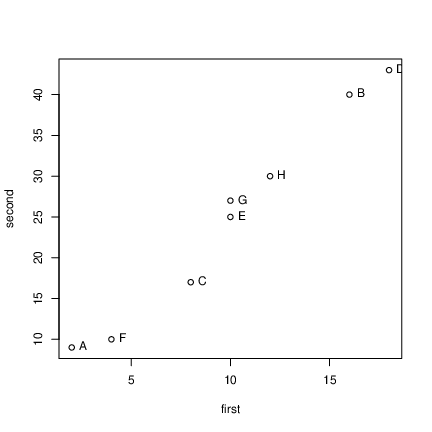
  


## Principal component analysis


* Grab just the numeric columns:

```r
test12_numbers <- test12 %>% select_if(is.numeric)
```

     


* Strongly correlated, so data nearly 1-dimensional:


```r
cor(test12_numbers)
```

```
##           first   second
## first  1.000000 0.989078
## second 0.989078 1.000000
```

 


* Make a score summarizing this one dimension. Like this:


```r
test12.pc <- test12_numbers %>% princomp(cor = T)
summary(test12.pc)
```

```
## Importance of components:
##                          Comp.1      Comp.2
## Standard deviation     1.410347 0.104508582
## Proportion of Variance 0.994539 0.005461022
## Cumulative Proportion  0.994539 1.000000000
```

 


## Comments


* "Standard deviation" shows relative importance of components
(as for LDs in discriminant analysis)

* Here, first one explains almost all (99.4\%) of variability.

* That is, look only at first component and ignore second.

* `cor=T` standardizes all variables first. Usually wanted,
because variables measured on different scales. (Only omit if
variables measured on same scale and expect similar variability.)


## Scree plot

```r
ggscreeplot(test12.pc)
```


   

Imagine scree plot continues at zero, so 2 components is a *big*
elbow (take one component).


## Component loadings
explain how each principal component depends on (standardized)
original variables (test scores):

```r
test12.pc$loadings
```

```
## 
## Loadings:
##        Comp.1 Comp.2
## first   0.707  0.707
## second  0.707 -0.707
## 
##                Comp.1 Comp.2
## SS loadings       1.0    1.0
## Proportion Var    0.5    0.5
## Cumulative Var    0.5    1.0
```

   

First component basically negative sum of (standardized) test
scores. That is, person tends to score similarly on two tests, and a
composite score would summarize performance.


## Component scores


```r
d <- data.frame(test12, test12.pc$scores)
d
```

```
##   first second id       Comp.1       Comp.2
## 1     2      9  A -2.071819003 -0.146981782
## 2    16     40  B  1.719862811 -0.055762223
## 3     8     17  C -0.762289708  0.207589512
## 4    18     43  D  2.176267535  0.042533250
## 5    10     25  E -0.007460609  0.007460609
## 6     4     10  F -1.734784030  0.070683441
## 7    10     27  G  0.111909141 -0.111909141
## 8    12     30  H  0.568313864 -0.013613668
```
$


* Person A is a low scorer, high positive `comp.1` score.

* Person D is high scorer, high negative `comp.1` score.

* Person E average scorer, near-zero `comp.1` score.

* `comp.2` says basically nothing.


## Plot of scores


```r
ggplot(d, aes(x = Comp.1, y = Comp.2, label = id)) +
  geom_point() + geom_text_repel()
```


  


## Comments


* Vertical scale exaggerates importance of `comp.2`.

* Fix up to get axes on same scale:

```r
g <- ggplot(d, aes(x = Comp.1, y = Comp.2, label = id)) +
  geom_point() + geom_text_repel() +
  coord_fixed()
```


* Shows how exam scores really spread out along one dimension:


```r
g
```


## The biplot


* Plotting variables and individuals on one plot.

* Shows how components and original variables related.

* Shows how individuals score on each component, and therefore
suggests how they score on each variable.

* Add `labels` option to identify individuals:

```r
g <- ggbiplot(test12.pc, labels = test12$id)
```

     


## The biplot

  


## Comments


* Variables point almost same direction (left). Thus very
negative value on `comp.1` goes with high scores on both
tests, and test scores highly correlated.

* Position of individuals on plot according to scores on
principal components, implies values on original variables. Eg.:


* D very negative on `comp.1`, high scorer on both tests.

* A and F very positive on `comp.1`, poor scorers on
both tests.

* C positive on `comp.2`, high score on first
test relative to second.

* A negative on `comp.2`, high score on second test
relative to first.


## Track running data

(1984) track running records for distances 100m to marathon, arranged
by country. Countries labelled by (mostly) Internet domain names (ISO
2-letter codes):


 


```r
my_url <- "http://www.utsc.utoronto.ca/~butler/d29/men_track_field.txt"
track <- read_table(my_url)
track %>% sample_n(12)
```

```
## # A tibble: 12 x 9
##     m100  m200  m400  m800 m1500 m5000 m10000 marathon country
##    <dbl> <dbl> <dbl> <dbl> <dbl> <dbl>  <dbl>    <dbl> <chr>  
##  1  10.4  20.8  46.8  1.79  3.6   13.3   27.7     136. at     
##  2  10.0  19.7  45.3  1.73  3.6   13.2   27.5     131. it     
##  3  10.3  20.6  46.0  1.77  3.62  13.5   28.4     133. hu     
##  4  10.2  20.2  45.7  1.76  3.63  13.6   28.1     130. ca     
##  5  10.4  21.0  45.9  1.76  3.64  13.2   27.7     132. ro     
##  6  10.2  20.2  45.4  1.76  3.6   13.3   27.9     132. pl     
##  7  11.0  21.8  47.9  1.9   4.01  14.7   31.4     148. pg     
##  8  10.2  20.6  45.6  1.77  3.61  13.3   27.9     131. se     
##  9  10.3  20.1  44.8  1.74  3.57  13.3   27.7     128. au     
## 10  10.1  20.3  44.9  1.73  3.56  13.2   27.4     130. dee    
## 11  10.4  21.0  46.1  1.82  3.74  13.5   27.9     131. co     
## 12  10.4  21.3  46.1  1.8   3.65  13.5   28.0     129. mx
```

 


## Country names
Also read in a table to look country names up in later:


```r
my_url <- "http://www.utsc.utoronto.ca/~butler/d29/isocodes.csv"
iso <- read_csv(my_url)
iso
```

```
## # A tibble: 251 x 4
##    Country        ISO2  ISO3    M49
##    <chr>          <chr> <chr> <dbl>
##  1 <NA>           <NA>  <NA>     NA
##  2 Afghanistan    af    afg       4
##  3 Aland Islands  ax    ala     248
##  4 Albania        al    alb       8
##  5 Algeria        dz    dza      12
##  6 American Samoa as    asm      16
##  7 Andorra        ad    and      20
##  8 Angola         ao    ago      24
##  9 Anguilla       ai    aia     660
## 10 Antarctica     aq    ata      10
## # … with 241 more rows
```

 


## Data and aims


* 
Times in seconds 100m--400m, in minutes for rest (800m up).

* This taken care of by standardization.

* 8 variables; can we summarize by fewer and gain some insight?

* In particular, if 2 components tell most of story, what do we see in a plot?


## Fit and examine principal components


   

```r
track_num <- track %>% select_if(is.numeric)
track.pc <- princomp(track_num, cor = T)
summary(track.pc)
```

```
## Importance of components:
##                           Comp.1    Comp.2
## Standard deviation     2.5733531 0.9368128
## Proportion of Variance 0.8277683 0.1097023
## Cumulative Proportion  0.8277683 0.9374706
##                            Comp.3     Comp.4
## Standard deviation     0.39915052 0.35220645
## Proportion of Variance 0.01991514 0.01550617
## Cumulative Proportion  0.95738570 0.97289187
##                             Comp.5      Comp.6
## Standard deviation     0.282630981 0.260701267
## Proportion of Variance 0.009985034 0.008495644
## Cumulative Proportion  0.982876903 0.991372547
##                             Comp.7      Comp.8
## Standard deviation     0.215451919 0.150333291
## Proportion of Variance 0.005802441 0.002825012
## Cumulative Proportion  0.997174988 1.000000000
```

 


## Scree plot


```r
ggscreeplot(track.pc)
```


 


## How many components?


* As for discriminant analysis, look for "elbow" in scree plot.

* See one here at 3 components; everything 3 and beyond is "scree".

* So take 2 components.

* Note difference from discriminant analysis: want "large"
rather than "small", so go 1 step left of elbow.

* Another criterion: any component with eigenvalue bigger than
about 1 is worth including. 2nd one here has eigenvalue just less
than 1.

* Refer back to `summary`: cumulative proportion of
variance explained for 2 components is 93.7\%, pleasantly high. 2
components tell almost whole story.


## How do components depend on original variables?
Loadings:


```r
track.pc$loadings
```

```
## 
## Loadings:
##          Comp.1 Comp.2 Comp.3 Comp.4 Comp.5 Comp.6 Comp.7
## m100      0.318  0.567  0.332  0.128  0.263  0.594  0.136
## m200      0.337  0.462  0.361 -0.259 -0.154 -0.656 -0.113
## m400      0.356  0.248 -0.560  0.652 -0.218 -0.157       
## m800      0.369        -0.532 -0.480  0.540        -0.238
## m1500     0.373 -0.140 -0.153 -0.405 -0.488  0.158  0.610
## m5000     0.364 -0.312  0.190        -0.254  0.141 -0.591
## m10000    0.367 -0.307  0.182        -0.133  0.219 -0.177
## marathon  0.342 -0.439  0.263  0.300  0.498 -0.315  0.399
##          Comp.8
## m100      0.106
## m200           
## m400           
## m800           
## m1500     0.139
## m5000     0.547
## m10000   -0.797
## marathon  0.158
## 
##                Comp.1 Comp.2 Comp.3 Comp.4 Comp.5 Comp.6
## SS loadings     1.000  1.000  1.000  1.000  1.000  1.000
## Proportion Var  0.125  0.125  0.125  0.125  0.125  0.125
## Cumulative Var  0.125  0.250  0.375  0.500  0.625  0.750
##                Comp.7 Comp.8
## SS loadings     1.000  1.000
## Proportion Var  0.125  0.125
## Cumulative Var  0.875  1.000
```

   


## Comments


* `comp.1` loads about equally (has equal weight) on
times over all distances.

* `comp.2` has large positive loading for long
distances, large negative for short ones.

* `comp.3`: large negative for middle distance, large
positive especially for short distances.

* Country overall good at running will have lower than average record
times at all distances, so `comp.1`
*large*. Conversely, for countries bad at running,
`comp.1` very negative.

* Countries relatively better at sprinting (low times) will be
*positive* on `comp.2`; countries relatively better at
distance running *negative* on `comp.2`.


## Commands for plots


* Principal component scores (first two). Also need country names.

```r
d <- data.frame(track.pc$scores,
  country = track$country
)
names(d)
```

```
## [1] "Comp.1"  "Comp.2"  "Comp.3"  "Comp.4"  "Comp.5" 
## [6] "Comp.6"  "Comp.7"  "Comp.8"  "country"
```

```r
g1 <- ggplot(d, aes(
  x = Comp.1, y = Comp.2,
  label = country
)) +
  geom_point() + geom_text_repel() +
  coord_fixed()
```

     


* Biplot:

```r
g2 <- ggbiplot(track.pc, labels = track$country)
```

   


## Principal components plot


```r
g1
```


     


## Comments on principal components plot


* Good running countries at right of plot: US, UK, Italy,
Russia, East and West Germany.

* Bad running countries at left: Western Samoa, Cook Islands.

* Better sprinting countries at bottom: US, Italy, Russia,
Brazil, Greece. `do` is Dominican Republic, where sprinting
records relatively good, distance records very bad.

* Better distance-running countries at top: Portugal, Norway,
Turkey, Ireland, New Zealand, Mexico. `ke` is Kenya.


## Biplot


```r
g2
```


  
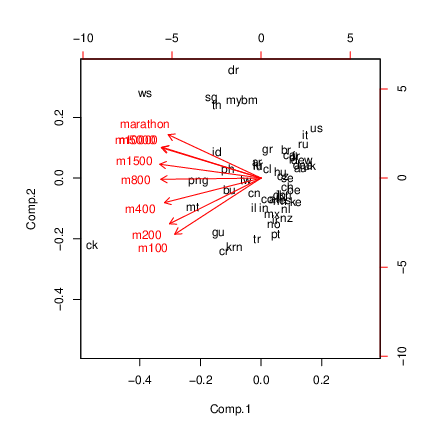


## Comments on biplot


* Had to do some pre-work to interpret PC plot. Biplot more self-contained.

* All variable arrows point left; countries on left have large
(bad) record times overall, countries on right good overall.

* Variable arrows extend negatively as well. Top left = bad at
distance running, bottom right = good at distance running.

* Bottom left = bad at sprinting, top right = good at
sprinting.

* Doesn't require so much pre-interpretation of components.


## How do I know which country is which?
Need to look up two-letter abbreviations in ISO table, eg. for best
8 running countries:

```r
d %>%
  arrange(desc(Comp.1)) %>%
  left_join(iso, by = c("country" = "ISO2")) %>%
  select(Comp.1, country, Country) %>%
  slice(1:8)
```

```
## [conflicted] `arrange` found in 2 packages.
## Either pick the one you want with `::` 
## * plyr::arrange
## * dplyr::arrange
## Or declare a preference with `conflict_prefer()`
## * conflict_prefer("arrange", "plyr")
## * conflict_prefer("arrange", "dplyr")
```

   


## Best 8 running countries

```r
d %>%
  arrange(Comp.1) %>%
  left_join(iso, by = c("country" = "ISO2")) %>%
  select(Comp.1, country, Country) %>%
  slice(1:8)
```

```
## [conflicted] `arrange` found in 2 packages.
## Either pick the one you want with `::` 
## * plyr::arrange
## * dplyr::arrange
## Or declare a preference with `conflict_prefer()`
## * conflict_prefer("arrange", "plyr")
## * conflict_prefer("arrange", "dplyr")
```

   


## Worst 8 running countries

```r
d %>%
  arrange(desc(Comp.1)) %>%
  left_join(iso, by = c("country" = "ISO2")) %>%
  select(Comp.1, country, Country) %>%
  slice(1:8)
```

```
## [conflicted] `arrange` found in 2 packages.
## Either pick the one you want with `::` 
## * plyr::arrange
## * dplyr::arrange
## Or declare a preference with `conflict_prefer()`
## * conflict_prefer("arrange", "plyr")
## * conflict_prefer("arrange", "dplyr")
```

   


## Better at distance running

```r
d %>%
  arrange(desc(Comp.2)) %>%
  left_join(iso, by = c("country" = "ISO2")) %>%
  select(Comp.2, country, Country) %>%
  slice(1:8)
```

```
## [conflicted] `arrange` found in 2 packages.
## Either pick the one you want with `::` 
## * plyr::arrange
## * dplyr::arrange
## Or declare a preference with `conflict_prefer()`
## * conflict_prefer("arrange", "plyr")
## * conflict_prefer("arrange", "dplyr")
```

   

## Better at sprinting

```r
d %>%
  arrange(Comp.2) %>%
  left_join(iso, by = c("country" = "ISO2")) %>%
  select(Comp.2, country, Country) %>%
  slice(1:10)
```

```
## [conflicted] `arrange` found in 2 packages.
## Either pick the one you want with `::` 
## * plyr::arrange
## * dplyr::arrange
## Or declare a preference with `conflict_prefer()`
## * conflict_prefer("arrange", "plyr")
## * conflict_prefer("arrange", "dplyr")
```

   


## Plot with country names

```r
g <- d %>%
  left_join(iso, by = c("country" = "ISO2")) %>%
  select(Comp.1, Comp.2, Country) %>%
  ggplot(aes(x = Comp.1, y = Comp.2, label = Country)) +
  geom_point() + geom_text_repel(size = 1) +
  coord_fixed()
```

```
## Warning: Column `country`/`ISO2` joining factor and
## character vector, coercing into character vector
```

   


## The plot


```r
g
```


   


## Principal components from correlation matrix
Create data file like this:
\verbatiminput{cov.txt}
and read in like this:

```r
my_url <- "http://www.utsc.utoronto.ca/~butler/d29/cov.txt"
mat <- read_table(my_url, col_names = F)
mat
```

```
## # A tibble: 3 x 3
##       X1     X2     X3
##    <dbl>  <dbl>  <dbl>
## 1  1      0.970 -0.96 
## 2  0.970  1     -0.998
## 3 -0.96  -0.998  1
```

   


## Pre-processing
A little pre-processing required:


* Turn into matrix (from data frame)

* Feed into `princomp` as `covmat=`


```r
mat.pc <- mat %>%
  as.matrix() %>%
  princomp(covmat = .)
```

   


## Scree plot: one component fine


```r
ggscreeplot(mat.pc)
```


  
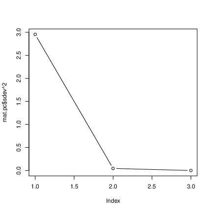
    


## Component loadings
\begin{minipage}[t]{0.6\linewidth}
Compare correlation matrix:


```r
mat
```

```
## # A tibble: 3 x 3
##       X1     X2     X3
##    <dbl>  <dbl>  <dbl>
## 1  1      0.970 -0.96 
## 2  0.970  1     -0.998
## 3 -0.96  -0.998  1
```

  

with component loadings


```r
mat.pc$loadings
```

```
## 
## Loadings:
##    Comp.1 Comp.2 Comp.3
## X1  0.573  0.812  0.112
## X2  0.581 -0.306 -0.755
## X3 -0.578  0.498 -0.646
## 
##                Comp.1 Comp.2 Comp.3
## SS loadings     1.000  1.000  1.000
## Proportion Var  0.333  0.333  0.333
## Cumulative Var  0.333  0.667  1.000
```
$
\end{minipage}
\begin{minipage}[t]{0.37\linewidth}


* When X1 large, X2 also large, X3 small.

* Then `comp.1` *negative*.

* When X1 small, X2 small, X3 large.

* Then `comp.1` *positive*.

\end{minipage}

## No scores


* With correlation matrix rather than data, no component scores

* So no principal component plot

* and no biplot. 


   


 


\section{Exploratory factor analysis}
\frame{\sectionpage}
## Principal components and factor analysis


* Principal components: 


* Purely mathematical.

* Find eigenvalues, eigenvectors of correlation matrix.

* No testing whether observed components reproducible, or even probability model behind it.


* Factor analysis: 


* some way towards fixing this (get test of appropriateness)

* In factor analysis, each variable modelled as: "common factor" (eg. verbal ability) and "specific factor" (left over).

* Choose the common factors to "best" reproduce pattern seen in correlation matrix.

* Iterative procedure, different answer from principal components.


## Packages

```r
library(lavaan) # confirmatory factor analysis
library(ggbiplot)
library(tidyverse)
```

   


## Example


* 
145 children given 5 tests, called PARA, SENT, WORD, ADD and DOTS. 3 linguistic tasks (paragraph comprehension, sentence completion  and word meaning), 2 mathematical ones (addition and counting dots).

* Correlation matrix of scores on the tests:


```

para 1     0.722 0.714 0.203 0.095
sent 0.722 1     0.685 0.246 0.181
word 0.714 0.685 1     0.170 0.113
add  0.203 0.246 0.170 1     0.585
dots 0.095 0.181 0.113 0.585 1

```


* Is there small number of underlying "constructs" (unobservable) that explains this pattern of correlations?


## To start: principal components

Using correlation matrix:


```r
my_url <- "http://www.utsc.utoronto.ca/~butler/d29/rex2.txt"
kids <- read_delim(my_url, " ")
kids
```

```
## # A tibble: 5 x 6
##   test   para  sent  word   add  dots
##   <chr> <dbl> <dbl> <dbl> <dbl> <dbl>
## 1 para  1     0.722 0.714 0.203 0.095
## 2 sent  0.722 1     0.685 0.246 0.181
## 3 word  0.714 0.685 1     0.17  0.113
## 4 add   0.203 0.246 0.17  1     0.585
## 5 dots  0.095 0.181 0.113 0.585 1
```

```r
kids.pc <- kids %>%
  select_if(is.numeric) %>%
  as.matrix() %>%
  princomp(covmat = .)
```

 


## Scree plot

```r
ggscreeplot(kids.pc)
```


   


## Principal component results


* Need 2 components. Loadings:

```r
kids.pc$loadings
```

```
## 
## Loadings:
##      Comp.1 Comp.2 Comp.3 Comp.4 Comp.5
## para  0.534  0.245  0.114         0.795
## sent  0.542  0.164         0.660 -0.489
## word  0.523  0.247 -0.144 -0.738 -0.316
## add   0.297 -0.627  0.707              
## dots  0.241 -0.678 -0.680         0.143
## 
##                Comp.1 Comp.2 Comp.3 Comp.4 Comp.5
## SS loadings       1.0    1.0    1.0    1.0    1.0
## Proportion Var    0.2    0.2    0.2    0.2    0.2
## Cumulative Var    0.2    0.4    0.6    0.8    1.0
```


* First component has a bit of everything, though especially the
first three tests.

* Second component rather more clearly `add` and `dots`.

* No scores, plots since no actual data.


## Factor analysis


* Specify number of factors first, get solution with exactly
that many factors.

* Includes hypothesis test, need to specify how many children
wrote the tests.

* Works from correlation matrix via `covmat` or actual
data, like `princomp`.

* Introduces extra feature, *rotation*, to make
interpretation of loadings (factor-variable relation) easier.


## Factor analysis for the kids data


* Create "covariance list" to include number of children who
wrote the tests.

* Feed this into `factanal`, specifying how many factors (2).


```r
km <- kids %>%
  select_if(is.numeric) %>%
  as.matrix()
km2 <- list(cov = km, n.obs = 145)
kids.f2 <- factanal(factors = 2, covmat = km2)
```

   


## Uniquenesses


```r
kids.f2$uniquenesses
```

```
##      para      sent      word       add      dots 
## 0.2424457 0.2997349 0.3272312 0.5743568 0.1554076
```
$


* Uniquenesses say how "unique" a variable is (size of
specific factor). Small
uniqueness means that the variable is summarized by a factor (good).

* Mildly worried by how large `add`'s uniqueness is.

* Also see "communality" for this, where *large* is good.


## Loadings
\begin{minipage}[t]{0.58\linewidth}


```r
kids.f2$loadings
```

```
## 
## Loadings:
##      Factor1 Factor2
## [1,] 0.867          
## [2,] 0.820   0.166  
## [3,] 0.816          
## [4,] 0.167   0.631  
## [5,]         0.918  
## 
##                Factor1 Factor2
## SS loadings      2.119   1.282
## Proportion Var   0.424   0.256
## Cumulative Var   0.424   0.680
```
$
\end{minipage}
\begin{minipage}[t]{0.40\linewidth}


* Loadings show how each factor depends on variables. Blanks
indicate "small", less than 0.1.

* Factor 1 clearly the "linguistic" tasks, factor 2 clearly
the "mathematical" ones.

* Two factors together explain 68\% of variability (like
regression R-squared).
    
\end{minipage}

## Are 2 factors enough?

```r
kids.f2$STATISTIC
```

```
## objective 
## 0.5810578
```

```r
kids.f2$dof
```

```
## [1] 1
```

```r
kids.f2$PVAL
```

```
## objective 
##  0.445898
```

   

P-value not small, so 2 factors OK.


## 1 factor


```r
kids.f1 <- factanal(factors = 1, covmat = km2)
kids.f1$STATISTIC
```

```
## objective 
##  58.16534
```

```r
kids.f1$dof
```

```
## [1] 5
```

```r
kids.f1$PVAL
```

```
##    objective 
## 2.907856e-11
```

   

1 factor rejected (P-value small). Definitely need more than 1.


## Track running records revisited


```r
g2
```


   


## Benefit of rotation


* 100m and marathon arrows almost perpendicular, but components
don't match anything much:


* sprinting: top left and bottom right

* distance running: bottom left and top right.


* Can we arrange things so that components (factors) correspond
to something meaningful?


## Track records by factor analysis
Obtain factor scores (have actual data):

```r
track
```

```
## # A tibble: 55 x 9
##     m100  m200  m400  m800 m1500 m5000 m10000 marathon
##    <dbl> <dbl> <dbl> <dbl> <dbl> <dbl>  <dbl>    <dbl>
##  1  10.4  20.8  46.8  1.81  3.7   14.0   29.4     138.
##  2  10.3  20.1  44.8  1.74  3.57  13.3   27.7     128.
##  3  10.4  20.8  46.8  1.79  3.6   13.3   27.7     136.
##  4  10.3  20.7  45.0  1.73  3.6   13.2   27.4     130.
##  5  10.3  20.6  45.9  1.8   3.75  14.7   30.6     147.
##  6  10.2  20.4  45.2  1.73  3.66  13.6   28.6     133.
##  7  10.6  21.5  48.3  1.8   3.85  14.4   30.3     140.
##  8  10.2  20.2  45.7  1.76  3.63  13.6   28.1     130.
##  9  10.3  20.8  46.2  1.79  3.71  13.6   29.3     134.
## 10  10.5  21.0  47.3  1.81  3.73  13.9   29.1     134.
## # … with 45 more rows, and 1 more variable: country <chr>
```

```r
track.f <- track %>%
  select_if(is.numeric) %>%
  factanal(2, scores = "r")
```

   


## Track data biplot
Not so nice-looking:  

```r
biplot(track.f$scores, track.f$loadings,
  xlabs = track$country
)
```


   


## Comments


* This time 100m "up" (factor 2), marathon "right" (factor 1).

* Countries most negative on factor 2 good at sprinting.

* Countries most negative on factor 1 good at distance running.


## Rotated factor loadings
{\small

```r
track.f$loadings
```

```
## 
## Loadings:
##          Factor1 Factor2
## m100     0.291   0.914  
## m200     0.382   0.882  
## m400     0.543   0.744  
## m800     0.691   0.622  
## m1500    0.799   0.530  
## m5000    0.901   0.394  
## m10000   0.907   0.399  
## marathon 0.915   0.278  
## 
##                Factor1 Factor2
## SS loadings      4.112   3.225
## Proportion Var   0.514   0.403
## Cumulative Var   0.514   0.917
```
def 
}


\begin{frame}[fragile]{Which countries are good at sprinting or
distance running?}
Make a data frame with the countries and scores in:


```r
scores <- data.frame(
  country = track$country,
  track.f$scores
)
scores %>% slice(1:6)
```

```
##   country     Factor1    Factor2
## 1      ar  0.33633782 -0.2651512
## 2      au -0.49395787 -0.8121335
## 3      at -0.74199914  0.1764151
## 4      be -0.79602754 -0.2388525
## 5      bm  1.46541593 -1.1704466
## 6      br  0.07780163 -0.8871291
```

 


## The best sprinting countries
Most negative on factor 2:  


```r
scores %>%
  arrange(Factor2) %>%
  left_join(iso, by = c("country" = "ISO2")) %>%
  select(Country, Factor1, Factor2) %>%
  slice(1:10)
```

```
## [conflicted] `arrange` found in 2 packages.
## Either pick the one you want with `::` 
## * dplyr::arrange
## * plyr::arrange
## Or declare a preference with `conflict_prefer()`
## * conflict_prefer("arrange", "dplyr")
## * conflict_prefer("arrange", "plyr")
```

 


## The best distance-running countries
Most negative on factor 1:


```r
scores %>%
  arrange(Factor1) %>%
  left_join(iso, by = c("country" = "ISO2")) %>%
  select(Country, Factor1, Factor2) %>%
  slice(1:10)
```

```
## [conflicted] `arrange` found in 2 packages.
## Either pick the one you want with `::` 
## * dplyr::arrange
## * plyr::arrange
## Or declare a preference with `conflict_prefer()`
## * conflict_prefer("arrange", "dplyr")
## * conflict_prefer("arrange", "plyr")
```

 

## A bigger example: BEM sex role inventory


* 369 women asked to rate themselves on 60 traits, like "self-reliant" or "shy".

* Rating 1 "never or almost never true of me" to 7 ``always or
almost always true of me''.

* 60 personality traits is a lot. Can we find a smaller number
of factors that capture aspects of personality?

* The whole BEM sex role inventory on next page.


## The whole inventory


## Some of the data


```r
my_url <- "http://www.utsc.utoronto.ca/~butler/d29/factor.txt"
bem <- read_tsv(my_url)
bem
```

```
## # A tibble: 369 x 45
##    subno helpful reliant defbel yielding cheerful indpt
##    <dbl>   <dbl>   <dbl>  <dbl>    <dbl>    <dbl> <dbl>
##  1     1       7       7      5        5        7     7
##  2     2       5       6      6        6        2     3
##  3     3       7       6      4        4        5     5
##  4     4       6       6      7        4        6     6
##  5     5       6       6      7        4        7     7
##  6     7       5       6      7        4        6     6
##  7     8       6       4      6        6        6     3
##  8     9       7       6      7        5        6     7
##  9    10       7       6      6        4        4     5
## 10    11       7       4      7        4        7     5
## # … with 359 more rows, and 38 more variables:
## #   athlet <dbl>, shy <dbl>, assert <dbl>, strpers <dbl>,
## #   forceful <dbl>, affect <dbl>, flatter <dbl>,
## #   loyal <dbl>, analyt <dbl>, feminine <dbl>,
## #   sympathy <dbl>, moody <dbl>, sensitiv <dbl>,
## #   undstand <dbl>, compass <dbl>, leaderab <dbl>,
## #   soothe <dbl>, risk <dbl>, decide <dbl>, selfsuff <dbl>,
## #   conscien <dbl>, dominant <dbl>, masculin <dbl>,
## #   stand <dbl>, happy <dbl>, softspok <dbl>, warm <dbl>,
## #   truthful <dbl>, tender <dbl>, gullible <dbl>,
## #   leadact <dbl>, childlik <dbl>, individ <dbl>,
## #   foullang <dbl>, lovchil <dbl>, compete <dbl>,
## #   ambitiou <dbl>, gentle <dbl>
```

   


## Principal components first
\ldots to decide on number of factors:

```r
bem.pc <- bem %>%
  select(-subno) %>%
  princomp(cor = T)
```

   


## The scree plot

```r
g <- ggscreeplot(bem.pc)
g
```


 


* No obvious elbow.
  


## Zoom in to search for elbow

```r
g + scale_x_continuous(limits = c(0, 8))
```


Possible elbows at 3 (2 factors) and 6 (5).


## but is 2 really good?
{\scriptsize

```r
summary(bem.pc)
```

```
## Importance of components:
##                           Comp.1    Comp.2     Comp.3
## Standard deviation     2.7444993 2.2405789 1.55049106
## Proportion of Variance 0.1711881 0.1140953 0.05463688
## Cumulative Proportion  0.1711881 0.2852834 0.33992029
##                            Comp.4     Comp.5     Comp.6
## Standard deviation     1.43886350 1.30318840 1.18837867
## Proportion of Variance 0.04705291 0.03859773 0.03209645
## Cumulative Proportion  0.38697320 0.42557093 0.45766738
##                            Comp.7     Comp.8     Comp.9
## Standard deviation     1.15919129 1.07838912 1.07120568
## Proportion of Variance 0.03053919 0.02643007 0.02607913
## Cumulative Proportion  0.48820657 0.51463664 0.54071577
##                           Comp.10    Comp.11    Comp.12
## Standard deviation     1.04901318 1.03848656 1.00152287
## Proportion of Variance 0.02500974 0.02451033 0.02279655
## Cumulative Proportion  0.56572551 0.59023584 0.61303238
##                           Comp.13    Comp.14   Comp.15
## Standard deviation     0.97753974 0.95697572 0.9287543
## Proportion of Variance 0.02171782 0.02081369 0.0196042
## Cumulative Proportion  0.63475020 0.65556390 0.6751681
##                           Comp.16    Comp.17   Comp.18
## Standard deviation     0.92262649 0.90585705 0.8788668
## Proportion of Variance 0.01934636 0.01864948 0.0175547
## Cumulative Proportion  0.69451445 0.71316392 0.7307186
##                           Comp.19    Comp.20    Comp.21
## Standard deviation     0.86757525 0.84269120 0.83124925
## Proportion of Variance 0.01710652 0.01613928 0.01570398
## Cumulative Proportion  0.74782514 0.76396443 0.77966841
##                           Comp.22    Comp.23    Comp.24
## Standard deviation     0.80564654 0.78975423 0.78100835
## Proportion of Variance 0.01475151 0.01417527 0.01386305
## Cumulative Proportion  0.79441992 0.80859519 0.82245823
##                           Comp.25    Comp.26    Comp.27
## Standard deviation     0.77852606 0.74969868 0.74137885
## Proportion of Variance 0.01377506 0.01277382 0.01249188
## Cumulative Proportion  0.83623330 0.84900712 0.86149899
##                           Comp.28    Comp.29    Comp.30
## Standard deviation     0.72343693 0.71457305 0.70358645
## Proportion of Variance 0.01189457 0.01160488 0.01125077
## Cumulative Proportion  0.87339356 0.88499844 0.89624921
##                           Comp.31     Comp.32     Comp.33
## Standard deviation     0.69022738 0.654861232 0.640339974
## Proportion of Variance 0.01082759 0.009746437 0.009318984
## Cumulative Proportion  0.90707680 0.916823235 0.926142219
##                           Comp.34     Comp.35     Comp.36
## Standard deviation     0.63179848 0.616621295 0.602404917
## Proportion of Variance 0.00907203 0.008641405 0.008247538
## Cumulative Proportion  0.93521425 0.943855654 0.952103192
##                            Comp.37     Comp.38     Comp.39
## Standard deviation     0.570025368 0.560881809 0.538149460
## Proportion of Variance 0.007384748 0.007149736 0.006581928
## Cumulative Proportion  0.959487940 0.966637677 0.973219605
##                            Comp.40     Comp.41     Comp.42
## Standard deviation     0.530277613 0.512370708 0.505662309
## Proportion of Variance 0.006390781 0.005966449 0.005811236
## Cumulative Proportion  0.979610386 0.985576834 0.991388070
##                            Comp.43     Comp.44
## Standard deviation     0.480413465 0.384873772
## Proportion of Variance 0.005245389 0.003366541
## Cumulative Proportion  0.996633459 1.000000000
```

   
}


## Comments


* Want overall fraction of variance explained (``cumulative
proportion'') to be reasonably high.

* 2 factors, 28.5\%. Terrible!

* Even 56\% (10 factors) not that good!

* Have to live with that.


## Biplot


```r
ggbiplot(bem.pc, alpha = 0.3)
```


  


## Comments


* Ignore individuals for now.

* Most variables point to 10 o'clock or 7 o'clock.

* Suggests factor analysis with rotation will get interpretable
factors (rotate to 6 o'clock and 9 o'clock, for example).

* Try for 2-factor solution (rough interpretation, will be bad):


```r
bem.2 <- bem %>%
  select(-subno) %>%
  factanal(factors = 2)
```


* Show output in pieces (just print `bem.2` to see all of it).


## Uniquenesses

```r
bem.2$uniquenesses
```

```
##   helpful   reliant    defbel  yielding  cheerful     indpt 
## 0.7598223 0.7808058 0.7748448 0.8688473 0.8394916 0.7282742 
##    athlet       shy    assert   strpers  forceful    affect 
## 0.9229702 0.8239496 0.6329347 0.5679398 0.5631857 0.6616625 
##   flatter     loyal    analyt  feminine  sympathy     moody 
## 0.9409500 0.8035264 0.8968744 0.8829927 0.7231450 0.9730607 
##  sensitiv  undstand   compass  leaderab    soothe      risk 
## 0.8018851 0.6194392 0.5937073 0.4091894 0.6596103 0.7789761 
##    decide  selfsuff  conscien  dominant  masculin     stand 
## 0.6938578 0.7210246 0.7974820 0.4942909 0.8453368 0.6024001 
##     happy  softspok      warm  truthful    tender  gullible 
## 0.8008966 0.8339058 0.4764762 0.8889983 0.4928919 0.9583435 
##   leadact  childlik   individ  foullang   lovchil   compete 
## 0.4166153 0.9800360 0.7941998 0.9821662 0.8924392 0.7942910 
##  ambitiou    gentle 
## 0.8101599 0.5064551
```

   


* Mostly high or very high (bad).

* Some smaller, eg.:
Leadership ability (0.409),
Acts like leader (0.417),
Warm (0.476),
Tender (0.493).

* Smaller uniquenesses captured by one of our two factors.


## Factor loadings, some


```r
bem.2$loadings
```

```
## 
## Loadings:
##          Factor1 Factor2
## helpful   0.314   0.376 
## reliant   0.453   0.117 
## defbel    0.434   0.193 
## yielding -0.131   0.338 
## cheerful  0.152   0.371 
## indpt     0.521         
## athlet    0.267         
## shy      -0.414         
## assert    0.605         
## strpers   0.657         
## forceful  0.649  -0.126 
## affect    0.178   0.554 
## flatter           0.223 
## loyal     0.151   0.417 
## analyt    0.295   0.127 
## feminine  0.113   0.323 
## sympathy          0.526 
## moody            -0.162 
## sensitiv  0.135   0.424 
## undstand          0.610 
## compass   0.114   0.627 
## leaderab  0.765         
## soothe            0.580 
## risk      0.442   0.161 
## decide    0.542   0.113 
## selfsuff  0.511   0.134 
## conscien  0.328   0.308 
## dominant  0.668  -0.245 
## masculin  0.276  -0.280 
## stand     0.607   0.172 
## happy     0.119   0.430 
## softspok -0.230   0.336 
## warm              0.719 
## truthful  0.109   0.315 
## tender            0.710 
## gullible -0.153   0.135 
## leadact   0.763         
## childlik -0.101         
## individ   0.445         
## foullang          0.133 
## lovchil           0.327 
## compete   0.450         
## ambitiou  0.414   0.137 
## gentle            0.702 
## 
##                Factor1 Factor2
## SS loadings      6.083   5.127
## Proportion Var   0.138   0.117
## Cumulative Var   0.138   0.255
```


## Making a data frame
There are too many to read easily, so make a data frame. This is a
bit tricky:

```r
loadings <- as.data.frame(unclass(bem.2$loadings)) %>%
  mutate(trait = rownames(bem.2$loadings))
```

```
## [conflicted] `mutate` found in 2 packages.
## Either pick the one you want with `::` 
## * dplyr::mutate
## * plyr::mutate
## Or declare a preference with `conflict_prefer()`
## * conflict_prefer("mutate", "dplyr")
## * conflict_prefer("mutate", "plyr")
```

```r
loadings %>% slice(1:10)
```

```
## Error in UseMethod("slice_"): no applicable method for 'slice_' applied to an object of class "function"
```

   


## Pick out the big ones on factor 1

Arbitrarily defining $>0.4$ or $<-0.4$ as "big":

```r
loadings %>% filter(abs(Factor1) > 0.4)
```

```
## Error in UseMethod("filter_"): no applicable method for 'filter_' applied to an object of class "function"
```


## Factor 2, the big ones

```r
loadings %>% filter(abs(Factor2) > 0.4)
```

```
## Error in UseMethod("filter_"): no applicable method for 'filter_' applied to an object of class "function"
```

   


## Plotting the two factors
A bi-plot, this time with the variables reduced in size. Looking for
unusual individuals.

Have to run `factanal` again to get factor scores for plotting.


```r
bem.2a <- factanal(bem[, -1], factors = 2, scores = "r")
biplot(bem.2a$scores, bem.2a$loadings, cex = c(0.5, 0.5))
```

 

Numbers on plot are row numbers of `bem`
data frame.


## The (awful) biplot

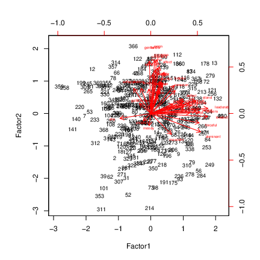
 


 


## Comments


* Variables mostly up ("feminine") and right ("masculine"),
accomplished by rotation.

* Some unusual individuals: 311, 214 (low on factor 2), 366
(high on factor 2),
359, 258
(low on factor 1), 230 (high on factor 1).


## Individual 366
\begin{multicols}{2}

```r
bem %>% slice(366) %>% glimpse()
```

```
## Observations: 1
## Variables: 45
## $ subno    <dbl> 755
## $ helpful  <dbl> 7
## $ reliant  <dbl> 7
## $ defbel   <dbl> 5
## $ yielding <dbl> 7
## $ cheerful <dbl> 7
## $ indpt    <dbl> 7
## $ athlet   <dbl> 7
## $ shy      <dbl> 2
## $ assert   <dbl> 1
## $ strpers  <dbl> 3
## $ forceful <dbl> 1
## $ affect   <dbl> 7
## $ flatter  <dbl> 9
## $ loyal    <dbl> 7
## $ analyt   <dbl> 7
## $ feminine <dbl> 7
## $ sympathy <dbl> 7
## $ moody    <dbl> 1
## $ sensitiv <dbl> 7
## $ undstand <dbl> 7
## $ compass  <dbl> 6
## $ leaderab <dbl> 3
## $ soothe   <dbl> 7
## $ risk     <dbl> 7
## $ decide   <dbl> 7
## $ selfsuff <dbl> 7
## $ conscien <dbl> 7
## $ dominant <dbl> 1
## $ masculin <dbl> 1
## $ stand    <dbl> 7
## $ happy    <dbl> 7
## $ softspok <dbl> 7
## $ warm     <dbl> 7
## $ truthful <dbl> 7
## $ tender   <dbl> 7
## $ gullible <dbl> 1
## $ leadact  <dbl> 2
## $ childlik <dbl> 1
## $ individ  <dbl> 5
## $ foullang <dbl> 7
## $ lovchil  <dbl> 7
## $ compete  <dbl> 7
## $ ambitiou <dbl> 7
## $ gentle   <dbl> 7
```

 


* High on factor 2, but hard to see which traits should have high scores
(unless we remember).

* Idea: *tidy* original data frame to make easier to look
things up.

\end{multicols}


## Tidying original data

```r
bem_tidy <- bem %>%
  mutate(row = row_number()) %>%
  gather(trait, score, c(-subno, -row))
```

```
## [conflicted] `mutate` found in 2 packages.
## Either pick the one you want with `::` 
## * dplyr::mutate
## * plyr::mutate
## Or declare a preference with `conflict_prefer()`
## * conflict_prefer("mutate", "dplyr")
## * conflict_prefer("mutate", "plyr")
```

```r
bem_tidy
```

```
## Error in eval(expr, envir, enclos): object 'bem_tidy' not found
```

   


## Recall data frame of loadings

```r
loadings %>% slice(1:10)
```

```
## Error in UseMethod("slice_"): no applicable method for 'slice_' applied to an object of class "function"
```

   

Want to add the factor scores for each trait to our tidy data frame
`bem_tidy`. This is a left-join (over), matching on the column
`trait` that is in both data frames (thus, the default):


## Looking up loadings

```r
bem_tidy <- bem_tidy %>% left_join(loadings)
```

```
## Error in eval(lhs, parent, parent): object 'bem_tidy' not found
```

```r
bem_tidy %>% sample_n(12)
```

```
## Error in eval(lhs, parent, parent): object 'bem_tidy' not found
```

   


## Individual 366, high on Factor 2
So now pick out the rows of the tidy data frame that belong to
individual 366 (`row=366`) and for which the `Factor2`
score exceeds 0.4 in absolute value (our "big" from before):


```r
bem_tidy %>% filter(row == 366, abs(Factor2) > 0.4)
```

```
## Error in eval(lhs, parent, parent): object 'bem_tidy' not found
```

 
As expected, high scorer on these.


## Several individuals
Rows 311 and 214 were *low* on Factor 2, so their scores should
be low. Can we do them all at once?

```r
bem_tidy %>% filter(
  row %in% c(366, 311, 214),
  abs(Factor2) > 0.4
)
```

```
## Error in eval(lhs, parent, parent): object 'bem_tidy' not found
```

   

Can we display each individual in own column?


## Individual by column
Un-`tidy`, that is, `spread`:


```r
bem_tidy %>%
  filter(
    row %in% c(366, 311, 214),
    abs(Factor2) > 0.4
  ) %>%
  select(-subno, -Factor1, -Factor2) %>%
  spread(row, score)
```

```
## Error in eval(lhs, parent, parent): object 'bem_tidy' not found
```

 
366 high, 311 middling, 214 (sometimes) low.


## Individuals 230, 258, 359
These were high, low, low on factor 1. Adapt code:

```r
bem_tidy %>%
  filter(row %in% c(359, 258, 230), abs(Factor1) > 0.4) %>%
  select(-subno, -Factor1, -Factor2) %>%
  spread(row, score)
```

```
## Error in eval(lhs, parent, parent): object 'bem_tidy' not found
```

 


## Is 2 factors enough?
Suspect not:

```r
bem.2$PVAL
```

```
##     objective 
## 1.458183e-150
```

   

2 factors resoundingly rejected. Need more. Have to go all the way to
15 factors to not reject:


```r
bem.15 <- bem %>%
  select(-subno) %>%
  factanal(factors = 15)
bem.15$PVAL
```

```
## objective 
##  0.132617
```

 

Even then, only just over 50\% of variability explained.

Let's have a look at the important things in those 15 factors.


## Get factor loadings
into a data frame, as before:  

```r
loadings <- as.data.frame(unclass(bem.15$loadings)) %>%
  mutate(trait = rownames(bem.15$loadings))
```

```
## [conflicted] `mutate` found in 2 packages.
## Either pick the one you want with `::` 
## * dplyr::mutate
## * plyr::mutate
## Or declare a preference with `conflict_prefer()`
## * conflict_prefer("mutate", "dplyr")
## * conflict_prefer("mutate", "plyr")
```

   

then show the highest few loadings on each factor.


## Factor 1

```r
loadings %>%
  arrange(desc(abs(Factor1))) %>%
  select(Factor1, trait) %>%
  slice(1:10)
```

```
## [conflicted] `arrange` found in 2 packages.
## Either pick the one you want with `::` 
## * dplyr::arrange
## * plyr::arrange
## Or declare a preference with `conflict_prefer()`
## * conflict_prefer("arrange", "dplyr")
## * conflict_prefer("arrange", "plyr")
```

   
Compassionate, understanding, sympathetic, soothing: thoughtful of
others. 


## Factor 2

```r
loadings %>%
  arrange(desc(abs(Factor2))) %>%
  select(Factor2, trait) %>%
  slice(1:10)
```

```
## [conflicted] `arrange` found in 2 packages.
## Either pick the one you want with `::` 
## * dplyr::arrange
## * plyr::arrange
## Or declare a preference with `conflict_prefer()`
## * conflict_prefer("arrange", "dplyr")
## * conflict_prefer("arrange", "plyr")
```

   

Strong personality, forceful, assertive, dominant: getting ahead. 


## Factor 3

```r
loadings %>%
  arrange(desc(abs(Factor3))) %>%
  select(Factor3, trait) %>%
  slice(1:10)
```

```
## [conflicted] `arrange` found in 2 packages.
## Either pick the one you want with `::` 
## * dplyr::arrange
## * plyr::arrange
## Or declare a preference with `conflict_prefer()`
## * conflict_prefer("arrange", "dplyr")
## * conflict_prefer("arrange", "plyr")
```

   

Self-reliant, self-sufficient, independent: going it alone.


## Factor 4

```r
loadings %>%
  arrange(desc(abs(Factor4))) %>%
  select(Factor4, trait) %>%
  slice(1:10)
```

```
## [conflicted] `arrange` found in 2 packages.
## Either pick the one you want with `::` 
## * dplyr::arrange
## * plyr::arrange
## Or declare a preference with `conflict_prefer()`
## * conflict_prefer("arrange", "dplyr")
## * conflict_prefer("arrange", "plyr")
```

   

Gentle, tender, warm (affectionate): caring for others.


## Factor 5

```r
loadings %>%
  arrange(desc(abs(Factor5))) %>%
  select(Factor5, trait) %>%
  slice(1:10)
```

```
## [conflicted] `arrange` found in 2 packages.
## Either pick the one you want with `::` 
## * dplyr::arrange
## * plyr::arrange
## Or declare a preference with `conflict_prefer()`
## * conflict_prefer("arrange", "dplyr")
## * conflict_prefer("arrange", "plyr")
```

   

Ambitious, competitive (with a bit of risk-taking and individualism):
Being the best.


## Factor 6

```r
loadings %>%
  arrange(desc(abs(Factor6))) %>%
  select(Factor6, trait) %>%
  slice(1:10)
```

```
## [conflicted] `arrange` found in 2 packages.
## Either pick the one you want with `::` 
## * dplyr::arrange
## * plyr::arrange
## Or declare a preference with `conflict_prefer()`
## * conflict_prefer("arrange", "dplyr")
## * conflict_prefer("arrange", "plyr")
```

   

Acts like a leader, leadership ability (with a bit of Dominant):
Taking charge.


## Factor 7

```r
loadings %>%
  arrange(desc(abs(Factor7))) %>%
  select(Factor7, trait) %>%
  slice(1:10)
```

```
## [conflicted] `arrange` found in 2 packages.
## Either pick the one you want with `::` 
## * dplyr::arrange
## * plyr::arrange
## Or declare a preference with `conflict_prefer()`
## * conflict_prefer("arrange", "dplyr")
## * conflict_prefer("arrange", "plyr")
```

   

Acts like a leader, leadership ability (with a bit of Dominant):
Taking charge.


## Factor 8

```r
loadings %>%
  arrange(desc(abs(Factor8))) %>%
  select(Factor8, trait) %>%
  slice(1:10)
```

```
## [conflicted] `arrange` found in 2 packages.
## Either pick the one you want with `::` 
## * dplyr::arrange
## * plyr::arrange
## Or declare a preference with `conflict_prefer()`
## * conflict_prefer("arrange", "dplyr")
## * conflict_prefer("arrange", "plyr")
```

   
Affectionate, flattering: Making others feel good.


## Factor 9

```r
loadings %>%
  arrange(desc(abs(Factor9))) %>%
  select(Factor9, trait) %>%
  slice(1:10)
```

```
## [conflicted] `arrange` found in 2 packages.
## Either pick the one you want with `::` 
## * dplyr::arrange
## * plyr::arrange
## Or declare a preference with `conflict_prefer()`
## * conflict_prefer("arrange", "dplyr")
## * conflict_prefer("arrange", "plyr")
```

   

Taking a stand.


## Factor 10

```r
loadings %>%
  arrange(desc(abs(Factor10))) %>%
  select(Factor10, trait) %>%
  slice(1:10)
```

```
## [conflicted] `arrange` found in 2 packages.
## Either pick the one you want with `::` 
## * dplyr::arrange
## * plyr::arrange
## Or declare a preference with `conflict_prefer()`
## * conflict_prefer("arrange", "dplyr")
## * conflict_prefer("arrange", "plyr")
```

   

Feminine. (A little bit of not-masculine!)


## Factor 11

```r
loadings %>%
  arrange(desc(abs(Factor11))) %>%
  select(Factor11, trait) %>%
  slice(1:10)
```

```
## [conflicted] `arrange` found in 2 packages.
## Either pick the one you want with `::` 
## * dplyr::arrange
## * plyr::arrange
## Or declare a preference with `conflict_prefer()`
## * conflict_prefer("arrange", "dplyr")
## * conflict_prefer("arrange", "plyr")
```

   

Loyal.


## Factor 12

```r
loadings %>%
  arrange(desc(abs(Factor12))) %>%
  select(Factor12, trait) %>%
  slice(1:10)
```

```
## [conflicted] `arrange` found in 2 packages.
## Either pick the one you want with `::` 
## * dplyr::arrange
## * plyr::arrange
## Or declare a preference with `conflict_prefer()`
## * conflict_prefer("arrange", "dplyr")
## * conflict_prefer("arrange", "plyr")
```

   

Childlike. (With a bit of moody, shy, not-self-sufficient, not-conscientious.)


## Factor 13

```r
loadings %>%
  arrange(desc(abs(Factor13))) %>%
  select(Factor13, trait) %>%
  slice(1:10)
```

```
## [conflicted] `arrange` found in 2 packages.
## Either pick the one you want with `::` 
## * dplyr::arrange
## * plyr::arrange
## Or declare a preference with `conflict_prefer()`
## * conflict_prefer("arrange", "dplyr")
## * conflict_prefer("arrange", "plyr")
```

   

Truthful. (With a bit of happy and not-gullible.)


## Factor 14

```r
loadings %>%
  arrange(desc(abs(Factor14))) %>%
  select(Factor14, trait) %>%
  slice(1:10)
```

```
## [conflicted] `arrange` found in 2 packages.
## Either pick the one you want with `::` 
## * dplyr::arrange
## * plyr::arrange
## Or declare a preference with `conflict_prefer()`
## * conflict_prefer("arrange", "dplyr")
## * conflict_prefer("arrange", "plyr")
```

   

Decisive. (With a bit of self-sufficient and not-soft-spoken.)


## Factor 15

```r
loadings %>%
  arrange(desc(abs(Factor15))) %>%
  select(Factor15, trait) %>%
  slice(1:10)
```

```
## [conflicted] `arrange` found in 2 packages.
## Either pick the one you want with `::` 
## * dplyr::arrange
## * plyr::arrange
## Or declare a preference with `conflict_prefer()`
## * conflict_prefer("arrange", "dplyr")
## * conflict_prefer("arrange", "plyr")
```

   

Not-compassionate, athletic, sensitive: A mixed bag. ("Cares about self"?)


## Anything left out? Uniquenesses

```r
data.frame(uniq = bem.15$uniquenesses) %>%
  rownames_to_column() %>%
  arrange(desc(uniq)) %>%
  slice(1:10)
```

```
## [conflicted] `arrange` found in 2 packages.
## Either pick the one you want with `::` 
## * dplyr::arrange
## * plyr::arrange
## Or declare a preference with `conflict_prefer()`
## * conflict_prefer("arrange", "dplyr")
## * conflict_prefer("arrange", "plyr")
```

   

Uses foul language especially, also loves children and analytical. So
could use even more factors.


\section{Confirmatory factor analysis}
\frame{\sectionpage}
## Confirmatory factor analysis


* Exploratory: what do data suggest as hidden underlying factors (in terms of variables observed)?

* Confirmatory: have {\em theory} about how underlying factors depend on observed variables; test whether theory supported by data:


* does theory provide {\em some} explanation (better than nothing)

* can we do better?


* Also can compare two theories about factors: is more complicated one significantly better than simpler one?


## Children and tests again


* Previously had this correlation matrix of test scores (based on 145
children):


```r
km
```

```
##       para  sent  word   add  dots
## [1,] 1.000 0.722 0.714 0.203 0.095
## [2,] 0.722 1.000 0.685 0.246 0.181
## [3,] 0.714 0.685 1.000 0.170 0.113
## [4,] 0.203 0.246 0.170 1.000 0.585
## [5,] 0.095 0.181 0.113 0.585 1.000
```
def 


* Will use package `lavaan` for confirmatory analysis.

* Can use actual data or correlation matrix.

* Latter (a bit) more work, as we see.


## Two or three steps


* Make sure correlation matrix (if needed) is handy.

* Specify factor model (from theory)

* Fit factor model: does it fit acceptably? 


## Specifying a factor model


* Jargon: thing you cannot observe called **latent variable**.

* Thing you *can* observe called **manifest variable**.

* Model predicts latent variables from manifest variables.

* Model with one factor including all the tests:

```r
test.model.1 <- "ability=~para+sent+word+add+dots"
```
def 


* and a model that we really believe, that there are two factors,
a verbal and a mathematical:

```r
test.model.2 <- "\nverbal=~para+sent+word\nmath=~add+dots"
```
def 

* Note the format: really all one line between single quotes, but
putting it on several lines makes the layout clearer.

* Also note special notation `=textasciitilde` for ``this latent
variable depends on these observed variables''.  


## Fitting a 1-factor model


* Need to specify model, correlation matrix, $n$ like this:


```r
fit1 <- cfa(test.model.1,
  sample.cov = km,
  sample.nobs = 145
)
```
def 


* Has `summary`, or briefer version like this:

```r
fit1
```

```
## lavaan 0.6-3 ended normally after 16 iterations
## 
##   Optimization method                           NLMINB
##   Number of free parameters                         10
## 
##   Number of observations                           145
## 
##   Estimator                                         ML
##   Model Fit Test Statistic                      59.886
##   Degrees of freedom                                 5
##   P-value (Chi-square)                           0.000
```
def 

* Test of fit: null "model fits" *rejected*. We can do better.


## Two-factor model

```r
fit2 <- cfa(test.model.2, sample.cov = km, sample.nobs = 145)
fit2
```

```
## lavaan 0.6-3 ended normally after 25 iterations
## 
##   Optimization method                           NLMINB
##   Number of free parameters                         11
## 
##   Number of observations                           145
## 
##   Estimator                                         ML
##   Model Fit Test Statistic                       2.951
##   Degrees of freedom                                 4
##   P-value (Chi-square)                           0.566
```
def 


* This fits OK: 2-factor model supported by the data.

* 1-factor model did not fit. We really need 2 factors.

* Same conclusion as from `factanal` earlier.


## Comparing models


* Use `anova` as if this were a regression:


```r
anova(fit1, fit2)
```

```
## Chi Square Difference Test
## 
##      Df    AIC    BIC   Chisq Chisq diff Df diff Pr(>Chisq)
## fit2  4 1776.7 1809.4  2.9509                              
## fit1  5 1831.6 1861.4 59.8862     56.935       1  4.504e-14
##         
## fit2    
## fit1 ***
## ---
## Signif. codes:  
## 0 '***' 0.001 '**' 0.01 '*' 0.05 '.' 0.1 ' ' 1
```
def 


* 2-factor model fits significantly better than 1-factor.

* No surprise!


## Track and field data, yet again


* `cfa` works easier on actual data, such as the running records:
{\small 


```r
track %>% print(n = 6)
```

```
## # A tibble: 55 x 9
##    m100  m200  m400  m800 m1500 m5000 m10000 marathon
##   <dbl> <dbl> <dbl> <dbl> <dbl> <dbl>  <dbl>    <dbl>
## 1  10.4  20.8  46.8  1.81  3.7   14.0   29.4     138.
## 2  10.3  20.1  44.8  1.74  3.57  13.3   27.7     128.
## 3  10.4  20.8  46.8  1.79  3.6   13.3   27.7     136.
## 4  10.3  20.7  45.0  1.73  3.6   13.2   27.4     130.
## 5  10.3  20.6  45.9  1.8   3.75  14.7   30.6     147.
## 6  10.2  20.4  45.2  1.73  3.66  13.6   28.6     133.
## # … with 49 more rows, and 1 more variable: country <chr>
```
def 
}


* Specify factor model. Factors seemed to be "sprinting" (up to
800m) and "distance running" (beyond):

```r
track.model <- "\nsprint=~m100+m200+m400+m800\ndistance=~m1500+m5000+m10000+marathon"
```
def 


## Fit and examine the model


* Fit the model. The observed variables are on different
scales, so we should standardize them first via `std.ov`:

```r
track.1 <- track %>%
  select(-country) %>%
  cfa(track.model, data = ., std.ov = T)
track.1
```

```
## lavaan 0.6-3 ended normally after 59 iterations
## 
##   Optimization method                           NLMINB
##   Number of free parameters                         17
## 
##   Number of observations                            55
## 
##   Estimator                                         ML
##   Model Fit Test Statistic                      87.608
##   Degrees of freedom                                19
##   P-value (Chi-square)                           0.000
```
def 


* This fits badly. Can we do better?

* Idea: move middle distance races (800m, 1500m) into a third factor.


## Factor model 2


* Define factor model:


```r
track.model.2 <- "\nsprint=~m100+m200+m400\nmiddle=~m800+m1500\ndistance=~m5000+m10000+marathon"
```
def 


* Fit and examine:

```r
track.2 <- track %>%
  select(-country) %>%
  cfa(track.model.2, data = ., std.ov = T)
track.2
```

```
## lavaan 0.6-3 ended normally after 72 iterations
## 
##   Optimization method                           NLMINB
##   Number of free parameters                         19
## 
##   Number of observations                            55
## 
##   Estimator                                         ML
##   Model Fit Test Statistic                      40.089
##   Degrees of freedom                                17
##   P-value (Chi-square)                           0.001
```
def 


* Fits  marginally better, though still badly.


## Comparing the two models


* Second model doesn't fit well, but is it better than first?
{\small    


```r
anova(track.1, track.2)
```

```
## Chi Square Difference Test
## 
##         Df    AIC    BIC  Chisq Chisq diff Df diff
## track.2 17 535.49 573.63 40.089                   
## track.1 19 579.01 613.13 87.608     47.519       2
##         Pr(>Chisq)    
## track.2               
## track.1  4.802e-11 ***
## ---
## Signif. codes:  
## 0 '***' 0.001 '**' 0.01 '*' 0.05 '.' 0.1 ' ' 1
```
def
}

* Oh yes, a lot better.


   


include time series notes here


\section{Multiway frequency tables}
\frame{\sectionpage}

## Packages

```r
library(tidyverse)
```

```
## ── Attaching packages ─────────────────── tidyverse 1.2.1 ──
```

```
## ✔ ggplot2 3.1.1          ✔ purrr   0.3.2     
## ✔ tibble  2.1.1          ✔ dplyr   0.8.0.1   
## ✔ tidyr   0.8.3.9000     ✔ stringr 1.4.0     
## ✔ readr   1.3.1          ✔ forcats 0.3.0
```

```
## Warning: package 'ggplot2' was built under R version 3.5.3
```

```
## Warning: package 'tibble' was built under R version 3.5.3
```

```
## Warning: package 'tidyr' was built under R version 3.5.3
```

```
## Warning: package 'readr' was built under R version 3.5.2
```

```
## Warning: package 'purrr' was built under R version 3.5.3
```

```
## Warning: package 'dplyr' was built under R version 3.5.2
```

```
## Warning: package 'stringr' was built under R version 3.5.2
```

```
## Warning: package 'forcats' was built under R version 3.5.1
```

```
## ── Conflicts ────────────────────── tidyverse_conflicts() ──
## ✖ dplyr::filter() masks stats::filter()
## ✖ dplyr::lag()    masks stats::lag()
```

   


## Multi-way frequency analysis


* A study of gender and eyewear-wearing finds the following frequencies:
\begin{tabular}{lrrr}
\hline
Gender & Contacts & Glasses & None \\
\hline
Female & 121 & 32 & 129 \\
Male & 42 & 37 & 85\\
\hline
\end{tabular}

* Is there association between eyewear and gender?

* Normally answer this with chisquare test (based on observed and expected frequencies from null hypothesis of no association).

* Two categorical variables and a frequency.

* We assess in way that generalizes to more categorical variables.


## The data file

```

gender contacts glasses none
female 121      32      129
male   42       37      85

```


* This is *not tidy!*

* Two variables are gender and *eyewear*, and those numbers
all frequencies.


```r
my_url <- "http://www.utsc.utoronto.ca/~butler/d29/eyewear.txt"
eyewear <- read_delim(my_url, " ")
eyewear
```

```
## # A tibble: 2 x 4
##   gender contacts glasses  none
##   <chr>     <dbl>   <dbl> <dbl>
## 1 female      121      32   129
## 2 male         42      37    85
```

   


## Tidying the data

```r
eyes <- eyewear %>%
  gather(eyewear, frequency, contacts:none)
eyes
```

```
## # A tibble: 6 x 3
##   gender eyewear  frequency
##   <chr>  <chr>        <dbl>
## 1 female contacts       121
## 2 male   contacts        42
## 3 female glasses         32
## 4 male   glasses         37
## 5 female none           129
## 6 male   none            85
```

```r
xt <- xtabs(frequency ~ gender + eyewear, data = eyes)
xt
```

```
##         eyewear
## gender   contacts glasses none
##   female      121      32  129
##   male         42      37   85
```

   

## Modelling


* Last table on previous page is "reconstituted" contingency table, for checking.

* Predict frequency from other factors and combos. `glm`
with `poisson` family.


```r
eyes.1 <- glm(frequency ~ gender * eyewear,
  data = eyes,
  family = "poisson"
)
```
def


* Called **log-linear model**.


## What can we get rid of?

{\small    

```r
drop1(eyes.1, test = "Chisq")
```

```
## Single term deletions
## 
## Model:
## frequency ~ gender * eyewear
##                Df Deviance    AIC    LRT  Pr(>Chi)    
## <none>               0.000 47.958                     
## gender:eyewear  2   17.829 61.787 17.829 0.0001345 ***
## ---
## Signif. codes:  
## 0 '***' 0.001 '**' 0.01 '*' 0.05 '.' 0.1 ' ' 1
```
def 
}


## Conclusions


* `drop1` says what we can remove at this
step. Significant = must stay.

* Cannot remove anything.

* Frequency depends on `gender-wear`
*combination*, cannot be simplified further.

* Gender and eyewear are *associated*.

* Stop here.


## `prop.table`
Original table:

{\footnotesize

```r
xt
```

```
##         eyewear
## gender   contacts glasses none
##   female      121      32  129
##   male         42      37   85
```

 
}
Calculate eg. row proportions like this:

{\small

```r
prop.table(xt, margin = 1)
```

```
##         eyewear
## gender    contacts   glasses      none
##   female 0.4290780 0.1134752 0.4574468
##   male   0.2560976 0.2256098 0.5182927
```

 
}


* `margin` says what to make add to 1.

* More females wear contacts and more males wear glasses.


## No association


* Suppose table had been as shown below:


```r
my_url <- "http://www.utsc.utoronto.ca/~butler/d29/eyewear2.txt"
eyewear2 <- read_table(my_url)
eyes2 <- eyewear2 %>% gather(eyewear, frequency, contacts:none)
xt2 <- xtabs(frequency ~ gender + eyewear, data = eyes2)
xt2
```

```
##         eyewear
## gender   contacts glasses none
##   female      150      30  120
##   male         75      16   62
```

```r
prop.table(xt2, margin = 1)
```

```
##         eyewear
## gender    contacts   glasses      none
##   female 0.5000000 0.1000000 0.4000000
##   male   0.4901961 0.1045752 0.4052288
```

   


* Females and males wear contacts and glasses in same proportions
(though more females and more contact-wearers). No
*association* between gender and eyewear.


## Analysis for revised data

```r
eyes.2 <- glm(frequency ~ gender * eyewear,
  data = eyes2,
  family = "poisson"
)
drop1(eyes.2, test = "Chisq")
```

```
## Single term deletions
## 
## Model:
## frequency ~ gender * eyewear
##                Df Deviance    AIC      LRT Pr(>Chi)
## <none>            0.000000 47.467                  
## gender:eyewear  2 0.047323 43.515 0.047323   0.9766
```

   

No longer any association. Take out interaction.


## No interaction
{\small

```r
eyes.3 <- update(eyes.2, . ~ . - gender:eyewear)
drop1(eyes.3, test = "Chisq")
```

```
## Single term deletions
## 
## Model:
## frequency ~ gender + eyewear
##         Df Deviance     AIC     LRT  Pr(>Chi)    
## <none>        0.047  43.515                      
## gender   1   48.624  90.091  48.577 3.176e-12 ***
## eyewear  2  138.130 177.598 138.083 < 2.2e-16 ***
## ---
## Signif. codes:  
## 0 '***' 0.001 '**' 0.01 '*' 0.05 '.' 0.1 ' ' 1
```

   
}


* More females (gender effect)

* more contact-wearers (eyewear
effect)

* no association (no interaction). 


## Chest pain, being overweight and being a smoker


* In a hospital emergency department, 176 subjects who attended
for acute chest pain took part in a study.

* Each subject had a
normal or abnormal electrocardiogram reading (ECG), were
overweight (as judged by BMI) or not, and were a smoker or
not.

* How are these three variables related, or not?


## The data
In modelling-friendly format:

```

ecg bmi smoke count
abnormal overweight yes 47
abnormal overweight no 10
abnormal normalweight yes 8 
abnormal normalweight no 6
normal overweight yes 25 
normal overweight no 15 
normal normalweight yes 35
normal normalweight no 30

```


## First step

```r
my_url <- "http://www.utsc.utoronto.ca/~butler/d29/ecg.txt"
chest <- read_delim(my_url, " ")
chest.1 <- glm(count ~ ecg * bmi * smoke,
  data = chest,
  family = "poisson"
)
drop1(chest.1, test = "Chisq")
```

```
## Single term deletions
## 
## Model:
## count ~ ecg * bmi * smoke
##               Df Deviance    AIC    LRT Pr(>Chi)
## <none>             0.0000 53.707                
## ecg:bmi:smoke  1   1.3885 53.096 1.3885   0.2387
```

   

That 3-way interaction comes out.


## Removing the 3-way interaction

```r
chest.2 <- update(chest.1, . ~ . - ecg:bmi:smoke)
drop1(chest.2, test = "Chisq")
```

```
## Single term deletions
## 
## Model:
## count ~ ecg + bmi + smoke + ecg:bmi + ecg:smoke + bmi:smoke
##           Df Deviance    AIC     LRT  Pr(>Chi)    
## <none>         1.3885 53.096                      
## ecg:bmi    1  29.0195 78.727 27.6310 1.468e-07 ***
## ecg:smoke  1   4.8935 54.601  3.5050   0.06119 .  
## bmi:smoke  1   4.4689 54.176  3.0803   0.07924 .  
## ---
## Signif. codes:  
## 0 '***' 0.001 '**' 0.01 '*' 0.05 '.' 0.1 ' ' 1
```

   

At $\alpha=0.05$, `bmi:smoke` comes out.


## Removing `bmi:smoke`

```r
chest.3 <- update(chest.2, . ~ . - bmi:smoke)
drop1(chest.3, test = "Chisq")
```

```
## Single term deletions
## 
## Model:
## count ~ ecg + bmi + smoke + ecg:bmi + ecg:smoke
##           Df Deviance    AIC    LRT  Pr(>Chi)    
## <none>          4.469 54.176                     
## ecg:bmi    1   36.562 84.270 32.094 1.469e-08 ***
## ecg:smoke  1   12.436 60.144  7.968  0.004762 ** 
## ---
## Signif. codes:  
## 0 '***' 0.001 '**' 0.01 '*' 0.05 '.' 0.1 ' ' 1
```

   

`ecg:smoke` has become significant. So we have to stop.


## Understanding the final model


* Thinking of `ecg` as "response" that might depend on
anything else.

* What is associated with `ecg`? Both `bmi` on its
own and `smoke` on its own, but *not* the combination
of both.

* `ecg:bmi` table:

```r
xtabs(count ~ ecg + bmi, data = chest)
```

```
##           bmi
## ecg        normalweight overweight
##   abnormal           14         57
##   normal             65         40
```

     


* Most normal weight people have a normal ECG, but a
majority of overweight people have an *abnormal* ECG. That is,
knowing about BMI says something about likely ECG.


## `ecg:smoke`


* `ecg:smoke` table:

```r
xtabs(count ~ ecg + smoke, data = chest)
```

```
##           smoke
## ecg        no yes
##   abnormal 16  55
##   normal   45  60
```

   


* Most nonsmokers have a normal ECG, but smokers are about 50--50
normal and abnormal ECG.

* Don't look at `smoke:bmi` table since not significant. 


## Simpson's paradox: the airlines example
\begin{tabular}{|l|rr|rr|}
\hline
& \multicolumn{2}{|c|}{Alaska Airlines} & 
\multicolumn{2}{|c|}{America West}\\
Airport & On time & Delayed & On time & Delayed\\
\hline
Los Angeles & 497 & 62 & 694 & 117\\
Phoenix & 221 & 12 & 4840 & 415\\
San Diego & 212 & 20 & 383 & 65\\
San Francisco & 503 & 102 & 320 & 129 \\
Seattle & 1841 & 305 & 201 & 61\\
\hline
Total & 3274 & 501 & 6438 & 787\\
\hline
\end{tabular}
\vspace{2ex}
Use `status` as variable name for "on time/delayed".


* Alaska: 13.3\% flights delayed ($501/(3274+501)$).

* America West: 10.9\% ($787/(6438+787)$).

* America West more punctual, right?


## Arranging the data


* Can only have single thing in columns, so we have to construct
column names like this:
\begin{small}

```

airport    aa_ontime aa_delayed aw_ontime aw_delayed
LosAngeles   497          62       694        117
Phoenix      221          12      4840        415
SanDiego     212          20       383         65
SanFrancisco 503         102       320        129
Seattle     1841         305       201         61

```

\end{small}

* Some tidying gets us the right layout, with frequencies all in
one column and the airline and delayed/on time status separated out:

```r
my_url <- "http://www.utsc.utoronto.ca/~butler/d29/airlines.txt"
airlines <- read_table2(my_url)
punctual <- airlines %>%
  gather(line.status, freq, contains("_")) %>%
  separate(line.status, c("airline", "status"))
```

     


## The data frame `punctual`


```
## # A tibble: 20 x 4
##    airport      airline status   freq
##    <chr>        <chr>   <chr>   <dbl>
##  1 LosAngeles   aa      ontime    497
##  2 Phoenix      aa      ontime    221
##  3 SanDiego     aa      ontime    212
##  4 SanFrancisco aa      ontime    503
##  5 Seattle      aa      ontime   1841
##  6 LosAngeles   aa      delayed    62
##  7 Phoenix      aa      delayed    12
##  8 SanDiego     aa      delayed    20
##  9 SanFrancisco aa      delayed   102
## 10 Seattle      aa      delayed   305
## 11 LosAngeles   aw      ontime    694
## 12 Phoenix      aw      ontime   4840
## 13 SanDiego     aw      ontime    383
## 14 SanFrancisco aw      ontime    320
## 15 Seattle      aw      ontime    201
## 16 LosAngeles   aw      delayed   117
## 17 Phoenix      aw      delayed   415
## 18 SanDiego     aw      delayed    65
## 19 SanFrancisco aw      delayed   129
## 20 Seattle      aw      delayed    61
```

   


## Proportions delayed by airline


* Two-step process: get appropriate subtable:

```r
xt <- xtabs(freq ~ airline + status, data = punctual)
xt
```

```
##        status
## airline delayed ontime
##      aa     501   3274
##      aw     787   6438
```

     


* and then calculate appropriate proportions:

```r
prop.table(xt, margin = 1)
```

```
##        status
## airline   delayed    ontime
##      aa 0.1327152 0.8672848
##      aw 0.1089273 0.8910727
```


* More of Alaska Airlines' flights delayed (13.3\% vs.\ 10.9\%).


## Proportion delayed by airport, for each airline

```r
xt <- xtabs(freq ~ airline + status + airport, data = punctual)
xp <- prop.table(xt, margin = c(1, 3))
ftable(xp,
  row.vars = c("airport", "airline"),
  col.vars = "status"
)
```

```
##                      status    delayed     ontime
## airport      airline                             
## LosAngeles   aa             0.11091234 0.88908766
##              aw             0.14426634 0.85573366
## Phoenix      aa             0.05150215 0.94849785
##              aw             0.07897241 0.92102759
## SanDiego     aa             0.08620690 0.91379310
##              aw             0.14508929 0.85491071
## SanFrancisco aa             0.16859504 0.83140496
##              aw             0.28730512 0.71269488
## Seattle      aa             0.14212488 0.85787512
##              aw             0.23282443 0.76717557
```

   

## Simpson's Paradox

\begin{tabular}{|l|rr|}
\hline
Airport & Alaska & America West\\
\hline
Los Angeles & 11.4 & 14.4\\
Phoenix & 5.2 & 7.9\\
San Diego & 8.6 & 14.5\\
San Francisco & 16.9 & 28.7\\
Seattle & 14.2 & 23.2 \\
\hline
Total & 13.3 & 10.9 \\
\hline
\end{tabular}


* America West more punctual overall,

* but worse at *every single* airport!

* How is that possible?

* Log-linear analysis sheds some light.


## Model 1 and output

```r
punctual.1 <- glm(freq ~ airport * airline * status,
  data = punctual, family = "poisson"
)
drop1(punctual.1, test = "Chisq")
```

```
## Single term deletions
## 
## Model:
## freq ~ airport * airline * status
##                        Df Deviance    AIC    LRT Pr(>Chi)
## <none>                      0.0000 183.44                
## airport:airline:status  4   3.2166 178.65 3.2166   0.5223
```
def 


## Remove 3-way interaction


```r
punctual.2 <- update(punctual.1, ~ . - airport:airline:status)
drop1(punctual.2, test = "Chisq")
```

```
## Single term deletions
## 
## Model:
## freq ~ airport + airline + status + airport:airline + airport:status + 
##     airline:status
##                 Df Deviance    AIC    LRT  Pr(>Chi)    
## <none>                  3.2  178.7                     
## airport:airline  4   6432.5 6599.9 6429.2 < 2.2e-16 ***
## airport:status   4    240.1  407.5  236.9 < 2.2e-16 ***
## airline:status   1     45.5  218.9   42.2 8.038e-11 ***
## ---
## Signif. codes:  
## 0 '***' 0.001 '**' 0.01 '*' 0.05 '.' 0.1 ' ' 1
```
def 

Stop here.


## Understanding the significance


* `airline:status`:


```r
xt <- xtabs(freq ~ airline + status, data = punctual)
prop.table(xt, margin = 1)
```

```
##        status
## airline   delayed    ontime
##      aa 0.1327152 0.8672848
##      aw 0.1089273 0.8910727
```

     


* More of Alaska Airlines' flights delayed overall.

* Saw this before.


## Understanding the significance (2)


* `airport:status`:

```r
xt <- xtabs(freq ~ airport + status, data = punctual)
prop.table(xt, margin = 1)
```

```
##               status
## airport           delayed     ontime
##   LosAngeles   0.13065693 0.86934307
##   Phoenix      0.07780612 0.92219388
##   SanDiego     0.12500000 0.87500000
##   SanFrancisco 0.21916509 0.78083491
##   Seattle      0.15199336 0.84800664
```


* Flights into San Francisco (and maybe Seattle) are often late, and
flights into Phoenix are usually on time.

* Considerable variation among airports.


## Understanding the significance (3)


* `airport:airline`:

```r
xt <- xtabs(freq ~ airport + airline, data = punctual)
prop.table(xt, margin = 2)
```

```
##               airline
## airport                aa         aw
##   LosAngeles   0.14807947 0.11224913
##   Phoenix      0.06172185 0.72733564
##   SanDiego     0.06145695 0.06200692
##   SanFrancisco 0.16026490 0.06214533
##   Seattle      0.56847682 0.03626298
```


* What fraction of each airline's flights are to each airport.

* Most of Alaska Airlines' flights to Seattle and San Francisco.

* Most of America West's flights to Phoenix.


## The resolution


* Most of America West's flights to Phoenix, where it is easy to
be on time.

* Most of Alaska Airlines' flights to San Francisco and Seattle,
where it is difficult to be on time.

* Overall comparison looks bad for Alaska because of this.

* But, *comparing like with like*, if you compare each
airline's performance *to the same airport*, Alaska does better.

* Aggregating over the very different airports was a (big)
mistake: that was the cause of the Simpson's paradox.

* Alaska Airlines is *more* punctual when you do the proper comparison.


## Ovarian cancer: a four-way table


* Retrospective study of ovarian cancer done in 1973.

* Information about 299 women operated on for ovarian cancer 10 years previously.

* Recorded:


* stage of cancer (early or advanced)

* type of operation (radical or limited)

* X-ray treatment received (yes or no)

* 10-year survival (yes or no)


* Survival looks like response (suggests logistic
regression).

* Log-linear model finds any associations at all.


## The data

after tidying:

{\scriptsize

```

stage operation xray survival freq
early radical no no 10
early radical no yes 41
early radical yes no 17
early radical yes yes 64
early limited no no 1
early limited no yes 13
early limited yes no 3
early limited yes yes 9
advanced radical no no 38
advanced radical no yes 6
advanced radical yes no 64
advanced radical yes yes 11
advanced limited no no 3
advanced limited no yes 1
advanced limited yes no 13
advanced limited yes yes 5


```

}


## Stage 1

hopefully looking familiar by now:

```r
my_url <- "http://www.utsc.utoronto.ca/~butler/d29/cancer.txt"
cancer <- read_delim(my_url, " ")
cancer %>% print(n = 6)
```

```
## # A tibble: 16 x 5
##   stage operation xray  survival  freq
##   <chr> <chr>     <chr> <chr>    <dbl>
## 1 early radical   no    no          10
## 2 early radical   no    yes         41
## 3 early radical   yes   no          17
## 4 early radical   yes   yes         64
## 5 early limited   no    no           1
## 6 early limited   no    yes         13
## # … with 10 more rows
```

```r
cancer.1 <- glm(freq ~ stage * operation * xray * survival,
  data = cancer, family = "poisson"
)
```
def 


## Output 1

See what we can remove:


```r
drop1(cancer.1, test = "Chisq")
```

```
## Single term deletions
## 
## Model:
## freq ~ stage * operation * xray * survival
##                               Df Deviance    AIC     LRT
## <none>                            0.00000 98.130        
## stage:operation:xray:survival  1  0.60266 96.732 0.60266
##                               Pr(>Chi)
## <none>                                
## stage:operation:xray:survival   0.4376
```
def 

Non-significant interaction can come out.

## Stage 2

```r
cancer.2 <- update(cancer.1, ~ .
- stage:operation:xray:survival)
drop1(cancer.2, test = "Chisq")
```

```
## Single term deletions
## 
## Model:
## freq ~ stage + operation + xray + survival + stage:operation + 
##     stage:xray + operation:xray + stage:survival + operation:survival + 
##     xray:survival + stage:operation:xray + stage:operation:survival + 
##     stage:xray:survival + operation:xray:survival
##                          Df Deviance    AIC     LRT
## <none>                       0.60266 96.732        
## stage:operation:xray      1  2.35759 96.487 1.75493
## stage:operation:survival  1  1.17730 95.307 0.57465
## stage:xray:survival       1  0.95577 95.085 0.35311
## operation:xray:survival   1  1.23378 95.363 0.63113
##                          Pr(>Chi)
## <none>                           
## stage:operation:xray       0.1853
## stage:operation:survival   0.4484
## stage:xray:survival        0.5524
## operation:xray:survival    0.4269
```
def 

Least significant term is `stage:xray:survival`: remove.

## Take out `stage:xray:survival`

```r
cancer.3 <- update(cancer.2, . ~ . - stage:xray:survival)
drop1(cancer.3, test = "Chisq")
```

```
## Single term deletions
## 
## Model:
## freq ~ stage + operation + xray + survival + stage:operation + 
##     stage:xray + operation:xray + stage:survival + operation:survival + 
##     xray:survival + stage:operation:xray + stage:operation:survival + 
##     operation:xray:survival
##                          Df Deviance    AIC     LRT
## <none>                       0.95577 95.085        
## stage:operation:xray      1  3.08666 95.216 2.13089
## stage:operation:survival  1  1.56605 93.696 0.61029
## operation:xray:survival   1  1.55124 93.681 0.59547
##                          Pr(>Chi)
## <none>                           
## stage:operation:xray       0.1444
## stage:operation:survival   0.4347
## operation:xray:survival    0.4403
```

   

`operation:xray:survival` comes out next.


## Remove `operation:xray:survival`

```r
cancer.4 <- update(cancer.3, . ~ . - operation:xray:survival)
drop1(cancer.4, test = "Chisq")
```

```
## Single term deletions
## 
## Model:
## freq ~ stage + operation + xray + survival + stage:operation + 
##     stage:xray + operation:xray + stage:survival + operation:survival + 
##     xray:survival + stage:operation:xray + stage:operation:survival
##                          Df Deviance    AIC    LRT Pr(>Chi)
## <none>                        1.5512 93.681                
## xray:survival             1   1.6977 91.827 0.1464  0.70196
## stage:operation:xray      1   6.8420 96.972 5.2907  0.02144
## stage:operation:survival  1   1.9311 92.061 0.3799  0.53768
##                           
## <none>                    
## xray:survival             
## stage:operation:xray     *
## stage:operation:survival  
## ---
## Signif. codes:  
## 0 '***' 0.001 '**' 0.01 '*' 0.05 '.' 0.1 ' ' 1
```

   


## Comments


* `stage:operation:xray` has now become significant, so
won't remove that.

* Shows value of removing terms one at a time.

* There are no higher-order interactions containing both
`xray` and `survival`, so now we get to test (and
remove) `xray:survival`.


## Remove `xray:survival`

```r
cancer.5 <- update(cancer.4, . ~ . - xray:survival)
drop1(cancer.5, test = "Chisq")
```

```
## Single term deletions
## 
## Model:
## freq ~ stage + operation + xray + survival + stage:operation + 
##     stage:xray + operation:xray + stage:survival + operation:survival + 
##     stage:operation:xray + stage:operation:survival
##                          Df Deviance    AIC    LRT Pr(>Chi)
## <none>                        1.6977 91.827                
## stage:operation:xray      1   6.9277 95.057 5.2300   0.0222
## stage:operation:survival  1   2.0242 90.154 0.3265   0.5677
##                           
## <none>                    
## stage:operation:xray     *
## stage:operation:survival  
## ---
## Signif. codes:  
## 0 '***' 0.001 '**' 0.01 '*' 0.05 '.' 0.1 ' ' 1
```

   


## Remove `stage:operation:survival`

```r
cancer.6 <- update(cancer.5, . ~ . - stage:operation:survival)
drop1(cancer.6, test = "Chisq")
```

```
## Single term deletions
## 
## Model:
## freq ~ stage + operation + xray + survival + stage:operation + 
##     stage:xray + operation:xray + stage:survival + operation:survival + 
##     stage:operation:xray
##                      Df Deviance     AIC     LRT Pr(>Chi)
## <none>                     2.024  90.154                 
## stage:survival        1  135.198 221.327 133.173   <2e-16
## operation:survival    1    4.116  90.245   2.092   0.1481
## stage:operation:xray  1    7.254  93.384   5.230   0.0222
##                         
## <none>                  
## stage:survival       ***
## operation:survival      
## stage:operation:xray *  
## ---
## Signif. codes:  
## 0 '***' 0.001 '**' 0.01 '*' 0.05 '.' 0.1 ' ' 1
```

   


## Last step?
Remove `operation:survival`.  

```r
cancer.7 <- update(cancer.6, . ~ . - operation:survival)
drop1(cancer.7, test = "Chisq")
```

```
## Single term deletions
## 
## Model:
## freq ~ stage + operation + xray + survival + stage:operation + 
##     stage:xray + operation:xray + stage:survival + stage:operation:xray
##                      Df Deviance     AIC    LRT Pr(>Chi)
## <none>                     4.116  90.245                
## stage:survival        1  136.729 220.859 132.61   <2e-16
## stage:operation:xray  1    9.346  93.475   5.23   0.0222
##                         
## <none>                  
## stage:survival       ***
## stage:operation:xray *  
## ---
## Signif. codes:  
## 0 '***' 0.001 '**' 0.01 '*' 0.05 '.' 0.1 ' ' 1
```

   
Finally done!


## Conclusions


* What matters is things associated with survival (survival is
"response").

* Only significant such term is `stage:survival`:

```r
xt <- xtabs(freq ~ stage + survival, data = cancer)
prop.table(xt, margin = 1)
```

```
##           survival
## stage             no       yes
##   advanced 0.8368794 0.1631206
##   early    0.1962025 0.8037975
```

     

* Most people in early stage of cancer survived, and most people
in advanced stage did not survive.

* This true *regardless* of type of operation or whether or
not X-ray treatment was received. These things have no impact on
survival. 


## What about that other interaction?

```r
xt <- xtabs(freq ~ operation + xray + stage, data = cancer)
ftable(prop.table(xt, margin = 3))
```

```
##                stage   advanced      early
## operation xray                            
## limited   no         0.02836879 0.08860759
##           yes        0.12765957 0.07594937
## radical   no         0.31205674 0.32278481
##           yes        0.53191489 0.51265823
```

   


* Out of the people at each stage of cancer (since
`margin=3` and `stage` was listed 3rd).

* The association is between `stage` and `xray`
*only for those who had the limited operation*.

* For those who
had the radical operation, there was no association between
`stage` and `xray`.

* This is of less interest than associations with
`survival`. 


## General procedure


* Start with "complete model" including all possible interactions.

* `drop1` gives highest-order interaction(s) remaining, remove least non-significant.

* Repeat as necessary until everything significant.

* Look at subtables of significant interactions.

* Main effects not usually very interesting.

* Interactions with "response" usually of most interest: show association with response.


   


make DONE slide


