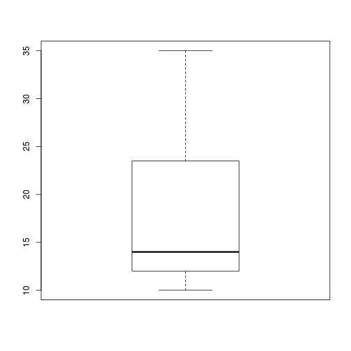

This is my title.
========================================================

Here is some random data.


```r
x = rnorm(100)
x
```

```
##   [1] -0.82624  1.19433  0.21095  0.56608  0.76117 -0.48620  0.68846
##   [8]  0.29793 -0.77861 -0.22547  1.27081 -0.30014 -0.45208 -1.61314
##  [15]  1.30836 -0.59239 -1.07902  1.82626 -1.94416  1.36792 -0.08386
##  [22] -0.66449 -0.99072  0.11562 -0.15639 -0.01822  0.06674  0.46704
##  [29]  0.60923 -1.04232  0.17775 -1.07996  0.14537  3.11497  0.12237
##  [36] -1.23024 -1.36983 -1.60883 -0.05045  1.03072  0.40653 -0.52029
##  [43]  0.41534 -0.69911  0.11608  1.27752  0.90393 -1.30124  0.90824
##  [50]  1.11790 -0.09742  0.54333  1.55609 -0.10614  1.40810 -0.22075
##  [57]  0.79052 -0.53676 -0.52247  0.62841  0.23632  0.33713 -0.75709
##  [64] -0.39089  0.24467 -0.09837 -0.41023 -2.54013 -2.16216  1.19476
##  [71]  1.75815 -0.08785 -0.13188  0.43794  0.32595  0.77252 -1.05388
##  [78] -0.74454  1.66406  1.50986 -1.49384 -0.70431  0.55750  0.08003
##  [85] -0.64601 -0.76977 -0.16862  0.55092  1.09321  0.14392  0.93219
##  [92]  0.10353  0.89695 -1.15411  0.25772  1.99586  0.51359 -1.27481
##  [99]  0.65810 -1.59751
```


This is a random formula:
$$z^2=x^2+y^2+{x \over 2 \sin x}$$

Here are some plots, for example:


```r
plot(x)
```

 

```r
hist(x, prob = T)
lines(density(x))
```

 


How normal is this?


```r
qqnorm(x)
qqline(x)
```

 


I'd say that's pretty normal.
