Time Series
========================================================

Correlation and slopes with time
================================

Time trends
-----------


* Assess existence or nature of time trends with:
  * correlation
  * regression ideas.
  
World mean temperatures
-----------------------
  

Global mean temperature every year since 1880:


```r
temp = read.csv("temperature.csv")
attach(temp)
plot(temperature ~ year, type = "b")
lines(lowess(temperature ~ year))
```

 


Examining trend
---------------

* Temperatures increasing on average over time, but pattern very irregular.
* Find (Pearson) correlation with time, and test for significance:


```r
cor.test(temperature, year)
```

```
## 
## 	Pearson's product-moment correlation
## 
## data:  temperature and year 
## t = 20, df = 129, p-value < 2.2e-16
## alternative hypothesis: true correlation is not equal to 0 
## 95 percent confidence interval:
##  0.8204 0.9059 
## sample estimates:
##    cor 
## 0.8695
```


* Correlation, 0.8695, significantly different from zero. 
* CI shows how far from zero it is.

Tests for *linear* trend with *normal* data. 

Kendall correlation
-------------------

Alternative, Kendall (rank) correlation, which just tests for monotone trend (anything upward, anything downward) and is resistant to outliers:


```r
cor.test(temperature, year, method = "kendall")
```

```
## 
## 	Kendall's rank correlation tau
## 
## data:  temperature and year 
## z = 11.78, p-value < 2.2e-16
## alternative hypothesis: true tau is not equal to 0 
## sample estimates:
##    tau 
## 0.6993
```


Kendall correlation usually closer to 0 for same data, but here P-values comparable. Trend again strongly significant.

Mann-Kendall
------------

Another way is via **Mann-Kendall**: Kendall correlation with time:


```r
library(Kendall)
MannKendall(temperature)
```

```
## tau = 0.699, 2-sided pvalue =<2e-16
```


Answer same as previous.

Examining rate of change
------------------------

* Having seen that there *is* a change, question is "how fast is it?"
* Examine slopes:

  * regular regression slope, if you believe straight-line regression
  * Theil-Sen slope: resistant to outliers, based on medians
  
Ordinary regression against time
--------------------------------


```r
temp.lm = lm(temperature ~ year)
summary(temp.lm)
```

```
## 
## Call:
## lm(formula = temperature ~ year)
## 
## Residuals:
##     Min      1Q  Median      3Q     Max 
## -0.3250 -0.1012  0.0058  0.0836  0.2850 
## 
## Coefficients:
##             Estimate Std. Error t value Pr(>|t|)    
## (Intercept) 2.579420   0.570398    4.52  1.4e-05 ***
## year        0.005863   0.000293   20.00  < 2e-16 ***
## ---
## Signif. codes:  0 '***' 0.001 '**' 0.01 '*' 0.05 '.' 0.1 ' ' 1 
## 
## Residual standard error: 0.127 on 129 degrees of freedom
## Multiple R-squared: 0.756,	Adjusted R-squared: 0.754 
## F-statistic:  400 on 1 and 129 DF,  p-value: <2e-16
```


Slope about 0.006 degrees per year (about 0.8 degrees over course of data).

Theil-Sen slope
---------------

Two ways, first more or less like regression:


```r
library(zyp)
temp.zs = zyp.sen(temperature ~ year, data = temp)
temp.zs
```

```
## 
## Call:
## NULL
## 
## Coefficients:
## Intercept       year  
##   2.94703    0.00568
```


Theil-Sen slope, the second way
-------------------------------

Don't need to supply `year`, but lots of output:


```r
zyp.trend.vector(temperature)
```

```
##     lbound      trend     trendp     ubound        tau        sig 
##   0.005000   0.005676   0.743514   0.006333   0.472925   0.000000 
##      nruns    autocor valid_frac     linear  intercept 
##   1.000000   0.614048   1.000000   0.005863  13.611622
```

```r
detach(temp)
```


* `trend`: Theil-Sen slope per unit time (year, here)
* `lbound, ubound`: confidence interval (95% by default) for slope
* `trendp`: slope over entire time period
* `linear`: regression slope on same data

Other things confuse me!

Conclusions
-----------

* Linear regression slope is 0.005863
* Theil-Sen slope is 0.005676
* Very close.
* Pearson correlation is 0.8675
* Kendall correlation is 0.6993
* Kendall correlation smaller, but P-value equally significant (usually the case)


Actual time series
==================

The Kings of England
--------------------

* Age at death of Kings and Queens of England since William the Conqueror (1066):


```r
kings = read.table("kings.txt", header = F)
kings.ts = ts(kings)
```


Data in one long column `V1`, so `kings` is data frame with one column. Turn into `ts` time series object.


```r
kings.ts
```

```
## Time Series:
## Start = 1 
## End = 42 
## Frequency = 1 
##       V1
##  [1,] 60
##  [2,] 43
##  [3,] 67
##  [4,] 50
##  [5,] 56
##  [6,] 42
##  [7,] 50
##  [8,] 65
##  [9,] 68
## [10,] 43
## [11,] 65
## [12,] 34
## [13,] 47
## [14,] 34
## [15,] 49
## [16,] 41
## [17,] 13
## [18,] 35
## [19,] 53
## [20,] 56
## [21,] 16
## [22,] 43
## [23,] 69
## [24,] 59
## [25,] 48
## [26,] 59
## [27,] 86
## [28,] 55
## [29,] 68
## [30,] 51
## [31,] 33
## [32,] 49
## [33,] 67
## [34,] 77
## [35,] 81
## [36,] 67
## [37,] 71
## [38,] 81
## [39,] 68
## [40,] 70
## [41,] 77
## [42,] 56
```


Plotting a time series
----------------------

Plotting gives time plot:


```r
plot(kings.ts)
lines(lowess(kings.ts))
```

 


Comments
--------

* "Time" here is order of monarch from William the Conqueror (1st) to George VI (last).

* Looks to be slightly increasing trend of age-at-death

* but lots of irregularity.


Stationarity
------------

A time series is **stationary** if:

* mean is constant over time
* variability constant over time and not changing with mean.

Kings time series seems to have:

* non-constant mean
* but constant variability
* not stationary.

Usual fix for non-stationarity is *differencing*: new series 2nd - 1st, 3rd - 2nd etc.

In R, `diff`:


```r
kings.diff.ts = diff(kings.ts)
```


Did differencing fix stationarity?
----------------------------------

Looks stationary now:


```r
plot(kings.diff.ts, main = "Kings series, differenced")
lines(lowess(kings.diff.ts))
```

 


Births per month in New York City
---------------------------------

from January 1946 to December 1959:


```r
ny = read.table("nybirths.txt", header = F)
ny.ts = ts(ny, freq = 12, start = c(1946, 1))
```


Note extras on `ts`:

* Time period is 1 year
* 12 observations per year (monthly) in `freq`
* First observation is 1st month of 1946 in `start`

Printing formats nicely
-----------------------


```r
ny.ts
```

```
##        Jan   Feb   Mar   Apr   May   Jun   Jul   Aug   Sep   Oct   Nov
## 1946 26.66 23.60 26.93 24.74 25.81 24.36 24.48 23.90 23.18 23.23 21.67
## 1947 21.44 21.09 23.71 21.67 21.75 20.76 23.48 23.82 23.11 23.11 21.76
## 1948 21.94 20.04 23.59 21.67 22.22 22.12 23.95 23.50 22.24 23.14 21.06
## 1949 21.55 20.00 22.42 20.61 21.76 22.87 24.10 23.75 23.26 22.91 21.52
## 1950 22.60 20.89 24.68 23.67 25.32 23.58 24.67 24.45 24.12 24.25 22.08
## 1951 23.29 23.05 25.08 24.04 24.43 24.67 26.45 25.62 25.01 25.11 22.96
## 1952 23.80 22.27 24.77 22.65 23.99 24.74 26.28 25.82 25.21 25.20 23.16
## 1953 24.36 22.64 25.57 24.06 25.43 24.64 27.01 26.61 26.27 26.46 25.25
## 1954 24.66 23.30 26.98 26.20 27.21 26.12 26.71 26.88 26.15 26.38 24.71
## 1955 24.99 24.24 26.72 23.48 24.77 26.22 28.36 28.60 27.91 27.78 25.69
## 1956 26.22 24.22 27.91 26.98 28.53 27.14 28.98 28.17 28.06 29.14 26.29
## 1957 26.59 24.85 27.54 26.90 28.88 27.39 28.07 28.14 29.05 28.48 26.63
## 1958 27.13 24.92 28.96 26.59 27.93 28.01 29.23 28.76 28.41 27.95 25.91
## 1959 26.08 25.29 27.66 25.95 26.40 25.57 28.86 30.00 29.26 29.01 26.99
##        Dec
## 1946 21.87
## 1947 22.07
## 1948 21.57
## 1949 22.02
## 1950 22.99
## 1951 23.98
## 1952 24.71
## 1953 25.18
## 1954 25.69
## 1955 26.88
## 1956 26.99
## 1957 27.73
## 1958 26.62
## 1959 27.90
```


Time plot
---------

* Time plot shows extra pattern:


```r
plot(ny.ts)
```

 


Comments on time plot
---------------------

* steady increase
* repeating pattern each year (seasonal component).
* Not stationary.

Differencing the New York births
--------------------------------

Does differencing help here?


```r
ny.diff.ts = diff(ny.ts)
plot(ny.diff.ts)
lines(lowess(ny.diff.ts))
```

 


Looks stationary, but some regular spikes.

Decomposing a seasonal time series
----------------------------------

Observations for NY births were every month. Are things the same every year?

A visual (using original data):


```r
ny.d = decompose(ny.ts)
plot(ny.d)
```

 


Decomposition bits
-------------------

Shows:

* original series
* just the trend, going steadily up (except at the start)
* a "seasonal" part: something that repeats every year
* random: what is left over ("residuals")

The seasonal part
-----------------

Fitted seasonal part is same every year, births lowest in February and highest in July:


```r
ny.d$seasonal
```

```
##          Jan     Feb     Mar     Apr     May     Jun     Jul     Aug
## 1946 -0.6772 -2.0830  0.8625 -0.8017  0.2517 -0.1533  1.4560  1.1646
## 1947 -0.6772 -2.0830  0.8625 -0.8017  0.2517 -0.1533  1.4560  1.1646
## 1948 -0.6772 -2.0830  0.8625 -0.8017  0.2517 -0.1533  1.4560  1.1646
## 1949 -0.6772 -2.0830  0.8625 -0.8017  0.2517 -0.1533  1.4560  1.1646
## 1950 -0.6772 -2.0830  0.8625 -0.8017  0.2517 -0.1533  1.4560  1.1646
## 1951 -0.6772 -2.0830  0.8625 -0.8017  0.2517 -0.1533  1.4560  1.1646
## 1952 -0.6772 -2.0830  0.8625 -0.8017  0.2517 -0.1533  1.4560  1.1646
## 1953 -0.6772 -2.0830  0.8625 -0.8017  0.2517 -0.1533  1.4560  1.1646
## 1954 -0.6772 -2.0830  0.8625 -0.8017  0.2517 -0.1533  1.4560  1.1646
## 1955 -0.6772 -2.0830  0.8625 -0.8017  0.2517 -0.1533  1.4560  1.1646
## 1956 -0.6772 -2.0830  0.8625 -0.8017  0.2517 -0.1533  1.4560  1.1646
## 1957 -0.6772 -2.0830  0.8625 -0.8017  0.2517 -0.1533  1.4560  1.1646
## 1958 -0.6772 -2.0830  0.8625 -0.8017  0.2517 -0.1533  1.4560  1.1646
## 1959 -0.6772 -2.0830  0.8625 -0.8017  0.2517 -0.1533  1.4560  1.1646
##          Sep     Oct     Nov     Dec
## 1946  0.6916  0.7752 -1.1098 -0.3768
## 1947  0.6916  0.7752 -1.1098 -0.3768
## 1948  0.6916  0.7752 -1.1098 -0.3768
## 1949  0.6916  0.7752 -1.1098 -0.3768
## 1950  0.6916  0.7752 -1.1098 -0.3768
## 1951  0.6916  0.7752 -1.1098 -0.3768
## 1952  0.6916  0.7752 -1.1098 -0.3768
## 1953  0.6916  0.7752 -1.1098 -0.3768
## 1954  0.6916  0.7752 -1.1098 -0.3768
## 1955  0.6916  0.7752 -1.1098 -0.3768
## 1956  0.6916  0.7752 -1.1098 -0.3768
## 1957  0.6916  0.7752 -1.1098 -0.3768
## 1958  0.6916  0.7752 -1.1098 -0.3768
## 1959  0.6916  0.7752 -1.1098 -0.3768
```


Time series basics
==================

White noise
-----------

Independent random normal. Knowing one value tells you nothing about the next. "Random" process.


```r
wn = rnorm(100)
wn.ts = ts(wn)
plot(wn.ts)
```

 


Lagging a time series
---------------------

This means moving a time series one (or more) steps back in time:


```r
x = rnorm(5)
x.1 = c(NA, x)
x.0 = c(x, NA)
cbind(x.0, x.1)
```

```
##           x.0      x.1
## [1,] -2.03609       NA
## [2,] -0.57862 -2.03609
## [3,]  0.60836 -0.57862
## [4,]  0.11803  0.60836
## [5,]  0.05634  0.11803
## [6,]       NA  0.05634
```


Have to glue `NA` onto **both** ends to keep series same length.

Lagging white noise
-------------------


```r
wn.1 = c(NA, wn)
wn.0 = c(wn, NA)
plot(wn.1, wn.0)
```

 

```r
cor(wn.1, wn.0, use = "c")
```

```
## [1] -0.01676
```


Correlation with lagged series
------------------------------

If you know about white noise at one time point, you know *nothing* about it at the next. This is shown by the scatterplot and the correlation. 


On the other hand, this:


```r
kings.1 = c(NA, kings.ts)
kings.0 = c(kings.ts, NA)
cor(kings.1, kings.0, use = "c")
```

```
## [1] 0.401
```


If one value larger, the next value (a bit) more likely to be larger. 

Plot of series vs. lagged series for kings data
-----------------------------------------------


```r
plot(kings.1, kings.0)
```

 


Two steps back:
---------------


```r
# one step back
cor(kings.1, kings.0, use = "c")
```

```
## [1] 0.401
```

```r
# one step plus one more
kings.2 = c(NA, kings.1)
kings.0 = c(kings.0, NA)
cor(kings.0, kings.2, use = "c")
```

```
## [1] 0.2457
```


Still a correlation two steps back, but smaller.

Autocorrelation
---------------

Correlation of time series with *itself* one, two,... time steps back is useful idea, called **autocorrelation**. Make a plot of it with `acf`.

White noise:


```r
acf(wn.ts)
```

 


No autocorrelations beyond chance, anywhere. Ignore 0.

Autocorrelations work best on *stationary* series.

Kings, differenced
--------------------


```r
acf(kings.diff.ts)
```

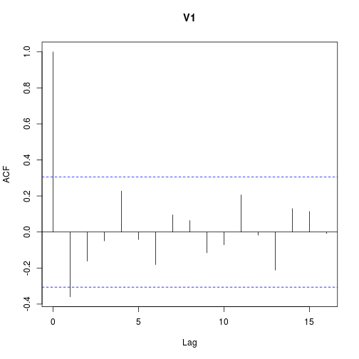 


Comments on autocorrelations of kings series
--------------------------------------------

Negative autocorrelation at lag 1, nothing beyond that. 

* If one value of differenced series positive, next one most likely negative.
* If one king lives longer than predecessor, next one likely lives shorter.

NY births, differenced
------------------------


```r
acf(ny.diff.ts, main = "NY births differenced")
```

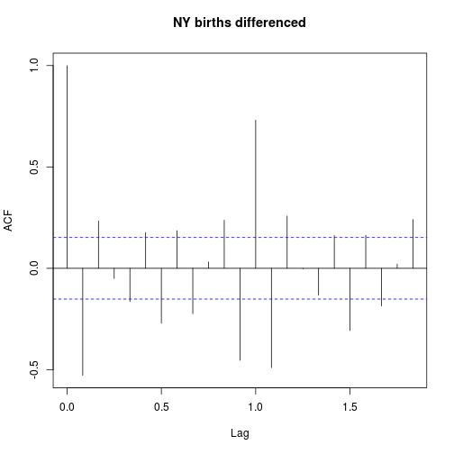 


Comments
---------

Lots of stuff:

* large positive autocorrelation at 1.0 years (July one year like July last year)
* large negative autocorrelation at 1 month.
* smallish but significant negative autocorrelation at 0.5 year = 6 months.
* Other stuff -- complicated.

Souvenir sales
--------------

Monthly sales for a beach souvenir shop in Queensland, Australia:


```r
souv = read.table("souvenir.txt", header = F)
souv.ts = ts(souv, frequency = 12, start = 1987)
souv.ts
```

```
##         Jan    Feb    Mar    Apr    May    Jun    Jul    Aug    Sep    Oct
## 1987   1665   2398   2841   3547   3753   3715   4350   3566   5022   6423
## 1988   2500   5198   7225   4806   5901   4951   6179   4752   5496   5835
## 1989   4717   5703   9958   5305   6492   6631   7350   8177   8573   9690
## 1990   5921   5815  12421   6370   7609   7225   8121   7979   8093   8477
## 1991   4827   6470   9639   8821   8722  10209  11277  12552  11637  13607
## 1992   7615   9850  14558  11587   9333  13082  16733  19889  23933  25391
## 1993  10243  11267  21827  17357  15998  18602  26155  28587  30505  30821
##         Nov    Dec
## 1987   7601  19756
## 1988  12600  28542
## 1989  15152  34061
## 1990  17915  30114
## 1991  21822  45061
## 1992  36025  80722
## 1993  46634 104661
```


Plot of souvenir sales
----------------------


```r
plot(souv.ts)
```

 


Comments
---------

Several problems:

* Mean goes up over time
* Variability gets larger as mean gets larger
* Not stationary

Problem-fixing
--------------

Fix non-constant variability first by taking logs:


```r
souv.log.ts = log(souv.ts)
plot(souv.log.ts)
```

 


Differencing
------------

Mean still not constant, so try taking differences:


```r
souv.log.diff.ts = diff(souv.log.ts)
plot(souv.log.diff.ts)
```

 


Comments
--------

* Now stationary
* but clear seasonal effect.

Decomposing to see the seasonal effect
--------------------------------------


```r
souv.d = decompose(souv.log.diff.ts)
plot(souv.d)
```

 


Comments
--------

**Big** drop in one month's differences. Look at seasonal component to see which:


```r
souv.d$seasonal
```

```
##           Jan      Feb      Mar      Apr      May      Jun      Jul
## 1987           0.23293  0.49069 -0.39701  0.02410  0.05074  0.13553
## 1988 -1.90372  0.23293  0.49069 -0.39701  0.02410  0.05074  0.13553
## 1989 -1.90372  0.23293  0.49069 -0.39701  0.02410  0.05074  0.13553
## 1990 -1.90372  0.23293  0.49069 -0.39701  0.02410  0.05074  0.13553
## 1991 -1.90372  0.23293  0.49069 -0.39701  0.02410  0.05074  0.13553
## 1992 -1.90372  0.23293  0.49069 -0.39701  0.02410  0.05074  0.13553
## 1993 -1.90372  0.23293  0.49069 -0.39701  0.02410  0.05074  0.13553
##           Aug      Sep      Oct      Nov      Dec
## 1987 -0.03710  0.08651  0.09148  0.47311  0.75274
## 1988 -0.03710  0.08651  0.09148  0.47311  0.75274
## 1989 -0.03710  0.08651  0.09148  0.47311  0.75274
## 1990 -0.03710  0.08651  0.09148  0.47311  0.75274
## 1991 -0.03710  0.08651  0.09148  0.47311  0.75274
## 1992 -0.03710  0.08651  0.09148  0.47311  0.75274
## 1993 -0.03710  0.08651  0.09148  0.47311  0.75274
```


Autocorrelations
----------------


```r
acf(souv.log.diff.ts)
```

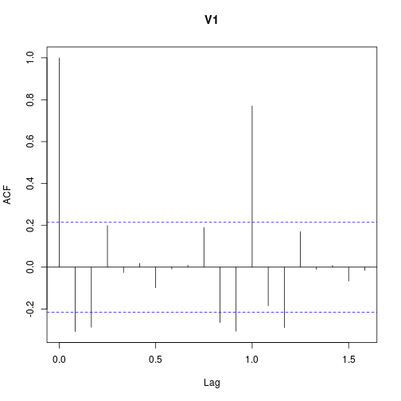 


* Big positive autocorrelation at 1 year (strong seasonal effect)
* Small negative autocorrelation at 1 and 2 months.


Moving average
--------------

A particular type of time series called a **moving average** or MA process captures idea of autocorrelations at a few lags but not at others.

Here's generation of MA(1) process, with autocorrelation at lag 1 but not otherwise:


```r
e = rnorm(100)
y = numeric(0)
y[1] = 0
beta = 1
for (i in 2:100) {
    y[i] = e[i] + beta * e[i - 1]
}
y
```

```
##   [1]  0.000000  1.459947  1.003636  0.290535  0.927762  0.698584  1.081925
##   [8]  1.199785 -0.755392 -2.501267 -1.491053  0.316963  0.007674  0.915412
##  [15]  0.699441 -0.709542 -1.510910 -1.931463 -2.699014 -0.191624  2.068134
##  [22]  1.953255  1.102764  1.160782  0.354067 -2.057886 -2.156346 -1.848551
##  [29] -0.683571 -1.433488 -2.226428 -1.569811 -1.998215 -0.774296 -0.776534
##  [36] -1.896003  0.593475  1.769262 -0.002125  0.350905  0.301290  0.257268
##  [43]  0.814916  0.174229 -1.457311 -0.440137  0.937195  0.621751  1.770630
##  [50]  1.167974 -1.342307 -1.565790 -0.992549  0.868109  2.128187  0.196433
##  [57]  0.345667  1.989314  0.467650 -0.891247  1.781103  0.104384 -1.702983
##  [64] -0.912250 -0.756331 -0.902107 -2.832956 -2.894871 -1.981636 -1.571337
##  [71] -0.648132 -1.068589 -2.818508 -2.154688  0.154307 -1.036771 -0.407083
##  [78] -0.419829 -1.736900 -0.042858  1.651501 -0.099512 -0.327476  0.890043
##  [85] -0.913421 -1.161211 -0.860284  0.261762  1.662999  1.536472  0.373325
##  [92]  1.756376  2.459355 -0.055969  0.467825  1.075871 -2.575363 -1.257956
##  [99]  0.583707 -0.714033
```


Comments
--------

* `e` contains independent "random shocks". 
* Start process at 0. 
* Then, each value of the time series has that time's random shock, plus a multiple of the last time's random shock. 
* `y[i]` has shock in common with `y[i-1]`; should be a lag 1 autocorrelation. 
* But `y[i]` has no shock in common with `y[i-2]`, so no lag 2 autocorrelation (or beyond).


ACF for MA(1) process
---------------------


```r
acf(y)
```

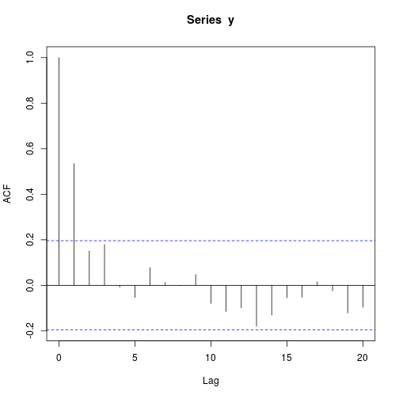 


As promised, everything beyond lag 1 is just chance.


AR process
----------

Another kind of time series is AR process, where each value depends on previous one, like this:


```r
e = rnorm(100)
x = numeric(0)
x[1] = 0
alpha = 0.7
for (i in 2:100) {
    x[i] = alpha * x[i - 1] + e[i]
}
x
```

```
##   [1]  0.00000  0.69150 -0.27157 -1.69374 -0.04625 -0.61290  0.26465
##   [8] -0.21494 -1.31429  0.44277  0.09918  0.19081 -1.02379  0.16694
##  [15]  0.98375  0.04866  1.22332 -0.04785 -0.21368 -0.68229  0.25079
##  [22] -0.86025  1.75818  1.19266  0.30513  2.41225  1.28151  1.68979
##  [29]  2.01816  3.53755  1.85841  2.32514  1.77112  2.12224  0.91096
##  [36]  1.58477  2.08225  1.09623 -0.76369 -0.70810 -1.84440 -0.38985
##  [43] -1.04266 -0.86988 -1.14486 -3.18900 -2.93376 -2.16076 -1.59509
##  [50] -1.74905 -3.13933 -3.02637 -1.44219 -1.55490 -1.73929 -2.00996
##  [57] -2.66272 -3.20338 -3.51822 -3.07147 -3.97834 -3.76372 -3.52533
##  [64] -3.45189 -0.06075 -0.57178  0.81558 -0.27386  0.75055 -1.41071
##  [71] -2.60771 -0.77008 -0.44599  0.92660 -0.50866 -0.28001 -0.69942
##  [78] -0.87488 -1.34524 -1.24758 -2.20687 -1.55319 -0.03080 -0.30484
##  [85]  1.32564  1.13382  0.88142  0.19973 -1.03974 -0.60656  0.27269
##  [92]  0.49555  0.74140  0.41685 -0.01248 -0.08956  1.09794  0.51406
##  [99]  1.27608  0.05862
```


Comments
--------

* Each random shock now only used for its own value of `x`
* but `x[i]` also depends on previous value `x[i-1]`
* so correlated with previous value
* *but* `x[i]` also contains multiple of `x[i-2]` and previous x's
* so all x's correlated, but autocorrelation dying away.

ACF for AR(1) series
--------------------


```r
acf(x)
```

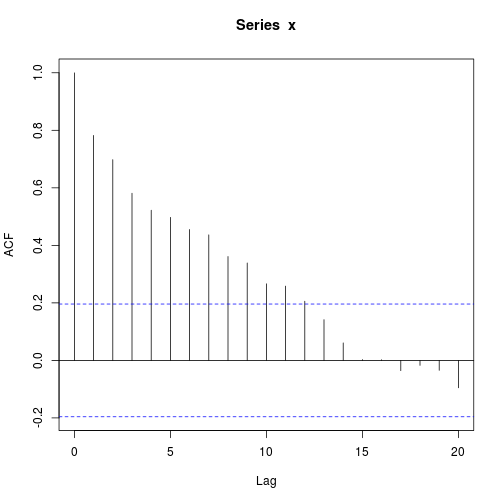 


Partial autocorrelation function
--------------------------------

This cuts off for an AR series:


```r
pacf(x)
```

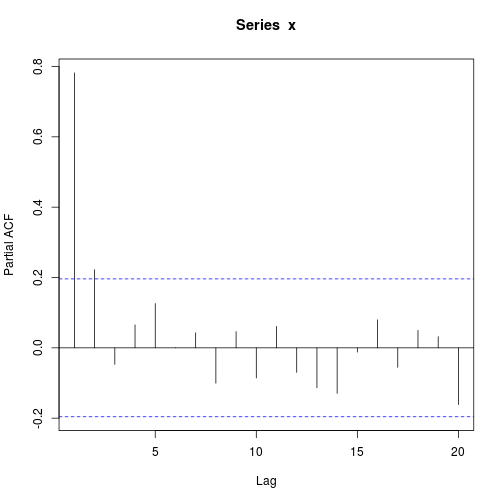 


The lag-2 autocorrelation should not be significant, and is only just.

PACF for an MA series
---------------------

Decays slowly for an MA series:


```r
pacf(y)
```

 


The old way of doing time series analysis
-----------------------------------------

Starting from a series with constant variability (eg. transform first to get it, as for souvenirs):

* Assess stationarity.
* If not stationary, take differences as many times as needed until it is.
* Look at ACF, see if it dies off. If it does, you have MA series.
* Look at PACF, see if that dies off. If it does, have AR series.
* If neither dies off, probably have a mixed "ARMA" series.
* Fit coefficients (like regression slopes).
* Do forecasts.


The new way of doing time series analysis (in R)
------------------------------------------------

* Transform series if needed to get constant variability
* Use package `forecast`.
* Use function `auto.arima` to estimate what kind of series best fits data.
* Use `forecast` to see what will happen in future.

Anatomy of `auto.arima` output
------------------------------


```r
library(forecast)
```

```
## This is forecast 4.03
```

```r
auto.arima(y)
```

```
## Warning: p-value greater than printed p-value
```

```
## Series: y 
## ARIMA(0,0,1) with zero mean     
## 
## Coefficients:
##         ma1
##       0.907
## s.e.  0.062
## 
## sigma^2 estimated as 0.978:  log likelihood=-141.6
## AIC=287.3   AICc=287.4   BIC=292.5
```


* ARIMA part tells you what kind of series you are estimated to have:
  * first number (first 0) is AR (autoregressive) part
  * second number (second 0) is amount of differencing here
  * third number (1) is MA (moving average) part
  
* Below that, coefficients (with SEs)
* AICc is measure of fit (lower better)

What other models were possible?
--------------------------------

Run `auto.arima` with `trace=T`:


```r
auto.arima(y, trace = T)
```

```
## Warning: p-value greater than printed p-value
```

```
## 
##  ARIMA(2,0,2) with non-zero mean : 1e+20
##  ARIMA(0,0,0) with non-zero mean : 345.2
##  ARIMA(1,0,0) with non-zero mean : 314
##  ARIMA(0,0,1) with non-zero mean : 287.9
##  ARIMA(1,0,1) with non-zero mean : 290.1
##  ARIMA(0,0,2) with non-zero mean : 290.1
##  ARIMA(1,0,2) with non-zero mean : 291.8
##  ARIMA(0,0,1) with zero mean     : 287.4
##  ARIMA(1,0,1) with zero mean     : 289.5
##  ARIMA(0,0,0) with zero mean     : 346.1
##  ARIMA(0,0,2) with zero mean     : 289.5
##  ARIMA(1,0,2) with zero mean     : 290.6
## 
##  Best model: ARIMA(0,0,1) with zero mean
```

```
## Series: y 
## ARIMA(0,0,1) with zero mean     
## 
## Coefficients:
##         ma1
##       0.907
## s.e.  0.062
## 
## sigma^2 estimated as 0.978:  log likelihood=-141.6
## AIC=287.3   AICc=287.4   BIC=292.5
```


Also possible were MA(2) and ARMA(1,1), both with AICc=289.5.


Doing it all the new way
====================

White noise
-----------


```r
wn.aa = auto.arima(wn.ts)
```

```
## Warning: p-value greater than printed p-value
```

```r
wn.aa
```

```
## Series: wn.ts 
## ARIMA(0,0,0) with zero mean     
## 
## sigma^2 estimated as 1.11:  log likelihood=-147.2
## AIC=296.3   AICc=296.4   BIC=298.9
```


Best fit *is* white noise (no AR, no MA, no differencing). 

Forecasts
---------


```r
forecast(wn.aa)
```

```
##     Point Forecast  Lo 80 Hi 80  Lo 95 Hi 95
## 101              0 -1.351 1.351 -2.066 2.066
## 102              0 -1.351 1.351 -2.066 2.066
## 103              0 -1.351 1.351 -2.066 2.066
## 104              0 -1.351 1.351 -2.066 2.066
## 105              0 -1.351 1.351 -2.066 2.066
## 106              0 -1.351 1.351 -2.066 2.066
## 107              0 -1.351 1.351 -2.066 2.066
## 108              0 -1.351 1.351 -2.066 2.066
## 109              0 -1.351 1.351 -2.066 2.066
## 110              0 -1.351 1.351 -2.066 2.066
```


Forecasts all 0, since the past doesn't help to predict future.


MA(1)
-----


```r
y.aa = auto.arima(y)
```

```
## Warning: p-value greater than printed p-value
```

```r
y.aa
```

```
## Series: y 
## ARIMA(0,0,1) with zero mean     
## 
## Coefficients:
##         ma1
##       0.907
## s.e.  0.062
## 
## sigma^2 estimated as 0.978:  log likelihood=-141.6
## AIC=287.3   AICc=287.4   BIC=292.5
```

```r
y.f = forecast(y.aa)
```


Plotting the forecasts for MA(1)
--------------------------------


```r
plot(y.f)
```

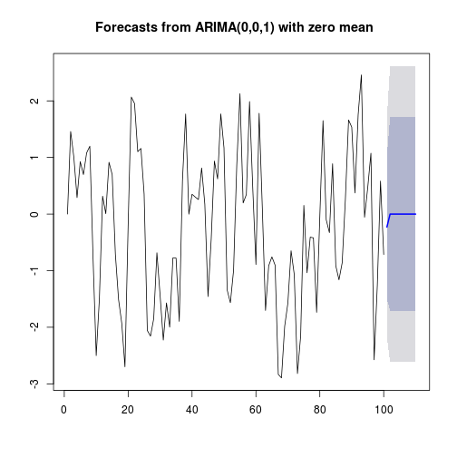 


AR(1)
-----


```r
x.aa = auto.arima(x)
```

```
## Warning: p-value greater than printed p-value
```

```
## Warning: possible convergence problem: optim gave code=1
```

```
## Warning: possible convergence problem: optim gave code=1
```

```r
x.aa
```

```
## Series: x 
## ARIMA(0,1,1)                    
## 
## Coefficients:
##          ma1
##       -0.354
## s.e.   0.106
## 
## sigma^2 estimated as 0.969:  log likelihood=-139
## AIC=282   AICc=282.1   BIC=287.2
```


Oops!
-----

Got it wrong! Fit right AR(1) model:


```r
x.arima = arima(x, order = c(1, 0, 0))
x.arima
```

```
## Series: x 
## ARIMA(1,0,0) with non-zero mean 
## 
## Coefficients:
##         ar1  intercept
##       0.776     -0.365
## s.e.  0.061      0.422
## 
## sigma^2 estimated as 0.957:  log likelihood=-140.2
## AIC=286.3   AICc=286.6   BIC=294.1
```


Forecasts for `x`
-----------------


```r
plot(forecast(x.arima))
```

 


Comparing wrong model
---------------------


```r
plot(forecast(x.aa))
```

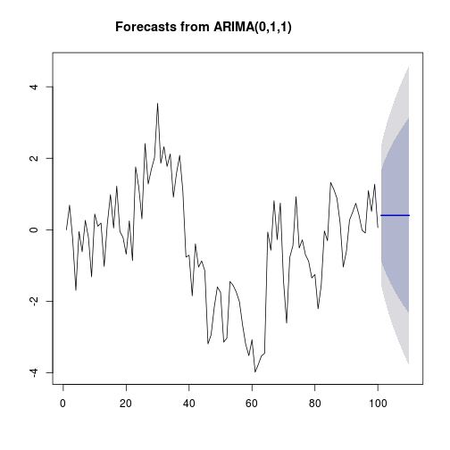 


Kings
-----


```r
kings.aa = auto.arima(kings.ts)
```

```
## Warning: p-value greater than printed p-value
```

```r
kings.aa
```

```
## Series: kings.ts 
## ARIMA(0,1,1)                    
## 
## Coefficients:
##          ma1
##       -0.722
## s.e.   0.121
## 
## sigma^2 estimated as 230:  log likelihood=-170.1
## AIC=344.1   AICc=344.4   BIC=347.6
```


Kings forecasts
---------------


```r
kings.f = forecast(kings.aa)
kings.f
```

```
##    Point Forecast Lo 80 Hi 80 Lo 95  Hi 95
## 43          67.75 48.30 87.20 38.00  97.50
## 44          67.75 47.56 87.94 36.87  98.63
## 45          67.75 46.84 88.66 35.78  99.72
## 46          67.75 46.16 89.35 34.72 100.78
## 47          67.75 45.49 90.01 33.70 101.80
## 48          67.75 44.84 90.66 32.71 102.79
## 49          67.75 44.21 91.29 31.75 103.76
## 50          67.75 43.59 91.91 30.81 104.70
## 51          67.75 42.99 92.51 29.89 105.61
## 52          67.75 42.41 93.09 29.00 106.51
```


Kings forecasts, plotted
------------------------


```r
plot(kings.f)
```

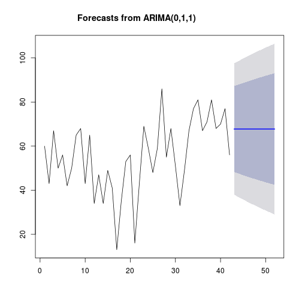 


NY births
---------


```r
ny.aa = auto.arima(ny.ts)
```

```
## Warning: p-value greater than printed p-value
```

```r
ny.aa
```

```
## Series: ny.ts 
## ARIMA(2,1,2)(1,1,1)[12]                    
## 
## Coefficients:
##         ar1     ar2     ma1    ma2    sar1    sma1
##       0.654  -0.454  -0.726  0.253  -0.243  -0.845
## s.e.  0.300   0.243   0.323  0.288   0.099   0.099
## 
## sigma^2 estimated as 0.392:  log likelihood=-157.4
## AIC=328.9   AICc=329.7   BIC=350.2
```

```r
ny.f = forecast(ny.aa, h = 36)
```


Going 36 time periods (3 years) into future.

NY births forecasts
-------------------

Not *quite* same every year:


```r
ny.f
```

```
##          Point Forecast Lo 80 Hi 80 Lo 95 Hi 95
## Jan 1960          27.69 26.89 28.49 26.46 28.92
## Feb 1960          26.08 24.98 27.17 24.40 27.75
## Mar 1960          29.27 28.04 30.49 27.39 31.14
## Apr 1960          27.59 26.29 28.90 25.60 29.59
## May 1960          28.93 27.55 30.32 26.82 31.05
## Jun 1960          28.55 27.07 30.03 26.29 30.82
## Jul 1960          29.85 28.27 31.43 27.43 32.27
## Aug 1960          29.45 27.78 31.13 26.89 32.01
## Sep 1960          29.16 27.41 30.92 26.48 31.85
## Oct 1960          29.21 27.38 31.05 26.41 32.01
## Nov 1960          27.26 25.36 29.17 24.35 30.18
## Dec 1960          28.07 26.09 30.05 25.04 31.09
## Jan 1961          27.67 25.64 29.70 24.56 30.78
## Feb 1961          26.21 24.13 28.30 23.02 29.40
## Mar 1961          29.23 27.09 31.37 25.95 32.50
## Apr 1961          27.58 25.38 29.78 24.22 30.94
## May 1961          28.71 26.46 30.96 25.27 32.15
## Jun 1961          28.22 25.92 30.52 24.70 31.74
## Jul 1961          29.99 27.64 32.34 26.39 33.58
## Aug 1961          29.96 27.56 32.36 26.29 33.63
## Sep 1961          29.57 27.12 32.01 25.82 33.31
## Oct 1961          29.55 27.05 32.04 25.73 33.36
## Nov 1961          27.58 25.04 30.12 23.69 31.47
## Dec 1961          28.41 25.82 31.00 24.45 32.37
## Jan 1962          28.05 25.39 30.72 23.98 32.13
## Feb 1962          26.56 23.83 29.29 22.38 30.74
## Mar 1962          29.62 26.82 32.41 25.34 33.89
## Apr 1962          27.96 25.11 30.81 23.60 32.32
## May 1962          29.15 26.24 32.05 24.70 33.59
## Jun 1962          28.68 25.72 31.64 24.15 33.21
## Jul 1962          30.33 27.31 33.35 25.71 34.95
## Aug 1962          30.22 27.14 33.29 25.51 34.92
## Sep 1962          29.85 26.72 32.98 25.06 34.63
## Oct 1962          29.85 26.66 33.03 24.98 34.71
## Nov 1962          27.88 24.65 31.12 22.94 32.83
## Dec 1962          28.71 25.42 31.99 23.68 33.73
```


Plotting the forecasts
----------------------


```r
plot(ny.f)
```

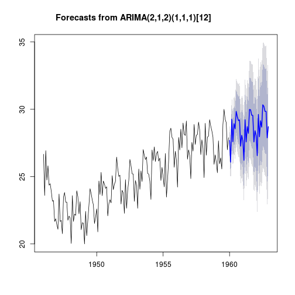 


Log-souvenir sales
------------------


```r
souv.aa = auto.arima(souv.log.ts)
souv.aa
```

```
## Series: souv.log.ts 
## ARIMA(2,0,0)(1,1,0)[12] with drift         
## 
## Coefficients:
##         ar1    ar2    sar1  drift
##       0.349  0.360  -0.328  0.025
## s.e.  0.109  0.116   0.133  0.004
## 
## sigma^2 estimated as 0.03:  log likelihood=23.04
## AIC=-36.09   AICc=-35.18   BIC=-24.71
```

```r
souv.f = forecast(souv.aa, h = 27)
```


The forecasts
-------------


```r
plot(souv.ts)
```

 

```r
plot(diff(souv.ts))
```

 


Differenced series showed low value for January (large drop). December highest, Jan and Feb lowest:


```r
souv.f
```

```
##          Point Forecast  Lo 80  Hi 80  Lo 95  Hi 95
## Jan 1994          9.561  9.339  9.783  9.221  9.901
## Feb 1994          9.710  9.475  9.946  9.351 10.070
## Mar 1994         10.274 10.015 10.532  9.878 10.669
## Apr 1994         10.042  9.775 10.308  9.634 10.450
## May 1994          9.912  9.638 10.185  9.493 10.330
## Jun 1994         10.121  9.844 10.398  9.697 10.545
## Jul 1994         10.428 10.149 10.708 10.000 10.856
## Aug 1994         10.543 10.262 10.824 10.113 10.973
## Sep 1994         10.646 10.363 10.928 10.214 11.078
## Oct 1994         10.671 10.388 10.954 10.238 11.104
## Nov 1994         11.063 10.780 11.346 10.629 11.497
## Dec 1994         11.870 11.586 12.154 11.436 12.304
## Jan 1995          9.850  9.525 10.175  9.353 10.348
## Feb 1995          9.981  9.650 10.312  9.475 10.487
## Mar 1995         10.576 10.236 10.916 10.056 11.096
## Apr 1995         10.345 10.002 10.688  9.820 10.870
## May 1995         10.230  9.884 10.577  9.701 10.760
## Jun 1995         10.420 10.073 10.768  9.888 10.953
## Jul 1995         10.739 10.390 11.088 10.205 11.272
## Aug 1995         10.845 10.495 11.194 10.310 11.380
## Sep 1995         10.935 10.585 11.285 10.399 11.470
## Oct 1995         10.955 10.605 11.306 10.419 11.491
## Nov 1995         11.354 11.004 11.705 10.818 11.891
## Dec 1995         12.162 11.811 12.513 11.625 12.698
## Jan 1996         10.149  9.755 10.544  9.546 10.753
## Feb 1996         10.286  9.886 10.686  9.675 10.898
## Mar 1996         10.871 10.461 11.280 10.244 11.497
```

```r
souv.f$mean
```

```
##         Jan    Feb    Mar    Apr    May    Jun    Jul    Aug    Sep    Oct
## 1994  9.561  9.710 10.274 10.042  9.912 10.121 10.428 10.543 10.646 10.671
## 1995  9.850  9.981 10.576 10.345 10.230 10.420 10.739 10.845 10.935 10.955
## 1996 10.149 10.286 10.871                                                 
##         Nov    Dec
## 1994 11.063 11.870
## 1995 11.354 12.162
## 1996
```

```r
exp(souv.f$mean)
```

```
##         Jan    Feb    Mar    Apr    May    Jun    Jul    Aug    Sep    Oct
## 1994  14203  16488  28959  22967  20164  24863  33806  37910  42015  43084
## 1995  18962  21617  39190  31100  27735  33540  46101  51257  56102  57246
## 1996  25573  29326  52617                                                 
##         Nov    Dec
## 1994  63766 142926
## 1995  85336 191342
## 1996
```

```r
print.default(souv.f)
```

```
## $method
## [1] "ARIMA(2,0,0)(1,1,0)[12] with drift        "
## 
## $model
## Series: souv.log.ts 
## ARIMA(2,0,0)(1,1,0)[12] with drift         
## 
## Coefficients:
##         ar1    ar2    sar1  drift
##       0.349  0.360  -0.328  0.025
## s.e.  0.109  0.116   0.133  0.004
## 
## sigma^2 estimated as 0.03:  log likelihood=23.04
## AIC=-36.09   AICc=-35.18   BIC=-24.71
## 
## $level
## [1] 80 95
## 
## $mean
##         Jan    Feb    Mar    Apr    May    Jun    Jul    Aug    Sep    Oct
## 1994  9.561  9.710 10.274 10.042  9.912 10.121 10.428 10.543 10.646 10.671
## 1995  9.850  9.981 10.576 10.345 10.230 10.420 10.739 10.845 10.935 10.955
## 1996 10.149 10.286 10.871                                                 
##         Nov    Dec
## 1994 11.063 11.870
## 1995 11.354 12.162
## 1996              
## 
## $lower
##          80%    95%
##  [1,]  9.339  9.221
##  [2,]  9.475  9.351
##  [3,] 10.015  9.878
##  [4,]  9.775  9.634
##  [5,]  9.638  9.493
##  [6,]  9.844  9.697
##  [7,] 10.149 10.000
##  [8,] 10.262 10.113
##  [9,] 10.363 10.214
## [10,] 10.388 10.238
## [11,] 10.780 10.629
## [12,] 11.586 11.436
## [13,]  9.525  9.353
## [14,]  9.650  9.475
## [15,] 10.236 10.056
## [16,] 10.002  9.820
## [17,]  9.884  9.701
## [18,] 10.073  9.888
## [19,] 10.390 10.205
## [20,] 10.495 10.310
## [21,] 10.585 10.399
## [22,] 10.605 10.419
## [23,] 11.004 10.818
## [24,] 11.811 11.625
## [25,]  9.755  9.546
## [26,]  9.886  9.675
## [27,] 10.461 10.244
## 
## $upper
##          80%    95%
##  [1,]  9.783  9.901
##  [2,]  9.946 10.070
##  [3,] 10.532 10.669
##  [4,] 10.308 10.450
##  [5,] 10.185 10.330
##  [6,] 10.398 10.545
##  [7,] 10.708 10.856
##  [8,] 10.824 10.973
##  [9,] 10.928 11.078
## [10,] 10.954 11.104
## [11,] 11.346 11.497
## [12,] 12.154 12.304
## [13,] 10.175 10.348
## [14,] 10.312 10.487
## [15,] 10.916 11.096
## [16,] 10.688 10.870
## [17,] 10.577 10.760
## [18,] 10.768 10.953
## [19,] 11.088 11.272
## [20,] 11.194 11.380
## [21,] 11.285 11.470
## [22,] 11.306 11.491
## [23,] 11.705 11.891
## [24,] 12.513 12.698
## [25,] 10.544 10.753
## [26,] 10.686 10.898
## [27,] 11.280 11.497
## 
## $x
##         Jan    Feb    Mar    Apr    May    Jun    Jul    Aug    Sep    Oct
## 1987  7.417  7.782  7.952  8.174  8.230  8.220  8.378  8.179  8.522  8.768
## 1988  7.824  8.556  8.885  8.478  8.683  8.507  8.729  8.466  8.612  8.672
## 1989  8.459  8.649  9.206  8.576  8.778  8.799  8.902  9.009  9.056  9.179
## 1990  8.686  8.668  9.427  8.759  8.937  8.885  9.002  8.985  8.999  9.045
## 1991  8.482  8.775  9.174  9.085  9.074  9.231  9.330  9.438  9.362  9.518
## 1992  8.938  9.195  9.586  9.358  9.141  9.479  9.725  9.898 10.083 10.142
## 1993  9.234  9.330  9.991  9.762  9.680  9.831 10.172 10.261 10.326 10.336
##         Nov    Dec
## 1987  8.936  9.891
## 1988  9.441 10.259
## 1989  9.626 10.436
## 1990  9.793 10.313
## 1991  9.991 10.716
## 1992 10.492 11.299
## 1993 10.750 11.558
## 
## $xname
##  [1] "structure(c(7.41746628178892, 7.78219431971372, 7.95180929991046, "      
##  [2] "8.17393921066467, 8.23030014093807, 8.22006396816164, 8.37784146489105, "
##  [3] "8.17929513880233, 8.52154769678127, 8.76771530589945, 8.93598247052666, "
##  [4] "9.89122315128614, 7.82397000796815, 8.55607538574002, 8.88532188995553, "
##  [5] "8.47762665847418, 8.68285677131405, 8.5074135259989, 8.72893114549063, " 
##  [6] "8.46635242620086, 8.61185406956077, 8.67164668253439, 9.44145844212576, "
##  [7] "10.2591221555078, 8.45893252325831, 8.64868275091755, 9.20608934916864, "
##  [8] "8.57636357987714, 8.77839216180762, 8.79948073955071, 8.90240389019008, "
##  [9] "9.00903414127095, 9.05639283818004, 9.1789013031408, 9.62587725570802, " 
## [10] "10.4359086073296, 8.68627752142817, 8.66812383534513, 9.42716399454557, "
## [11] "8.75931864116395, 8.9371028068499, 8.88526791030584, 9.0022356681753, "  
## [12] "8.98459970106459, 8.99876218328263, 9.04507650210367, 9.79337465104933, "
## [13] "10.3127590737202, 8.48190585239446, 8.77496693554935, 9.17354878610287, "
## [14] "9.08490979326442, 9.07364626896591, 9.23107197940138, 9.33048062720624, "
## [15] "9.43765282134659, 9.36197846933872, 9.51833156108381, 9.99067895498687, "
## [16] "10.7157655267851, 8.93787920491441, 9.19519526158966, 9.58592342560243, "
## [17] "9.35766753878483, 9.14126463991353, 9.4789993981795, 9.72512494873588, " 
## [18] "9.89790248504199, 10.083029416227, 10.1421638438248, 10.4919628691521, " 
## [19] "11.298762839144, 9.2343732547976, 9.32962272753498, 9.99089568414157, "  
## [20] "9.76177017454231, 9.68020586668178, 9.8309991143828, 10.1718013908294, " 
## [21] "10.2606905570263, 10.3256593239152, 10.3359622617392, 10.7500933163369, "
## [22] "11.5584786815873), .Dim = c(84L, 1L), .Dimnames = list(NULL, "           
## [23] "    \"V1\"), .Tsp = c(1987, 1993.91666666667, 12), class = \"ts\")"      
## 
## $fitted
##         Jan    Feb    Mar    Apr    May    Jun    Jul    Aug    Sep    Oct
## 1987  7.410  7.774  7.944  8.166  8.222  8.212  8.370  8.171  8.513  8.759
## 1988  7.741  8.185  8.475  8.839  8.749  8.563  8.719  8.479  8.811  8.954
## 1989  8.218  8.878  9.091  8.836  8.944  8.684  8.951  8.727  9.023  9.212
## 1990  8.595  8.992  9.390  8.790  9.054  8.962  9.092  9.066  9.135  9.213
## 1991  8.785  8.707  9.462  8.791  9.069  9.176  9.282  9.368  9.417  9.484
## 1992  8.881  9.121  9.670  9.372  9.394  9.408  9.504  9.709  9.751  9.990
## 1993  9.356  9.585  9.821  9.669  9.600  9.886 10.064 10.219 10.348 10.404
##         Nov    Dec
## 1987  8.927  9.882
## 1988  9.032 10.085
## 1989  9.727 10.547
## 1990  9.723 10.584
## 1991 10.127 10.710
## 1992 10.615 11.176
## 1993 10.754 11.513
## 
## $residuals
##            Jan       Feb       Mar       Apr       May       Jun       Jul
## 1987  0.007393  0.007733  0.007878  0.008075  0.008107  0.008072  0.008205
## 1988  0.082682  0.371237  0.410450 -0.361343 -0.066304 -0.055713  0.009617
## 1989  0.241085 -0.229345  0.114738 -0.259724 -0.165505  0.115281 -0.048571
## 1990  0.091128 -0.323790  0.037593 -0.030932 -0.117056 -0.076782 -0.089530
## 1991 -0.303563  0.067673 -0.288302  0.293671  0.004772  0.054811  0.048072
## 1992  0.057106  0.074394 -0.084244 -0.013867 -0.253133  0.070964  0.221201
## 1993 -0.122032 -0.255532  0.170076  0.092444  0.079810 -0.054842  0.108227
##            Aug       Sep       Oct       Nov       Dec
## 1987  0.007982  0.008299  0.008521  0.008664  0.009595
## 1988 -0.012719 -0.199043 -0.282450  0.409616  0.174482
## 1989  0.282489  0.033425 -0.033571 -0.101221 -0.110646
## 1990 -0.081042 -0.136331 -0.167969  0.070510 -0.270881
## 1991  0.069909 -0.055507  0.034451 -0.136165  0.005514
## 1992  0.188833  0.332213  0.151894 -0.123079  0.122478
## 1993  0.042026 -0.022281 -0.068399 -0.003563  0.045434
## 
## attr(,"class")
## [1] "forecast"
```


Plotting the forecasts
----------------------


```r
plot(souv.f)
```

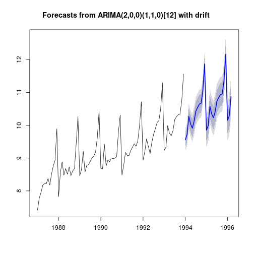 


Global mean temperatures, revisited
-----------------------------------


```r
attach(temp)
temp.ts = ts(temperature, start = 1880)
temp.aa = auto.arima(temp.ts)
```

```
## Warning: p-value smaller than printed p-value
```

```
## Warning: p-value greater than printed p-value
```

```r
temp.aa
```

```
## Series: temp.ts 
## ARIMA(1,1,1) with drift         
## 
## Coefficients:
##         ar1     ma1  drift
##       0.260  -0.783  0.007
## s.e.  0.116   0.069  0.003
## 
## sigma^2 estimated as 0.00902:  log likelihood=121.3
## AIC=-234.6   AICc=-234.2   BIC=-223.1
```


Forecasts
---------


```r
temp.f = forecast(temp.aa)
plot(temp.f)
```

 


